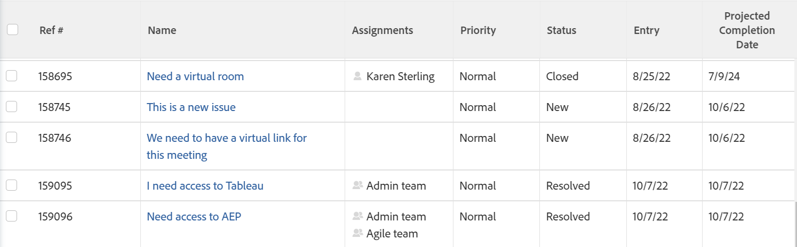

# プロジェクト、タスクおよびイシューに関する見込み完了日の概要

<!-- Audited: 11/2025 -->

見込み完了日は、プロジェクト、タスクまたはイシューがいつ完了するかを示すリアルタイムの計算された指標です。 プロジェクト、タスク、またはイシューが「完了」とマークされると、見込み完了日が実際の完了日に変更されます。

次の節では、プロジェクト、タスク、およびイシューに対する予定完了日の決定方法と、その検索方法について説明します。

## アクセス要件

+++ 展開すると、この記事の機能のアクセス要件が表示されます。 

<table style="table-layout:auto"> 
 <col> 
 <col> 
 <tbody> 
  <tr> 
   <td role="rowheader">Adobe Workfront パッケージ</td> 
   <td> 
任意
 </td> 
  </tr> 
  <tr> 
   <td role="rowheader">Adobe Workfront プラン</td> 
   <td> 
   <ul><li>
レポートに見込み完了日を表示するためのコントリビューター以上の権限
</li> <li>
レポートを作成するための標準ライセンス
</li> </ul>
   または
   <ul><li>
レポートに見込み完了日を表示するためのレビュー権限またはそれ以上の権限
</li> 
   <li>
レポートを作成するためのプランライセンス版
 </li></ul>
      </td> 
  </tr> 
  <tr> 
   <td role="rowheader">アクセスレベル</td> 
   <td> 
プロジェクトに対する表示以上のアクセス権
 
レポート、ダッシュボード、カレンダーへのアクセス権を編集してレポートを作成する
 
フィルター、ビュー、グループ化へのアクセス権を編集して、レポートを作成するか、リスト表示を変更します
  </td> 
  </tr> 
  <tr> 
   <td role="rowheader">オブジェクト権限</td> 
   <td> 
プロジェクトに対する表示権限またはそれ以上の権限
 </td> 
  </tr> 
 </tbody> 
</table>

詳しくは、[Workfront ドキュメントのアクセス要件](/help/quicksilver/administration-and-setup/add-users/access-levels-and-object-permissions/access-level-requirements-in-documentation.md)を参照してください。

+++

## Adobe Workfront が見込み完了日を決定する方法

見込み完了日は計算済みフィールドであり、手動で変更することはできません。

予定完了日の決定に使用される基準は、表示するオブジェクトによって異なります。

* **プロジェクト：**&#x200B;プロジェクトの「見込み完了日」は、そのプロジェクトの最新タスクの見込み完了日と同じです。

  例えば、完了率が高くなると、タスクの見込み完了日は現在の日付に近づきます。 タスクのステータスが新規で、タスクの予定完了日が近いか過ぎている場合、見込み完了日は将来の日付に移動します。

* **タスク：**&#x200B;タスクの見込み完了日は、次の基準に基づいて決定されます。

   * タスク担当者がタスクに対して行った&#x200B;**進捗状況の更新：**&#x200B;進捗状況の更新には、完了率の変更とタスクのステータスの変更が含まれます。
   * **コミット日：**&#x200B;タスクの担当者がコミット日を指定した場合、「見込み完了日」は「コミット日」に合わせて変更されます。

     コミット日について詳しくは、記事[ コミット日の概要](../../../manage-work/projects/updating-work-in-a-project/overview-of-commit-dates.md)を参照してください。

   * **先行タスク：**&#x200B;先行タスクに遅延がない場合、予定完了日は予定完了日と一致する必要があります。 遅延が発生した場合、依存タスクには、「予定完了日」よりも大きい日付の「見込み完了日」が表示されます。

     タスクの予定完了日について詳しくは、[タスクの予定完了日の概要](../../../manage-work/tasks/task-information/task-planned-completion-date.md)を参照してください。

  >[!IMPORTANT]
  >
  >タスクの先行タスクに「実績完了日」がある場合、依存タスクには次のシナリオの説明に従って「見込み完了日」が割り当てられます。
  >
  >
  >プロジェクトにタスク A、タスク B、タスク Cおよびタスク Bがタスク Aの後継である場合、タスク Cはタスク Bの後継であり、実際の完了日がタスク Aに追加され、プロジェクトの&#x200B;**更新タイプ**&#x200B;が自動および変更時に設定されている場合、タスク Bに対して予定完了日が自動的に再計算されます。現在、Workfrontでは、更新されたタスクから1 レベル上下のタスクに対して再計算再計算されます。

* **イシュー：**&#x200B;イシューの見込み完了日は、最初はイシューの予定完了日に合わせて設定されます。

  イシューの担当者がコミット日を指定すると、見込み完了日と予定完了日の両方がコミット日に合わせて変更されます。

  コミット日について詳しくは、[コミット日の概要](../../../manage-work/projects/updating-work-in-a-project/overview-of-commit-dates.md)を参照してください。

## 見込み完了日の表示

プロジェクト、タスクおよびイシューの見込み完了日をレポートに表示できます。 Workfront の他のエリアで、プロジェクトおよびタスクの見込み完了日を表示できます。

### プロジェクトの予定完了日の表示 {#view-the-projected-completion-date-of-a-project}

1. 見込み完了日を表示するプロジェクトに移動します。
1. 左パネルの「**プロジェクト詳細**」をクリックします。
1. **概要**／「**プロジェクトの日付**」セクションで「**見込み完了日**」フィールドを探します。

### タスクの予定完了日の表示 {#view-the-projected-completion-date-of-a-task}

1. 見込み完了日を表示するタスクに移動します。
1. 左パネルの「**タスクの詳細**」をクリックします。
1. **概要**／「**タスクの日付と制約**」セクションで「**見込み完了日**」フィールドを見つけます。

### 問題の予定完了日の表示 {#view-the-projected-completion-date-of-an-issue}

イシューの見込み完了日は、イシューレポートまたはリストビューでのみ確認できます。 リストビューの作成は、レポートでのビューの作成と似ています。

見込み完了日を含んだイシューレポートを作成するには：

1. [カスタムレポートの作成](../../../reports-and-dashboards/reports/creating-and-managing-reports/create-custom-report.md)の記事の説明に従って、イシューレポートを作成します。
1. 「**カラム （表示）**」タブを選択します。
1. 「**列を追加**」をクリックし、「**このカラムに表示**」フィールドに「**見込み完了日**」と入力します。

1. リストの&#x200B;**問題** オブジェクトの下に表示される場合に選択します。
1. 「**保存して閉じる**」をクリックします。

   

   レポートの「**完了予定日**」列にデータが入力されています。

