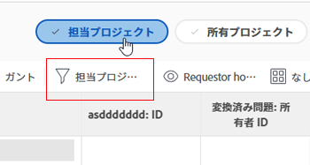

# プロジェクトチームの概要

ある能力のプロジェクトに関連付けられているユーザーにより、プロジェクトチームが構成されます。プロジェクトの担当者エリアに表示されるユーザーは、プロジェクトチームを構成するユーザーです。例えば、プロジェクトでの作業に割り当てられたユーザーや、プロジェクトの所有者は、プロジェクトチームのユーザーです。

## プロジェクトチームのメンバー

ユーザーを手動または自動で、プロジェクトチームに割り当てることができます。詳しくは、[プロジェクトチームの管理](../../../manage-work/projects/planning-a-project/manage-project-team.md)の記事の「プロジェクトチームにユーザーを追加する」の節を参照してください。

ユーザーを手動でプロジェクトチームに追加すると、追加されたユーザーに、プロジェクトに対する表示権限と、プロジェクトのタスク、イシュー、ドキュメントに対する表示権限が付与されます。

## プロジェクトチームメンバーへの通知

Adobe Workfront 管理者が有効にするメール通知に応じて、プロジェクトチームのユーザーには、プロジェクトの様々なアクションが通知されます。メール通知の使用に関して詳しくは、[システムの全員に対するイベント通知を設定](../../../administration-and-setup/manage-workfront/emails/configure-event-notifications-for-everyone-in-the-system.md)を参照してください。

>[!NOTE]
>
>プロジェクトに関する情報を必要としないユーザーに通知が送信されないように、プロジェクトチームのメンバーシップを必ずアップデートしてください。

## 役割ベースの承認

プロジェクトに対する役割ベースの承認を使用するには、ユーザーがプロジェクトチームに割り当てられており、ユーザープロファイルに正しい担当業務が割り当てられている必要があります。

ユーザーをプロジェクトチームに追加する方法と担当業務を割り当てる方法について詳しくは、次の記事を参照してください。

* [プロジェクトチームの管理](../../../manage-work/projects/planning-a-project/manage-project-team.md)
* [ユーザーのプロファイルの編集](../../../administration-and-setup/add-users/create-and-manage-users/edit-a-users-profile.md)

役割ベースの承認のために、ユーザーがプロジェクトチームに属している必要がない場合は、承認設定でこれを制御できます。詳しくは、[グローバル承認設定を指定](../../../administration-and-setup/customize-workfront/configure-approval-milestone-processes/establish-approval-settings.md)を参照してください。

## 自分が参加しているプロジェクトフィルター

ユーザーがプロジェクトの担当者エリアに表示されている場合、そのプロジェクトは、プロジェクトのリストまたはプロジェクトレポートで、自分が参加しているプロジェクトフィルターを適用すると表示されます。

プロジェクトエリアのヘッダーで、自分が参加しているプロジェクトフィルターが選択されているかどうかを確認できます。フィルターパネルまたはヘッダーから適用できます。

>[!NOTE]
>
>プロジェクトの作成者の場合、プロジェクトの担当者エリアに自身の名前が表示されない場合や、自身の名前がそのリストから削除された場合であっても、担当プロジェクトのリストに、そのプロジェクトが表示されたままになります。
