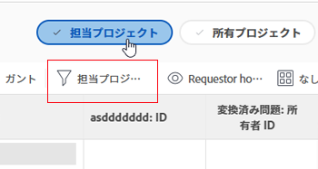

# プロジェクトチームの概要

<!-- Audited: 6/2025 -->

プロジェクトチームは、何らかの形でプロジェクトに関連するユーザーで構成されます。 プロジェクトの「ユーザー」セクションにリストされているユーザーが、プロジェクトチームを構成します。 例えば、プロジェクトでの作業に割り当てられたユーザーや、プロジェクトの所有者は、プロジェクトチームのユーザーです。

プロジェクトテンプレート上の次のユーザーは、テンプレートを使用してプロジェクトを作成した後、将来のプロジェクトチームの一部となります。

* テンプレートの作業（タスクとイシュー）に割り当てられたユーザー。
* テンプレートの所有者またはスポンサー。

テンプレート上の今後のプロジェクトチームの一部であるユーザーは、テンプレートの「人物」セクションに表示されます。

## プロジェクトチームのメンバー

ユーザーを手動または自動で、プロジェクトチームに割り当てることができます。 詳しくは、「[ プロジェクトチームの管理](../../../manage-work/projects/planning-a-project/manage-project-team.md)」の「プロジェクトチームにユーザーを追加する」セクションを参照してください。

ユーザーを手動でプロジェクトチームに追加すると、追加されたユーザーに、プロジェクトに対する表示権限と、プロジェクトのタスク、イシュー、ドキュメントに対する表示権限が付与されます。

## プロジェクトチームメンバーへの通知

Adobe Workfront管理者が有効にするメール通知に応じて、プロジェクトチームのユーザーには、プロジェクトに対するさまざまなアクションが通知されます。

詳しくは、次の記事も参照してください。

* [イベント通知のタイプ](/help/quicksilver/administration-and-setup/manage-workfront/emails/event-notifications-available-in-wf.md)

* [システムの全員へのイベント通知を設定](../../../administration-and-setup/manage-workfront/emails/configure-event-notifications-for-everyone-in-the-system.md)

>[!NOTE]
>
>プロジェクトに関する情報を必要としないユーザーに通知を送信しないよう、プロジェクトチームのメンバーシップを常に最新の状態に保ちましょう。

## 役割ベースの承認

プロジェクトに対する役割ベースの承認を使用するには、ユーザーがプロジェクトチームに割り当てられており、ユーザープロファイルに正しい担当業務が割り当てられている必要があります。

ユーザーをプロジェクトチームに追加する方法と担当業務を割り当てる方法について詳しくは、次の記事を参照してください。

* [プロジェクトチームの管理](../../../manage-work/projects/planning-a-project/manage-project-team.md)
* [ユーザーのプロファイルの編集](../../../administration-and-setup/add-users/create-and-manage-users/edit-a-users-profile.md)

役割ベースの承認のために、ユーザーがプロジェクトチームに属している必要がない場合は、承認設定でこれを制御できます。 詳しくは、[グローバル承認設定を指定](../../../administration-and-setup/customize-workfront/configure-approval-milestone-processes/establish-approval-settings.md)を参照してください。

## 自分が参加しているプロジェクトフィルター

ユーザーがプロジェクトの「人物」エリアにリストされている場合、そのプロジェクトは、プロジェクトまたはプロジェクトレポートのリストに「自分が使用しているプロジェクト」フィルターを適用すると表示されます。

プロジェクトエリアのヘッダーで、自分が参加しているプロジェクトフィルターが選択されているかどうかを確認できます。 フィルターパネルまたはヘッダーから適用できます。

>[!NOTE]
>
>自分がプロジェクトの作成者である場合、自分の名前がプロジェクトの「ユーザー」エリアに表示されない場合や、自分の名前がそのリストから削除された場合でも、プロジェクトは「自分が所属するプロジェクト」リストにリストされたままになります。
