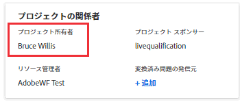
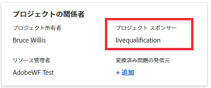

# プロジェクトの所有者とスポンサーの更新

Adobe Workfrontでプロジェクトを作成すると、プロジェクトの所有者として自動的に設定されます。 このフィールドは別のユーザーで更新できます。 また、プロジェクトの「プロジェクトスポンサー」フィールドを更新することもできます。

プロジェクトの所有者とスポンサーについて詳しくは、 [プロジェクト所有者とスポンサーの概要](../../../manage-work/projects/planning-a-project/project-owners-and-sponsors.md).

>[!TIP]
>
>テンプレートの所有者とスポンサーを特定できます。 そのテンプレートからプロジェクトを作成すると、「テンプレート所有者」が「プロジェクト所有者」になり、「テンプレートスポンサー」が「プロジェクトスポンサー」になります。
>
>テンプレートに所有者が含まれていない場合、チームプレートからプロジェクトを作成するユーザーが「プロジェクト所有者」になります。
>
>テンプレートの編集について詳しくは、 [プロジェクトテンプレートの編集](../../../manage-work/projects/create-and-manage-templates/edit-templates.md).

## アクセス要件

<!--drafted for P&P:

<table style="table-layout:auto"> 
 <col> 
 <col> 
 <tbody> 
  <tr> 
   <td role="rowheader">Adobe Workfront plan*</td> 
   <td> 
Any
 
  
 </td> 
  </tr> 
  <tr> 
   <td role="rowheader">Adobe Workfront license*</td> 
   <td> 
Current license: Standard 
 
   Or
   
Legacy license: Plan 
 
   </td> 
  </tr> 
  <tr> 
   <td role="rowheader">Access level configurations*</td> 
   <td> 
Edit access to Projects
 
<b>NOTE</b>
   
   If you still don't have access, ask your Workfront administrator if they set additional restrictions in your access level. For information on how a Workfront administrator can modify your access level, see <a href="../../../administration-and-setup/add-users/configure-and-grant-access/create-modify-access-levels.md" class="MCXref xref">Create or modify custom access levels</a>.
 </td> 
  </tr> 
  <tr> 
   <td role="rowheader">Object permissions</td> 
   <td> 
Edit permissions to a project
 
For information on requesting additional access, see <a href="../../../workfront-basics/grant-and-request-access-to-objects/request-access.md" class="MCXref xref">Request access to objects </a>.
 </td> 
  </tr> 
 </tbody> 
</table>
-->

この記事の手順を実行するには、次のアクセス権が必要です。

<table style="table-layout:auto"> 
 <col> 
 <col> 
 <tbody> 
  <tr> 
   <td role="rowheader">Adobe Workfront plan*</td> 
   <td> 
任意
 
  
 </td> 
  </tr> 
  <tr> 
   <td role="rowheader">Adobe Workfront license*</td> 
   <td> 
計画 
 </td> 
  </tr> 
  <tr> 
   <td role="rowheader">アクセスレベル設定*</td> 
   <td> 
プロジェクトへのアクセスを編集
 
<b>メモ</b>

まだアクセス権がない場合は、Workfront管理者に、アクセスレベルに追加の制限を設定しているかどうかを問い合わせてください。 Workfront管理者がアクセスレベルを変更する方法について詳しくは、 <a href="../../../administration-and-setup/add-users/configure-and-grant-access/create-modify-access-levels.md" class="MCXref xref">カスタムアクセスレベルの作成または変更</a>.
 </td>
</tr> 
  <tr> 
   <td role="rowheader">オブジェクトの権限</td> 
   <td> 
プロジェクトに対する権限の編集
 
追加のアクセス権のリクエストについて詳しくは、 <a href="../../../workfront-basics/grant-and-request-access-to-objects/request-access.md" class="MCXref xref">オブジェクトへのアクセスのリクエスト </a>.
 </td> 
  </tr> 
 </tbody> 
</table>

&#42;保有するプラン、ライセンスの種類、アクセス権を確認するには、Workfront管理者に問い合わせてください。

## プロジェクトのプロジェクト所有者の更新

ユーザーをプロジェクトのプロジェクト所有者として追加すると、Workfrontは自動的にそのユーザーにプロジェクトの表示権限を付与します。

1. 更新するプロジェクトに移動します。
1. クリック **プロジェクトの詳細** をクリックします。
1. 次をクリック： **編集** アイコン  「プロジェクトの詳細」領域の右上隅にあるをクリックし、  **概要**.

1. ユーザーの名前を指定 **プロジェクト所有者** フィールドに入力します。

   アクティブなユーザーのみをプロジェクト所有者として指定できます。

1. 「**変更を保存**」をクリックします。

   プロジェクト所有者は、プロジェクトヘッダーおよび「プロジェクトの詳細」領域で更新されます。

## プロジェクトスポンサーの更新

ユーザーをプロジェクトスポンサーとして追加すると、Workfrontは自動的にそのプロジェクトを表示する権限をユーザーに与えます。

>[!TIP]
>
>プロジェクトスポンサーとして追加したユーザーがシステム管理者である場合、そのユーザーはプロジェクトの共有リストに追加されません。

1. 更新するプロジェクトに移動します。
1. クリック **プロジェクトの詳細** をクリックします。
1. 次をクリック： **編集** アイコン  「プロジェクトの詳細」領域の右上隅にあるをクリックし、  **概要**.

1. ユーザーの名前を指定 **プロジェクトスポンサー** フィールドに入力します。

   アクティブなユーザーのみがプロジェクトスポンサーとして指定できます。

1. 「**変更を保存**」をクリックします。

   「プロジェクトの詳細」領域の「プロジェクトスポンサー」が更新されます。

   
