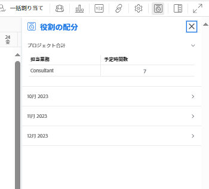

# 役割の配分パネルでプロジェクトの予定時間数を表示

プロジェクトの役割の配分パネルでは、プロジェクトの作業アイテムに割り当てられているすべての担当業務について、役割の配分を表示できます。

>[!NOTE]
>
>この記事では、プロジェクトの役割の配分パネルでの、プロジェクトのタスクとイシューに関連する担当業務と、配分された予定時間数の表示について説明します。Adobe Workfront Scenario Planner を使用する際に、役割の配分パネルを使用して予定時間数とイニシアチブの時間数を調整する方法について詳しくは、以下を参照してください。
>
>* [タスクリストのプロジェクトとイニシアチブの役割の配分を表示](../../../scenario-planner/show-role-allocation-task-list-nwe.md)
>* [ワークロードバランサーのプロジェクトとイニシアチブの役割の配分を表示](../../../scenario-planner/show-role-allocation-workload-balancer.md)
>
>  役割の配分パネルにイニシアチブの時間数を表示するには、シナリオプランナーのライセンスが必要です。シナリオプランナーについては、[シナリオプランナーの概要](../../../scenario-planner/get-started-with-scenario-planning.md)を参照してください。
>

## アクセス要件

<!--drafted for P&P:

<table style="table-layout:auto"> 
 <col> 
 <col> 
 <tbody> 
  <tr> 
   <td role="rowheader">Adobe Workfront plan*</td> 
   <td> 
Any 
 </td> 
  </tr> 
  <tr> 
   <td role="rowheader">Adobe Workfront license*</td> 
   <td> 
Current license: Light or higher
 
   Or
   
Legacy license: Review or higher
 
   </td> 
  </tr> 
  <tr> 
   <td role="rowheader">Access level configurations*</td> 
   <td> 
View or higher access to Projects
 
If you still don't have access, ask your Workfront administrator if they set additional restrictions in your access level. For information on how a Workfront administrator can modify your access level, see <a href="../../../administration-and-setup/add-users/configure-and-grant-access/create-modify-access-levels.md" class="MCXref xref">Create or modify custom access levels</a>.
 </td> 
  </tr> 
  <tr> 
   <td role="rowheader">Object permissions</td> 
   <td> 
View or higher permissions on the project
 
For information on requesting additional access, see <a href="../../../workfront-basics/grant-and-request-access-to-objects/request-access.md" class="MCXref xref">Request access to objects </a>.
 </td> 
  </tr> 
 </tbody> 
</table>

-->

以下が必要です。

<table style="table-layout:auto"> 
 <col> 
 <col> 
 <tbody> 
  <tr> 
   <td role="rowheader">Adobe Workfront プラン*</td> 
   <td> 
任意 
 </td> 
  </tr> 
  <tr> 
   <td role="rowheader">Adobe Workfront ライセンス*</td> 
   <td> 
レビュー以上
 </td> 
  </tr> 
  <tr> 
   <td role="rowheader">アクセスレベル設定*</td> 
   <td> 
プロジェクトに対する表示以上のアクセス権
 
まだアクセス権がない場合は、Workfront 管理者に問い合わせて、アクセスレベルに追加の制限が設定されているかどうかを確認してください。Workfront 管理者がユーザーのアクセスレベルを変更する方法については、<a href="../../../administration-and-setup/add-users/configure-and-grant-access/create-modify-access-levels.md" class="MCXref xref">カスタムアクセスレベルの作成または変更</a>を参照してください。
 </td> 
  </tr> 
  <tr> 
   <td role="rowheader">オブジェクト権限</td> 
   <td> 
プロジェクトに対する表示以上の権限
 
追加のアクセス権のリクエストについて詳しくは、<a href="../../../workfront-basics/grant-and-request-access-to-objects/request-access.md" class="MCXref xref">オブジェクトへのアクセス権のリクエスト</a>を参照してください。
 </td> 
  </tr> 
 </tbody> 
</table>

&#42;保有するプラン、ライセンスタイプ、アクセス権を確認するには、Workfront 管理者にお問い合わせください。

## 前提条件

以下が必要です。

* 担当業務または担当業務に関連付けられたユーザーに割り当てられたタスクまたはイシュー。

  >[!TIP]
  >
  >タスクまたはイシューが未割り当ての場合、チームに割り当てられた場合、または担当業務のないユーザーに割り当てられた場合、プロジェクトの予定時間数は役割の配分パネルでゼロになります。

* 期間が 0 よりも長いタスクとイシュー。

## 役割の配分パネルでプロジェクトの予定時間数を表示

1. Adobe Workfront の右上隅にある&#x200B;**メインメニュー**&#x200B;アイコン 、「**プロジェクト**」の順にクリックします。
1. プロジェクト名をクリックしてアクセスします。プロジェクトページが開きます。
1. 左側のパネルで、次のいずれかをクリックします。

   * **タスク**
   * **ワークロードバランサー**

1. **役割の配分を表示**&#x200B;アイコン  をクリックします。

   役割の配分パネルが表示されます。

   

1. **役割の配分**パネルで次の情報を確認します。
|フィールド | 説明|
|---|---|
| **担当業務** |プロジェクトでタスクとイシューに割り当てられた担当業務です。これは、プロジェクトのタスクとイシューに直接割り当てられた担当業務、またはタスクとイシューに割り当てられたユーザーに関連付けられた担当業務である場合があります。|
| **予定時間数** |プロジェクトの担当業務、または担当業務に関連付けられたユーザーに割り当てられた、タスクとイシューからの予定時間数の合計です。|

