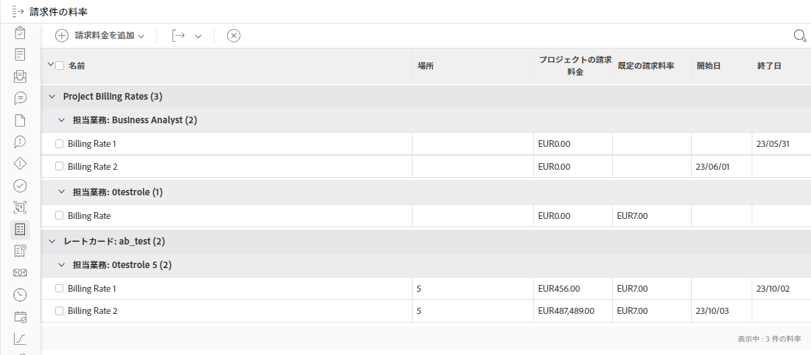

# プロジェクトへのレートカードの添付

{{highlighted-preview-article-level}}

レートカードには、場所に基づいて、担当業務ごとに複数の請求レートが保存されます。例えば、パリを拠点とするデザイナーとニューヨークを拠点とする別のデザイナーの 2 つの担当業務を持ち、それぞれに異なる請求レートで設定できます。ただし、レートカードの担当業務に場所は必要ありません。レートカードの担当業務（場所が含まれる場合もあります）の請求レートには、有効日付を含めることもできます。

レートカードをプロジェクトに添付すると、場所別のすべての役割とそれに関連する請求レートがプロジェクトに追加されます。

>[!NOTE]
>
>評価カードを添付すると、プロジェクト上の既存の請求レートが上書きされます。

請求レートは、プロジェクト内のレートカードから直接編集できます。これは、デフォルトのレートカードに保存されるレートには影響しません。

レートカードの作成について詳しくは、[レートカードの管理](/help/quicksilver/administration-and-setup/set-up-workfront/configure-system-defaults/manage-rate-cards.md)を参照してください。

プロジェクトの担当業務請求レートの上書きおよびプロジェクト収益の計算に関する一般的な情報については、[担当業務請求レートの上書きとプロジェクトでの収益の計算の概要](/help/quicksilver/manage-work/projects/project-finances/override-role-billing-rates-and-calculate-project-revenue.md)を参照してください。

## アクセス要件

この記事の手順を実行するには、次のアクセス権が必要です。

<table style="table-layout:auto"> 
 <col> 
 <col> 
 <tbody> 
  <tr> 
   <td role="rowheader">Adobe Workfront プラン*</td> 
   <td> 
任意
 </td> 
  </tr> 
  <tr> 
   <td role="rowheader">Adobe Workfront ライセンス*</td> 
   <td> 
現在のプラン：標準

または

従来のプラン：プラン 
 </td> 
  </tr> 
  <tr> 
   <td role="rowheader">アクセスレベル設定*</td> 
   <td> 
プロジェクトおよび財務データへのアクセスを編集する
 
担当業務の管理アクセス権
 
メモ：まだアクセス権がない場合は、アクセスレベルに追加の制限が設定されていないかどうか Workfront 管理者にお問い合わせください。Workfront 管理者がアクセスレベルを変更する方法について詳しくは、<a href="../../../administration-and-setup/add-users/configure-and-grant-access/create-modify-access-levels.md" class="MCXref xref">カスタムアクセスレベルの作成または変更</a>を参照してください。
 </td> 
  </tr> 
  <tr> 
   <td role="rowheader">オブジェクト権限</td> 
   <td> 
財務を管理する権限を持つプロジェクトに対する権限の管理
 
追加のアクセス権のリクエストについて詳しくは、<a href="../../../workfront-basics/grant-and-request-access-to-objects/request-access.md" class="MCXref xref">オブジェクトへのアクセス権のリクエスト</a>を参照してください。
 </td> 
  </tr> 
 </tbody> 
</table>

&#42;保有するプラン、ライセンスタイプ、アクセス権を確認するには、Workfront 管理者に問い合わせてください。

## プロジェクトへのレートカードの添付

1. プロジェクトに移動します。
1. 左側のパネルで「**請求料金**」をクリックします。最初に「**さらに表示**」をクリックする必要がある場合もあります。
1. **「請求レートを追加」／「レートカードを添付」**&#x200B;をクリックします。

   レートカードを添付ページが開きます。詳しくは、[レートカードの管理](/help/quicksilver/administration-and-setup/set-up-workfront/configure-system-defaults/manage-rate-cards.md)を参照してください。

1. プロジェクトに追加するレートカードを選択し、「**添付**」をクリックします。

   レートカードとそのすべての担当業務のレートが請求レートリストに追加されます。

   

   >[!NOTE]
   >
   >請求レートリストでは、レートカードからの 1 つ以上の担当業務を削除できます。プロジェクトから担当業務の請求レートを削除しても、デフォルトのレートカードからは削除されません。
