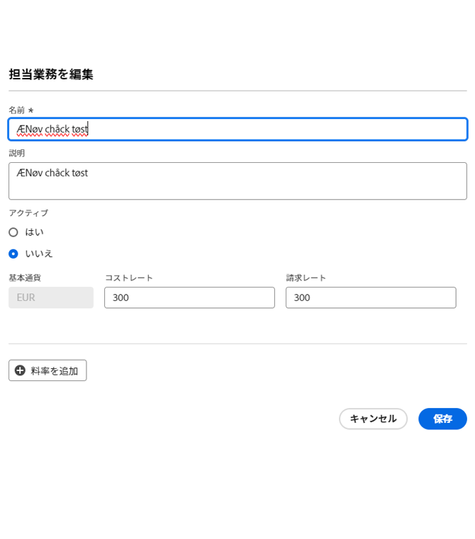

# 請求と収益の概要

<!-- Audited: 1/2024 -->

{{highlighted-preview}}

プロジェクトマネージャーは、請求料率を使用して、プロジェクトの収益を把握できます。

この記事では、プロジェクトの収益の追跡について説明します。収益の計算は、稼動率レポートでは異なります。稼働率レポートの収益計算については、[リソース稼働率情報の表示](../../../resource-mgmt/resource-utilization/view-utilization-information.md)を参照してください。

## 請求料率の概要

請求料率を扱う際は、次の点を考慮してください。

* 請求率を管理するには、財務データへの編集アクセス権を持つプランまたは標準ライセンスが必要です。\
  財務データへのアクセス権の付与について詳しくは、[財務データへのアクセス権の付与](../../../administration-and-setup/add-users/configure-and-grant-access/grant-access-financial.md)を参照してください。

* 請求料率は、担当業務またはユーザーに関連付けられている作業単位ごとの収益金額です。

  その率に作業に費やした時間数を掛けると、プロジェクトの収益になります。

* 請求料率を設定したら、請求記録を作成して請求済みと未請求の金額を記録することで、収益を追跡できます。

  >[!TIP]
  >
  >請求記録を請求済みとしてマークしたら、その記録は編集できません。請求料率が変化する状況で、プロジェクトの収益と費用の情報をロックする場合、このことは重要です。請求記録に追加して請求済みとしてマークすると、システムで請求料率が更新されても、収益は更新されません。

  請求記録の作成について詳しくは、[請求記録の作成](../../../manage-work/projects/project-finances/create-billing-records.md)を参照してください。

* ユーザーや担当業務の請求料率を作成することも、プロジェクトやタスクの請求料率を 1 回限りとすることもできます。

>[!IMPORTANT]
>
>収益を計算する率は、時間を記録するユーザーまたはジョブの役割に属しています。

* [ユーザー請求料率](#user-billing-rates)
* [担当業務請求料率](#job-role-billing-rates)
* [プロジェクトまたはタスクの固定請求料率](#fixed-billing-rates-for-projects-or-tasks)
* [請求料率の上書き](#override-billing-rates)

### ユーザー請求料率 {#user-billing-rates}

ユーザー管理者は、ユーザーを作成する際に、「時間当たりの請求」フィールドの値とレートの日付を指定することで、ユーザーを日付有効の請求レートに関連付けることができます。

ユーザーの作成について詳しくは、[ユーザーの追加](../../../administration-and-setup/add-users/create-and-manage-users/add-users.md)の記事を参照してください。

### 担当業務請求料率 {#job-role-billing-rates}

Adobe Workfront管理者は、ジョブロールを作成する際に、「時間当たりの請求」フィールドの値とレートの日付を指定することで、ジョブロールに日付が有効な請求レートを関連付けることができます。

Workfront システムの基準通貨または別のカスタム通貨を使用して、担当業務請求料率の値を定義できます。

ジョブの役割の作成とその通貨の上書きの詳細については、この記事を参照してください。 [ジョブの役割の作成と管理](../../../administration-and-setup/set-up-workfront/organizational-setup/create-manage-job-roles.md).

### プロジェクトまたはタスクの固定請求料率 {#fixed-billing-rates-for-projects-or-tasks}

ユーザーと担当業務の時給に加えて、次の固定請求料率を設定することもできます。

* 固定時間収益タイプの固定金額
* 固定収益収益タイプの固定金額

固定請求料率を使用して収益を計算する方法について詳しくは、[タスクの収益タイプの概要](#overview-of-task-revenue-types)を参照してください。

### 請求料率の上書き {#override-billing-rates}

>[!IMPORTANT]
>
>担当業務に関連付けられている請求料率を上書きできます。ユーザー請求料率または固定請求料率を上書きすることはできません。

担当業務請求料率を上書きできるのは、次の場合です。

* 特定の会社

  会社固有の担当業務請求料率の作成について詳しくは、[会社の作成と編集](../../../administration-and-setup/set-up-workfront/organizational-setup/create-and-edit-companies.md)を参照してください。

* 特定のプロジェクト

  プロジェクト固有の担当業務請求料率の作成について詳しくは、[担当業務請求料率の上書きとプロジェクト収益の計算の概要](../../../manage-work/projects/project-finances/override-role-billing-rates-and-calculate-project-revenue.md)の記事を参照してください。

## 収益金額の追跡

Workfront では、タスクの予定時間数に基づいてタスクが作成されると、予定収益を自動的に追跡できます。

また、タスク、イシューおよびプロジェクトの実際の時間数が記録されると、実収益を自動的に追跡することもできます。

タスク、イシューおよびプロジェクトに関連付けられる収益のタイプを次の表に示します。

<table style="table-layout:auto"> 
 <col> 
 <col> 
 <tbody> 
  <tr> 
   <td role="rowheader">予定収益</td> 
   <td> 
タスクの場合、これはタスクの予定時間数に関連付けられた収益です。すべてのタスクからの予定時間数をまとめて、プロジェクトの予定時間数が計算されます。 
 
Workfront での予定時間数について詳しくは、<a href="../../../manage-work/tasks/task-information/planned-hours.md" class="MCXref xref">予定時間数の概要</a>を参照してください。 
 <ul><li>
Workfront では、次の式を使用してタスクの予定収益を計算します。

   
<code>Task Planned Revenue = Planned Hours * Billing hourly rate</code>
 
<strong>注意</strong>  フォーミュラ内の請求の時間別レートでは、レートの日付有効な変更が考慮されます。
 </li><li>
Workfront では、次の式を使用してプロジェクトの予定収益を計算します。
 
<code>Project Planned Revenue = SUM (All tasks Planned Revenue) + Fixed Revenue</code>

   
<b>メモ</b>

プロジェクト詳細エリアおよびプロジェクトレポートに表示されるプロジェクトの予定収益は、稼働率レポートに表示される予定収益とは異なります。 
</li></ul> 
プロジェクト詳細エリアの予定収益には、タスクの予定時間数に関連付けられたタスク収益と、プロジェクトの固定収益が反映されています。稼働率レポートの予定収益には、プロジェクトのタスク割り当てからの予定時間数にのみ関連付けられた予定収益が表示されます。 
 
     
Example: </b>"> 
      
プロジェクトに 10 時間のタスクが 1 つあり、そのタスクがコンサルタントに時給 20 ドルで割り当てられ、プロジェクトの固定収益が 100 ドルの場合、稼働率レポートには予定収益（タスクの時間数に関連付けられた予定収益）として 200 ドルが表示されます。「プロジェクト詳細」セクションには、300 ドル（タスクからの予定収益とプロジェクトの固定収益）が表示されます。 
 
     
 
 
タスクの予定収益は、タスクに割り当てられたユーザーまたは担当業務の請求時給を使用して計算されます。タスクの収益タイプは、予定収益の計算に使用される時給（ユーザーか役割か）に影響を与えます。詳しくは、この記事の次の節を参照してください。
 
    <ul> 
     <li> 
<a href="#overview-of-task-revenue-types" class="MCXref xref">タスクの収益タイプの概要</a> 
 </li> 
     <li> 
<a href="#revenue-calculations-for-tasks-based-on-user-and-role-assignments" class="MCXref xref">ユーザーと役割の割り当てに基づくタスクの収益計算</a> 
 </li> 
    </ul> 
稼働率レポートの計画収益の計算については、 <a href="../../../resource-mgmt/resource-utilization/view-utilization-information.md" class="MCXref xref">リソース使用率情報の表示</a>. 
 </td> 
  </tr> 
  <tr> 
   <td role="rowheader">実収益*</td> 
   <td> 
タスク、タスクおよびプロジェクトの実際の時間に関連する売上高。 
 
一般に、Workfront では次の式を使用して実収益を計算します。
 
<code>Actual Revenue = Actual Hours * Billing rate</code> 
 
<strong>注意</strong>  フォーミュラ内の請求の時間別レートでは、レートの日付有効な変更が考慮されます。
 
稼働率レポートの実際の収益計算の詳細は、 <a href="../../../resource-mgmt/resource-utilization/view-utilization-information.md" class="MCXref xref">リソース使用率情報の表示</a>. 
 
<b>ヒント</b>

実収益はイシューレベルでは表示されませんが、イシューに関する実際の時間数に関連付けられた収益はプロジェクトの実収益に反映されます。 
 </td>
</tr> 
 </tbody> 
</table>

*実際の時間数の場合、ユーザーの時給は常に、時間数を記録するユーザーの時給またはそのユーザーの担当業務の時給を指します。Workfront がどのような場合にユーザーの時給を使用し、どのような場合に担当業務の時給を使用するかについては、この記事の[収益計算](#revenue-calculations)の節を参照してください。

<!--Note from the table for Planned Revenue line: 
     
(the note below is duplicated in this article: /Content/Resource Mgmt/Resource utilization/view-utilization-information.htm and in the glossary)

    -->

例えば、「ユーザー (毎時)」収益タイプのタスクが 2 時間かかる予定で、そのタスクに割り当てられたユーザーの時給が 30 ドルの場合、タスクの予定収益は 60 ドルになります。タスクが完了したときに、ユーザーがタスクの完了に費やした実際の時間数として 1.5 時間と記録すると、実収益は 45 ドルになります。タスクに割り当てられていない別のユーザーが時間を記録した場合、実収益はそのユーザーの請求料率に基づいて計算されます。

収益は次の方法で記録できます。

* タスクの収益タイプを定義し、作業アイテムに割り当てられたユーザーまたは役割を請求料率に関連付ける。これにより、作業アイテムの予定時間数または実際の時間数の数値で収益が計算されます。時給の最大請求額に上限を設定することも、設定しないこともできます。\
  タスクの収益タイプの指定について詳しくは、[タスクの編集](../../../manage-work/tasks/manage-tasks/edit-tasks.md)を参照してください。

* タスクまたはプロジェクトの定額の固定収益率で請求する。\
  固定収益のタスクがある場合、固定収益額はタスクまたはプロジェクトの予定収益として追加され、タスクの予定収益は固定収益として請求記録に追加できます。
* プロジェクトの定額請求の固定収益率を設定してから、プロジェクト内のタスクの時給を設定する。Workfront では、プロジェクトの定額料金にタスクの時給を加算します。\
  例えば、Workfront を使用する整備士が、部品のコストをプロジェクトの固定収益として入力したうえで、車の修理に費やした時間を時給で請求するといったことです。プロジェクトまたはタスクの固定収益は、完了時に計上されます。

また、タスクを「請求不可」としてマークすることもできます。この場合、タスクには予定収益も実収益も関連付けられません。

## タスクの収益タイプの概要 {#overview-of-task-revenue-types}

デフォルトでは、すべての新しいタスクの収益タイプは、Workfront 管理者またはグループ管理者が指定したタスクとイシューの環境設定に従って設定されます。\
Workfront インスタンスのタスクとイシューの環境設定の定義について詳しくは、[システム全体のタスクとイシューの環境設定](../../../administration-and-setup/set-up-workfront/configure-system-defaults/set-task-issue-preferences.md)の記事を参照してください。

プロジェクト所有者は、タスクの収益タイプとプロジェクトの固定収益を変更できます。\
プロジェクトの固定収益の指定について詳しくは、[プロジェクトの編集](../../../manage-work/projects/manage-projects/edit-projects.md)の記事を参照してください。\
タスクの収益タイプの指定について詳しくは、[タスクの編集](../../../manage-work/tasks/manage-tasks/edit-tasks.md)の記事を参照してください。

タスクまたはプロジェクトに適用できる収益タイプは、次のとおりです。

<table border="1" cellspacing="15"> 
 <col> 
 <col> 
 <thead> 
  <tr> 
   <th> 
<strong>収益タイプ</strong> 
 </th> 
   <th> 
<strong>説明</strong> 
 </th> 
  </tr> 
 </thead> 
 <tbody> 
  <tr> 
   <td> 
固定収益
 </td> 
   <td> 
このタイプは、プロジェクトおよびタスクで使用できます。 
 
プロジェクトにテンプレートを添付する際に、テンプレートの固定収益がプロジェクトの固定収益に追加されます。詳しくは、<a href="../../../manage-work/projects/create-and-manage-templates/attach-template-to-project-overview.md" class="MCXref xref">プロジェクトへのテンプレートの添付の概要</a>を参照してください。 
 
タスクの場合、タスクの割り当てに関係なく、タスクの収益は常に、タスクに指定された固定金額を使用して計算されます。 
 
子タスクからの固定収益は、親タスクの収益ににまとめられてから、プロジェクトの収益にまとめられます。親タスクやプロジェクトで固定金額が定義されている場合、その金額は、子タスクからまとめられた予定収益に追加されます。
 
タスクの固定収益の金額は、プロジェクトの請求記録に含めることができます。
 </td> 
  </tr> 
  <tr> 
   <td> 
ユーザー (毎時)
 </td> 
   <td> 
このタイプは、タスクにのみ使用できます。 
 
特定のユーザーに設定した請求料率に、そのタスクの予定時間数を掛けた値が、タスクの予定収益金額になります。特定のユーザーに設定した請求料率に、タスクに対してユーザーが記録した時間数を掛けた値が、タスクの実収益金額になります。 例えば、ユーザーを作成し、「1 時間当たりの請求」フィールドに 20 ドルを設定した場合、ユーザーがタイムシートのタスクについて 5 時間を申請すると、タスクの実際の請求額は 100 ドルになります。

   
ユーザープロファイルには、複数の請求料率を有効日と共に含めることができます。例えば、最初のユーザー請求料率 20 ドルが 2023年4月30日に終了し、2 番目のユーザー請求料率 25 ドルが 2023年5月1日に開始するといった具合です。ユーザーがタスクについて 4月28日に 2 時間、5月2日に 3 時間を申請した場合、タスクの実際の請求額は 40 ドル + 75 ドル = 115 ドルになります。

   
<b>ヒント</b>

これが、タスクを作成する際のデフォルトの収益タイプです。
 </td>
</tr> 
  <tr> 
   <td> 
役割（毎時）
 </td> 
   <td> 
このタイプは、タスクにのみ使用できます。
 
このタイプは「ユーザー (毎時)」に似ていますが、ユーザーの請求料率ではなく担当業務の請求料率を使用します。
 
<strong>メモ</strong> また、担当業務には、複数の請求料率を有効日と共に含めることもできます。
</td> 
  </tr> 
  <tr> 
   <td> 
ユーザー (毎時) (上限付き)
 </td> 
   <td> 
このタイプは、タスクにのみ使用できます。
 
タスクは「ユーザー (毎時)」と同様に時間単位で請求されますが、指定できる上限額があります。 例えば、ユーザーの請求料率が 25 ドルで、タスクの上限金額が 20 ドルとすると、ユーザーが 1 時間記録した場合、タスクの実収益は 20 ドルになります。 
 </td> 
  </tr> 
  <tr> 
   <td> 
役割 (毎時) (上限付き)
 </td> 
   <td> 
このタイプは、タスクにのみ使用できます。
 
このタイプは「ユーザー (毎時) (上限付き)」に似ていますが、ユーザーの請求料率ではなく担当業務の請求料率を使用します。 
 </td> 
  </tr> 
  <tr> 
   <td> 
ユーザー（毎時）+ 固定
 </td> 
   <td> 
このタイプは、タスクにのみ使用できます。 
 
タスクは「ユーザー (毎時)」と同様に時間単位で請求されますが、ユーザー請求料率に追加できる「固定金額」があります。タスクに指定された固定金額は、プロジェクトの請求記録に含めることができます。固定金額にタスクの時間数を掛けることはありません。タスクの時間数を掛けるのは、ユーザー請求料率のみです。 
 </td> 
  </tr> 
  <tr> 
   <td> 
役割（毎時）+ 固定
 </td> 
   <td> 
このタイプは、タスクにのみ使用できます。 
 
タスクは、「役割 (毎時)」と同様に時間単位で請求されますが、役割請求料率に追加できる追加の「固定金額」があります。タスクに指定された固定金額は、プロジェクトの請求記録に含めることができます。固定金額にタスクの時間数を掛けることはありません。タスクの時間数を掛けるのは、担当業務請求料率のみです。 
 </td> 
  </tr> 
  <tr> 
   <td> 
固定 (毎時)
 </td> 
   <td> 
このタイプは、タスクにのみ使用できます。
 
タスクに設定した上限値または固定金額に、（ユーザーやユーザーの担当業務に関係なく）タスクに対して入力した時間数を掛けた金額が請求額になります。
 </td> 
  </tr> 
  <tr> 
   <td> 
請求不可
 </td> 
   <td> 
このタイプは、タスクにのみ使用できます。
 
この収益タイプは、収益には影響しません。 
 
親オブジェクトにこの設定がある場合、請求タイプの子タスクは通常どおり適用されます。
 
財務データへのアクセス権がないユーザーまたはテンプレートに対する財務権限を持たないユーザーが、そのテンプレートからプロジェクトを作成する場合、これはプロジェクトのタスクのデフォルトの収益タイプです。
 
財務データへのアクセスの詳細については、<a href="../../../administration-and-setup/add-users/configure-and-grant-access/grant-access-financial.md" class="MCXref xref">財務データへのアクセス権を付与</a>の記事を参照してください。 オブジェクトに対する財務権限の詳細については、<a href="../../../workfront-basics/grant-and-request-access-to-objects/sharing-permissions-on-objects-overview.md" class="MCXref xref">オブジェクトに対する共有権限の概要</a>の記事を参照してください。 テンプレートからプロジェクトを作成する方法について詳しくは、<a href="../../../manage-work/projects/create-projects/create-project-from-template.md" class="MCXref xref">テンプレートを使用したプロジェクトの作成</a>の記事を参照してください。 
 </td> 
  </tr> 
 </tbody> 
</table>

## 親タスクの収益の概要

請求情報を含むスタンドアロンタスクを親に変更した場合、新しい親タスクには、以前に適用された時間と共に、以前に適用された請求情報が保持されます。子タスクに記録された時間からの請求情報は、新しい親タスクに対して実収益としてロールアップされます。

また、子タスクからの予定収益も、親タスクにロールアップされます。

## イシューに関する収益の概要

イシューには、予定収益または実収益の金額はありませんが、実績コストが含まれる場合があります。

イシューの時間をログに記録し、「収益としてカウント」とマークされた時間タイプを使用した場合、Workfront はその時間にログインしているユーザーの割合に応じて実績コストの金額を計算します。この数は、プロジェクトの実績コストに追加されます。時間は請求記録に含めることもできます。

コストのトラッキングの詳細について詳しくは、[コストのトラック](../../../manage-work/projects/project-finances/track-costs.md)の記事を参照してください。

時間のタイプの詳細については、[時間タイプの管理](../../../administration-and-setup/set-up-workfront/configure-timesheets-schedules/hour-types.md)の記事を参照してください。

## 収益の計算

* [ユーザーと役割の割り当てに基づくタスクの収益計算](#revenue-calculations-for-tasks-based-on-user-and-role-assignments)

### ユーザーと役割の割り当てに基づくタスクの収益計算 {#revenue-calculations-for-tasks-based-on-user-and-role-assignments}

タスクの収益を計算する際は、次の点に注意してください。

* ユーザーまたは担当業務に 0 ドルのレートが表示される場合、Workfront はその値を有効な金額として読み取り、この金額にタスクの時間数を掛けて収益を計算します。タスクに収益を表示しない場合は、ユーザーまたは担当業務の請求レートのフィールドが空白であることを確認してください。
* 担当業務の請求率が適用される場合、Workfront は、プロジェクトの請求レートが上書きされるたびに、システムレベルで定義されたその役割の請求レートの代わりに、プロジェクトレベルでの上書き率を使用します。
* 実際の収益の場合、ユーザーまたはジョブの役割に有効日付と共に複数の請求率がある場合、タスクの収益は、ユーザーが時間を記録した各期間の収益の合計になります。 計画収益は、その期間の計画時間に基づきます。
* タスクに複数の担当者がいる場合、以下に説明するシナリオは各担当者に適用されます。

タスクの割り当てに基づく収益計算でレートが使用される階層があります。

Workfront 管理者が、タイムシートと時間の環境設定エリアで&#x200B;**担当業務を時間エントリに手動で割り当て**&#x200B;設定を有効にして、プロジェクトのユーザーのログ時間が、このログ時間と関連付けるために、別の役割を選択する場合、タスクまたはプロジェクトの実収益は時間エントリに関連付けられた役割に基づいて、常に計算されます。特定の担当業務の時間の記録の有効化について詳しくは、[タイムシートと時間の環境設定を指定](../../../administration-and-setup/set-up-workfront/configure-timesheets-schedules/timesheet-and-hour-preferences.md)の記事を参照してください。

収益タイプとタスク割り当ての特性に基づいてタスクの収益を計算する場合、次のシナリオが存在します。

* **タスクの収益タイプは、ユーザー（毎時）です**

  <table style="table-layout:auto"> 
   <col> 
   <col> 
   <col> 
   <col> 
   <tbody> 
    <tr> 
     <td role="rowheader">1 時間当たりの請求率</td> 
     <td>割り当てなし</td> 
     <td>ユーザーの割り当て</td> 
     <td>担当業務の割り当て</td> 
    </tr> 
    <tr> 
     <td role="rowheader">予定収益の 1 時間あたりの請求率</td> 
     <td>0.00 ドル</td> 
     <td> ユーザーのプロファイルに請求レートが設定されている場合、そのレートを使用して予定収益が計算されます。それ以外の場合は、プライマリ担当業務のシステム請求レートが使用されます。  
<b>メモ</b>  ユーザーは、セカンダリ担当業務の 1 つを持つタスクに割り当てることができますが、代わりに、プライマリ担当業務のレートがここで使用されます。

割り当て中にユーザーの役割が変更された場合は、プロジェクトの財務が再計算されると、正しいレートが適用されます。
</td> 
     <td>
レートカードがプロジェクトに添付されている場合、レートカードの担当業務に基づいて予定収益が計算されます。
 
請求率は、プロジェクトレベルで上書きできます。
</td> 
    </tr> 
    <tr> 
     <td role="rowheader">実収益に対する 1 時間当たりの請求</td> 
     <td>時間を記録するユーザーのプロファイルに請求レートが設定されている場合は、そのレートが使用されます。
      高度な割り当てで場所固有の割り当てを持つユーザーまたは役割の時間がログに記録されると、その場所のレートが使用されます。
      それ以外の場合は、プライマリ担当業務の請求レートが使用されます。ユーザーまたはそのプライマリ役割に関連する請求レートがない場合、実収益は 0 ドルになります。  
<b>メモ</b>

  別のユーザーがタスクに割り当てられている場合でも、時間のログを記録するユーザーに関連付けられたレートのみが計算されます。
</td>
  <td>時間を記録するユーザーのプロファイルに請求レートが設定されている場合は、そのレートが使用されます。 高度な割り当てで場所固有の割り当てを持つユーザーまたは役割の時間がログに記録されると、その場所のレートが使用されます。 それ以外の場合は、プライマリ担当業務の請求レートが使用されます。ユーザーまたはそのプライマリ役割に関連する請求レートがない場合、実収益は 0 ドルになります。  
<b>メモ</b>

  別のユーザーがタスクに割り当てられている場合でも、時間のログを記録するユーザーに関連付けられたレートのみが計算されます。
</td>
  <td>時間を記録するユーザーのプロファイルに請求レートが設定されている場合は、そのレートが使用されます。それ以外の場合は、プライマリ担当業務の請求レートが使用されます。 
<b>メモ</b>

  ユーザーがログに記録した時間に対して請求レートが関連付けられておらず、担当業務がない場合や担当業務に対する請求レートがない場合は、タスクに関連付けられている担当業務のレートが使用されます。この役割に対する請求レートがない場合、売上高は 0 ドルです
</td>
  </tr> 
   </tbody> 
  </table>

* **タスクの収益タイプは役割（毎時）です**

  <table style="table-layout:auto"> 
   <col> 
   <col> 
   <col> 
   <col> 
   <tbody> 
    <tr> 
     <td role="rowheader">1 時間当たりの請求率</td> 
     <td>割り当てなし</td> 
     <td>ユーザーの割り当て</td> 
     <td>担当業務の割り当て</td> 
    </tr> 
    <tr> 
     <td role="rowheader">予定収益の 1 時間あたりの請求率</td> 
     <td>0.00 ドル</td> 
     <td>
Workfront は、タスクでユーザーが実行する担当業務を調べて、予定収益を計算します。 ユーザーがタスク上の役割に関連付けられていない場合、売上高は 0 ドルになります。
 
<strong>メモ</strong> 割り当て中にユーザーの役割が変更された場合は、プロジェクトの財務が再計算される際に正しいレートが適用されます。
 </td> 
     <td>
レートカードがプロジェクトに添付されている場合、レートカードの担当業務に基づいて予定収益が計算されます。
 
請求率は、プロジェクトレベルで上書きできます。
</td> 
    </tr> 
    <tr> 
     <td role="rowheader">実収益に対する 1 時間当たりの請求</td> 
     <td>Workfront は、時間をログに記録するユーザーのプライマリ担当業務の請求レートを使用します。 高度な割り当てで場所固有の割り当てを持つユーザーまたは役割の時間がログに記録されると、その場所のレートが使用されます。  時間をログに記録しているユーザーに、担当業務が関連付けられていない場合またはプライマリ担当業務に請求レートがない場合、実収益は 0 ドルになります。 </td> 
     <td> 時間のログを記録するユーザーがタスクに割り当てられている場合、タスクのユーザーに関連付けられている担当業務の請求レートを使用して、実収益が計算されます。 高度な割り当てで場所固有の割り当てを持つユーザーまたは役割の時間がログに記録されると、その場所のレートが使用されます。  それ以外の場合は、プライマリ担当業務の請求レートが使用されます。ユーザーにプライマリ担当業務がない場合またはプライマリ担当業務に請求レートがない場合、実収益は 0 ドルになります。 </td> 
     <td>時間をログに記録するユーザーの担当業務の 1 つがタスクに割り当てられている場合は、その担当業務のレートが使用されます。タスクに割り当てられた担当業務が、時間のログ記録に関連付けられていない場合は、ユーザーのプライマリ役割の請求レートを使用して実収益が計算されます。ユーザーに担当業務がない場合またはプライマリ担当業務に関連付けられたレートがない場合は、タスクに割り当てられた担当業務のレートが使用されます。 </td> 
    </tr> 
   </tbody> 
  </table>

<!--

Ideal table but does not come across Markdown

<table style="table-layout:auto">
<col>
<col>
<col>
<col>
<col>
<col>
<col>
<tbody>
<tr>
<td colspan="3">Revenue Type = User Hourly</td>
<td colspan="4">Revenue Type = Role Hourly</td>
</tr>
<tr>
<td> 
 
 </td>
<td> 
<strong>No Assignment</strong> 
 </td>
<td> 
<strong>User Assignment</strong> 
 </td>
<td> 
<strong>Job Role Assignment</strong> 
 </td>
<td> 
<strong>No Assignment</strong> 
 </td>
<td> 
<strong>User Assignment</strong> 
 </td>
<td> 
<strong>Job Role Assignment</strong> 
 </td>
</tr>
<tr>
<td> 
<strong>Billing per hour rate for Planned Revenue</strong> 
 </td>
<td> 
$0.00
 </td>
<td> 
 If a user has a billing rate in their profile, then that rate is used to calculate Planned Revenue. Otherwise, the system billing rate of their primary job role is used.  <note type="note">
The user can be assigned to the task with one of their secondary job roles, but the rate of the primary job role is used here instead.
</note>
 </td>
<td> 
 The system billing rate of the job role assigned to the task is used to calculate Planned Revenue. 
 </td>
<td> 
$0.00
 </td>
<td> 
Workfront looks at the job role that the user fulfills on the task to calculate the Planned Revenue.  If the user is not associated with any role on the task, the Revenue is $0.00. 
 </td>
<td> 
The billing rate of the job role assigned to the task is used to calculate Planned Revenue. 
 
 
 
 
 </td>
</tr>
<tr>
<td> 
<strong>Billing per hour rate for Actual Revenue</strong> 
 </td>
<td colspan="2"> 
If the user logging the hours has a billing rate in their profile, that rate is used.  Otherwise, the billing rate of their primary job role is used. If there is no billing rate associated with the user or their primary role, the Actual Revenue is $0.00.  <note type="note">
Only the rates associated with the user logging the time are taken into account for the calculation, even when another user is assigned to the task.
</note>
 </td>
<td> If the user logging the hours has a billing rate in their profile, that rate is used. Otherwise, the billing rate of their primary job role is used. <note type="note">
If the user logging time has no billing rate associated with them, and they do not have a job role or a billing rate for their job role, then the rate from the job role associated with the task is used. If there is no billing rate for this role, the revenue is $0.00
</note></td>
<td> 
Workfront uses the billing rate of the primary job role of the user logging the time.  If the user logging the time has no job role associated with them, or if the primary job role has no billing rate, the Actual Revenue is $0.00. 
 </td>
<td> 
 If the user logging the time is assigned to the task, the billing rate of the job role associated with the user on the task is used to calculate the Actual Revenue. Otherwise, the billing rate of their primary job role is used. If the user has no primary job role or if their primary job role has no billing rate, the Actual Revenue is $0.00. 
 </td>
<td> 
If one of the job roles of the user logging the time is assigned to the task, that job role rate is used. If the job role assigned to the task is not associated with the user logging the time, then the billing rate of the primary role of the user is used to calculate the Actual Revenue. If the user does not have a job role or there is no rate associated with their primary job role, then the rate of the job role assigned to the task is used. 
 </td>
</tr>
</tbody>
</table>

-->

### プロジェクトの収益計算

プロジェクトの次の収益タイプをトラックできます。

* プロジェクトの予定収益は、次の式で計算されます。

  `Project Planned Revenue = SUM(Task Planned Revenue)+ Fixed Revenue`

  タスクの予定収益の計算方法について詳しくは、この記事の[ユーザーと役割の割り当てに基づくタスクの収益計算](#revenue-calculations-for-tasks-based-on-user-and-role-assignments)の節を参照してください。

* プロジェクトの実収益は、次の数式で計算されます。

  `Project Actual Revenue = SUM (Task Actual Revenue) + (Hours logged for the project x User Billing per Hour Rate) + SUM (Hours logged for the issues x User Billing per Hour rate)`

タスクの実収益の計算方法について詳しくは、この記事の[ユーザーと役割の割り当てに基づくタスクの収益計算](#revenue-calculations-for-tasks-based-on-user-and-role-assignments)の節を参照してください。

プロジェクトに直接記録された時間やイシューに関連する実収益に対して、Workfront は、プロジェクトに時間を記録するユーザーの請求レートを使用します。ユーザーのプロファイルに請求レートが関連付けられていない場合、Workfront はプライマリ担当業務の請求レートを使用します。両方のレートがゼロの場合、プロジェクトに記録された時間に関連する実収益またはイシューはゼロになります。
