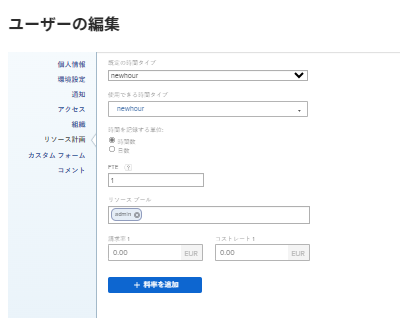
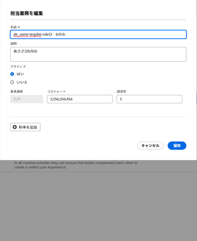

# 請求と売上高の概要

{{highlighted-preview}}

プロジェクトマネージャーは、請求率を使用して、プロジェクトの売上高を把握できます。

この記事では、プロジェクトの売上高の追跡について説明します。 売上高の計算は、使用率レポートでは異なります。 稼働率レポートの収益計算の詳細は、 [リソース使用率情報の表示](../../../resource-mgmt/resource-utilization/view-utilization-information.md).

## 請求率の概要

請求率を扱う際は、次の点を考慮してください。

* 請求率を管理するには、財務データへの編集アクセス権を持つプランライセンスが必要です。\
  財務データへのアクセス権の付与の詳細は、 [財務データへのアクセス権の付与](../../../administration-and-setup/add-users/configure-and-grant-access/grant-access-financial.md).

* 請求率は、ジョブの役割またはユーザーに関連付けられた作業単位ごとの売上高です。

  レートに作業に費やした時間を掛けると、プロジェクトの売上高が生じます。

* 請求率を設定した後、請求レコードを作成して、請求済みと未請求を記録することで、売上高を追跡できます。

  >[!TIP]
  >
  >請求レコードを請求としてマークした場合、そのレコードは編集できません。 これは、レートが異なり、プロジェクトの売上高と費用の情報をロックする場合に重要です。 請求レコードに追加して請求としてマークすると、システムで料金が更新された場合に、請求が更新されなくなります。

  請求レコードの作成について詳しくは、 [請求レコードの作成](../../../manage-work/projects/project-finances/create-billing-records.md).

* ユーザーや役割に対する請求率を作成したり、プロジェクトやタスクに対して 1 回限りの請求率を設定したりできます。

>[!IMPORTANT]
>
>収益を計算する率は、時間またはジョブの役割を記録するユーザーに属しています。

* [ユーザーの請求率](#user-billing-rates)
* [ジョブロール請求率](#job-role-billing-rates)
* [プロジェクトまたはタスクの固定請求率](#fixed-billing-rates-for-projects-or-tasks)
* [請求率の上書き](#override-billing-rates)

### ユーザーの請求率 {#user-billing-rates}

ユーザー管理者は、ユーザーを作成する際に、「時間当たりの請求」フィールドの値とレートの日付を指定することで、ユーザーを日付有効の請求レートに関連付けることができます。

ユーザーの作成について詳しくは、 [ユーザーを追加](../../../administration-and-setup/add-users/create-and-manage-users/add-users.md).

### ジョブロール請求率 {#job-role-billing-rates}

Adobe Workfront管理者は、ジョブロールを作成する際に、「時間当たりの請求」フィールドの値とレートの日付を指定することで、ジョブロールを日付有効請求レートに関連付けることができます。

Workfrontシステムのベース通貨を使用するか、別のカスタム通貨を使用して、ジョブロールの請求率の値を定義できます。

ジョブの役割の作成とその通貨の上書きの詳細については、この記事を参照してください。 [ジョブの役割の作成と管理](../../../administration-and-setup/set-up-workfront/organizational-setup/create-manage-job-roles.md).

### プロジェクトまたはタスクの固定請求率 {#fixed-billing-rates-for-projects-or-tasks}

ユーザーとジョブの役割の時間単価に加えて、次の固定請求率を設定することもできます。

* 固定時間別売上高タイプの固定金額
* 固定売上高収益タイプの固定金額

固定請求率を使用した売上高の計算方法について詳しくは、 [タスクの収益タイプの概要](#overview-of-task-revenue-types).

### 請求率の上書き {#override-billing-rates}

>[!IMPORTANT]
>
>役割に関連付けられた請求率を上書きできます。 ユーザーの請求率または固定率を上書きすることはできません。

次のジョブロールの請求率を上書きできます。

* 特定の会社

  会社に固有の役割の請求率の作成について詳しくは、 [会社の作成と編集](../../../administration-and-setup/set-up-workfront/organizational-setup/create-and-edit-companies.md).

* 特定のプロジェクト

  プロジェクト固有のジョブロール請求率の作成の詳細については、この記事を参照してください。 [ジョブ・ロール請求率の上書きとプロジェクトでの収益の計算の概要](../../../manage-work/projects/project-finances/override-role-billing-rates-and-calculate-project-revenue.md).

## 売上高の追跡

Workfrontでは、タスクの予定時間に基づいてタスクが作成されたときに、計画収益を自動的に追跡できます。

また、実際の時間がタスク、問題、およびプロジェクトにログオンしたときに、実際の収益を自動的に追跡することもできます。

次の表に、タスク、タスク、タスク、プロジェクトに関連する売上高のタイプを示します。

<table style="table-layout:auto"> 
 <col> 
 <col> 
 <tbody> 
  <tr> 
   <td role="rowheader">予定収益</td> 
   <td> 
タスクの場合、これは予定時間タスクに関連付けられた収益です。 すべてのタスクからの計画時間は、プロジェクトの計画時間にロールアップされ、プロジェクトの計画時間の計算に役立ちます。 
 
Workfrontでの予定時間について詳しくは、 <a href="../../../manage-work/tasks/task-information/planned-hours.md" class="MCXref xref">計画時間の概要</a>. 
 
Workfrontは、次の式を使用してタスクの計画収益を計算します。

   
<code>Task Planned Revenue = Planned Hours * Billing hourly rate</code>
 
<strong>注意</strong>  フォーミュラ内の請求時間率では、レートの有効日変更が考慮されます。
 
Workfrontは、次の式を使用して、プロジェクトの計画収益を計算します。
 
<code>Project Planned Revenue = SUM (All tasks Planned Revenue) + Fixed Revenue</code>

   
<b>メモ</b>

「プロジェクト詳細」領域およびプロジェクト・レポートに表示されるプロジェクト計画収益は、「稼働状況」レポートに表示される計画収益とは異なります。 
 
「プロジェクトの詳細」領域の「計画収益」には、タスク「計画時間」に関連付けられたタスク収益と、プロジェクトの固定収益が反映されます。 「稼働率レポート」の「計画収益」には、プロジェクトのタスク割り当てからの計画時間に関連付けられた計画収益のみが表示されます。 
 
     
Example: </b>"> 
      
プロジェクトに 10 時間のタスクが 1 つあり、時間レートが$20 のコンサルタントに割り当てられ、プロジェクトに$100 の固定売上高がある場合、使用率レポートには計画収益（タスクの時間に関連付けられた計画収益）が$200 と表示されます。 「プロジェクトの詳細」セクションには、$300（タスクからの計画収益およびプロジェクトの固定売上高）が表示されます。 
 
     
 
 
タスク計画収益は、タスクに割り当てられたユーザーまたはジョブロールの請求時間率を使用して計算されます。 タスクの収益タイプは、計画収益の計算に使用されるレート（ユーザーまたはロール）に影響を与えます。 詳しくは、この記事の次の節を参照してください。
 
    <ul> 
     <li> 
<a href="#overview-of-task-revenue-types" class="MCXref xref">タスクの収益タイプの概要</a> 
 </li> 
     <li> 
<a href="#revenue-calculations-for-tasks-based-on-user-and-role-assignments" class="MCXref xref">ユーザーとロールの割り当てに基づくタスクの収益計算</a> 
 </li> 
    </ul> 
稼働率レポートの計画収益の計算については、 <a href="../../../resource-mgmt/resource-utilization/view-utilization-information.md" class="MCXref xref">リソース使用率情報の表示 </a>. 
 </td> 
  </tr> 
  <tr> 
   <td role="rowheader">実収益*</td> 
   <td> 
実際のタスク時間、タスク数、タスク数、およびプロジェクト数に関連付けられています。 
 
一般に、Workfrontは次の式を使用して実際の売上高を計算します。
 
<code>Actual Revenue = Actual Hours * Billing rate</code> 
 
<strong>注意</strong>  フォーミュラ内の請求時間率では、レートの有効日変更が考慮されます。
 
稼働率レポートの実際の収益計算の詳細は、 <a href="../../../resource-mgmt/resource-utilization/view-utilization-information.md" class="MCXref xref">リソース使用率情報の表示 </a>. 
 
<b>ヒント</b>

実際の売上高は問題レベルで表示できませんが、問題に関する実際の時間に関連付けられた売上高は、プロジェクトの実際の売上高に貢献します。 
 </td>
</tr> 
 </tbody> 
</table>

*実際の時間の場合、ユーザーのレートは常に、時間を記録するユーザーまたは自分の職務ロールのレートを指します。 Workfrontがユーザーの率を使用するタイミングと、ジョブの役割の率を使用するタイミングについて詳しくは、 [売上高の計算](#revenue-calculations) 」の節を参照してください。

<!--Note from the table for Planned Revenue line: 
     
(the note below is duplicated in this article: /Content/Resource Mgmt/Resource utilization/view-utilization-information.htm and in the glossary)

    -->

例えば、ユーザーの時間別売上高タイプのタスクが 2 時間かかる予定で、割り当てられたユーザーの時間別売上高が 1 時間に 30 ドルの場合、タスクの予定売上高は$60 になります。 タスクが完了した場合、ユーザーがタスクの完了に費やした実際の時間として 1.5 時間しかログに記録しないと、実際の売上高は$45 になります。 タスクに割り当てられていない別のユーザーが時間をログに記録した場合、実際の売上高はそのユーザーの請求率に基づいて計算されます。

売上高の記録方法は次のとおりです。

* タスクの収益タイプを定義し、作業項目に割り当てられたユーザーまたはロールと請求率を関連付ける。 これにより、作業項目の予定時間または実際時間の金額で売上高が計算されます。 上限は、時間単価に対して請求される最大金額に設定することも、請求しない設定にすることもできます。\
  タスクの収益タイプの指定の詳細については、「 [タスクを編集](../../../manage-work/tasks/manage-tasks/edit-tasks.md).

* タスクまたはプロジェクトに対して定額の固定収益率を請求する。\
  固定収益のタスクがある場合、固定収益額はタスクまたはプロジェクトの計画収益として追加され、タスクの計画収益は固定収益として請求レコードに追加できます。
* プロジェクトに対して定額請求の固定収益率を設定し、プロジェクト内のタスクに対して時間単価を設定します。 Workfrontは、プロジェクトの定額料金にタスクの時間単価を追加します。\
  たとえば、Workfrontを使用する機械工は、部品のコストをプロジェクトの固定売上高として入力し、車の修理に費やした時間に対して 1 時間ごとに請求することができます。 修正されたプロジェクトまたはタスクの売上高は、完了時に実現されます。

また、タスクに「請求不可」とマークすることもできます。この場合、計画収益または実際の収益は関連付けられていません。

## タスクの収益タイプの概要 {#overview-of-task-revenue-types}

デフォルトでは、すべての新しいタスクの売上高タイプは、Workfrontまたはグループ管理者が指定したタスクと問題の環境設定に従って設定されます。\
Workfrontインスタンスのタスクと問題の環境設定の定義について詳しくは、 [システム全体のタスクと問題の環境設定を構成する](../../../administration-and-setup/set-up-workfront/configure-system-defaults/set-task-issue-preferences.md).

プロジェクト所有者は、タスクの収益タイプおよびプロジェクトの固定売上高を変更できます。\
プロジェクトの固定売上高の指定の詳細については、「 [プロジェクトを編集](../../../manage-work/projects/manage-projects/edit-projects.md).\
タスクの収益タイプの指定の詳細については、「 [タスクを編集](../../../manage-work/tasks/manage-tasks/edit-tasks.md).

次の収益タイプをタスクまたはプロジェクトに適用できます。

<table border="1" cellspacing="15"> 
 <col> 
 <col> 
 <thead> 
  <tr> 
   <th> 
<strong>収益タイプ</strong> 
 </th> 
   <th> 
<strong>説明</strong> 
 </th> 
  </tr> 
 </thead> 
 <tbody> 
  <tr> 
   <td> 
固定収益
 </td> 
   <td> 
このタイプは、プロジェクトおよびタスクで使用できます。 
 
テンプレートをプロジェクトに添付する際に、テンプレートからの固定売上高がプロジェクトの固定売上高に追加されます。 詳しくは、 <a href="../../../manage-work/projects/create-and-manage-templates/attach-template-to-project-overview.md" class="MCXref xref">プロジェクトへのテンプレートのアタッチの概要</a>. 
 
タスクの場合、タスクの割り当てに関係なく、タスクの売上高は常にタスクに指定された固定金額を使用して計算されます。 
 
子タスクからの固定売上高は、親タスクの売上高にロールアップしてから、プロジェクトの売上高にロールアップします。 親タスクまたはプロジェクトで固定金額が定義されている場合、その金額は、子タスクからロールアップされた予定収益に追加されます。
 
タスクの固定売上高は、プロジェクトの請求レコードに含めることができます。
 </td> 
  </tr> 
  <tr> 
   <td> 
ユーザー (毎時)
 </td> 
   <td> 
このタイプは、タスクにのみ使用できます。 
 
特定のユーザーに設定した請求率に、そのタスクの計画時間数を掛けた値が、タスクの計画収益金額になります。 特定のユーザーに設定した請求率に、タスクに対してユーザーがログを記録する時間数を掛けた値が、タスクの実際の売上高になります。  たとえば、ユーザーを作成し、[ 時間当たりの請求 ] フィールドに$20 を設定した場合、ユーザーがタイムシートのタスクに対して 5 時間を送信した場合、タスクの [ 実績請求 ] の値は$100 になります。

   
ユーザープロファイルには、有効日付と共に複数の請求率を含めることができます。 例えば、最初のユーザーの請求率$20 は 2023 年 4 月 30 日に終了し、2 番目のユーザーの請求率$25 は 2023 年 5 月 1 日に開始します。 ユーザーがタスクに対して 4 月 28 日に 2 時間、5 月 2 日に 3 時間を送信した場合、タスクの実際の請求額は$40 + $75 = $115 になります。

   
<b>ヒント</b>

これは、タスクを作成する際のデフォルトの収益タイプです。
 </td>
</tr> 
  <tr> 
   <td> 
役割 (毎時)
 </td> 
   <td> 
このタイプは、タスクにのみ使用できます。
 
このタイプは「1 時間ごとのユーザー」に似ていますが、ユーザー率ではなくジョブの役割率を使用します。
 
<strong>注意</strong> また、ジョブロールには、有効日付と共に複数の請求率を設定できます。
</td> 
  </tr> 
  <tr> 
   <td> 
キャップ付き 1 時間ごとのユーザー
 </td> 
   <td> 
このタイプは、タスクにのみ使用できます。
 
タスクは 1 時間ごとにユーザー時間ごとに請求されますが、指定できる最大上限金額があります。  例えば、ユーザーの請求率が$25 で、タスクの上限金額が$20 で、ユーザーが 1 時間ログに記録した場合、タスクの実際の売上高は$20 になります。 
 </td> 
  </tr> 
  <tr> 
   <td> 
キャップ付き 1 時間ごとのロール
 </td> 
   <td> 
このタイプは、タスクにのみ使用できます。
 
このタイプは「上限付きのユーザー時間別」に似ていますが、ユーザー率ではなくジョブの役割率を使用します。 
 </td> 
  </tr> 
  <tr> 
   <td> 
ユーザー (毎時) + 固定
 </td> 
   <td> 
このタイプは、タスクにのみ使用できます。 
 
タスクは 1 時間ごとに「ユーザー時間別」と同じように請求されますが、ユーザー率に追加できる「固定金額」があります。 タスクで指定された固定金額は、プロジェクトの請求レコードに含めることができます。 固定金額にタスクの時間を掛けることはありません。 ユーザーの請求率のみが該当します。 
 </td> 
  </tr> 
  <tr> 
   <td> 
役割 (毎時) + 固定
 </td> 
   <td> 
このタイプは、タスクにのみ使用できます。 
 
タスクは「ロール」「時間別」と同じように 1 時間ごとに請求されますが、ロールレートに追加できる「固定金額」が追加されます。 タスクで指定された固定金額は、プロジェクトの請求レコードに含めることができます。 固定金額にタスクの時間を掛けることはありません。 求人ロールの請求率のみが適用されます。 
 </td> 
  </tr> 
  <tr> 
   <td> 
固定 (毎時)
 </td> 
   <td> 
このタイプは、タスクにのみ使用できます。
 
タスクに設定した上限または固定金額に、タスクに対して入力した時間数（ユーザーの役割や職務の役割に関係なく）を掛けた金額が請求金額になります。
 </td> 
  </tr> 
  <tr> 
   <td> 
請求不可
 </td> 
   <td> 
このタイプは、タスクにのみ使用できます。
 
この収益タイプは収益には影響しません。 
 
親オブジェクトにこの設定がある場合、請求タイプの子タスクは通常どおり適用されます。
 
財務データへのアクセス権がないユーザーまたはテンプレートに対する財務権限を持たないユーザーが、そのテンプレートからプロジェクトを作成する場合、これはプロジェクトのタスクのデフォルトの収益タイプです。
 
財務データへのアクセスの詳細については、「 <a href="../../../administration-and-setup/add-users/configure-and-grant-access/grant-access-financial.md" class="MCXref xref">財務データへのアクセス権の付与</a>. オブジェクトに対する財務権限の詳細については、「 <a href="../../../workfront-basics/grant-and-request-access-to-objects/sharing-permissions-on-objects-overview.md" class="MCXref xref">オブジェクトに対する共有権限の概要</a>. テンプレートからプロジェクトを作成する方法については、この記事を参照してください。 <a href="../../../manage-work/projects/create-projects/create-project-from-template.md" class="MCXref xref">テンプレートを使用したプロジェクトの作成</a>. 
 </td> 
  </tr> 
 </tbody> 
</table>

## 親タスクの売上高の概要

請求情報を含むスタンドアロンタスクを親に変更した場合、新しい親タスクには、以前に適用された請求情報と共に、以前に適用された請求情報が保持されます。 子タスクに記録された時間からの請求情報は、新しい親タスクに対して実際の売上高としてロールアップされます。

また、子タスクからの予定収益も、親タスクにロールアップされます。

## 問題に関する売上高の概要

案件には、計画済または実際の収益の金額はありませんが、実際の原価が含まれる場合があります。

問題の時間をログに記録し、「売上高としてカウント」とマークされた時間タイプを使用した場合、Workfrontはその時間にログインしているユーザーの割合に応じて実際のコストの金額を計算します。 この数は、プロジェクトの実際のコストに追加されます。 時間は請求レコードに含めることもできます。

コストの追跡の詳細については、「 [コストの追跡](../../../manage-work/projects/project-finances/track-costs.md).

時間のタイプの詳細については、「 [時間タイプの管理](../../../administration-and-setup/set-up-workfront/configure-timesheets-schedules/hour-types.md).

## 売上高の計算

* [ユーザーとロールの割り当てに基づくタスクの収益計算](#revenue-calculations-for-tasks-based-on-user-and-role-assignments)

### ユーザーとロールの割り当てに基づくタスクの収益計算 {#revenue-calculations-for-tasks-based-on-user-and-role-assignments}

タスクの売上高を計算する際は、次の点に注意してください。

* ユーザーまたはジョブの役割に$0.00 のレートが表示される場合、Workfrontはその値を有効な金額として読み取り、この金額にタスクの時間数を掛けて売上高を計算します。 タスクに売上高を表示しない場合は、ユーザーまたはジョブの役割の請求率のフィールドが空であることを確認してください。
* ジョブロールの請求率が適用される場合、Workfrontは、プロジェクトに上書き率があるたびに、システムレベルで定義されたそのロールの請求率の代わりに、プロジェクトレベルでの上書き率を使用します。
* 実際の収益の場合、ユーザーまたはジョブの役割に有効日付と共に複数の請求率がある場合、タスクの収益は、ユーザーが時間を記録した各期間の収益の合計になります。 計画収益は、その期間の計画時間に基づきます。
* タスクに複数の担当者がいる場合、以下に説明するシナリオは各担当者に適用されます。

タスクの割り当てに基づく収益の計算で利率が使用される階層があります。

Workfront管理者が **ジョブの役割を時間エントリに手動で割り当てる** [ タイムシートと時間の基本設定 ] 領域の設定を行い、プロジェクトのユーザーログ時刻に関連付ける別の役割が選択され、タスクまたはプロジェクトの実績収益は、常に時間エントリに関連付けられた役割に基づいて計算されます。 特定のジョブの役割のログ時間の有効化について詳しくは、この記事を参照してください。 [タイムシートと時間の基本設定](../../../administration-and-setup/set-up-workfront/configure-timesheets-schedules/timesheet-and-hour-preferences.md).

収益タイプとタスク割り当ての特性に基づいてタスクの収益を計算する場合、次のシナリオが存在します。

* **タスクの収益タイプは「1 時間ごとのユーザー」です**

  <table style="table-layout:auto"> 
   <col> 
   <col> 
   <col> 
   <col> 
   <tbody> 
    <tr> 
     <td role="rowheader">時間あたりの請求率</td> 
     <td>割り当てなし</td> 
     <td>ユーザー割り当て</td> 
     <td>ジョブの役割の割り当て</td> 
    </tr> 
    <tr> 
     <td role="rowheader">計画収益の 1 時間あたりの請求率</td> 
     <td>$0.00</td> 
     <td> ユーザーのプロファイルに請求率が設定されている場合、その率を使用して計画収益が計算されます。 それ以外の場合は、主なジョブの役割のシステム請求率が使用されます。  
<b>注意</b>  ユーザーは、セカンダリジョブの役割の 1 つを持つタスクに割り当てることができますが、代わりに、プライマリジョブの役割の割合がここで使用されます。

割り当て中にユーザーの役割が変更された場合は、プロジェクトの財務が再計算されると、正しい率が適用されます。
</td> 
     <td>
レート・カードがプロジェクトに添付されている場合、レート・カードのジョブの役割に基づいて計画収益が計算されます。
 
請求率は、プロジェクトレベルで上書きできます。
</td> 
    </tr> 
    <tr> 
     <td role="rowheader">実際の売上高に対する 1 時間あたりの請求率</td> 
     <td>時間を記録するユーザーのプロファイルに請求率が設定されている場合は、その率が使用されます。 
      高度な割り当てで場所固有の割り当てを持つユーザーまたはロールの時間がログに記録されると、その場所の割合が使用されます。
      それ以外の場合は、主要なジョブの役割の請求率が使用されます。 ユーザーまたはその主な役割に関連する請求率がない場合、実際の売上高は$0.00 になります。  
<b>メモ</b>

  別のユーザーがタスクに割り当てられている場合でも、時間のログを記録するユーザーに関連付けられたレートのみが計算に考慮されます。
</td>
  <td>時間を記録するユーザーのプロファイルに請求率が設定されている場合は、その率が使用されます。  高度な割り当てで場所固有の割り当てを持つユーザーまたはロールの時間がログに記録されると、その場所の割合が使用されます。 それ以外の場合は、主要なジョブの役割の請求率が使用されます。 ユーザーまたはその主な役割に関連する請求率がない場合、実際の売上高は$0.00 になります。  
<b>メモ</b>

  別のユーザーがタスクに割り当てられている場合でも、時間のログを記録するユーザーに関連付けられたレートのみが計算に考慮されます。
</td>
  <td>時間を記録するユーザーのプロファイルに請求率が設定されている場合は、その率が使用されます。 それ以外の場合は、主要なジョブの役割の請求率が使用されます。 
<b>メモ</b>

  ユーザーのログに請求率が関連付けられておらず、ジョブの役割や請求率がジョブの役割にない場合は、タスクに関連付けられているジョブの役割からの割合が使用されます。 この役割に対する請求率がない場合、売上高は$0.00 です
</td>
  </tr> 
   </tbody> 
  </table>

* **タスクの収益タイプは「ロール（時間別）」です**

  <table style="table-layout:auto"> 
   <col> 
   <col> 
   <col> 
   <col> 
   <tbody> 
    <tr> 
     <td role="rowheader">時間あたりの請求率</td> 
     <td>割り当てなし</td> 
     <td>ユーザー割り当て</td> 
     <td>ジョブの役割の割り当て</td> 
    </tr> 
    <tr> 
     <td role="rowheader">計画収益の 1 時間あたりの請求率</td> 
     <td>$0.00</td> 
     <td>
Workfrontは、タスクでユーザーが実行するジョブの役割を調べて、計画収益を計算します。  ユーザーがタスク上の役割に関連付けられていない場合、売上高は$0.00 になります。
 
<strong>注意</strong> 割り当て中にユーザーの役割が変更された場合は、プロジェクトの財務が再計算されると、正しい率が適用されます。
 </td> 
     <td>
レート・カードがプロジェクトに添付されている場合、レート・カードのジョブの役割に基づいて計画収益が計算されます。
 
請求率は、プロジェクトレベルで上書きできます。
</td> 
    </tr> 
    <tr> 
     <td role="rowheader">実際の売上高に対する 1 時間あたりの請求率</td> 
     <td>Workfrontは、時間を記録するユーザーのプライマリジョブロールの請求率を使用します。  高度な割り当てで場所固有の割り当てを持つユーザーまたはロールの時間がログに記録されると、その場所の割合が使用されます。  時間をログに記録しているユーザーに、ジョブロールが関連付けられていない場合、またはプライマリジョブロールに請求率がない場合、実際の収益は$0.00 になります。 </td> 
     <td> 時間のログを記録するユーザーがタスクに割り当てられている場合、タスクのユーザーに関連付けられているジョブロールの請求率を使用して、実際の売上高が計算されます。  高度な割り当てで場所固有の割り当てを持つユーザーまたはロールの時間がログに記録されると、その場所の割合が使用されます。  それ以外の場合は、主要なジョブの役割の請求率が使用されます。 ユーザーに主要な役割がない場合、または主要な役割に請求率がない場合、実際の収益は$0.00 になります。 </td> 
     <td>時刻を記録するユーザーのジョブロールの 1 つがタスクに割り当てられている場合は、そのジョブロールレートが使用されます。 タスクに割り当てられたジョブの役割が、時間のログ記録に関連付けられていない場合は、ユーザーの主要な役割の請求率を使用して実際の売上高が計算されます。 ユーザーにジョブロールがない場合や、主ジョブロールに関連付けられたレートがない場合は、タスクに割り当てられたジョブロールのレートが使用されます。 </td> 
    </tr> 
   </tbody> 
  </table>

<!--

Ideal table but does not come across Markdown

<table style="table-layout:auto">
<col>
<col>
<col>
<col>
<col>
<col>
<col>
<tbody>
<tr>
<td colspan="3">Revenue Type = User Hourly</td>
<td colspan="4">Revenue Type = Role Hourly</td>
</tr>
<tr>
<td> 
 
 </td>
<td> 
<strong>No Assignment</strong> 
 </td>
<td> 
<strong>User Assignment</strong> 
 </td>
<td> 
<strong>Job Role Assignment</strong> 
 </td>
<td> 
<strong>No Assignment</strong> 
 </td>
<td> 
<strong>User Assignment</strong> 
 </td>
<td> 
<strong>Job Role Assignment</strong> 
 </td>
</tr>
<tr>
<td> 
<strong>Billing per hour rate for Planned Revenue</strong> 
 </td>
<td> 
$0.00
 </td>
<td> 
 If a user has a billing rate in their profile, then that rate is used to calculate Planned Revenue. Otherwise, the system billing rate of their primary job role is used.  <note type="note">
The user can be assigned to the task with one of their secondary job roles, but the rate of the primary job role is used here instead.
</note>
 </td>
<td> 
 The system billing rate of the job role assigned to the task is used to calculate Planned Revenue. 
 </td>
<td> 
$0.00
 </td>
<td> 
Workfront looks at the job role that the user fulfills on the task to calculate the Planned Revenue.  If the user is not associated with any role on the task, the Revenue is $0.00. 
 </td>
<td> 
The billing rate of the job role assigned to the task is used to calculate Planned Revenue. 
 
 
 
 
 </td>
</tr>
<tr>
<td> 
<strong>Billing per hour rate for Actual Revenue</strong> 
 </td>
<td colspan="2"> 
If the user logging the hours has a billing rate in their profile, that rate is used.  Otherwise, the billing rate of their primary job role is used. If there is no billing rate associated with the user or their primary role, the Actual Revenue is $0.00.  <note type="note">
Only the rates associated with the user logging the time are taken into account for the calculation, even when another user is assigned to the task.
</note>
 </td>
<td> If the user logging the hours has a billing rate in their profile, that rate is used. Otherwise, the billing rate of their primary job role is used. <note type="note">
If the user logging time has no billing rate associated with them, and they do not have a job role or a billing rate for their job role, then the rate from the job role associated with the task is used. If there is no billing rate for this role, the revenue is $0.00
</note></td>
<td> 
Workfront uses the billing rate of the primary job role of the user logging the time.  If the user logging the time has no job role associated with them, or if the primary job role has no billing rate, the Actual Revenue is $0.00. 
 </td>
<td> 
 If the user logging the time is assigned to the task, the billing rate of the job role associated with the user on the task is used to calculate the Actual Revenue. Otherwise, the billing rate of their primary job role is used. If the user has no primary job role or if their primary job role has no billing rate, the Actual Revenue is $0.00. 
 </td>
<td> 
If one of the job roles of the user logging the time is assigned to the task, that job role rate is used. If the job role assigned to the task is not associated with the user logging the time, then the billing rate of the primary role of the user is used to calculate the Actual Revenue. If the user does not have a job role or there is no rate associated with their primary job role, then the rate of the job role assigned to the task is used. 
 </td>
</tr>
</tbody>
</table>

-->

### プロジェクトの売上高計算

プロジェクトの次の売上高タイプを追跡できます。

* プロジェクトの計画収益は、次の式で計算されます。

  `Project Planned Revenue = SUM(Task Planned Revenue)+ Fixed Revenue`

  タスクの計画収益の計算方法について詳しくは、 [ユーザーとロールの割り当てに基づくタスクの収益計算](#revenue-calculations-for-tasks-based-on-user-and-role-assignments) 」の節を参照してください。

* プロジェクトの実際の売上高は、次の数式で計算されます。

  `Project Actual Revenue = SUM (Task Actual Revenue) + (Hours logged for the project x User Billing per Hour Rate) + SUM (Hours logged for the issues x User Billing per Hour rate)`

タスクの実際の売上高の計算方法について詳しくは、 [ユーザーとロールの割り当てに基づくタスクの収益計算](#revenue-calculations-for-tasks-based-on-user-and-role-assignments) 」の節を参照してください。

プロジェクトに直接記録された時間や問題に関連する実際の売上高に対して、Workfrontは、プロジェクトに時間を記録するユーザーの請求率を使用します。 ユーザーのプロファイルに請求率が関連付けられていない場合、Workfrontはプライマリジョブロールの請求率を使用します。 両方のレートがゼロの場合、プロジェクトに記録された時間に関連する実際の売上高、または問題はゼロになります。
