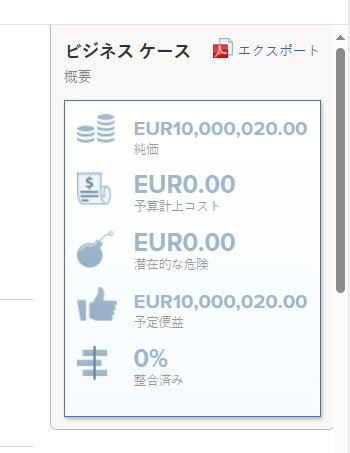

# 予算コストの計算

<!--

(NOTE: This article is linked from "Tracking Project Progress with a Utilization Report"

Keep the structure of this article similar to Calculating Budgeted Labor Cost)

-->

プロジェクトの予算コストは、プロジェクトの計画時に見積もられた、プロジェクトに関連する合計コストです。

## プロジェクトの予算原価の概要

プロジェクトの予算原価は手動で変更できません。 Adobe Workfrontは、次の式を使用して予算原価を計算します。

`Budgeted Cost = Resource Planner Budgeted Labor Cost + Budgeted Expenses Cost + Fixed Cost of the project`

* この **生産資源プランナの予算労務費** 上の計算では、プロジェクトのジョブロールに関連付けられたコストが使用されます。

   プロジェクトの予算人件費は、ビジネス事例またはリソース・プランナの「生産資源予算」領域で追跡できます。

   >[!TIP]
   >
   >  ビジネス・ケースのプロジェクトの予算労務費は、レポートおよびリストで、リソース・プランナの予算労務費として表示されます。

   予算労務費の詳細は、この記事を参照してください。 [プロジェクトの予算労務費と予算時間の把握](../../../manage-work/projects/project-finances/budgeted-labor-cost.md).

* この **予算費用原価** 上の計算では、「ビジネス事例」の「費用」領域またはプロジェクトの「費用」タブで計算されるので、プロジェクトの費用に関連付けられた計画原価が使用されます。\
   プロジェクトの費用の詳細については、「 [プロジェクト費用の管理](../../../manage-work/projects/project-finances/manage-project-expenses.md).

* この **固定コスト** 上記の計算では、プロジェクトの詳細セクションの財務領域で定義されている、プロジェクトのコストに関連する固定金額が使用されます。\
   プロジェクトの「財務」サブタブの詳細については、「 [プロジェクトの財務エリアで情報を管理します](../../../manage-work/projects/project-finances/manage-project-finance-area.md).

>[!NOTE]
>
>Workfrontは、プロジェクトの通貨を使用してすべてのコスト情報を計算します。 リソース・プランナでリソースに予算時間を指定した場合、プロジェクト通貨を変更するオプションは無効になります。
>
>プロジェクトの通貨の変更の詳細については、「 [プロジェクト通貨を変更](../../../manage-work/projects/project-finances/change-project-currency.md).

## プロジェクトの予算コストを見つけます。

ビジネス・ケースの「生産資源予算設定」領域または「生産資源プランナ」に反映された予算原価は、Workfrontの次の領域に次の名前で表示されます。

<table style="table-layout:auto"> 
   <col> 
   <col> 
   <tbody> 
    <tr> 
     <td><strong>予算原価表示名</strong></td> 
     <td><strong>Workfrontの面積</strong></td> 
    </tr> 
    <tr> 
     <td>予算計上コスト</td> 
     <td> 
ビジネス ケース概要
 
  
 </td> 
    </tr> 
    <tr> 
     <td>コスト</td> 
     <td> 
Portfolio最適化
 
ヒント：すべてのプロジェクトの予算原価値の合計は、ポートフォリオの予算原価です。
 </td> 
    </tr> 
    <tr> 
     <td>プロジェクト予算計上コスト</td> 
     <td> <!--
       
Resource Estimates report (NOTE: this was removed with flash)

      --> 
プロジェクトレポート
 
プロジェクト（金融データ）レポート
 
タスクレポート
 
問題レポート
 
予算時間レポート
 
レポートの作成について詳しくは、 <a href="../../../reports-and-dashboards/reports/creating-and-managing-reports/create-custom-report.md" class="MCXref xref">カスタムレポートの作成</a>.
 </td> 
    </tr> 
   </tbody> 
  </table>
