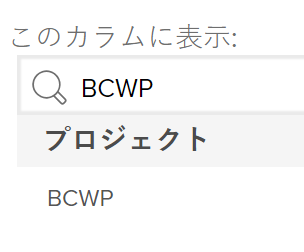

# BCWP（実行された作業の予算計上コスト）の計算

## BCWP（実行された作業の予算計上コスト）の概要

BCWP（実行された作業の予算計上コスト）は、出来高とも呼ばれ、この指標の計算時点で実際に完了したタスク量を表す、プロジェクトのパフォーマンス指標です。

Adobe Workfront では、プロジェクトとタスクの両方について、BCWP（実行された作業の予算計上コスト）が計算されます。

タスクまたはプロジェクトの BCWP の値を確認する際は、次の点に注意してください。

* Workfront は、プロジェクトの PMI（Performance Index Method）の構成に基づいてタスクの BCWP を計算します。

  時間またはコストを使用して PMI を計算するようにプロジェクトを構成し、BCWP も同じ値を使用して計算します。

  BCWP の計算方法の設定について詳しくは、[BCWP の計算方法の設定](#configure-how-bcwp-is-calculated)を参照してください。

* Workfront は、プロジェクト上のすべての親タスクと個々のタスクのすべての BCWP 値を追加することで、プロジェクトの BCWP を計算します。

  子タスクの値は、プロジェクトの BCWP には追加されません。

## アクセス要件

この記事の手順を実行するには、次のアクセス権が必要です。

<table style="table-layout:auto"> 
 <col> 
 <col> 
 <tbody> 
  <tr> 
   <td role="rowheader">Adobe Workfront プラン*</td> 
   <td> <p>任意</p> </td> 
  </tr> 
  <tr> 
   <td role="rowheader">Adobe Workfront ライセンス*</td> 
   <td> <p>プラン </p> </td> 
  </tr> 
  <tr> 
   <td role="rowheader">アクセスレベル設定*</td> 
   <td> <p>プロジェクトへのアクセスを編集</p> <p>まだアクセス権がない場合は、Workfront 管理者に問い合わせて、アクセスレベルに追加の制限が設定されているかどうかを確認してください。Workfront 管理者がアクセスレベルを変更する方法について詳しくは、<a href="../../../administration-and-setup/add-users/configure-and-grant-access/create-modify-access-levels.md" class="MCXref xref">カスタムアクセスレベルの作成または変更</a>を参照してください。</p> </td> 
  </tr> 
  <tr> 
   <td role="rowheader">オブジェクト権限</td> 
   <td> <p>プロジェクトの管理権限</p> <p>追加のアクセス権のリクエストについて詳しくは、<a href="../../../workfront-basics/grant-and-request-access-to-objects/request-access.md" class="MCXref xref">オブジェクトへのアクセス権のリクエスト</a>を参照してください。</p> </td> 
  </tr> 
 </tbody> 
</table>

&#42;保有するプラン、ライセンスタイプ、アクセス権を確認するには、Workfront 管理者に問い合わせてください。

## BCWP の計算方法の設定 {#configure-how-bcwp-is-calculated}

BCWP を時間単位で計算するかコスト単位で計算するかは、プロジェクトの PIM（Performance Index Method）の計算方法を設定することで設定できます。

1. プロジェクトに移動して、左パネルの「**プロジェクトの詳細**」を展開します。
1. **財務**&#x200B;エリアで、「**パフォーマンスインデックスメソッド**」フィールドを見つけ、ダブルクリックして編集します。

   

1. 次のオプションから選択します。

   | オプション | 計算の実行方法 |
   |---|---|
   | 時間ベース | Workfront は、タスクの予定時間数を使用して BCWP を計算します。 |
   | コストベース | Workfront は、タスクの予定コストを使用して BCWP を計算します。 |

1. 「**変更を保存**」をクリックします。

プロジェクトのタスクの BCWP は、時間またはコストを使用して計算されます。

## BCWP を計算

Adobe Workfront では、次の式を使用してタスクまたはプロジェクトの BCWP（実行された作業の予算計上コスト）が計算されます。

```
Task BCWP = Actual Percent Complete x Task Budget
```

```
Project BCWP = SUM(BCWP values of all parent and individual tasks)
```

これらの計算では、次の値が使用されます。

| 使用値 | 使用値の説明 |
|---|---|
| 実際の完了率 | これは、Workfront に表示されるタスクの実際の完了率です。 |
| タスクの予算 | これは、タスクの予定時間数または予定コストの値です。 |

たとえば、タスクの実際の完了率が 25％で、タスクの予算または予定コストが $10,000 の場合、タスクの BCWP は次のようになります。

```
BCWP = 25% x $10,000 = $2,500
```

## プロジェクトまたはタスクの BCWP を見つける

BCWP 列をビューに追加すると、レポートまたはリストで実行された作業の予算計上コストの値を表示できます。

1. タスクまたはプロジェクトのリストに移動します。
1. **表示**&#x200B;メニューを展開し、「**新規表示**」または「**表示をカスタマイズ**」を選択します。

1. 「**列を追加**」をクリックします。
1. **この列に表示：** フィールドで **BCWP** の入力を開始して、リストに表示されたらクリックして選択します。

   

1. 「**ビューを保存**」をクリックします。
1. 「BCWP」フィールドがビューに表示されます。
