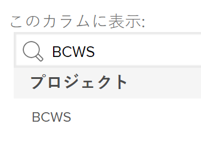

# 予定作業時間コスト（BCWS）の計算

## BCWS（予定された作業の予算計上コスト）の概要

BCWS（予定された作業の予算計上コスト）は、計画値とも呼ばれ、この指標が計算された時点で完了する必要があるタスクの量を表すプロジェクトのパフォーマンス指標です。

Adobe Workfront は、プロジェクトとタスクの両方について、予定された作業の予算計上コスト（BCWS）を計算します。

タスクまたはプロジェクトの BCWS の値を確認する際は、次の点を考慮してください。

* Workfront は、プロジェクトのパフォーマンスインデックスメソッド（PIM）の設定に基づいてタスクの BCWS を計算します。

  時間またはコストを使用して PMI を計算するようにプロジェクトを設定し、BCWP も同じ値を使用して計算します。

  BCWP の計算方法の設定については、[BCWP の計算方法の設定](#configure-how-bcws-is-calculated)を参照してください。

* Workfront は、プロジェクト上のすべての親タスクと個々のタスクのすべての BCWS 値を追加することで、プロジェクトの BCWS を計算します。

  子タスクの値は、プロジェクトの BCWS には追加されません。

## アクセス要件

この記事の手順を実行するには、次のアクセス権が必要です。

<table style="table-layout:auto"> 
 <col> 
 <col> 
 <tbody> 
  <tr> 
   <td role="rowheader">Adobe Workfront プラン*</td> 
   <td> <p>任意</p> </td> 
  </tr> 
  <tr> 
   <td role="rowheader">Adobe Workfront ライセンス*</td> 
   <td> <p>プラン </p> </td> 
  </tr> 
  <tr> 
   <td role="rowheader">アクセスレベル設定*</td> 
   <td> <p>プロジェクトへのアクセスを編集</p> <p>まだアクセス権がない場合は、Workfront 管理者に問い合わせて、アクセスレベルに追加の制限が設定されているかどうかを確認してください。Workfront 管理者がアクセスレベルを変更する方法について詳しくは、<a href="../../../administration-and-setup/add-users/configure-and-grant-access/create-modify-access-levels.md" class="MCXref xref">カスタムアクセスレベルの作成または変更</a>を参照してください。</p> </td> 
  </tr> 
  <tr> 
   <td role="rowheader">オブジェクト権限</td> 
   <td> <p>プロジェクトの管理権限</p> <p>追加のアクセス権のリクエストについて詳しくは、<a href="../../../workfront-basics/grant-and-request-access-to-objects/request-access.md" class="MCXref xref">オブジェクトへのアクセス権のリクエスト</a>を参照してください。</p> </td> 
  </tr> 
 </tbody> 
</table>

&#42;保有するプラン、ライセンスタイプ、アクセス権を確認するには、Workfront 管理者に問い合わせてください。

## BCWS の計算方法の設定 {#configure-how-bcws-is-calculated}

BCWS を時間単位で計算するかコスト単位で計算するかは、プロジェクトのパフォーマンスインデックスメソッド（PIM）の計算方法を指定することで設定できます。

1. プロジェクトに移動し、左パネルの「**プロジェクトの詳細**」をクリックします。
1. **財務**&#x200B;エリアで、「**パフォーマンスインデックスメソッド**」フィールドを検索し、ダブルクリックして編集します。

   

1. 次のオプションから選択します。

   | オプション | 計算の実行方法 |
   |---|---|
   | 時間ベース | Workfront は、タスクの予定時間を使用して BCWS を計算します。 |
   | コストベース | Workfront は、タスクの予定コストを使用して BCWS を計算します。 |


1. 「**変更を保存**」をクリックします。

   プロジェクトのタスクの BCWS は、時間またはコストを使用して計算されます。

## BCWS の計算

Workfront は、次の式を使用して、タスクまたはプロジェクトの予定された作業の予算計上コスト（BCWS）を計算します。

```
Task BCWS = Planned Percent Complete x Task Budget
```

```
Project BCWS = SUM(BCWS values of all parent and individual tasks)
```

この計算では、次の値が使用されます。

| 使用値 | 使用する値の説明 |
|---|---|
| 予定完了率 | これは、タスクの開始から今日までの経過時間を調べることで、タスクの完了率が何パーセントになるかを示しています。 |
| タスクの予算 | これは、タスクの予定時間数または予定コストの値です。 |

例えば、今日が 2月12日で、タスクが 2月10日から 2月20日まで続くようにスケジュールされている場合、今日のタスクの完了率は 20%になります。タスク予算（予定コスト）が $10,000 の場合、タスクの BCWS は次のようになります。

```
Task BCWS = 20% x $10,000 = $2,000
```

## プロジェクトまたはタスクの BCWS を検索

BCWS 列をビューに追加すると、レポートまたはリスト上の予定された作業の予算計上コストの値を表示できます。

1. タスクまたはプロジェクトのリストに移動します。
1. **表示**&#x200B;メニューを展開し、「**新規表示**」または「**表示をカスタマイズ**」を選択します。

1. 「**列を追加**」をクリックします。 
1. **この列に表示：**&#x200B;フィールドで **BCWP** の入力を開始して、リストに表示されたらクリックして選択します。

   

1. 「**ビューを保存**」をクリックします。
1. **BCWS** フィールドがビューに表示されます。
