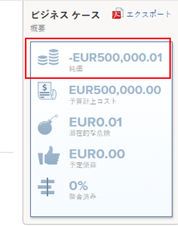

# 正味値を計算

プロジェクトの正味価値は、利益を計算してコストを削除した後の、プロジェクトの期待値の合計です。 

## プロジェクトの純価値の概要

Adobe Workfrontは、次の式を使用してプロジェクトの正味価値を計算します。 

```
Project Net Value = Planned Benefit - Budgeted Cost - Potential Risk Cost
```

次のフィールドは、プロジェクトの正味値に影響を与える可能性があります。

* **計画済み特典**:これは、 **プロジェクト情報** ビジネス事例の領域\
   プロジェクトの計画的利益の詳細については、 [プロジェクト情報](../../../manage-work/projects/define-a-business-case/areas-of-business-case.md#project-info) 記事のセクション [ビジネス事例の領域の概要](../../../manage-work/projects/define-a-business-case/areas-of-business-case.md).

* **予算コスト**：プロジェクトを初めて起動したときの推定プロジェクトに関連する合計コストです。

   この **予算コスト** は **予算労務費** ビジネス・ケースの「生産資源予算編成」領域で計算される値で、「生産資源プランナ」の製造オーダー・ロールに予算された時間数と、各製造オーダー・ロールの「時間単価」レートが考慮されます。\
   予算コストは **正味値** プロジェクトの 予算原価の計算方法の詳細は、 [予算コストの計算](../../../manage-work/projects/project-finances/budgeted-cost.md).

* **潜在的なリスクコスト**:これは、[ ビジネス事例 ] またはプロジェクトの [ リスク ] タブで定義されている、プロジェクト上の任意のリスクに関連するコストです。\
   プロジェクトの潜在的なリスクコストの計算の詳細については、「 [潜在的なリスクコストの計算](../../../manage-work/projects/project-finances/potential-risk-cost.md).

    

## プロジェクトの正味の値を見つけます。

プロジェクトの正味価値は、Workfrontの次の領域にあります。

* ビジネス事例のビジネス事例概要領域 \
   「ビジネス事例の概要」領域の詳細については、この記事の「ビジネス事例の概要について」の節を参照してください [プロジェクトのビジネスケースの作成](../../../manage-work/projects/define-a-business-case/create-business-case.md) [プロジェクトのビジネスケースの作成](../../../manage-work/projects/define-a-business-case/create-business-case.md).

   

* Portfolioの最適化で、プロジェクトがポートフォリオに関連付けられているかどうか

   >[!TIP]
   >
   >すべてのプロジェクトの純値の合計は、ポートフォリオの純値です。

   Optimizer の詳細については、「Portfolio・オプティマイザ」を参照してください。 [Portfolio最適化の概要](../../../manage-work/portfolios/portfolio-optimizer/portfolio-optimizer-overview.md).

* 次のリストおよびレポートの「プロジェクトの正味値」フィールドで、次の操作を実行します。

   * プロジェクト
   * タスク
   * 問題
   * プロジェクト (財務データ)
   レポートの作成について詳しくは、 [カスタムレポートの作成](../../../reports-and-dashboards/reports/creating-and-managing-reports/create-custom-report.md).
