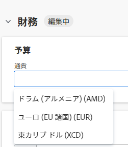

# プロジェクト通貨の変更

プロジェクトマネージャーは、Adobe Workfront システムのデフォルト通貨以外の通貨を使用するようにプロジェクトを設定できます。これにより、労力コストと収益を計算する際に、プロジェクトの財務情報を目的の通貨で表示できます。

この節で説明されているように代替通貨を使用する前に、[為替レートの設定](../../../administration-and-setup/manage-workfront/exchange-rates/set-up-exchange-rates.md)の記事の説明に従って、Workfront 管理者はまず複数の通貨を有効にして設定する必要があります。

## アクセス要件

この記事の手順を実行するには、次のアクセス権が必要です。

<table style="table-layout:auto"> 
 <col> 
 <col> 
 <tbody> 
  <tr> 
   <td role="rowheader">Adobe Workfront プラン*</td> 
   <td> 
任意
 </td> 
  </tr> 
  <tr> 
   <td role="rowheader">Adobe Workfront ライセンス*</td> 
   <td> 
プラン 
 </td> 
  </tr> 
  <tr> 
   <td role="rowheader">アクセスレベル設定*</td> 
   <td> 
プロジェクトへのアクセスを編集
 
メモ：まだアクセス権がない場合は、アクセスレベルに追加の制限が設定されていないかどうか Workfront 管理者にお問い合わせください。Workfront 管理者がアクセスレベルを変更する方法について詳しくは、<a href="../../../administration-and-setup/add-users/configure-and-grant-access/create-modify-access-levels.md" class="MCXref xref">カスタムアクセスレベルの作成または変更</a>を参照してください。
 </td> 
  </tr> 
  <tr> 
   <td role="rowheader">オブジェクト権限</td> 
   <td> 
プロジェクトに対して権限を管理
 
追加のアクセス権のリクエストについて詳しくは、<a href="../../../workfront-basics/grant-and-request-access-to-objects/request-access.md" class="MCXref xref">オブジェクトへのアクセス権のリクエスト</a>を参照してください。
 </td> 
  </tr> 
 </tbody> 
</table>

&#42;保有するプラン、ライセンスタイプ、アクセス権を確認するには、Workfront 管理者に問い合わせてください。

## Workfront でプロジェクト通貨を変更する際の考慮事項

* プロジェクトに既に財務情報が存在する場合、プロジェクト通貨は変更できません。
* レートは労力コストに適用され、収益の計算に使用され、将来的にはレポート目的で使用されます。
* 1 つのプロジェクトに異なる通貨を指定しない場合、Workfront は、そのプロジェクトの通貨がシステムのデフォルトの通貨であると見なします。システムレベルのデフォルト通貨について詳しくは、[為替レートの設定](../../../administration-and-setup/manage-workfront/exchange-rates/set-up-exchange-rates.md)を参照してください。
* デフォルトでは、すべてのフルライセンスユーザーが通貨と為替レートを表示に対するアクセス権を持っています。Workfront 管理者は、ユーザーがプロジェクトに特定のレートを設定できるように、**為替レート**&#x200B;に対する追加の管理アクセス権を付与する必要があります。
* Workfront の為替レートは動的ではありません。管理者がこの値を設定し、為替レートの変動が発生した場合に更新する必要があります。
* プロジェクトに通貨を反映させるレポートを作成すると、デフォルトでは、すべてのレポートがプロジェクトのデフォルト通貨でグループ化されます。異なる為替レートを持つ複数のプロジェクトでレポートを作成する場合、プロジェクトに適用したグループは、システムレベルでのデフォルトの為替レートを反映します。詳しくは、[一意の為替レートを使用した財務データレポートの作成](../../../reports-and-dashboards/reports/creating-and-managing-reports/create-financial-data-reports-unique-exchange-rates.md)を参照してください。

## プロジェクト通貨の設定

1. デフォルトの通貨を変更するプロジェクトに移動します。

   >[!TIP]
   >
   >プロジェクトに財務情報がまだ含まれていないことを確認します。例えば、プロジェクトに予定コストまたは実際のコストが関連付けられていないことを確認します。

1. 左側のパネルで「**プロジェクト詳細**」をクリックして、**財務情報**&#x200B;エリアに移動します。
1. 「**通貨**」フィールドの「**追加**」をクリックし、プロジェクトのデフォルト通貨として使用する通貨を選択します。Workfront 管理者が Workfront インスタンスに設定したすべての通貨が表示されます。

   

1. （条件付き）Workfront システムに設定されているデフォルト通貨以外の通貨を選択する場合は、システムで基準通貨として設定される通貨との関連で、選択した通貨のレートを指定します。
1. 「**変更を保存**」をクリックします。
