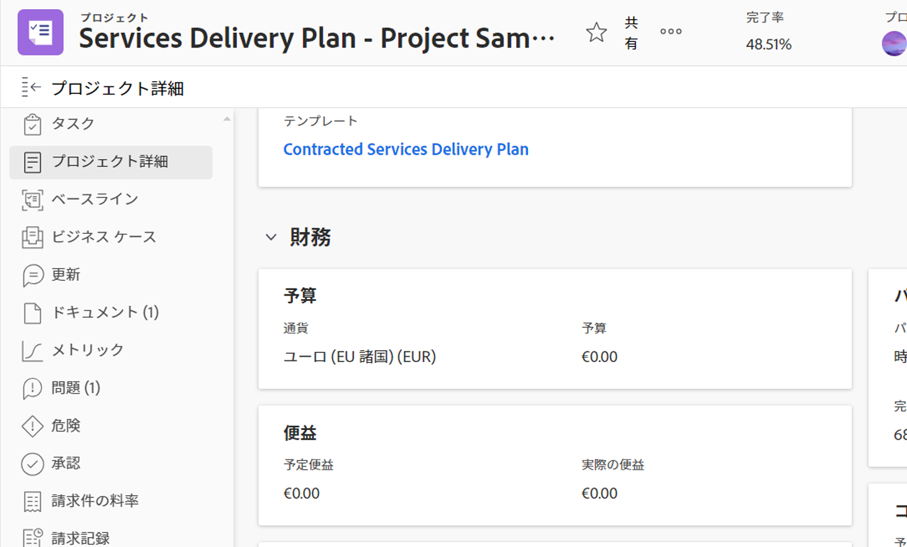
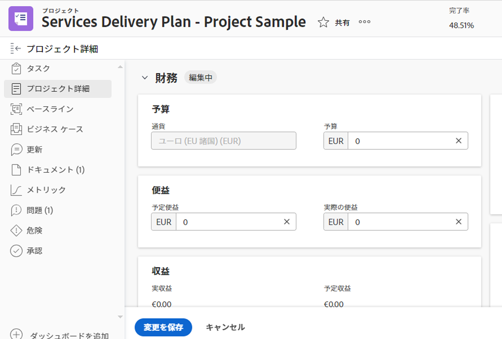

# プロジェクトの財務エリアでの情報の管理

<!--

(NOTE: some information in here is duplicated in Edit projects. If you need to update one of the fields in this area, do it in both places.)

-->

プロジェクトの財務情報を表示または編集するには、プロジェクトの詳細セクションの財務エリアにアクセスします。このエリアで表示または編集できるフィールドは限られています。プロジェクトのすべての情報の編集について詳しくは、[プロジェクトの編集](../../../manage-work/projects/manage-projects/edit-projects.md)を参照してください。

## アクセス要件

この記事の手順を実行するには、次のアクセス権が必要です。

<table style="table-layout:auto"> 
 <col> 
 <col> 
 <tbody> 
  <tr> 
   <td role="rowheader">Adobe Workfront プラン*</td> 
   <td> 
任意
 </td> 
  </tr> 
  <tr> 
   <td role="rowheader">Adobe Workfront ライセンス*</td> 
   <td> 
レビュー以上
 </td> 
  </tr> 
  <tr> 
   <td role="rowheader">アクセスレベル設定*</td> 
   <td> 
プロジェクトおよび財務データへの表示アクセス権またはそれ以上の権限
 
プロジェクトおよび財務データへのアクセスを編集して、プロジェクトの財務情報を編集します
 
<b>メモ</b>

   
 まだアクセス権がない場合は、Workfront 管理者に問い合わせて、アクセスレベルに追加の制限が設定されているかどうかを確認してください。Workfront 管理者がアクセスレベルを変更する方法について詳しくは、「<a href="../../../administration-and-setup/add-users/configure-and-grant-access/create-modify-access-levels.md" class="MCXref xref">カスタムアクセスレベルの作成または変更</a>」を参照してください。
 </td> 
  </tr> 
  <tr> 
   <td role="rowheader">オブジェクト権限</td> 
   <td> 
財務の表示権限を含むプロジェクトへの表示権限またはそれ以上の権限
 
プロジェクトの財務情報を編集するための財務管理を含むプロジェクトへの管理権限
 
追加のアクセス権のリクエストについて詳しくは、<a href="../../../workfront-basics/grant-and-request-access-to-objects/request-access.md" class="MCXref xref">オブジェクトへのアクセス権のリクエスト</a>を参照してください。
 </td> 
  </tr> 
 </tbody> 
</table>

&#42;保有するプラン、ライセンスタイプ、アクセス権を確認するには、Workfront 管理者に問い合わせてください。

## 財務エリアの概要

財務エリアで情報を表示または編集する際は、次の項目を考慮してください。

* プロジェクトの詳細の財務エリアに表示される財務情報は、タスクからプロジェクトレベルにロールアップされる値と、プロジェクトに直接入力された情報を表します。一部の財務情報は、プロジェクトでもタスクレベルでも管理できます。
* プロジェクトの財務エリアを表示するには、プロジェクトでの表示権限と、アクセスレベルからの財務データへのアクセス権が必要です。
* 財務エリアの情報を編集するには、プロジェクトに対する管理権限と、アクセスレベルからの財務データへのアクセス権が必要です。ただし、このエリアの情報を編集するのはプロジェクト所有者のみにすることをお勧めします。

## プロジェクトの財務情報を表示

1. プロジェクトに移動します。
1. 左側のパネルの「**プロジェクト詳細**」をクリックします。
1. 詳細セクションの右上隅にある&#x200B;**編集**&#x200B;アイコン  をクリックし、「**財務**」をクリックします。

   

   >[!NOTE]
   >
   >Workfront 管理者がレイアウトテンプレートを設定した方法によっては、「概要」セクションが最初に表示されない場合があり、その場合は折りたたまれています。詳しくは、[レイアウトテンプレートを使用した詳細ビューのカスタマイズ](../../../administration-and-setup/customize-workfront/use-layout-templates/customize-details-view-layout-template.md)を参照してください。

1. プロジェクトの財務エリアで、次のフィールドを表示します。

   <table style="table-layout:auto"> 
    <col> 
    <col> 
    <tbody> 
     <tr> 
      <td role="rowheader">パフォーマンスインデックスメソッド</td> 
      <td> Workfront が出来高指標の計算に使用する方法を制御します。時間ベースとコストベースのどちらでもかまいません。 PIM について詳しくは、<a href="../../../manage-work/projects/project-finances/set-pim.md" class="MCXref xref">パフォーマンスインデックスメソッド（PIM）の設定</a>を参照してください。</td> 
     </tr> 
     <tr> 
      <td role="rowheader">CPI/SPI/CSI</td> 
      <td> 
これらは、特定の時点でのプロジェクトのパフォーマンスを示すプロジェクトパフォーマンス指標です。その値は、パフォーマンスインデックスメソッドに基づいて計算されます。 詳しくは、以下の記事を参照してください。 
 
       <ul> 
        <li> 
<a href="../../../manage-work/projects/project-finances/calculate-cpi.md" class="MCXref xref">コスト効率指数（CPI）の計算</a> 
 </li> 
        <li> 
<a href="../../../manage-work/projects/project-finances/calculate-spi.md" class="MCXref xref">スケジュール効率指数（SPI）の計算</a> 
 </li> 
        <li> 
<a href="../../../manage-work/projects/project-finances/calculate-csi.md" class="MCXref xref">コスト効率指数（CPI）の計算</a> 
 </li> 
       </ul> </td> 
     </tr> 
     <tr> 
      <td role="rowheader">完成時総コスト見積り</td> 
      <td> パフォーマンスインデックスメソッド（PIM）が時間ベースの場合は、プロジェクトの見込まれる合計コストを時間単位で表し、PIM がコストベースの場合は、通貨値で表します。 完了時の見積もりの計算について詳しくは、<a href="../../../manage-work/projects/project-finances/calculate-eac.md" class="MCXref xref">完了時の見積もり（EAC）の計算</a>を参照してください。</td> 
     </tr> 
     <tr> 
      <td role="rowheader">予算</td> 
      <td>これはプロジェクトの予算セットです。これは、プロジェクト所有者が手動で指定します。</td> 
     </tr> 
     <tr> 
      <td role="rowheader">固定コスト</td> 
      <td>これらは、プロジェクトの他のアクティビティから独立した、プロジェクトの固定費です。これらは、プロジェクト所有者が手動で入力します。</td> 
     </tr> 
     <tr> 
      <td role="rowheader">予定コスト</td> 
      <td>タスク担当者（担当業務またはユーザー）に関連付けられた予定時間数とレートに基づく、プロジェクトの概算コストです。</td> 
     </tr> 
     <tr> 
      <td role="rowheader">実際のコスト</td> 
      <td>プロジェクトで発生するすべてのコスト。実際のコストは、すべての実際のコストの合計です。人件費（担当業務またはそれらを記録するユーザーに関連付けられた実際の時間数とレートに基づく）、経費、固定費から成り、プロジェクトまたはタスクに関連付けることができます。</td> 
     </tr> 
     <tr> 
      <td role="rowheader">固定収益</td> 
      <td>プロジェクトスケジュールに基づいて予測される収益を設定します。固定収益は、プロジェクト所有者が手動で指定します。</td> 
     </tr> 
     <tr> 
      <td role="rowheader">予定収益</td> 
      <td>タスク担当者（担当業務またはユーザー）に関連付けられた予定時間数とレートに基づいて予測される収入です。</td> 
     </tr> 
     <tr> 
      <td role="rowheader">実収益</td> 
      <td>タスク担当者（担当業務またはユーザー）に関連付けられた実際の時間数とレートに基づく、プロジェクトの実際の収入です。</td> 
     </tr> 
     <tr> 
      <td role="rowheader">請求済み収益</td> 
      <td> 
請求記録で取得されたクライアントまたは他の関係者に請求される収益。請求記録について詳しくは、<a href="../../../manage-work/projects/project-finances/create-billing-records.md" class="MCXref xref">請求記録の作成</a>の記事を参照してください。 
 </td> 
     </tr> 
     <tr> 
      <td role="rowheader"> </td> 
      <td> </td> 
     </tr> 
     <tr> 
      <td role="rowheader"> </td> 
      <td> </td> 
     </tr> 
    </tbody> 
   </table>

## プロジェクトの財務情報を編集

プロジェクト所有者は、プロジェクトの「財務」サブタブの情報を編集できます。

「プロジェクト財務」サブタブの情報を編集するには、次の手順に従います。

1. 自分が所有するプロジェクトに移動します。

   >[!NOTE]
   >
   >次の手順を実行するには、プロジェクトに対する管理権限が必要です。また、プロジェクトの「財務情報」サブタブを変更できるのは、プロジェクト所有者のみにすることをお勧めします。

1. 左パネルの「**プロジェクト詳細**」をクリックします。
1. 詳細セクションの右上隅にある&#x200B;**編集**&#x200B;アイコン  をクリックし、「**財務**」をクリックします。財務エリアが編集用に開きます。
1. 編集可能なフィールドをシングルクリックして編集するか、「**+ 追加**」をクリックして空のフィールドに情報を追加します。

   >[!TIP]
   >
   >Workfront によって自動的に計算されるフィールドや、編集権限を持っていないフィールドは、編集できません。

   

1. 以下のフィールドを更新します。

   >[!NOTE]
   >
   >Workfront 管理者がレイアウトテンプレートを設定する方法によっては、「プロジェクトの詳細」セクションのフィールドが環境によって異なる場合があります。詳しくは、[レイアウトテンプレートを使用した詳細ビューのカスタマイズ](../../../administration-and-setup/customize-workfront/use-layout-templates/customize-details-view-layout-template.md)を参照してください。

   <table style="table-layout:auto"> 
    <col> 
    <col> 
    <tbody> 
     <tr> 
      <td role="rowheader">パフォーマンスインデックスメソッド</td> 
      <td> 
Workfront がプロジェクトのパフォーマンス指標の計算に使用する方法を制御します。これは管理者がシステムレベルで設定しますが、プロジェクトレベルで編集することもできます。次のオプションのいずれかを選択することを検討してください。
 
       <ul> 
        <li><strong>時間ベース：</strong>Workfront では、プロジェクトの CPI と EAC の計算に「予定時間数」を使用し、プロジェクトの EAC は時間単位の数値で表示されます。 </li> 
        <li><strong>コストベース：</strong>Workfront では、プロジェクトの CPI と EAC の計算に予定労力コストを使用し、EAC は通貨値として表示されます。このオプションを選択する場合は、タスクの担当者（業務担当またはユーザー）がコスト率に関連付けられていることを確認します。</li> 
       </ul> </td> 
     </tr> 
     <tr> 
      <td role="rowheader">完成時総コスト見積り</td> 
      <td> 
プロジェクトまたはタスクが完了すると見込まれる合計コストを表します。これは管理者がシステムレベルで設定しますが、プロジェクトレベルで編集することもできます。次のオプションのいずれかを選択することを検討してください。
 
       <ul> 
        <li><strong>プロジェクトレベルでの計算</strong>：親タスクとプロジェクトの EAC は、EAC 式の実際の時間数／実際の労力コストを使用して決定されます。この計算には、親タスクまたはプロジェクトに直接追加された実際の時間数／コストと費用が含まれます。</li> 
        <li><strong>タスク／サブタスクからロールアップ</strong>：親タスクとプロジェクトの EAC は、各子タスクの EAC を合計することによって決定されます。この計算には、親タスクまたはプロジェクトに直接追加された実際の時間数／コストと費用は含まれません。</li> 
       </ul> </td> 
     </tr> 
     <tr> 
      <td role="rowheader">予算</td> 
      <td>このプロジェクトの予算を指定します。</td> 
     </tr> 
     <tr> 
      <td role="rowheader">固定コスト</td> 
      <td>このプロジェクトの固定コストを指定します。これには、労力コストや費用コストは含まれません。</td> 
     </tr> 
     <tr> 
      <td role="rowheader">固定収益</td> 
      <td> 
このプロジェクトの固定収益を指定します。これには、パートナーやサードパーティに対して請求された請求記録から得られる売上高は含まれません。
 </td> 
     </tr> 
     <tr> 
      <td role="rowheader">プロジェクトの通貨</td> 
      <td> 
システム内のデフォルトの通貨と異なる場合は、このプロジェクトの通貨を指定します。システム内のデフォルトの通貨は、Workfront 管理者が定義します。Workfront での為替レートの設定について詳しくは、<a href="../../../administration-and-setup/manage-workfront/exchange-rates/set-up-exchange-rates.md" class="MCXref xref">為替レートの設定</a>の記事を参照してください。
 </td> 
     </tr>
    </tbody> 
   </table>

1. 「**変更を保存**」をクリックします。
