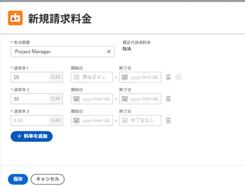

# プロジェクト・レベルでの役割請求率の上書き

プロジェクトマネージャーは、特定のプロジェクトのジョブロールに対する請求率を指定できます。 このプロジェクトレベルの請求率は、このジョブロールのシステムレベルの請求率を上書きします。 Workfrontは、ジョブロールのプロジェクトレベルの請求率を使用して、システムレベルの請求率を使用する代わりに、売上高を計算します。

この記事では、プロジェクトのシステムジョブの役割の請求率を上書きする方法について説明します。

プロジェクトのジョブロール請求率の上書きおよびプロジェクト収益の計算に関する一般情報は、 [ジョブ・ロール請求率の上書きとプロジェクトの収益の計算の概要](../../../manage-work/projects/project-finances/override-role-billing-rates-and-calculate-project-revenue.md).

プロジェクトの売上高の計算に使用される役割の詳細は、この記事の「ユーザーと役割の割り当てに基づくタスクの収益計算について」の節を参照してください [請求と売上高の概要](../../../manage-work/projects/project-finances/billing-and-revenue-overview.md).

>[!NOTE]
>
>実際の収益の場合、請求としてマークされた請求レコードに追加された時間に適用される請求率は、請求レコードの請求後に発生する請求率の上書きの影響を受けません。

## アクセス要件

この記事の手順を実行するには、次のアクセス権が必要です。

<table style="table-layout:auto"> 
 <col> 
 <col> 
 <tbody> 
  <tr> 
   <td role="rowheader">Adobe Workfront plan*</td> 
   <td> 
任意
 </td> 
  </tr> 
  <tr> 
   <td role="rowheader">Adobe Workfront license*</td> 
   <td> 
計画 
 </td> 
  </tr> 
  <tr> 
   <td role="rowheader">アクセスレベル設定*</td> 
   <td> 
プロジェクトおよび財務データへのアクセスを編集
 
ジョブロールの管理アクセス
 
注意：まだアクセス権がない場合は、Workfront管理者に、アクセスレベルに追加の制限を設定しているかどうかを問い合わせてください。 Workfront管理者がアクセスレベルを変更する方法について詳しくは、 <a href="../../../administration-and-setup/add-users/configure-and-grant-access/create-modify-access-levels.md" class="MCXref xref">カスタムアクセスレベルの作成または変更</a>.
 </td> 
  </tr> 
  <tr> 
   <td role="rowheader">オブジェクト権限</td> 
   <td> 
財務データの編集を含むプロジェクトに対する権限を管理します 
 
追加のアクセス権のリクエストについて詳しくは、 <a href="../../../workfront-basics/grant-and-request-access-to-objects/request-access.md" class="MCXref xref">オブジェクトへのアクセスのリクエスト </a>.
 </td> 
  </tr> 
 </tbody> 
</table>

&#42;保有しているプラン、ライセンスの種類、アクセス権を確認するには、Workfront管理者に問い合わせてください。

## プロジェクト・レベルでの役割請求率の上書き

次の方法で、プロジェクトのジョブロールの請求率を上書きできます。

* 1 回のみ、ジョブの役割の新しい率を選択します。\
   新しい率は、プロジェクトの期間全体に対して、売上高の計算に使用されます。

* 特定の日付範囲に対して複数の新しい率を選択することで、何度か実行できます。\
   指定した日付範囲ごとに異なる率を使用できます。

>[!TIP]
>
>プロジェクトのユーザー請求率を上書きすることはできません。

プロジェクトの請求率を上書きする手順は、次のとおりです。

1. 請求率を上書きするプロジェクトに移動します。
1. クリック **請求率** をクリックします。 最初にクリックする必要がある場合があります **さらに表示**.
1. クリック **請求率を追加** > **新しい請求率**.

   「 New Billing Rate 」ボックスが開きます。

1. 内 **ジョブの役割** 「 」フィールドで、請求率を変更するジョブの役割を選択します。

   

   この **デフォルトの請求率** 「 」フィールドには、このジョブの役割のシステムレベルの割合が表示されます。

1. 内 **請求率 1** [!DNL Analytics] フィールドに、請求レートの上書き（1 回限り）を入力し、[!DNL Analytics] **保存** 請求率を一度に上書きする

   または

   クリック **追加率** ：請求レートの上書きを追加します。

1. （条件付き）複数の請求レートの上書きを追加する場合は、次の情報を指定します。

   * **請求率 1**:プロジェクトの開始時から最初の上書きの最初の日までの請求率の値。 これは通常、 **デフォルトのレート**.
   * **開始日**:これはデフォルトレートが終了する日付です。
   * **終了日**:新しい請求率の上書きが終了する日付。

   

1. 選択した日付のタイムゾーンが「新しい請求率」ボックスの下部に表示されます。 セットアップの顧客情報領域に表示されるように、Workfrontインスタンスに関連付けられたタイムゾーンです。 詳しくは、 [システムの基本情報を設定する](../../../administration-and-setup/get-started-wf-administration/configure-basic-info.md).
1. Workfrontは、プロジェクトの売上高を計算する際に指定した期間に発生した時間に対して、上書きの役割率を適用します。
1. 2 つの上書き率の時間枠の間にギャップが生じないようにする必要があります。 この **開始日** の上書き率は、 **終了日** の日付を指定します。

1. 最初の上書き率に対して開始日を指定したり、最後の上書き率に対して終了日を指定したりすることはできません。\
   最初の上書き率には「デフォルトの率」を使用することをお勧めします。\
   Workfrontでは、最初の上書きの終了日より前の日付を持つすべての時間に対して最初の上書き率が適用され、最後の上書きの開始日より後の日付を持つすべての時間に対して、最後の上書き率が適用されると想定しています。\
   プロジェクトの計画開始日の 1 時間前にログが記録された場合は、最初の請求率が使用されます。\
   プロジェクトの計画完了日の後に 1 時間が記録された場合は、最後の請求率が使用されます。

1. 「**保存**」をクリックします。
