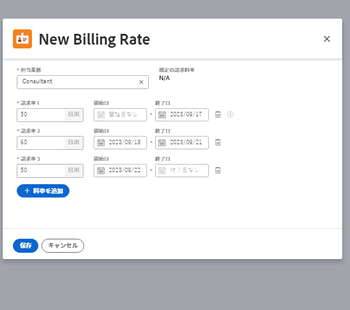

# 担当業務に対する請求レートの上書きとプロジェクトにおける収益の計算の概要

{{highlighted-preview}}

請求レートを使用して、プロジェクトに費やした時間で乗算したプロジェクトの収益を計算できます。請求レートと収益について詳しくは、[請求と収益の概要](../../../manage-work/projects/project-finances/billing-and-revenue-overview.md)を参照してください。

<!--
<div data-mc-conditions="QuicksilverOrClassic.Draft mode">
<p>(NOTE: drafted because the only procedure here was moved to a different article.&nbsp;This stays as an overview)</p>
<h2>Access requirements</h2>
<p>You must have the following access to perform the steps in this article:</p>
<table style="table-layout:auto">
<col>
<col>
<tbody>
<tr>
<td role="rowheader">Adobe Workfront plan*</td>
<td> <p>Any</p> </td>
</tr>
<tr>
<td role="rowheader">Adobe Workfront license*</td>
<td> <p>Plan </p> </td>
</tr>
<tr>
<td role="rowheader">Access level configurations*</td>
<td> <p>Edit access to Projects and Financial&nbsp;Data</p> <note type="note">
If you still don't have access, ask your Workfront administrator if they set additional restrictions in your access level. For information on how a Workfront administrator can modify your access level, see
<a href="../../../administration-and-setup/add-users/configure-and-grant-access/create-modify-access-levels.md" class="MCXref xref">Create or modify custom access levels</a>.
</note> </td>
</tr>
<tr>
<td role="rowheader">Object permissions</td>
<td> <p>Manage permissions to the project with permissions to Manage Finance</p> <p>For information on requesting additional access, see <a href="../../../workfront-basics/grant-and-request-access-to-objects/request-access.md" class="MCXref xref">Request access to objects </a>.</p> </td>
</tr>
</tbody>
</table>
<p>*To find out what plan, license type, or access you have, contact your Workfront administrator.</p>
</div>
-->

## 担当業務に対する請求レートおよび役割（毎時）収益のタイプの概要

Adobe Workfront の管理者は、ユーザーと担当業務の両方に請求レートを関連付けることができます。\
ユーザーの作成と請求レート率への関連付けについて詳しくは、[ユーザーを追加](../../../administration-and-setup/add-users/create-and-manage-users/add-users.md)を参照してください。担当業務の作成と請求レートとの関連付けについて詳しくは、[担当業務の作成と管理](../../../administration-and-setup/set-up-workfront/organizational-setup/create-manage-job-roles.md)を参照してください。

ユーザーに関連付けられた請求レートは上書きできません。

担当業務に関連付けられた請求レートは、会社レベルまたはプロジェクトレベルで上書きできます。

担当業務の請求レートに基づいてプロジェクトの収益を計算するには、**収益タイプ**&#x200B;プロジェクト上のタスクのうち、次のいずれかである必要があります。

* 役割（毎時）
* 役割（毎時）（上限付き）
* 役割（毎時）+ 固定

詳しくは、**収益タイプ**&#x200B;および請求レートについては、[請求と収益の概要](../../../manage-work/projects/project-finances/billing-and-revenue-overview.md)を参照してください。

## 収益計算時の請求レートの上書き階層

担当業務には、次の方法で請求レートを関連付けることができます。

* Workfront 管理者は、担当業務の作成時に、担当業務に関連付けられたシステムレベルの請求レートを定義できます。\
  担当業務の作成について詳しくは、[担当業務の作成と管理](../../../administration-and-setup/set-up-workfront/organizational-setup/create-manage-job-roles.md)を参照してください。

* Workfront 管理者は、会社を作成する時に担当業務の会社レベルの請求レートを定義できます。\
  Workfront がこの会社に関連付けられたプロジェクトの収益を計算するときは、役割がタスクに割り当てられた場合に、この担当業務のシステムレベルの請求レートではなく、会社の請求レートが使用されます。\
  会社レベルでの担当業務レートの変更は、その会社に関連するすべてのプロジェクトに影響します。

  >[!NOTE]
  >
  >会社の請求レートを更新する必要がある場合、プロジェクトの料金は自動的には更新されません。新しい会社のレートがプロジェクトに反映される前に、プロジェクトから会社を削除し、会社のレートを更新して、その後、会社をプロジェクトに再度関連付ける必要があります。プロジェクトに会社を添付する手順については、[プロジェクトを編集](../../../manage-work/projects/manage-projects/edit-projects.md)を参照してください。

  会社に固有の担当業務の請求レートの作成について詳しくは、[会社の作成と編集](../../../administration-and-setup/set-up-workfront/organizational-setup/create-and-edit-companies.md)を参照してください。

* Workfront 管理者は、プロジェクトを編集するときにオプションを有効にして、ユーザーが手動でプロジェクトの財務を再計算する際に、会社レベルの請求レートに変更を適用できます。\
  詳しくは、[プロジェクトレベルの請求レートを会社レベルの請求レートで上書きする](../../../manage-work/projects/project-finances/override-project-level-with-company-level-billing-rates.md)を参照してください。

<div class="preview">

* Workfront 管理者は、場所と日付に基づいて、役割ごとに複数の請求レートがある評価カードを定義できます。評価カードをプロジェクトに添付すると、すべての役割（場所を使用している場合は場所別）と関連する請求レートが、プロジェクトの「請求レート」セクションに追加されます。評価カードを添付すると、プロジェクト上の既存の請求レートが上書きされます。

  詳しくは、[評価カードの管理](/help/quicksilver/administration-and-setup/set-up-workfront/configure-system-defaults/manage-rate-cards.md)および[プロジェクトへの評価カードの添付](/help/quicksilver/manage-work/projects/project-finances/attach-rate-card-to-project.md)を参照してください。

</div>

* プロジェクトマネージャーは、プロジェクトレベルで、同じ担当業務の請求レートを定義できます。\
  プロジェクトで変更された担当業務レートは、そのプロジェクトにのみ影響します。

  プロジェクトの担当業務のレートの上書きについては、[プロジェクトレベルで担当業務請求レートを上書きする](../../../manage-work/projects/project-finances/override-job-role-billing-rates-at-the-project-level.md)を参照してください。

>[!IMPORTANT]
>
>担当業務がシステムレベル、会社レベル、およびプロジェクトレベルの請求レートに関連付けられている場合、Workfront は担当業務レートを使用する際に、プロジェクトレベルの担当業務の請求レートを使用してタスクの収益を計算します。すべてのタスクの収益は、プロジェクトの収益にまでロールアップされます。

## プロジェクトレベルでの担当業務請求レートの上書き

プロジェクトマネージャーは、特定のプロジェクトの担当業務に対する請求レートを指定できます。このプロジェクトレベルの請求レートは、この担当業務のシステムレベルの請求レートを上書きします。Workfront は、担当業務のプロジェクトレベルの請求レート使用して、システムレベルの請求レートを使用する代わりに、収益を計算します。

<span class="preview">また、評価カードをプロジェクトに添付し、評価カードからプロジェクトに担当業務の請求レートを読み込むこともできます。</span>

プロジェクトレベルでの担当業務請求レートの上書きについて詳しくは、[プロジェクトレベルでの担当業務請求レートの上書き](../../../manage-work/projects/project-finances/override-job-role-billing-rates-at-the-project-level.md)を参照してください。

プロジェクトの収益の計算に使用される担当業務について詳しくは、[請求と収益の概要](../../../manage-work/projects/project-finances/billing-and-revenue-overview.md)の「ユーザーと役割の割り当てに基づくタスクの収益計算」の節を参照してください。<span class="preview">プロジェクトに評価カードを添付する方法については、[プロジェクトに評価カードを添付](/help/quicksilver/manage-work/projects/project-finances/attach-rate-card-to-project.md)を参照してください。</span>

>[!NOTE]
>
>実収益の場合、請求としてマークされた請求レコードに追加された時間に適用される請求レートは、請求レコードの請求後に発生する請求レートの上書きの影響を受けません。

<!--
<div data-mc-conditions="QuicksilverOrClassic.Draft mode">
<p>(NOTE: drafted and linked above to the stand-alone article for overriding billing rates on projects.)</p>
<p>You can override the billing rate of a job role on a project in the following ways:</p>
<ul>
<li>One time, by selecting a new rate for the job role.<br>The new rate is used for the entire duration of the project, to calculate revenue. </li>
</ul>
<ul>
<li>Several times, by selecting several new rates for specific date ranges. <br>A different rate can be used during each specified date range.</li>
</ul>
<p>To override a billing rate for a project:</p>
<ol>
<li value="1">Go to the project you want to override billing rates for.</li>
<li value="2"> <p data-mc-conditions="QuicksilverOrClassic.Quicksilver">Click <strong>Billing Rates</strong> in the left panel. You might have to first click <strong>Show More</strong>. </p> </li>
<li value="3"> <p>Click <strong>Add Billing Rate</strong> > <strong>New Billing Rate</strong>.</p> <p>The New Billing Rate box opens</p> <p>  </p> <p> <br>The <strong>Default Billing Rate</strong> field displays the system-level rate for this job role.</p> </li>
<li value="4">In the <strong>Job Role</strong> field, select the job role you want to change the billing rate for.<br></li>
<li value="5">In the <strong>Billing Rates 1</strong> field, enter the one time billing rate override, then click <strong>Save</strong> to override the billing rate one time, <br>Or Click <strong>Add Rate</strong> to add more billing rate overrides.</li>
<li value="6">(Conditional) If you are adding more than one billing rate override, specify the following information:<br>- <strong>Billing Rates 1</strong>: the value of the Billing Rate from the beginning of the project to the first date of the first override. This is typically the same amount as the <strong>Default Rate</strong>.<br>- <strong>Start Date</strong>: this is the date when the Default Rate ends.<br>- <strong>End Date</strong>: the date when the new billing rate override ends. <br>Workfront applies the override job role rate to the hours that occur during the time frames specified when calculating revenue on the project.<br>There should be no gaps between the time frames of two override rates. The <strong>Start Date</strong> of an override rate should be the day immediately following the <strong>End Date</strong> of the previous override date.<br><note type="note">
You cannot specify a
<strong>Start Date</strong> for the first override rate, nor an
<strong>End Date</strong> for the last override rate. We recommend that you use the Default Rate for the first override rate.
<br>Workfront assumes that the first override rate is applied for all hours with a date older than the
<strong>End Date</strong> of the first override, and that the last override rate is applied for all hours with a date newer than the
<strong>Start Date</strong> of the last override.
<br>If an hour is logged before the Planned Start Date of the project the very first billing rate is used.
<br>If an hour is logged after the Planned Completion Date of the project the very last billing rate is used.
</note><br></li>
<li value="7">Click <strong>Save</strong>.</li>
</ol>
</div>
-->

## プロジェクトの請求レートセクションの概要

プロジェクトに関連付けられた担当業務の請求レートの上書きを指定すると、プロジェクトの「**請求レート**」タブですべての担当業務と上書きが表示されます。

**請求レート**&#x200B;リスト内に次の情報があります。

* [担当業務のグループ化](#job-role-grouping)
* [プロジェクト請求レートの値](#project-billing-rate-value)
* [デフォルトの請求レートの値](#default-billing-rate-value)
* [会社の請求レートの値](#company-billing-rate-value)
* [請求レートの複数の値と期間](#multiple-billing-rate-values-and-timeframes)

### 担当業務のグループ化 {#job-role-grouping}

**請求レート**&#x200B;エリアでは、請求レートはそれぞれの担当業務別にグループ化されます。<span class="preview">評価カードがプロジェクトに添付されている場合、担当業務も評価カード別でグループ化されます。場所が担当業務に適用されている場合は、場所の名前が担当業務名に含まれます。複数の場所に同じ担当業務を割り当てることができます。</span>

### プロジェクトの請求レートの値 {#project-billing-rate-value}

担当業務に対応するグループ化の行で、その担当業務のプロジェクトレベルの請求レートは、「**プロジェクトの請求レート**」列に表示されています。担当業務に請求レートの上書きが複数ある場合、現在の日付に対応する上書きレートが、「**プロジェクトの請求レート**」列のグループ化された行に表示されます。

### デフォルトの請求レートの値 {#default-billing-rate-value}

担当業務のグループ化の行で、その担当業務のシステムレベルの請求レートは、「**デフォルトの請求レート**」列に表示されています。

>[!NOTE]
>
>担当業務に対するプロジェクトの請求レートがある場合、**デフォルトの請求レート**&#x200B;は、プロジェクトの収益の計算には適用されません。**プロジェクトの請求レート**&#x200B;のみを適用して収益が計算されます。

### 会社の請求レートの値 {#company-billing-rate-value}

担当業務のグループ化の行で、その担当業務の会社レベルの請求レートは、「**会社の請求レート**」列に表示されています。つまり、このプロジェクトに関連する会社が存在し、この担当業務がその会社に対して異なる請求レートを持つということです。プロジェクトのレートと同じ場合でも、会社の請求レートが表示されます。

>[!NOTE]
>
><span class="preview">評価カードがプロジェクトに添付されたとき、**会社の請求レート**&#x200B;は請求レートに読み込まれません。計算は、担当業務の評価カードのレート、または会社のレートに基づいて行われます。</span>
>
>担当業務に対するプロジェクトの請求レートがある場合、**会社の請求レート**&#x200B;は、プロジェクトの収益の計算には適用されません。**プロジェクトの請求レート**&#x200B;のみを適用して収益が計算されます。

### 請求レートの複数の値と期間 {#multiple-billing-rate-values-and-timeframes}

特定の担当業務に請求レートの上書きが複数ある場合、その担当業務のグループ化の下に、複数の請求レートがリスト表示されます。インライン編集を使用すると、このタブで上書きレートを変更したり、上書き請求レートの&#x200B;**開始**、**日付**&#x200B;および&#x200B;**終了日**&#x200B;を変更したりできます。

>[!NOTE]
>
>**開始日**&#x200B;を最初の上書きレートに設定することや、**終了日**&#x200B;を最後の上書きレートに設定することはできません。Workfront では、最初の変更の&#x200B;**終了日**&#x200B;より前の日付のすべての時間には、最初の上書きレートを適用し、最後の変更の&#x200B;**開始日**&#x200B;よりも後の日付のすべての時間には、最後の上書きレートを適用すると見なされます。\
>プロジェクトの予定開始日より前に 1 時間が記録された場合は、最初の請求レートが使用されます。\
>プロジェクトの予定完了日の後に 1 時間が記録された場合は、最後の請求レートが使用されます。

## 予定収益の計算

* [1 回の請求レートの上書きに基づいて予定収益を計算](#calculate-planned-revenue-based-on-a-one-time-billing-rate-override)
* [複数の請求レートの上書きに基づいて予定収益を計算](#calculate-planned-revenue-based-on-multiple-billing-rate-overrides)
* [タスクの期間全体での予定時間の配分](#distribution-of-planned-hours-across-the-duration-of-a-task)

### 1 回の請求レートの上書きに基づいて予定収益を計算 {#calculate-planned-revenue-based-on-a-one-time-billing-rate-override}

1 回の請求レートの上書きに基づいて予定収益を計算する際は、次の点を考慮してください。

* タスクの&#x200B;**収益タイプ**&#x200B;が&#x200B;**役割（毎時）**&#x200B;の場合、Workfront は、タスクの予定時間数に、タスクに関連付けられた担当業務の請求レートを乗算して、タスクの予定収益を計算します。

* 担当業務の請求レートがプロジェクトレベルで上書きされた場合、Workfront は、プロジェクトでの上書きレートを使用して予定収益を計算します。
* タスクに複数の割り当てがある場合、予定収益は、各割り当ての担当業務の請求レートと、それぞれの予定時間数の配分を乗算して計算されます。

>[!NOTE]
>
>複数の割り当てがある場合、割り当てごとの予定時間数はタスクの予定時間数とは異なります。

予定収益の計算に使用される担当業務について詳しくは、[請求と収益の概要](../../../manage-work/projects/project-finances/billing-and-revenue-overview.md)の記事の「ユーザーおよび役割の割り当てに基づくタスクの収益計算について」の節を参照してください。

### 複数の請求レートの上書きに基づいて予定収益を計算 {#calculate-planned-revenue-based-on-multiple-billing-rate-overrides}

請求レートの複数の上書きに基づいて予定収益を計算する際は、次の点を考慮してください。

* タスクの&#x200B;**収益タイプ**&#x200B;が&#x200B;**役割（毎時）**&#x200B;の場合、Workfront は、タスクの予定時間数に、タスクに関連付けられた担当業務の請求レートを掛け算して、タスクの予定収益を計算します。

  予定収益の計算に使用される担当業務について詳しくは、[請求と収益の概要](../../../manage-work/projects/project-finances/billing-and-revenue-overview.md)の記事の「ユーザーおよび役割の割り当てに基づくタスクの収益計算について」の節を参照してください。

* 請求レートが複数ある場合、予定時間数に乗算するレートは、タスクの期間中に変更されます。デフォルトでは、Workfront は、タスクの期間全体に予定時間数を均等に配分し、タスクの 1 日あたりの時間数を均等に割り当てます。タスクの&#x200B;**予定収益**&#x200B;を計算する場合、Workfront は 1 日あたりの予定時間数に、その日の請求レートを乗算します。複数の請求レートがある場合、そのレートは毎日異なる可能性があります。

  例えば、役割（毎時）**収益タイプ**&#x200B;のタスクがあるとします。タスクの期間は 5 日で、予定時間数の値は 40 時間です。1 日あたりの予定時間数は 8 時間です。タスクにプロジェクトマネージャーの担当業務を割り当て、タスクの過去 3 日間のこの担当業務の請求レートを上書きします。この場合、この担当業務の最初の 2 日間はレート 1 の請求レート、残り 3 日間にはレート 2 の請求レートが適用されます。

  次の式を使用して、このタスクの&#x200B;**予定収益**&#x200B;を計算します。

  ```
  Planned Revenue = (Rate 1) * (Planned Hours for Day 1) + (Rate 1) * (Planned hours for Day 2) + (Rate 2) * (Planned hours for Day 3) + (Rate 2) * (Planned hours for Day 4) + (Rate 2) * (Planned hours for Day 5)
  ```

Workfront での 1 日あたりの予定時間数を確認する方法について詳しくは、この記事の[タスクの期間全体での予定時間数の配分](#distribution-of-planned-hours-across-the-duration-of-a-task)の節を参照してください。

>[!NOTE]
>
>タスクに複数の担当者がいる場合、予定時間数はまず各担当者に配分され、その後タスクの期間中の各日に配分されます。この場合、予定収益は各担当者の 1 日の時間数と、タスクの期間中に変更される可能性のある各担当業務の請求レート（複数の請求レートがある場合）を考慮して計算されます。

### タスクの期間全体での予定時間の配分 {#distribution-of-planned-hours-across-the-duration-of-a-task}

タスクの期間全体での予定時間数の配分を理解する際は、次の点を考慮してください。

* デフォルトでは、Workfront はプロジェクトスケジュールの空き時間に基づいて、タスクの期間全体に予定時間数を均等に配分し、タスクの 1 日あたりの時間数を均等に割り当てます。

  タスクの期間全体での予定時間数の配分について詳しくは、[予定時間数の概要](../../../manage-work/tasks/task-information/planned-hours.md)の記事の「タスクの期間全体での予定時間数の配分について」の節を参照してください。

  >[!NOTE]
  >
  >1 日あたりの予定時間数は、タスクの期間中の各日の予定時間数の割り当てです。タスクに割り当てが 1 つある場合、この数は割り当てごとの 1 日あたりの予定画時間数も表します。タスクに複数の割り当てがある場合、割り当てごとの 1 日あたりの予定時間数は、タスクの 1 日あたりの予定時間数とは異なります。複数の割り当てを持つタスクの日次予定時間数は、Workfront に表示されません。
  >
  >
  >1 日あたりの予定時間数に、その日のタスクに割り当てられた担当業務の請求レートを掛け合わせて、そのタスクの 1 日あたりの予定収益を計算します。この方法で計算されたすべての日次予定収益の合計は、そのタスクの予定収益と等しくなります。

## 実収益を計算

* [1 回の請求レートの上書きに基づいて実収益を計算](#calculate-actual-revenue-based-on-a-one-time-billing-rate-override)
* [複数の請求レートの上書きに基づいて実収益を計算](#calculate-actual-revenue-based-on-multiple-billing-rate-overrides)

### 1 回の請求レートの上書きに基づいて実収益を計算 {#calculate-actual-revenue-based-on-a-one-time-billing-rate-override}

1 回の請求レートの上書きに基づいて実収益を計算する際は、次の点を考慮してください。

* タスクの&#x200B;**収益タイプ**&#x200B;が **役割（毎時）**&#x200B;の場合、Workfront はタスクの&#x200B;**実際の時間数**&#x200B;に、タスクに割り当てられた担当業務の請求レートを乗算して、タスクの&#x200B;**実収益**&#x200B;を計算します。実際の時間数は、タスクに直接記録される時間です。

  **実収益**&#x200B;の計算に使用される担当業務について詳しくは、[請求と収益の概要](../../../manage-work/projects/project-finances/billing-and-revenue-overview.md)の記事の「ユーザーおよび役割の割り当てに基づくタスクの収益計算について」の節を参照してください。

* 担当業務の請求レートがプロジェクトレベルで上書きされた場合、Workfront はプロジェクトの上書きレートを使用して実収益を計算します。プロジェクトの担当業務の請求レートを上書きすると、プロジェクトの&#x200B;**実収益**&#x200B;は、調整された新しいレートを使用して自動的に再計算されます。

  プロジェクトの役割レートの上書きについては、[プロジェクトレベルでの担当業務レートの上書き](../../../manage-work/projects/project-finances/override-job-role-billing-rates-at-the-project-level.md)を参照してください。

>[!NOTE]
>
>元のレートで請求された元の請求レートを上書きする前に、プロジェクトに既にログオンしている時間を保持する場合は、その時間を&#x200B;**請求記録**&#x200B;に含める必要があり、**請求記録**&#x200B;を「**請求済み**」とマークします。それ以外の場合、プロジェクトの請求レートが上書きされる前に記録された時間からの&#x200B;**実収益**&#x200B;は、プロジェクトの財務が再計算されると、新しいレートを使用して再計算されます。\
>請求記録に時間を含め、それを「**請求済み**」としてマークする方法について詳しくは、[請求記録を作成](../../../manage-work/projects/project-finances/create-billing-records.md)の記事を参照してください。

### 複数の請求レートの上書きに基づいて実収益を計算 {#calculate-actual-revenue-based-on-multiple-billing-rate-overrides}

複数の請求レートの上書きに基づいて実収益を計算する際は、次の点を考慮してください。

* タスクの&#x200B;**収益タイプ**&#x200B;が **役割（毎時）**&#x200B;の場合、Workfront はタスクの&#x200B;**実際の時間数**&#x200B;に、タスクに割り当てられた担当業務の請求レートを乗算して、タスクの&#x200B;**実収益**&#x200B;を計算します。実際の時間数は、タスクに直接記録される時間です。

* 請求レートが複数回上書きされる場合、**実収益**&#x200B;を計算するために&#x200B;**実際の時間数**&#x200B;に乗算されるレートは、タスクの実行中に変化する場合があります。Workfront は、タスクに対して記録された時間の&#x200B;**エントリ日**&#x200B;と一致する時間枠の担当業務の請求レートを使用して、**実収益を計算します。**

  例えば、タスクの&#x200B;**収益タイプ**&#x200B;が&#x200B;**役割（毎時）**&#x200B;で、プロジェクトマネージャーの担当業務に割り当てられているとします。6月19日から 6月25日までの日付に対して、この担当業務の請求レートをレート 1 で上書きします。6月26日以降は、請求レートをレート 2 で上書きします。6月20日の場合は 2 時間、6月28日の場合は 3 時間を記録します。

  Workfront は、次の式を使用して、このタスクの&#x200B;**実収益**&#x200B;を計算します。

  ```
  Actual Revenue = 2 * Rate 1 + 3 * Rate 2
  ```

  **実収益**&#x200B;の計算に使用される担当業務について詳しくは、[請求と収益の概要](../../../manage-work/projects/project-finances/billing-and-revenue-overview.md)の記事の「ユーザーおよび役割の割り当てに基づくタスクの収益計算について」の節を参照してください。

## 複数の請求レートに基づいて収益を計算する際のタイムゾーンの影響

Workfront の他のエンティティとの間でタイムゾーンの違いが生じた場合、ユーザーには他のユーザーとは異なる 1 日あたりの予定時間数が表示されます。次のシナリオでは、あるユーザーの 1 日あたりの予定時間情報が、別のユーザーに表示される情報と異なる場合があります。

* 2 人のユーザーが 2 つの異なるタイムゾーンでコンピューターを設定している場合
* Workfront の 2 つのユーザープロファイルが、2 つの異なるタイムゾーンに設定されている場合
* ユーザープロファイルに関連付けられているタイムゾーンが、Workfront のシステムのタイムゾーンと異なる場合
* ユーザープロファイルに関連付けられているタイムゾーンが、プロジェクトのスケジュールのタイムゾーンとは異なる場合。

この場合、同じタイムゾーン設定を共有していない 2 人のユーザーで、1 日あたりの予定時間数が異なる場合があります。また、プロジェクトで複数の請求料率の上書きを使用する場合は、予定収益の数値の表示が異なります。

* [異なるタイムゾーンのユーザーの予定収益を計算](#calculate-planned-revenue-for-users-in-different-time-zones)
* [異なるタイムゾーンのユーザーの実収益を計算](#calculate-actual-revenue-for-users-in-different-time-zones)

### 異なるタイムゾーンのユーザーの予定収益を計算 {#calculate-planned-revenue-for-users-in-different-time-zones}

>[!NOTE]
>
>異なるタイムゾーンのユーザーが同じプロジェクトで作業している場合は、その週の間はプロジェクトの請求料率の上書きを変更しないことをお勧めします。料率の上書きを変更すると、ユーザーのスケジュール内のタイムゾーンと Workfront システムのタイムゾーンとの時間差が原因で、プロジェクトの予定収益に誤った値が表示される場合があります。ほとんどのスケジュールでは、週末を予定時間数の計算から除外できます。担当業務の請求料率の上書きを変更する場合、その変更がタスクの期間の途中になる場合は、週の半ばではなく週末に変更することをお勧めします。

異なるタイムゾーンのユーザーの予定収益を計算する際は、次の点を考慮してください。

* **収益タイプ**&#x200B;が&#x200B;**役割（毎時）**&#x200B;で、担当業務に割り当てられているタスクの場合、**予定収益**&#x200B;は、タスクの&#x200B;**予定時間数**&#x200B;に担当業務の請求料率を乗算して計算します。

* **予定時間数**&#x200B;は、タスクの&#x200B;**期間**&#x200B;全体で均等に配分されます。

* **期間**&#x200B;は、タスクの&#x200B;**予定開始****日**&#x200B;と&#x200B;**予定完了日**&#x200B;の間の期間です。タスクの&#x200B;**予定開始日**&#x200B;と&#x200B;**予定完了日**&#x200B;は、タスクを表示するユーザーのタイムゾーンによって異なる場合があるため、異なるタイムゾーンの 2 人のユーザーで、1 日あたりの予定時間数が異なる場合があります。

* 担当業務の請求料率が変更されていない場合、または請求料率の上書きが 1 回のみの場合、1 日あたりの予定時間数によってプロジェクトの予定収益は変更しません。この場合、2 つの異なるタイムゾーンの 2 人のユーザーで 1 日あたりの予定時間数の表示が異なる場合でも、プロジェクトの全体的な予定収益は、2 人のユーザーで同じになります。

  ただし、複数の請求料率の上書きがある場合、2 つの異なるタイムゾーンの 2 人のユーザーで、プロジェクト全体の&#x200B;**予定収益**&#x200B;が異なる場合があります。その予定収益は、1 日あたりの予定時間数（2 人のユーザーで異なる可能性がある）と請求料率の上書き（各ユーザーがタスクを自分のタイムゾーンで表示している場合、同じ日でも異なる可能性がある）に依存しているからです。

* 正確な&#x200B;**予定収益**&#x200B;の値は、Workfront インスタンスのタイムゾーンと同じタイムゾーンを持つユーザーが表示するものです。Workfront 管理者が、システム顧客情報エリアで Workfront のタイムゾーンを定義します。\
  システムのタイムゾーンの定義について詳しくは、[システムの基本情報の設定](../../../administration-and-setup/get-started-wf-administration/configure-basic-info.md)を参照してください。

### 異なるタイムゾーンのユーザーの実収益を計算 {#calculate-actual-revenue-for-users-in-different-time-zones}

異なるタイムゾーンのユーザーの実収益を計算する際は、次の点を考慮してください。

* タスクの&#x200B;**収益タイプ**&#x200B;が **役割（毎時）**&#x200B;の場合、Workfront はタスクの&#x200B;**実際の時間数**&#x200B;に、タスクに割り当てられた担当業務の請求レートを乗算して、**実収益**&#x200B;を計算します。実際の時間数は、タスクに直接記録される時間です。

* 複数の請求レートの上書きがある場合、Workfront は、タスクのログ時間の&#x200B;**エントリ日**&#x200B;が時間枠に一致する担当業務の請求レートを使用し、**実収益**&#x200B;を計算します。

* ログ時間の&#x200B;**エントリ日**&#x200B;にタイムスタンプがなく、複数の請求レートの上書きの日付範囲にもタイムスタンプがないので、**実収益**&#x200B;の計算はユーザーに関連付けられたタイムゾーンの影響を受けません。

**実収益**&#x200B;の計算に使用される担当業務について詳しくは、[請求と収益の概要](../../../manage-work/projects/project-finances/billing-and-revenue-overview.md)の記事の「ユーザーおよび役割の割り当てに基づくタスクの収益計算について」の節を参照してください。

## プロジェクトの財務を再計算

財務は、プロジェクトに対して記録された時間内に変更が発生したときに、プロジェクトに対して計算されます。

プロジェクト期間にレートが変更された場合は、プロジェクトの「財務の再計算」オプションを使用して、プロジェクトのコストと収益を手動で再計算できます。また、一部のアクションは自動再計算をトリガーにしています。

プロジェクトの財務計算について詳しくは、[プロジェクトの財務を再計算](../../../manage-work/projects/project-finances/recalculate-project-finances.md)の記事を参照してください。

## API を使用して新しい請求レートを追加

API を使用して担当業務の新しい請求レートを追加するには、*PUT メソッド*&#x200B;を使用し **Rate**&#x200B;オブジェクトに対して *setRatesForRole* アクションを実行します。
**レート**オブジェクトのアクションおよび日付フィールドは、API バージョン 8.0 で使用できます。
既にプロジェクトの担当業務に対して複数の請求レートが定義されていて、新しい日付範囲で新しい請求レートを追加する場合は、既存の請求レートと、追加するレートの両方を、同じ API 呼び出しに含める必要があります。これは、オブジェクトのコレクションを更新する方法と似ています。

次の API 呼び出しの例では、**attachableID** が料率を追加するプロジェクトの&#x200B;**プロジェクト ID** で、**RoleID** が新しい請求レートを追加する&#x200B;**担当業務 ID** となります。<pre>{</pre><pre>&quot;attachableID&quot;:&quot;593f01500000557d75fdd4fdfcc624f2&quot;,</pre><pre>&quot;attachableObjCode&quot;:&quot;PROJ&quot;,</pre><pre>&quot;roleID&quot;:&quot;544820df000014148cda5136d4b79d09&quot;, </pre><pre>&quot;rates&quot;:[</pre><pre>         {&quot;rateValue&quot;:&quot;0.00&quot;,&quot;startDate&quot;:null,&quot;endDate&quot;:&quot;2017-06-11&quot;},</pre><pre>         {&quot;rateValue&quot;:&quot;45.00&quot;,&quot;startDate&quot;:&quot;2017-06-12&quot;,&quot;endDate&quot;:&quot;2017-06-17&quot;},</pre><pre>         {&quot;rateValue&quot;:&quot;95.00&quot;,&quot;startDate&quot;:&quot;2017-06-21&quot;,&quot;endDate&quot;:null}</pre><pre>]</pre><pre>}</pre>Workfront API の使用について詳しくは、[API の基本](https://experience.workfront.com/s/article/API-Basics-638808549)の記事を参照してください。
