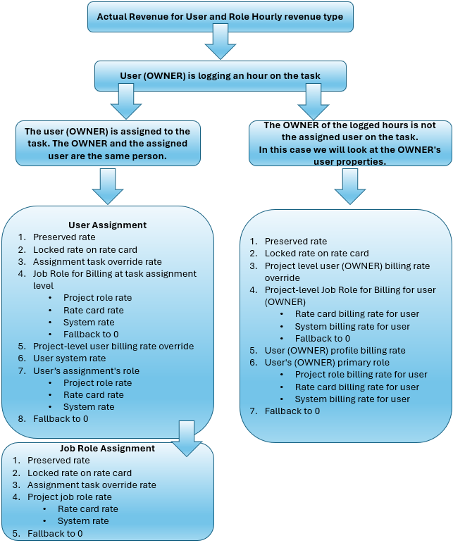

# 収益とコスト階層の概要

{{highlighted-preview-article-level}}

{{ultimate-package}}

Workfrontでは、正確な財務計算を行うために、タスクやプロジェクトの売上を計算する際に適切な請求率を使用します。 正確な財務計算を実現するには、あらゆるレベルで役割とユーザー率を明確に定義する必要があります。

この記事の節では、ユーザーおよび役割/時間単位の収益タイプとコストタイプに対する、担当業務とユーザーに対する適切な請求およびコスト率を決定するための手順を順を追って説明します。

請求レート、収益タイプ、収益の計算方法について詳しくは、[請求と収益の概要](/help/quicksilver/manage-work/projects/project-finances/billing-and-revenue-overview.md)を参照してください。

## 発効日の概要

Workfront管理者は、必要に応じて、請求率、コスト率、その他の財務属性がシステムに適用される日付を指定できます。 例えば、担当業務またはユーザーのデフォルトの請求率が50 ドルの場合があります。 発効日が適用された場合、その50 ドルのレートは3月31日に期限切れとなり、新たな55 ドルのレートは4月1日に自動的に開始されます。

予定収益計算の場合、請求率は予定時間数の日付に基づきます。 予定時間は、タスク期間に均等に配分されます。 前の例では、3月31日以前に計画された時間は50 ドルの料金を使用し、4月1日以降に計画された時間は55 ドルの料金を使用します。

実際の収益計算の場合、請求率はログ時間の日付に基づいています。 前の例では、3月31日以前に記録された時間は50 ドルの料金を使用し、4月1日以降に記録された時間は55 ドルの料金を使用します。

>[!NOTE]
>
>タスクの割り当ては、有効日で定義されていません。 割り当てによって、レートカード、ユーザープロファイル、割り当てレベルの上書きなど、システムから適用されるレートが引き出されます。 実施日は、作業のタイミングに基づいて正しい割合が適用されることを保証しますが、割り当てを直接定義するものではありません。

## 請求用の担当業務の概要

割り当てレベルまたはプロジェクトレベルのユーザーに対して、請求&#x200B;**の**&#x200B;担当業務ロールが設定されます。 これはユーザーにのみ適用され、他の担当業務では使用できません。 例えば、オーディエンスの主な担当業務はDesignerですが、あるタスクやプロジェクトではシニアDesignerとして扱われており、その割合を反映する必要があります。

請求の割り当てレベルの担当業務は、その特定の割り当てにのみ適用され、ユーザーの他の割り当てに自動的に適用されるわけではありません。 請求に関するプロジェクトレベルの担当業務は、そのプロジェクトに対するユーザーのすべての割り当てに適用されます。 必要に応じて、個々の割り当てレベルで上書きできます。

請求に関する担当業務がユーザー割り当てまたはプロジェクトレベルのいずれかで適用される場合も、収益の計算では、ユーザーまたは担当業務のレートの代わりに、請求に関する担当業務に関連付けられたレートを使用できます。 請求の担当業務は、ユーザーおよび担当業務時間別収益タイプが使用されている場合にのみ使用できます。

>[!NOTE]
>
>ユーザーが請求目的で別の役割を使用する場合もありますが、コスト計算では引き続き主要な役職が使用されます。 請求用の担当業務は、請求計算にのみ影響します。

詳しくは、[請求用の担当業務の設定](/help/quicksilver/manage-work/projects/project-finances/set-up-job-role-for-billing.md)を参照してください。

## 保存率の概要

プロジェクトの&#x200B;**プロジェクト請求料金情報を保持** フラグは、レートカードが確定した時点でシステムが割り当てに請求情報を使用するか、プロジェクトの過程での変更に基づいて変更を許可するかを制御します。 ユーザーの担当業務、給与、レートカード、またはその他の請求関連情報に変更を加えても、割り当ての請求率には影響しません。 料金は、プロジェクトフラグがアクティブ化された時点で、最終レートカードに従って保持されます。 これらの割り当てプロパティ（役職や給与など）は、割り当ての真のコストが正確になるように、まだ更新されます。

フラグがオンになっている場合、プロジェクトの期間の日付有効な請求レート（プロジェクトに添付された確定レートカードに設定）がロックされます。

このフラグは、作業が開始され、割り当てや時間がすでに存在する場合に、プロジェクトでアクティブ化できます。 当時：

* 最終承認レートカードのレートは、すべてのプロジェクト割り当ての請求レートのソースになります。
* 過去、現在、未来のすべての割り当ては、最終承認済みレートを使用して再計算されます。
* 実際の値と計画された値が再計算されます。

>[!NOTE]
>
>請求レートを保持するためにフラグをオンにすると、プロジェクトに割り当てがなく、時間がない限り、フラグをオフにすることはできません。 これにより、すべての財務報告書に真の契約率が反映されます。
>フラグがオフの場合、請求レートを再計算または動的に調整できます。 ユーザーの役割、給与、または請求率の更新は、割り当ての請求率にすぐに反映されます。

詳しくは、[&#x200B; プロジェクトの編集](/help/quicksilver/manage-work/projects/manage-projects/edit-projects.md)および[&#x200B; レートカードの管理](/help/quicksilver/administration-and-setup/manage-enterprise-operations/manage-rate-cards.md)を参照してください。

## 予定収益 – ユーザーおよび役割（時間単位）

タスクの収益タイプがユーザーおよびロール時間単位の場合、Workfrontでは、ユーザーと担当業務の両方の階層を使用して、予定収益の請求率を決定します。

次の図は、計画収益階層のフローを示しています。

ユーザーがタスクに割り当てられている場合、Workfrontは次の階層に従って検索します。

1. システムはまず、ユーザーの割り当て時に保存されたレートを探します。

   保存されたレートは引き続き階層に従いますが、プロジェクトを保存するとレートは固定されます。 詳しくは、[保存率の概要](#overview-of-preserved-rates)を参照してください。

1. 次に、タスクに割り当てられたユーザーのプライマリジョブの役割またはユーザーの請求に関するジョブの役割について、レートカードの請求レートを検索します。 レートが存在し、ロックされている場合、そのレートは収益計算に使用されます。

   レートがレートカードに存在し、そのレートがロック解除されている場合、システムはそのレートを使用せず、階層内の次のレートを検索します。

1. 次に、ユーザーの割り当てレベルの上書き率を探します。 これは、特定の割り当てに関連付けられた手動で追加されたレートであり、この割り当て上のユーザーの他のすべてのレートを上書きします（レートカードロックのレートを除く）。 レートが見つかった場合は、そのレートが収益の計算に使用されます。
1. 次に、タスク割り当てレベルで請求用の担当業務を探します。

   請求の担当業務は、特定の割り当てにのみ適用され、ユーザーの主要な担当業務レートの代わりに割り当てに適用されます。 例えば、ユーザーの主な担当業務はDesignerですが、ある業務では請求率の高いシニアDesignerとして機能します。

   Workfrontは、請求率に関する担当業務を探します。

   * 最初に、有効日を考慮して、割り当て（例ではシニアDesigner）から請求する担当業務の請求率を探します。 この情報は、プロジェクトの「**レートSource：上書き/リソースタイプ：担当業務**」グループの「 レート/請求」エリアに表示されます。 これは、プロジェクトの上書き率です。
   * 次に、レートカードから請求レートの担当業務を検索し、有効日を考慮します。 この情報は、プロジェクトの「**レートSource：添付済みレートカード/リソースタイプ：担当業務**」グループの「 レート/請求」エリアに表示されます。
   * 請求の担当業務のレートがプロジェクトまたはレートカードにない場合、システムは有効日を考慮して、システムレベルの担当業務レート（例ではシニアDesigner）を探します。
   * 請求用の担当業務が割り当てられ、前の手順の料金のいずれも見つからない場合、請求率は0になります。

     >[!NOTE]
     >
     >請求の担当業務が割り当てられていても、請求レートが0の場合、これはレート設定を再検討するための指標です。 率が0の場合、その担当業務（例ではシニアDesigner）の率がWorkfrontで設定されていないことを意味します。 担当業務の料金を追加するか、請求用の担当業務を割り当てから削除してください。
     >
     >タスクは、これらの料金がプロジェクトレベルで利用可能な場合、プロジェクトからジョブロールレートを継承するため、Workfrontがジョブロールでタスク割り当てレベルの請求を検索した際に、プロジェクトの請求用ジョブロールの検索からの料金は既に見つかっていました。 請求用の担当業務に対するプロジェクトレベルの検索は、引き続き検索階層に残ります。

1. 請求の担当業務がタスク割り当てレベルで利用できない場合、システムは、タスクに割り当てられた特定のユーザーについて、有効日を考慮してプロジェクトの請求率を検索します。 この情報は、プロジェクトの「**レートSource：上書き/リソースタイプ：ユーザー**」グループの「 レート/請求」エリアに表示されます。 これは、プロジェクトの上書き率です。
1. 次に、システムは、有効日を考慮して、ユーザーのプロファイルに対するシステムレベルの請求率を探します。
1. 次に、ユーザーの主要な担当業務（例ではDesigner）の請求率を検索します。

   * システムはまず、ユーザーの主要な担当業務について、有効日を考慮しながら、プロジェクトの請求レートを探します。 この情報は、プロジェクトの「**レートSource：上書き/リソースタイプ：担当業務**」グループの「 レート/請求」エリアに表示されます。 これは、プロジェクトの上書き率です。
   * 次に、レートカードから担当業務の割合を検索し、有効日を考慮します。 この情報は、プロジェクトの「**レートSource：添付済みレートカード/リソースタイプ：担当業務**」グループの「 レート/請求」エリアに表示されます。
   * 次に、システムは有効日を考慮して、システムレベルの担当業務率を探します。

1. これらの料金のいずれも見つからない場合、請求レートは0になります。

ユーザーがタスクに割り当てられていない場合、Workfrontは、次の階層に従ってジョブロールのレートを検索します。

1. システムはまず、担当業務の割り当て時に保存されたレートを探します。
1. システムは、タスクに割り当てられた担当業務について、レートカードの請求レートを検索します。 レートが存在し、ロックされている場合、そのレートは収益計算に使用されます。

   レートがレートカードに存在し、そのレートがロック解除されている場合、システムはそのレートを使用せず、階層内の次のレートを検索します。

1. 次に、システムは担当業務の割り当てタスクの上書き率を探します。 これは、特定の割り当て上の担当業務に対して手動で追加された料金であり、このタスク上の担当業務に対するその他すべての料金を上書きします。 レートが見つかった場合は、そのレートが収益の計算に使用されます。
1. 次に、タスクに割り当てられた担当業務の請求率を検索します。

   * 最初に、プロジェクトの請求率を検索し、有効日を考慮して、担当業務に割り当てます。 この情報は、プロジェクトの「**レートSource：上書き/リソースタイプ：担当業務**」グループの「 レート/請求」エリアに表示されます。 これは、プロジェクトの上書き率です。
   * 次に、レートカードから担当業務の割合を検索し、有効日を考慮します。 この情報は、プロジェクトの「**レートSource：添付済みレートカード/リソースタイプ：担当業務**」グループの「 レート/請求」エリアに表示されます。
   * 次に、システムは有効日を考慮して、システムレベルの担当業務率を探します。

1. これらの料金のいずれも見つからない場合、請求レートは0になります。

## 実収益 – ユーザーおよび役割（時間単位）

タスクの収益タイプがユーザーおよびロール時間単位の場合、Workfrontは2つの階層を使用して、実際の収益の請求率を決定します。 請求レートは、ユーザーがタスクに記録した時間に基づいています。

階層内の「ユーザー」は、タスクに割り当てられた人物です。 「所有者」は、タスクに割り当てられていない場合でも、タスクに対して時間が記録される人物です。 例えば、マイケルはタスクに割り当てられていますが、ジョアンナはマイケルが病気だったので仕事を終えます。 マネージャーは、タスクに対して時間を記録し、記録された時間の所有者をJoannaに設定できます。 「予定収益」値は、階層のMichaelの割り当てとレートに基づいていますが、「実際の収益」値はJoannaのレートに基づいています。

次の図は、実際の収益階層のフローを示しています。

の実際の収益

### ログに記録された時間の所有者とタスクに割り当てられたユーザーが同じ場合

Workfrontは、まずユーザー割り当てによる請求レートを検索します。 ユーザーがタスクに割り当てられていない場合、ユーザーは担当業務の割り当てによって請求レートを検索します。

このシナリオの階層は、予定収益階層と同じです。 このワークフローについては、[予定収益 – ユーザーおよび役割の時間単位](#planned-revenue--user-and-role-hourly)を参照してください。

### ログに記録された時間の所有者がタスクに割り当てられたユーザーではない場合

Workfrontは、次の階層に従って、所有者のユーザープロパティを検索します。

1. システムはまず、所有者の割り当てに対する保存率を探します。
1. 次に、システムは、所有者の主な担当業務について、レートカードの請求レートを検索します。 レートが存在し、ロックされている場合、そのレートは収益計算に使用されます。

   レートがレートカードに存在し、そのレートがロック解除されている場合、システムはそのレートを使用せず、階層内の次のレートを検索します。

1. 次に、システムはプロジェクトの請求率を探し、所有者は有効日を考慮に入れます。 これは、プロジェクトのレート/請求エリアの「レートSource：上書き/リソースタイプ：ユーザーグループ化」に表示されます。 これは、プロジェクトの上書き率です。
1. 次に、プロジェクトレベルで請求を行うための担当業務を探します。

   請求の担当業務は、特定のプロジェクトに対してのみ行われ、所有者の主な担当業務の割合ではなく、プロジェクトに適用されます。 例えば、オーナーの主な担当業務はDesignerですが、あるプロジェクトでは、請求率の高いシニアDesignerとして活動しています。

   Workfrontは、請求率に関する担当業務を探します。

   * システムは、まず、有効日を考慮して、レートカードから請求レートの担当業務を探します。 この情報は、プロジェクトの「**レートSource：添付済みレートカード/リソースタイプ：担当業務**」グループの「 レート/請求」エリアに表示されます。
   * 請求に関する担当業務のレートがレートカードに記載されていない場合、システムは有効日を考慮して、システムレベルの担当業務レート（例ではシニアDesigner）を探します。
   * 請求用の担当業務が割り当てられ、前の手順の料金のいずれも見つからない場合、請求率は0になります。

     >[!NOTE]
     >
     >請求の担当業務が割り当てられていても、請求レートが0の場合、これはレート設定を再検討するための指標です。 率が0の場合、その担当業務（例ではシニアDesigner）の率がWorkfrontで設定されていないことを意味します。 担当業務の料金を追加するか、請求用の担当業務をプロジェクトから削除する必要があります。

1. 次に、システムは、発効日を考慮して、所有者のユーザープロファイルに関するシステムレベルの請求率を探します。
1. 次に、所有者の主な担当業務（例ではDesigner）の請求率を検索します。

   * まず、発効日を考慮に入れて、所有者の主な担当業務に関するプロジェクトの請求率を探します。 この情報は、プロジェクトの「**レートSource：上書き/リソースタイプ：担当業務**」グループの「 レート/請求」エリアに表示されます。 これは、プロジェクトの上書き率です。
   * 次に、レートカードから担当業務の割合を検索し、有効日を考慮します。 この情報は、プロジェクトの「**レートSource：添付済みレートカード/リソースタイプ：担当業務**」グループの「 レート/請求」エリアに表示されます。
   * 次に、システムは有効日を考慮して、システムレベルの担当業務率を探します。

1. これらの料金のいずれも見つからない場合、請求レートは0になります。

## 予定コスト – ユーザーおよび役割（時間単位）

タスクのコストタイプがユーザーおよびロール時間単位である場合、Workfrontでは、ユーザーとジョブロールの両方のレート階層を使用して、計画されたコストのレートを決定します。

次の図は、計画コスト階層のフローを示しています。

ユーザーがタスクに割り当てられている場合、Workfrontは次の階層に従って検索します。

1. システムは、ユーザーの割り当てタスクの上書き率を検索します。 これは、特定の割り当て上のユーザーに対して手動で追加された料金であり、このタスク上のユーザーに対するその他すべての料金を上書きします。 レートが見つかった場合、そのレートはコスト計算に使用されます。
1. 次に、プロジェクトの原価率を探します。有効日を考慮しながら、タスクに割り当てられた特定のユーザーの原価率を探します。 この情報は、プロジェクトの「**レートSource：上書き/リソースタイプ：ユーザー**」グループの「 レート/コスト」領域に表示されます。 これは、プロジェクトの上書き率です。
1. 次に、有効期間を考慮して、ユーザープロファイル上でシステムレベルのコスト率を検索します。
1. 次に、属性スコアに基づいて、割り当てられた属性の組み合わせでユーザーのプライマリジョブロールのコスト率を検索します。
1. これらのレートのいずれも見つからない場合、コスト率は0になります。

ユーザーがタスクに割り当てられていない場合、Workfrontは、次の階層に従って担当業務のコスト率を検索します。

1. システムは、担当業務の割り当てタスクの上書き率を探します。 これは、特定の割り当て上の担当業務に対して手動で追加された料金であり、このタスク上の担当業務に対するその他すべての料金を上書きします。 レートが見つかった場合、そのレートはコスト計算に使用されます。
1. 次に、属性スコアに基づいて、割り当てられた属性の組み合わせを含むシステムレベルの担当業務の原価率を、有効日を考慮して検索します。
1. これらのレートのいずれも見つからない場合、コスト率は0になります。

## 実際のコスト – ユーザーおよび役割の時間単位

タスクのコストタイプが「ユーザー」と「ロール時間単位」の場合、Workfrontでは、実際のコストの請求率を決定するために2つの階層を使用します。 請求レートは、ユーザーがタスクに記録した時間に基づいています。

階層内の「ユーザー」は、タスクに割り当てられた人物です。 「所有者」は、タスクに割り当てられていない場合でも、タスクに対して時間が記録される人物です。 例えば、マイケルはタスクに割り当てられていますが、ジョアンナはマイケルが病気だったので仕事を終えます。 マネージャーは、タスクに対して時間を記録し、記録された時間の所有者をJoannaに設定できます。 「予定収益」値は、階層のMichaelの割り当てとレートに基づいていますが、「実際の収益」値はJoannaのレートに基づいています。

次の図は、実際のコスト階層のフローを示しています。

### ログに記録された時間の所有者とタスクに割り当てられたユーザーが同じ場合

Workfrontでは、最初にユーザー割り当てによるコスト率を検索します。 ユーザーがタスクに割り当てられていない場合、ユーザーはジョブロールの割り当てによってコストレートを検索します。

このシナリオの階層は、計画されたコスト階層と同じです。 このワークフローについては、[予定コスト – ユーザーおよび役割の時間単位](#planned-cost--user-and-role-hourly)を参照してください。

### ログに記録された時間の所有者がタスクに割り当てられたユーザーではない場合

Workfrontは、次の階層に従って、所有者のユーザープロパティを検索します。

1. 有効日を考慮しながら、プロジェクトの原価率をオーナーに求めます。 この情報は、プロジェクトの「**レートSource：上書き/リソースタイプ：ユーザー**」グループの「 レート/コスト」領域に表示されます。 これは、プロジェクトの上書き率です。
1. 次に、有効期間を考慮しながら、所有者のユーザープロファイルに対してシステムレベルのコスト率を求めます。
1. 次に、所有者の主な担当業務（例ではDesigner）のコスト率を検索します。

   * まず、発効日を考慮しながら、所有者の主な担当業務に関するプロジェクトの原価率を求めます。 この情報は、プロジェクトの「**レートSource：上書き/リソースタイプ：担当業務**」グループの「 レート/コスト」領域に表示されます。 これは、プロジェクトの上書き率です。
   * 次に、レートカードから担当業務の割合を検索し、有効日を考慮します。 この情報は、プロジェクトの「**レートSource：添付済みレートカード/リソースタイプ：担当業務**」グループの「 レート/コスト」領域に表示されます。
   * 次に、システムは有効日を考慮して、システムレベルの担当業務率を探します。

1. これらの料金のいずれも見つからない場合、請求レートは0になります。

