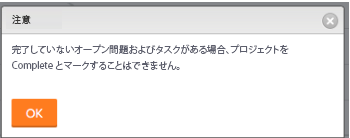
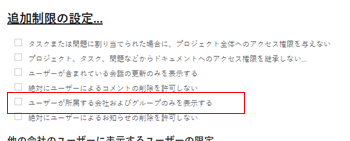

# プロジェクトに関する FAQ

プロジェクトに関するよくある質問を次に示します。

## タスクリスト内のタスクを右クリックしたときに、「タスクを上に挿入」と「タスクを下に挿入」が表示されないのはなぜですか。

### 回答

「挿入」オプションを使用するには、タスクリストを番号で並べ替える必要があります。列を番号で並べ替えるには、**タスク名**&#x200B;の左側の列のヘッダーにある **#** をクリックして、番号でタスクを並べ替えます。

## 実際の完了日とは何ですか。

### 回答

実際の完了日とは、作業が完了した日時を示します。詳しくは、[プロジェクトの実際の完了日の概要](../../../manage-work/projects/planning-a-project/project-actual-completion-date.md)を参照してください。

## インデントとアウトデントのボタンが表示されないのはなぜですか。

### 回答

インデント / アウトデントボタンを使用するには、タスクをタスク番号で並べ替え、グループ化が適用されていないことを確認します。

## プロジェクトのステータスを「完了」に変更できないのはなぜですか。

プロジェクトを「完了」とマークしようとすると、次のエラーメッセージが表示されます。

### 回答

プロジェクトに次のいずれかがある場合は、プロジェクトのステータスを「完了」に変更できません。

* 完了していないタスクやイシュー
* 承認待ちステータスのタスクやイシュー

## プロジェクトのステータスを「完了」から「現在」に変更できないのはなぜですか。

### 回答

プロジェクトの「完了モード」が「自動」に設定されている場合、すべてのタスクとイシューが完了すると、プロジェクトのステータスが自動的に「完了」に変わります。これを他のステータスに変更することはできません。完了したプロジェクトを「現在」に切り替えられるようにするには、プロジェクトの「完了モード」を「手動」に設定しておく必要があります。詳しくは、[プロジェクトのステータスを「完了」から「現在」に変更できません](../../../manage-work/projects/tips-tricks-and-troubleshooting/project-status-does-not-change-from-complete-to-current.md)を参照してください。

## 適切な権限を持っているのに、プロジェクトをポートフォリオに追加できないのはなぜですか。

適切な権限を持っていますが、ポートフォリオの「プロジェクト」タブに「プロジェクトを追加」ボタンが表示されません。

### 回答

これは、ポートフォリオのステータスが非アクティブであることが原因です。ポートフォリオのステータスを変更するには：

1. **ポートフォリオの詳細／概要**&#x200B;をクリックします。
1. **ステータス**&#x200B;を「**アクティブ**」に変更します

1. 「**保存**」をクリックします。\
   これで「**プロジェクトを追加**」ボタンが「**プロジェクト**」タブに表示されます。

## プロジェクトに追加されたリソースマネージャーにはどのようなアクセス権限が付与されますか。

### 回答

リソースマネージャーには、プロジェクトへのアクセス管理権限が自動的に付与されます。リソースマネージャーの役割からユーザーを削除しても、共有のアクセス管理権限は削除されません。

## グループを追加すると、プロジェクトのステータスが変わるのはなぜですか。

### 回答

プロジェクトのステータスは、グループのデフォルトのステータスによって変わります。プロジェクトにグループを追加すると、そのグループに設定されているデフォルトのステータスにステータスのリストが変更されます。

詳しくは、[ステータスの作成または編集](../../../administration-and-setup/customize-workfront/creating-custom-status-and-priority-labels/create-or-edit-a-status.md)を参照してください。

## 予算ステータスとは何ですか。

### 回答

予算ステータスは、プロジェクトが現在、キャパシティ プランナに追加されているかどうか、および予算計算が完了しているかどうかを示します。

予算ステータスには次のようなものがあります。

* 含まれない：プロジェクトはキャパシティ プランナに追加されません。
* 含まれるが計算されない：プロジェクトは処理能力プランナーに追加されますが、予算の計算からは除外されます。
* 含まれて計算される：プロジェクトは処理能力プランナーに追加され、予算の計算に含まれます。

## 自分が所有者で、管理権限を持つプロジェクトをチームと共有できないのはなぜですか？プロジェクトの共有ダイアログボックスにチームが見つかりません。

### 回答

Adobe Workfront 管理者によって、アクセスレベルで自分が所属する会社、グループ、チームのみを表示できるように制限されています。探しているチームは、所属するチームの 1 つではありません。

システム内のすべてのチームをユーザーが表示できるようにする方法について詳しくは、[カスタムアクセスレベルの作成または変更](../../../administration-and-setup/add-users/configure-and-grant-access/create-modify-access-levels.md)を参照してください。
