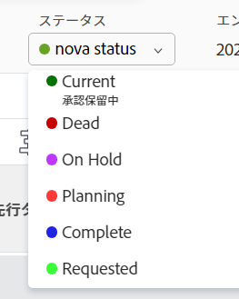

# グループに関連付けられた作業にステータスを適用する

<!--
Alina, I moved this out of an admin article about statuses (Create and customize statuses)
-->

プロジェクトがグループに関連付けられている場合、システムレベルのステータスと、そのグループに関連付けられたカスタムステータスの両方を、そのプロジェクトに適用できます。 Adobe Workfrontのグループステータスについて詳しくは、 [ステータスの作成または編集](../../../administration-and-setup/customize-workfront/creating-custom-status-and-priority-labels/create-or-edit-a-status.md).

>[!TIP]
>
>プロジェクトのみをグループに関連付けることができます。 タスクとタスクは、そのタスクが属するプロジェクトからグループを継承します。

## アクセス要件

<!--drafted for P&P:

<table style="table-layout:auto"> 
 <col> 
 <col> 
 <tbody> 
  <tr> 
   <td role="rowheader">Adobe Workfront plan*</td> 
   <td> 
Any
 </td> 
  </tr> 
  <tr> 
   <td role="rowheader">Adobe Workfront license*</td> 
   <td> 
Current license: Standard 
 
   Or
   
Legacy license: Plan 
 
   </td> 
  </tr> 
  <tr> 
   <td role="rowheader">Access level configurations*</td> 
   <td> 
Edit access to Projects
 
<b>NOTE</b>
   
   If you still don't have access, ask your Workfront administrator if they set additional restrictions in your access level. For information on how a Workfront administrator can modify your access level, see <a href="../../../administration-and-setup/add-users/configure-and-grant-access/create-modify-access-levels.md" class="MCXref xref">Create or modify custom access levels</a>.
 </td> 
  </tr> 
  <tr> 
   <td role="rowheader">Object permissions</td> 
   <td> 
Manage permissions to the project
 
For information on requesting additional access, see <a href="../../../workfront-basics/grant-and-request-access-to-objects/request-access.md" class="MCXref xref">Request access to objects </a>.
 </td> 
  </tr> 
 </tbody> 
</table>
-->

この記事の手順を実行するには、次のアクセス権が必要です。

<table style="table-layout:auto"> 
 <col> 
 <col> 
 <tbody> 
  <tr> 
   <td role="rowheader">Adobe Workfront plan*</td> 
   <td> 
任意
 </td> 
  </tr> 
  <tr> 
   <td role="rowheader">Adobe Workfront license*</td> 
   <td> 
計画 
 </td> 
  </tr> 
  <tr> 
   <td role="rowheader">アクセスレベル設定*</td> 
   <td> 
プロジェクトへのアクセスを編集
 
<b>メモ</b>

まだアクセス権がない場合は、Workfront管理者に、アクセスレベルに追加の制限を設定しているかどうかを問い合わせてください。 Workfront管理者がアクセスレベルを変更する方法について詳しくは、 <a href="../../../administration-and-setup/add-users/configure-and-grant-access/create-modify-access-levels.md" class="MCXref xref">カスタムアクセスレベルの作成または変更</a>.
 </td>
</tr> 
  <tr> 
   <td role="rowheader">オブジェクト権限</td> 
   <td> 
プロジェクトに対する権限の管理
 
追加のアクセス権のリクエストについて詳しくは、 <a href="../../../workfront-basics/grant-and-request-access-to-objects/request-access.md" class="MCXref xref">オブジェクトへのアクセスのリクエスト </a>.
 </td> 
  </tr> 
 </tbody> 
</table>

&#42;保有しているプラン、ライセンスの種類、アクセス権を確認するには、Workfront管理者に問い合わせてください。

## プロジェクトグループとステータスの更新

プロジェクトのグループを更新すると、タスクのステータス、問題、またはプロジェクトで使用できるオプションが、グループに合わせて変更されます。

1. プロジェクトに移動するか、新しいプロジェクトを作成します ( [プロジェクトの作成](../../../manage-work/projects/create-projects/create-project.md).
1. 次をクリック： **詳細** アイコン を選択し、「 **編集**.

1. 内 **プロジェクトを編集** 表示されるボックス ( **概要** セクションで、 **グループ** ドロップダウンメニュー。

1. 内 **ステータス** ドロップダウンメニューから、カスタムステータスを選択します。

   >[!NOTE]
   >
   >別のグループを **グループ** ドロップダウンメニューから、 **ステータス** 新しいグループとクロス集計するには、メニューが自動的に変更されます。
   >
   >
   >   >

1. プロジェクトのステータスを選択します。 作成し、そのグループに適用したカスタムステータスがリストに表示されます。
