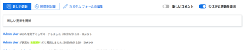
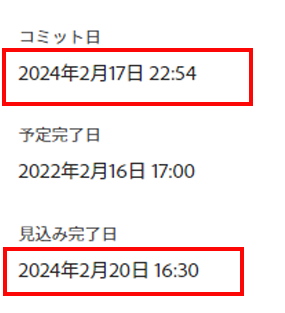
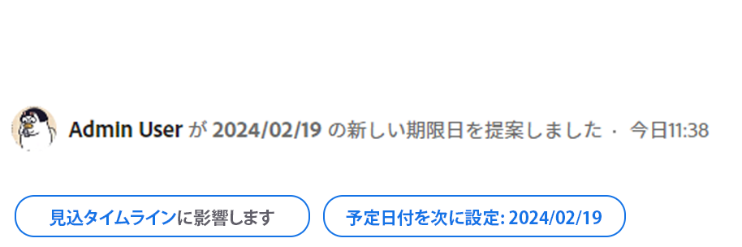
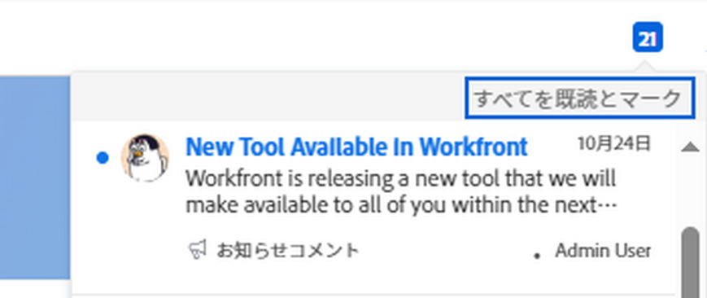

# コミット日の概要

コミット日は、タスクまたはイシューに割り当てられたユーザーがタスクまたはイシューを完了するためにコミットする日付です。これは予定完了日とは異なり、作業を担当するユーザーが設定する、より現実的な予定完了日です。予定完了日について詳しくは、[タスクの予定完了日の概要](../../../manage-work/tasks/task-information/task-planned-completion-date.md)を参照してください。

## コミット日の概要

コミット日を扱う際は、次の点を考慮してください。

* コミット日があるのはタスクとイシューのみです。
* コミット日は、Adobe Workfront では自動的に設定されません。\
  タスクまたはイシューを作成する場合、タスクまたはイシューにコミット日は割り当てられません。
* タスクまたはイシューに割り当てられている場合は、次のいずれかの操作を行ってコミット日を設定できます。

   * Workfront は、タスクまたはイシューの「作業」、「問題の取り組みを開始」、または「タスクを開始」をクリックして、タスクまたはイシューの既存の予定完了日に一致するようにコミット日を設定します。「作業をする」ボタンを「開始」ボタンに置き換える方法については、[「作業をする」ボタンの「開始」ボタンへの置き換え](../../../people-teams-and-groups/create-and-manage-teams/work-on-it-button-to-start-button.md)を参照してください。
   * タスクまたはイシューが完了したと思われるタイミングに応じて、自分でコミット日を手動で設定します。これは、タスクまたはイシューを特定の日までに完了させる、担当者としてのプロジェクトマネージャーに対する見積もりとコミットメントです。

>[!NOTE]
>
>コミット日を変更するには、タスクのタスク所有者である必要があります。次のユーザーは、タスクのコミット日を変更できません。
>
>* プロジェクト所有者
>* プロジェクトスポンサー
>* リソース管理者
>* システム管理者
>* タスクのその他の担当者
>* タスクに対する権限を持つその他のユーザー。
>
>タスク所有者の詳細について詳しくは、[タスクの編集](../../../manage-work/tasks/manage-tasks/edit-tasks.md)の記事で[タスクの編集](../../../manage-work/tasks/manage-tasks/edit-tasks.md#assignments)の節を参照してください。

## コミット日の変更によってトリガーされる通知と更新 {#notifications-and-updates-triggered-by-changing-the-commit-date}

タスクまたはイシューの担当者がプロジェクト所有者が設定した予定完了日とは異なるコミット日を選択すると、プロジェクト所有者や他のユーザーにこの変更について警告する通知や更新が多数あります。

>[!NOTE]
>
>コミット日を変更しても、計画日は自動的に変更されず、計画日に加えた変更でも、コミット日は自動的に変更されません。

タスクまたはイシューのコミット日を設定すると、次の変更がトリガーされます。

* コミット日はタスクまたはイシューの「更新ストリーム」に入力されます。

  

  Workfront 管理者が設定のフィードを更新エリアでこの更新を有効にした場合、コミット日の変更がタスクまたはイシューの更新エリアに表示されます。詳しくは、[システムで追跡された更新](../../../administration-and-setup/set-up-workfront/system-tracked-update-feeds/system-tracked-update-feeds.md)を参照してください。

* タスクまたはイシューの見込み完了日が同じ日付に設定されるのは、タスクの完了する可能性が高い時期がより正確に示されるようになったためです。

  見込み完了日について詳しくは、[プロジェクト、タスク、およびイシューに関する見込み完了日の概要](../../../manage-work/projects/planning-a-project/project-projected-completion-date.md)を参照してください。

  

* プロジェクト所有者が従来のコメント作成機能を使用している場合は、タスクの「更新」タブで、この変更がプロジェクトタイムラインに影響を与えるかどうかが通知され、同じ領域でタスクの計画完了日を更新する機会が与えられます。

  この機能は、新しいコメントエクスペリエンスではサポートされていません。 詳しくは、 [新しいコメントエクスペリエンス](/help/quicksilver/product-announcements/betas/new-commenting-experience-beta/unified-commenting-experience.md).

  >[!TIP]
  >
  >  問題の発生日はプロジェクトのタイムラインに影響を与えないので、プロジェクト所有者は、問題の計画完了日を更新する機会を与えられません。

  プロジェクト所有者が変更を受け入れたくない場合は、新しい日付を提案するユーザーにコメントを返して、コミット日を元の予定日に戻すか、新しい日付を選択するように求めることをお勧めします。プロジェクト所有者が変更を受け入れた場合は、手動で計画完了日を調整して、アイテムに割り当てられたユーザーが提供するコミット日に一致させることができます。 また、 **計画日を次の値に設定： &lt; date >** 「更新」領域で、計画完了日を新しいコミット日に合わせて自動的に設定します。

  この変更を受け入れるには、タスクとプロジェクトを管理するアクセス権が必要です。

  >[!NOTE]
  >
  >タスクの完了予定日の変更を承認して、プロジェクトのタイムラインがどのように影響を受けるかを確認する場合は、「**プロジェクトのタイムライン**」をクリックします。タスクリストが開き、日付の変更やプロジェクトタイムラインを評価できます。
  >
  >
  >  >
  >

* [ 通知 ] 領域に、タスクのコミット日が変更されたことがプロジェクト所有者に通知されます。

  

  <!--
  
(NOTE: the tip below is actually wrong and the updates feeds should not control this setting, but at this time it does, according to this issue in Hub: https://hub.workfront.com/issue/61e1aa5e0002a186fdd0a73a10db0fc3/updates?email-source=comm

  -->

  >[!TIP]
  >
  >コミット日が変更された通知は、Workfront管理者が設定の「更新フィード」領域にコミット日を表示できるようにした場合にのみ、プロジェクト所有者に送信されます。 詳しくは、 [システムで追跡された更新](../../../administration-and-setup/set-up-workfront/system-tracked-update-feeds/system-tracked-update-feeds.md).

作業項目の更新時に使用できる追加機能について詳しくは、  [作業を更新](../../../workfront-basics/updating-work-items-and-viewing-updates/update-work.md).

タスクとイシューのコミット日の更新について詳しくは、[タスクとイシューに関するコミット日の更新](../../../manage-work/projects/updating-work-in-a-project/update-commit-date-on-tasks-and-issues.md)を参照してください。

<!--

<h2>Update Commit Dates on tasks and issues</h2>

(NOTE: moved to its own article) 

Updating the Commit Date is identical for tasks and issues.

<ol>
<li value="1"> 
Go to a task or issue that you are assigned to as the <strong>Task Owner</strong>.
 
For more information about finding out who the Task Owner for an issue or task is, see the section <a href="../../../manage-work/tasks/manage-tasks/edit-tasks.md#assignments" class="MCXref xref">Edit tasks</a> in the article <a href="../../../manage-work/tasks/manage-tasks/edit-tasks.md" class="MCXref xref">Edit tasks</a>.
 </li>
<li value="2"> 
Click Work on it in the task or issue header
 
Or
 
Click <strong>Start Task</strong> or <strong>Start Issue</strong> if the Work on it button has been customized in your environment to indicate that you are now working on the work item. 
 
At this time, the Commit Date and the Planned Completion Date of the task or issue are the same.
 </li>
<li value="3"> 
(Optional) If you clicked Start Task or Start Issue, click <strong>Undo</strong> in the lower-left corner of the screen. The Commit Date is removed. 
 
For information about replacing the Work On It button with a Start button, see <a href="../../../people-teams-and-groups/create-and-manage-teams/work-on-it-button-to-start-button.md" class="MCXref xref">Replace the Work On It button with a Start button</a>.
 <note type="tip">
The option to undo your selection to start your work is not available when you click
Work on it.
</note> </li>
<li value="4"> 
 Expand the <strong>This will be done by</strong> date picker, and select a new Commit Date.

Click <strong>Updates</strong> in the left panel, then click the <strong>Start a new update</strong>><strong>Commit Date</strong>

Or

Click <strong>Task Details</strong> or <strong>Issue Details</strong> in the left panel, then double click <strong>Commit Date</strong> and select a new date from calendar. 

The Commit Date and the Planned Completion date are no longer the same.

Instead, the Commit Date and the Projected Completion Date of the task or issue become the same.

The changes are saved automatically.

The Project Owner is notified that you have suggested a new Commit Date for the task or issue and can, at this time, update the Planned Completion Date of the task or issue to match the Commit Date you suggested. For information about the notifications and updates that are triggered by this change, see the section <a href="#notifications-and-updates-triggered-by-changing-the-commit-date" class="MCXref xref">Notifications and updates triggered by changing the Commit Date</a> in this article.

 </li>
</ol>

-->
