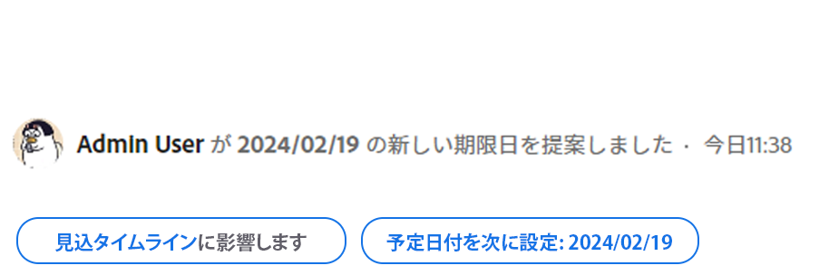
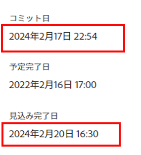
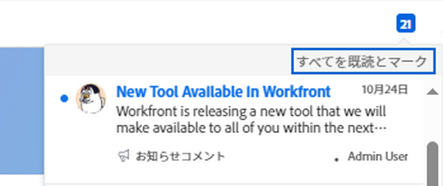

# コミット日の概要

<!--Audited: 05/2025-->

<!--
 The highlighted information on this page refers to functionality not yet generally available. It is available only in the Preview environment for all customers, or in the Production environment for customers who enabled fast releases.

For information about fast releases, see [Enable or disable fast releases for your organization](/help/quicksilver/administration-and-setup/set-up-workfront/configure-system-defaults/enable-fast-release-process.md).

For information about the current release, see [Third Quarter 2024 release overview](/help/quicksilver/product-announcements/product-releases/24-q3-release-activity/24-q3-release-overview.md).
-->

コミット日とは、ユーザーがタスクに割り当てられた日付、またはイシューがタスクまたはイシューを完了するためにコミットした日付です。 これは、タスクやイシューの完了予定日とは異なります。作業を担当するユーザーだけが与える完了日をより現実的に見積もることができるからです。

予定完了日について詳しくは、[タスクの予定完了日の概要](../../../manage-work/tasks/task-information/task-planned-completion-date.md)を参照してください。

## コミット日の概要

コミット日を扱う際は、次の点を考慮してください。

* コミット日があるのはタスクとイシューのみです。
* コミット日は、Adobe Workfrontで自動的に設定されるわけではありません。 タスクまたはイシューを作成する場合、そのタスクに割り当てられたコミット日はありません。
* タスクまたはイシューに割り当てられている場合は、次のいずれかの操作を行ってコミット日を設定できます。

   * Workfront は、タスクまたはイシューの「作業」、「問題の取り組みを開始」、または「タスクを開始」をクリックして、タスクまたはイシューの既存の予定完了日に一致するようにコミット日を設定します。詳しくは、「[作業中のボタンを開始ボタンに置き換える](../../../people-teams-and-groups/create-and-manage-teams/work-on-it-button-to-start-button.md)」を参照してください。
   * タスクまたは問題が完了すると思われるタイミングに応じて、手動でコミット日を設定します。 これは、プロジェクトマネージャーに対する担当者としての見積もりとコミットメントであり、特定の日付までにタスクまたはイシューを完了させる必要があります。 詳しくは、[タスクやイシューのコミット日の更新](/help/quicksilver/manage-work/projects/updating-work-in-a-project/update-commit-date-on-tasks-and-issues.md)を参照してください。

>[!NOTE]
>
>コミット日を変更するには、タスクのタスク所有者である必要があります。次のユーザーは、タスクのコミット日を変更できません：
>
>* プロジェクト所有者
>* プロジェクトスポンサー
>* リソース管理者
>* システム管理者
>* タスクのその他の担当者
>* タスクに対する権限を持つ他のユーザー
>
>タスク責任者について詳しくは、[タスクの編集](../../../manage-work/tasks/manage-tasks/edit-tasks.md)を参照してください。

## タスクとイシューのコミット日を探します

Workfrontの次の領域で、タスクとイシューのコミット日を確認できます。

* 詳細ページ
* Workfrontまたはグループ管理者がレイアウトテンプレートに追加した後の概要パネル。 詳しくは、[&#x200B; レイアウトテンプレートを使用した概要パネルのカスタマイズ &#x200B;](/help/quicksilver/administration-and-setup/customize-workfront/use-layout-templates/customize-home-summary-layout-template.md)を参照してください。
* Workfrontまたはグループ管理者がレイアウトテンプレートに追加した後のタスクまたはイシューのヘッダー。 詳しくは、[レイアウトテンプレートを使用してオブジェクトヘッダーをカスタマイズ](/help/quicksilver/administration-and-setup/customize-workfront/use-layout-templates/customize-object-headers.md)を参照してください。

## コミット日の変更によってトリガーされる通知と更新 {#notifications-and-updates-triggered-by-changing-the-commit-date}

タスクまたはイシューの担当者がコミット日をプロジェクト所有者が設定した予定完了日とは異なる日付に手動で変更すると、プロジェクト所有者や他のユーザーにこの変更について警告する通知や更新が多数行われます。

>[!NOTE]
>
>コミット日に加えた変更は、予定日を自動的に変更することはなく、予定日に加えた変更は、コミット日を自動的に変更することはありません。

タスクまたはイシューのコミット日を手動で設定すると、次の変更がトリガーされます。

* コミット日の変更は、タスクまたは問題の「更新」セクションの「システムアクティビティ」および「すべての」タブに入力されます。

  

  Workfront管理者が設定の更新フィード領域でこの更新を有効にすると、タスクまたはイシューの「更新」領域に「コミット日」の変更が表示されます。詳しくは、[システムで追跡された更新](../../../administration-and-setup/set-up-workfront/system-tracked-update-feeds/system-tracked-update-feeds.md)を参照してください。

  プロジェクト所有者が変更を受け入れたくない場合は、「更新」セクションの「コメント」タブを使用して、新しい日付を提案するユーザーにコメントし直すか、コミット日を元の予定日に戻すように依頼するか、新しい日付を選択することをお勧めします。

  プロジェクト所有者が変更を受け入れた場合、タスクまたはイシューを編集することで、アイテムに割り当てられたユーザーが提供するコミット日に合わせて、予定完了日を手動で調整できます。

  タスクまたはイシューを編集するには、これらを管理するアクセス権が必要です。

  >[!TIP]
  >
  >システム管理者またはグループ管理者にコミット日フィールドを概要パネルまたはヘッダーに追加するように依頼して、更新を簡単にできます。
  >
  >詳しくは、次の記事を参照してください。
  >
  >* [概要](/help/quicksilver/workfront-basics/the-new-workfront-experience/summary-overview.md)
  >* [&#x200B; レイアウトテンプレートを使用した概要パネルのカスタマイズ &#x200B;](/help/quicksilver/administration-and-setup/customize-workfront/use-layout-templates/customize-home-summary-layout-template.md)
  >* [レイアウトテンプレートを使用してオブジェクトヘッダーをカスタマイズ](/help/quicksilver/administration-and-setup/customize-workfront/use-layout-templates/customize-object-headers.md)

<!--
this is no longer possible: 
>[!NOTE]
>
>If you want to see how the timeline of the project is affected by accepting to change the Planned Completion Date of the task, click **Project Timeline**. This opens the task list where you can evaluate the date changes and the project timeline.
>
>
>  >
>
-->

* タスクまたは問題の予定完了日は、タスクが完了する可能性が高いタイミングをより正確に示すため、同じ日付に設定されます。

  詳しくは、[プロジェクト、タスクおよびイシューの見込み完了日の概要](../../../manage-work/projects/planning-a-project/project-projected-completion-date.md)を参照してください。

  ハイライト表示された詳細の

* タスクまたはイシューのコミット日が変更されたことを、プロジェクト所有者に通知が通知されます。

  

  <!--
  
(NOTE: the tip below is actually wrong and the updates feeds should not control this setting, but at this time it does, according to this issue in Hub: https://hub.workfront.com/issue/61e1aa5e0002a186fdd0a73a10db0fc3/updates?email-source=comm

  -->

  >[!TIP]
  >
  >コミット日の変更通知は、Workfront 管理者が設定の更新フィードエリアでコミット日を表示できるようにした場合にのみ、プロジェクト所有者に送信されます。詳しくは、[システムで追跡された更新の設定](../../../administration-and-setup/set-up-workfront/system-tracked-update-feeds/system-tracked-update-feeds.md)を参照してください。

作業項目の更新時に使用できる追加機能について詳しくは、[作業の更新](../../../workfront-basics/updating-work-items-and-viewing-updates/update-work.md)を参照してください。

タスクとイシューのコミット日の更新について詳しくは、[タスクとイシューに関するコミット日の更新](../../../manage-work/projects/updating-work-in-a-project/update-commit-date-on-tasks-and-issues.md)を参照してください。

<!--

<h2>Update Commit Dates on tasks and issues</h2>

(NOTE: moved to its own article) 

Updating the Commit Date is identical for tasks and issues.

<ol>
<li value="1"> 
Go to a task or issue that you are assigned to as the <strong>Task Owner</strong>.
 
For more information about finding out who the Task Owner for an issue or task is, see the section <a href="../../../manage-work/tasks/manage-tasks/edit-tasks.md#assignments" class="MCXref xref">Edit tasks</a> in the article <a href="../../../manage-work/tasks/manage-tasks/edit-tasks.md" class="MCXref xref">Edit tasks</a>.
 </li>
<li value="2"> 
Click Work on it in the task or issue header
 
Or
 
Click <strong>Start Task</strong> or <strong>Start Issue</strong> if the Work on it button has been customized in your environment to indicate that you are now working on the work item. 
 
At this time, the Commit Date and the Planned Completion Date of the task or issue are the same.
 </li>
<li value="3"> 
(Optional) If you clicked Start Task or Start Issue, click <strong>Undo</strong> in the lower-left corner of the screen. The Commit Date is removed. 
 
For information about replacing the Work On It button with a Start button, see <a href="../../../people-teams-and-groups/create-and-manage-teams/work-on-it-button-to-start-button.md" class="MCXref xref">Replace the Work On It button with a Start button</a>.
 <note type="tip">
The option to undo your selection to start your work is not available when you click
Work on it.
</note> </li>
<li value="4"> 
 Expand the <strong>This will be done by</strong> date picker, and select a new Commit Date.

Click <strong>Updates</strong> in the left panel, then click the <strong>Start a new update</strong>><strong>Commit Date</strong>

Or

Click <strong>Task Details</strong> or <strong>Issue Details</strong> in the left panel, then double click <strong>Commit Date</strong> and select a new date from calendar. 

The Commit Date and the Planned Completion date are no longer the same.

Instead, the Commit Date and the Projected Completion Date of the task or issue become the same.

The changes are saved automatically.

The Project Owner is notified that you have suggested a new Commit Date for the task or issue and can, at this time, update the Planned Completion Date of the task or issue to match the Commit Date you suggested. For information about the notifications and updates that are triggered by this change, see the section <a href="#notifications-and-updates-triggered-by-changing-the-commit-date" class="MCXref xref">Notifications and updates triggered by changing the Commit Date</a> in this article.

 </li>
</ol>

-->
