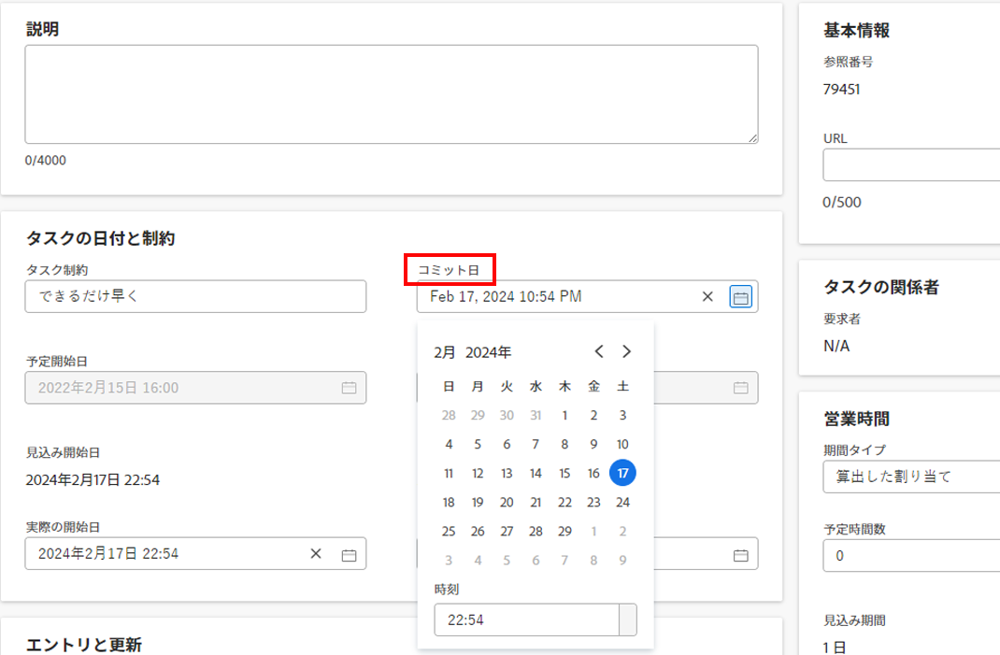

# タスクと問題に関するコミット日の更新

タスクまたは割り当て先のイシューのコミット日は手動で更新できます。 Adobe Workfrontでのコミット日の詳細については、 [コミット日の概要](../../../manage-work/projects/updating-work-in-a-project/overview-of-commit-dates.md).

## アクセス要件

<!--Audited: 01/2024-->

この記事の手順を実行するには、次のアクセス権が必要です。

<table style="table-layout:auto"> 
 <col> 
 <col> 
 <tbody> 
  <tr> 
   <td role="rowheader">Adobe Workfront plan*</td> 
   <td> 
任意
 </td> 
  </tr> 
  <tr> 
   <td role="rowheader">Adobe Workfront license*</td> 
   <td> 
   新しいライセンスの場合：
   <ul>
   <li>
タスクの標準
 </li>
   <li>
問題の寄稿者以上
</li>
   </ul>
   現在のライセンスの場合：
<ul>
   <li>
タスクに関する作業以上
</li> 
   <li>
問題に対するリクエスト以上
</li>
</ul>

</td> 
  </tr> 
  <tr> 
   <td role="rowheader">アクセスレベル設定</td> 
   <td> 
タスクおよび問題へのアクセスを編集
 </td> 
  </tr> 
  <tr> 
   <td role="rowheader">オブジェクトの権限</td> 
   <td> 
タスクまたはイシューに対する権限の管理
 </td> 
  </tr> 
 </tbody> 
</table>

*保有するプラン、ライセンスの種類、アクセス権を確認するには、Workfront管理者にお問い合わせください。 詳しくは、 [Workfrontドキュメントのアクセス要件](/help/quicksilver/administration-and-setup/add-users/access-levels-and-object-permissions/access-level-requirements-in-documentation.md).

## 前提条件

開始する前に、タスクまたはイシューに割り当てられている必要があります。コミット日を更新する必要があります。

## タスクと問題に関するコミット日の更新

タスクと問題のコミット日の更新は同じです。

1. として割り当てられているタスクまたはタスクに移動します **所有者**.

   イシューまたはタスクのタスク所有者の特定について詳しくは、「 [タスクを編集](../../../manage-work/tasks/manage-tasks/edit-tasks.md#assignments) 記事内 [タスクを編集](../../../manage-work/tasks/manage-tasks/edit-tasks.md).

1. クリック **タスクの詳細** または **問題の詳細** をクリックします。
1. クリック **概要** 拡張する
1. を更新します。 **コミット日** フィールドに入力します。

   

1. 「**変更を保存**」をクリックします。

   この変更をおこなった後、次の処理がおこなわれます。 

   * タスクまたはタスクのコミット日と計画完了日が同じではなくなりました。

     代わりに、タスクまたはタスクのコミット日と予定完了日が同じになります。

     

   * 既存の [ 更新 ] 領域を使用している場合は、タスクまたは問題に対して新しいコミット日を提案したことがプロジェクト所有者に通知されます。この時点で、タスクまたは問題の計画完了日を、提案したコミット日に合わせて更新できます。 この機能は、新しいコメントエクスペリエンスではサポートされていません。 詳しくは、 [新しいコメントのエクスペリエンス](/help/quicksilver/product-announcements/betas/new-commenting-experience-beta/unified-commenting-experience.md).

     

     この変更によってトリガーされる通知と更新について詳しくは、 [コミット日の変更によってトリガーされる通知と更新](../../../manage-work/projects/updating-work-in-a-project/overview-of-commit-dates.md#notifica) 記事内 [コミット日の概要](../../../manage-work/projects/updating-work-in-a-project/overview-of-commit-dates.md).
