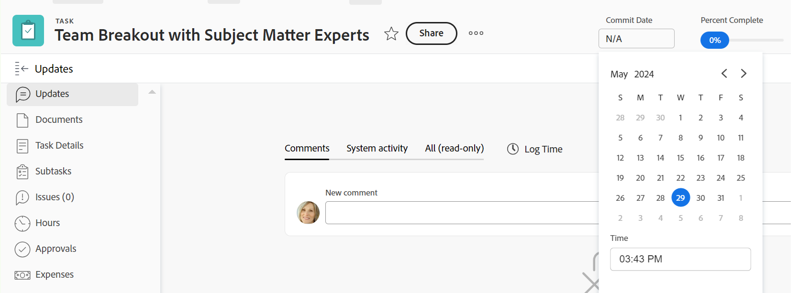
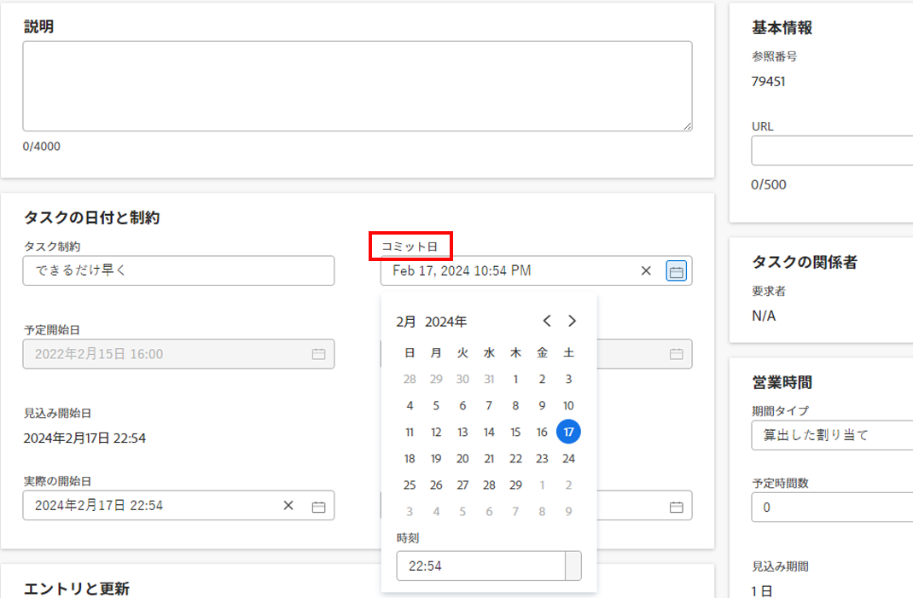

# タスクやイシューのコミット日の更新

<!--Audited: 07/2024-->

<!--
The highlighted information on this page refers to functionality not yet generally available. It is available only in the Preview environment for all customers, or in the Production environment for customers who enabled fast releases.

For information about fast releases, see [Enable or disable fast releases for your organization](/help/quicksilver/administration-and-setup/set-up-workfront/configure-system-defaults/enable-fast-release-process.md).

For information about the current release, see [Third Quarter 2024 release overview](/help/quicksilver/product-announcements/product-releases/24-q3-release-activity/24-q3-release-overview.md).
-->

割り当てられたタスクやイシューのコミット日は手動で更新できます。Adobe Workfront でのコミット日について詳しくは、[コミット日の概要](../../../manage-work/projects/updating-work-in-a-project/overview-of-commit-dates.md)を参照してください。

## アクセス要件

<!--Audited: 01/2024-->

+++ 展開すると、この記事の機能のアクセス要件が表示されます。 

<table style="table-layout:auto"> 
 <col> 
 <col> 
 <tbody> 
  <tr> 
   <td role="rowheader">Adobe Workfront パッケージ</td> 
   <td> 
任意
 </td> 
  </tr> 
  <tr> 
   <td role="rowheader">Adobe Workfront プラン</td> 
   <td> 
   <ul>
   <li>
タスクの標準
 </li>
   <li>
イシューの場合は Contributor 以上
</li>
   </ul>
   
または

<ul>
   <li>
タスクの場合はワーク以上
</li> 
   <li>
イシューの場合はリクエスト以上
</li>
</ul>

</td> 
  </tr> 
  <tr> 
   <td role="rowheader">アクセスレベル設定</td> 
   <td> 
タスクおよびイシューに対する編集アクセス権
 </td> 
  </tr> 
  <tr> 
   <td role="rowheader">オブジェクト権限</td> 
   <td> 
タスクまたはイシューの管理権限

   
 コミット日を更新するには、タスクまたはイシューに割り当てられる必要があります 

    </td> 
  </tr> 
 </tbody> 
</table>

詳しくは、[Workfront ドキュメントのアクセス要件](/help/quicksilver/administration-and-setup/add-users/access-levels-and-object-permissions/access-level-requirements-in-documentation.md)を参照してください。

+++

<!--
Old:
<table style="table-layout:auto"> 
 <col> 
 <col> 
 <tbody> 
  <tr> 
   <td role="rowheader">Adobe Workfront plan</td> 
   <td> 
Any
 </td> 
  </tr> 
  <tr> 
   <td role="rowheader">Adobe Workfront license*</td> 
   <td> 
   New:
   <ul>
   <li>
Standard for tasks
 </li>
   <li>
Contributor or higher for issues
</li>
   </ul>
   Current:
<ul>
   <li>
Work or higher for tasks
</li> 
   <li>
Request or higher for issues
</li>
</ul>

   </td> 
  </tr> 
  <tr> 
   <td role="rowheader">Access level configurations</td> 
   <td> 
Edit access to Tasks and Issues
 </td> 
  </tr> 
  <tr> 
   <td role="rowheader">Object permissions</td> 
   <td> 
Manage permissions on the task or issue

   
 You must be assigned to the task or issue to update the commit date 

    </td> 
  </tr> 
 </tbody> 
</table>
-->

## 前提条件

タスクまたはイシューのコミット日を編集するには、タスクまたはイシューのコミット日を更新する必要があるタスクまたはイシューに割り当てる必要があります。

## タスクやイシューのコミット日の更新

Workfrontの次の領域で、タスクまたはイシューのコミット日を更新できます。

* タスクまたは問題の詳細セクション
* タスクまたはイシューのヘッダー

  Workfrontまたはグループ管理者は、レイアウトテンプレートのタスクまたはイシューのヘッダーにコミット日を追加して、タスクまたはイシューのページから表示する必要があります。
詳しくは、[レイアウトテンプレートを使用してオブジェクトヘッダーをカスタマイズ](/help/quicksilver/administration-and-setup/customize-workfront/use-layout-templates/customize-object-headers.md)を参照してください。

コミット日の更新は、タスクとイシューで同じです。

>[!NOTE]
>
>システム管理者またはグループ管理者に、Workfrontの様々な領域で簡単に更新できるように、「コミット日」フィールドを概要パネルに追加するように依頼できます。
>
>詳しくは、次の記事を参照してください。
>
>* [概要](/help/quicksilver/workfront-basics/the-new-workfront-experience/summary-overview.md)
>* [ レイアウトテンプレートを使用して概要パネルをカスタマイズする](/help/quicksilver/administration-and-setup/customize-workfront/use-layout-templates/customize-home-summary-layout-template.md)。

1. 自分が&#x200B;**所有者**&#x200B;として割り当てられているタスクまたはイシューに移動します。

   タスクやイシューのタスク所有者の確認方法について詳しくは、[タスクの編集](../../../manage-work/tasks/manage-tasks/edit-tasks.md)の記事で[タスクの編集](../../../manage-work/tasks/manage-tasks/edit-tasks.md#assignments)の節を参照してください。

1. （条件付きとオプション）Workfrontまたはグループ管理者がコミット日をタスクまたはイシューのヘッダーに追加した場合は、ヘッダーの「**コミット日**」フィールドをクリックし、カレンダーから日付を選択します。 コミット日がヘッダーにない場合は、次の手順に進みます。

   

1. 左側のパネルで「**タスクの詳細**」または「**イシューの詳細**」をクリックします。
1. 「**概要**」をクリックして展開します。
1. 「**コミット日**」フィールドを更新します。

   詳細ページで

1. 「**変更を保存**」をクリックします。

   この変更を行うと、次のようになります。

   * タスクまたはイシューのコミット日と予定完了日が同じになります。

     代わりに、コミット日と、タスクまたはイシューの見込み完了日が同じになります。

     

   * プロジェクト所有者には、タスクまたは問題の新しいコミット日が提案されたことをWorkfront アプリ内通知で通知します。
   * プロジェクト所有者には、「更新」セクションで新しいコミット日を提案したことが通知され、この時点で、タスクまたは問題の予定完了日を、提案したコミット日と一致するように更新できます。

     

     <!---->

     この変更によってトリガーされる通知と更新について詳しくは、[コミット日の概要](/help/quicksilver/manage-work/projects/updating-work-in-a-project/overview-of-commit-dates.md)の記事で「コミット日の変更でトリガーされる通知と更新」の節を参照してください。

<!--at the Production update stream when removing legacy - replace the last bullet with: The Project Owner is notified in the Systems Activity and the All tabs of the Updates section that you have suggested a new Commit Date. They can then update the Planned Completion Date accordingly by editing the task or the issue.-->
