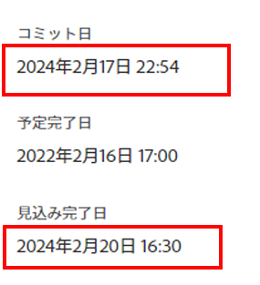

# タスクと問題に関するコミット日の更新

タスクまたは割り当て先のイシューのコミット日は手動で更新できます。 Adobe Workfrontのコミット日の詳細については、 [コミット日の概要](../../../manage-work/projects/updating-work-in-a-project/overview-of-commit-dates.md).

## アクセス要件

<!--drafted for P&P

<table style="table-layout:auto"> 
 <col> 
 <col> 
 <tbody> 
  <tr> 
   <td role="rowheader">Adobe Workfront plan*</td> 
   <td> 
Any
 </td> 
  </tr> 
  <tr> 
   <td role="rowheader">Adobe Workfront license*</td> 
   <td> 
   For the current licenses:
   <ul>
   <li>
Standard for tasks
 </li>
   <li>
Contributor or higher for issues
</li>
   </ul>
   For legacy licenses:
<ul>
   <li>
Work or higher for tasks
</li> 
   <li>
Request or higher for issues
</li>
</ul>

   </td> 
  </tr> 
  <tr> 
   <td role="rowheader">Access level configurations*</td> 
   <td> 
Edit access to Tasks and Issues
 
<b>NOTE</b>
   
   If you still don't have access, ask your Workfront administrator if they set additional restrictions in your access level. For information on how a Workfront administrator can modify your access level, see <a href="../../../administration-and-setup/add-users/configure-and-grant-access/create-modify-access-levels.md" class="MCXref xref">Create or modify custom access levels</a>.
 </td> 
  </tr> 
  <tr> 
   <td role="rowheader">Object permissions</td> 
   <td> 
Manage permissions on the task or issue
 
For information on requesting additional access, see <a href="../../../workfront-basics/grant-and-request-access-to-objects/request-access.md" class="MCXref xref">Request access to objects </a>.
 </td> 
  </tr> 
 </tbody> 
</table>
-->

この記事の手順を実行するには、次のアクセス権が必要です。

<table style="table-layout:auto"> 
 <col> 
 <col> 
 <tbody> 
  <tr> 
   <td role="rowheader">Adobe Workfront plan*</td> 
   <td> 
任意
 </td> 
  </tr> 
  <tr> 
   <td role="rowheader">Adobe Workfront license*</td> 
   <td> 
タスクに関する作業以上
 
   
問題に対するリクエスト以上

   </td> 
  </tr> 
  <tr> 
   <td role="rowheader">アクセスレベル設定*</td> 
   <td> 
タスクおよび問題へのアクセスを編集
 
<b>メモ</b>

まだアクセス権がない場合は、Workfront管理者に、アクセスレベルに追加の制限を設定しているかどうかを問い合わせてください。 Workfront管理者がアクセスレベルを変更する方法について詳しくは、 <a href="../../../administration-and-setup/add-users/configure-and-grant-access/create-modify-access-levels.md" class="MCXref xref">カスタムアクセスレベルの作成または変更</a>.
 </td>
</tr> 
  <tr> 
   <td role="rowheader">オブジェクト権限</td> 
   <td> 
タスクまたはイシューに対する権限の管理
 
追加のアクセス権のリクエストについて詳しくは、 <a href="../../../workfront-basics/grant-and-request-access-to-objects/request-access.md" class="MCXref xref">オブジェクトへのアクセスのリクエスト </a>.
 </td> 
  </tr> 
 </tbody> 
</table>

&#42;保有しているプラン、ライセンスの種類、アクセス権を確認するには、Workfront管理者に問い合わせてください。

## 前提条件

開始する前に、タスクまたはイシューに割り当てられている必要があります。コミット日を更新する必要があります。

## タスクと問題に関するコミット日の更新

タスクと問題のコミット日の更新は同じです。

1. として割り当てられているタスクまたはタスクに移動します **タスク所有者**.

   イシューまたはタスクのタスク所有者の特定について詳しくは、「 [タスクを編集](../../../manage-work/tasks/manage-tasks/edit-tasks.md#assignments) 記事内 [タスクを編集](../../../manage-work/tasks/manage-tasks/edit-tasks.md).

1. タスクまたはイシューのヘッダー内で「作業」をクリックします

   または

   クリック **タスクを開始** または **問題の開始** 作業ボタンが、作業項目で作業中であることを示すように、環境内でカスタマイズされている場合。

   現時点では、タスクまたはタスクのコミット日と計画完了日は同じです。

1. （オプション）「Start Task」または「Start Issue」をクリックした場合、 **取り消し** をクリックします。 コミット日が削除されます。

   「Work On It」ボタンを「Start」ボタンに置き換える方法については、  [「作業対象」ボタンを「開始」ボタンに置き換えます](../../../people-teams-and-groups/create-and-manage-teams/work-on-it-button-to-start-button.md).

   >[!TIP]
   >
   >選択を取り消して作業を開始するオプションは、 **作業**.

1. クリック **更新** 左のパネルで、 **新しい更新を開始** >**コミット日**

   または

   クリック **タスクの詳細** または **問題の詳細** 左のパネルで、をダブルクリックします。 **コミット日** カレンダーから新しい日付を選択し、 **変更を保存**.
   

   この変更をおこなった後、次のことが発生します。 

   * 「コミット日」と「計画完了日」は同じ日付ではなくなりました。

      代わりに、タスクまたはタスクのコミット日と予定完了日が同じになります。

      

   * 「更新日」領域で新しい日付を選択すると、変更内容は自動的に保存されます。
   * プロジェクト所有者には、タスクまたはタスクの新しいコミット日が提案されたことが通知されます。この時点で、タスクまたはタスクの計画完了日を、提案されたコミット日に合わせて更新できます。

      

      この変更によってトリガーされる通知と更新について詳しくは、 [コミット日の変更によってトリガーされる通知と更新](../../../manage-work/projects/updating-work-in-a-project/overview-of-commit-dates.md#notifica) 記事内 [コミット日の概要](../../../manage-work/projects/updating-work-in-a-project/overview-of-commit-dates.md).
