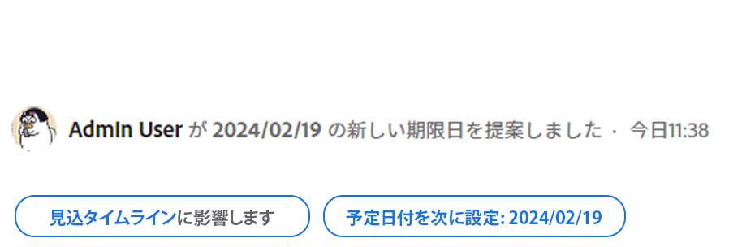

# タスクやイシューのコミット日の更新

割り当てられたタスクやイシューのコミット日は手動で更新できます。Adobe Workfront でのコミット日について詳しくは、[コミット日の概要](../../../manage-work/projects/updating-work-in-a-project/overview-of-commit-dates.md)を参照してください。

## アクセス要件

<!--Audited: 01/2024-->

この記事の手順を実行するには、次のアクセス権が必要です。

<table style="table-layout:auto"> 
 <col> 
 <col> 
 <tbody> 
  <tr> 
   <td role="rowheader">Adobe Workfront プラン*</td> 
   <td> 
任意
 </td> 
  </tr> 
  <tr> 
   <td role="rowheader">Adobe Workfront ライセンス*</td> 
   <td> 
   新規ライセンスの場合：
   <ul>
   <li>
タスクの標準
 </li>
   <li>
問題のコントリビューター以上
</li>
   </ul>
   現在のライセンス：
<ul>
   <li>
タスクの場合はワーク以上
</li> 
   <li>
イシューの場合はリクエスト以上
</li>
</ul>

</td> 
  </tr> 
  <tr> 
   <td role="rowheader">アクセスレベル設定</td> 
   <td> 
タスクおよびイシューに対する編集アクセス権
 </td> 
  </tr> 
  <tr> 
   <td role="rowheader">オブジェクト権限</td> 
   <td> 
タスクまたはイシューの管理権限
 </td> 
  </tr> 
 </tbody> 
</table>

*保有するプラン、ライセンスタイプまたはアクセス権を確認するには、Workfront 管理者にお問い合わせください。詳しくは、[Workfront ドキュメントのアクセス要件](/help/quicksilver/administration-and-setup/add-users/access-levels-and-object-permissions/access-level-requirements-in-documentation.md)を参照してください。

## 前提条件

作業を開始するには、コミット日の更新対象となるタスクまたはイシューに自分が割り当てられている必要があります。

## タスクやイシューのコミット日の更新

コミット日の更新は、タスクとイシューで同じです。

>[!NOTE]
>
>システム管理者またはグループ管理者に依頼して、「コミット日」フィールドを概要パネルに追加し、Workfrontの様々な領域で更新しやすくすることができます。
>
>詳しくは、次の記事を参照してください。
>
>* [概要](/help/quicksilver/workfront-basics/the-new-workfront-experience/summary-overview.md)
>* [レイアウトテンプレートを使用してホームと概要をカスタマイズ](/help/quicksilver/administration-and-setup/customize-workfront/use-layout-templates/customize-home-summary-layout-template.md).

1. として割り当てられているタスクまたは問題に移動します **所有者**.

   タスクやイシューのタスク所有者の確認方法について詳しくは、[タスクの編集](../../../manage-work/tasks/manage-tasks/edit-tasks.md)の記事で[タスクの編集](../../../manage-work/tasks/manage-tasks/edit-tasks.md#assignments)の節を参照してください。

1. クリック **タスクの詳細** または **問題の詳細** 左側のパネルで次の操作を行います。
1. クリック **概要** をクリックして展開します。
1. を更新 **コミット日** フィールド。

   

1. 「**変更を保存**」をクリックします。

   この変更を行った後、次の処理が行われます。 

   * タスクまたは問題のコミット日と予定完了日が同じではなくなりました。

     代わりに、コミット日と、タスクまたはイシューの見込み完了日が同じになります。

     

   * プロジェクト所有者には、タスクまたは問題の新しいコミット日を提案したことがWorkfrontのアプリ内通知で通知されます。
   <!--* The Project Owner is notified in the Updates section that you have suggested a new Commit Date and they can, at this time, update the Planned Completion Date of the task or issue to match the Commit Date you suggested. This functionality is not supported in the new commenting experience. For information, see [The new commenting experience](/help/quicksilver/product-announcements/betas/new-commenting-experience-beta/unified-commenting-experience.md). -->

   <!---->

   この変更によってトリガーされる通知と更新の詳細については、記事の「コミット日の変更によってトリガーされる通知と更新」の節を参照してください [コミット日の概要](/help/quicksilver/manage-work/projects/updating-work-in-a-project/overview-of-commit-dates.md).

<!--at the Production update stream when removing legacy - replace the last bullet with: The Project Owner is notified in the Systems Activity and the All tabs of the Updates section that you have suggested a new Commit Date. They can then update the Planned Completion Date accordingly by editing the task or the issue.-->