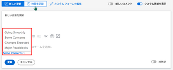

# タスクおよび問題の条件を更新

タスクまたはイシューの条件は、タスクの進行状況を示すフラグがタスクまたはイシューに設定されます。 これは、作業項目の現在の開発段階を示す作業項目のステータスとは異なります。

タスクまたはイシューの条件は、自動または手動で設定できます。

Adobe Workfront管理者は、 [カスタム条件の作成または編集](../../../administration-and-setup/customize-workfront/create-manage-custom-conditions/create-edit-custom-conditions.md)

<!--You can manually update the Condition of a task or issue if you are assigned to it or if you have permissions to it, as described in the [Access requirements](#access-requirements) section of this article.-->

## アクセス要件 {#access-requirements}

<!--drafted for P&P:

<table style="table-layout:auto"> 
 <col> 
 <col> 
 <tbody> 
  <tr> 
   <td role="rowheader">Adobe Workfront plan*</td> 
   <td> 
Any
 </td> 
  </tr> 
  <tr> 
   <td role="rowheader">Adobe Workfront license*</td> 
   <td> 
   
   For the current licenses:
   <ul><li>
Standard for tasks
</li>
   <li>
Contributor or higher for issues
</li></ul>

   For legacy licenses:
   <ul><li>
Work or higher for tasks
</li>
   <li>
Request or higher for issues
</li></ul>
    </td> 
  </tr> 
  <tr> 
   <td role="rowheader">Access level configurations*</td> 
   <td> 
View or higher access to projects
 
Edit access to tasks and issues 
 
<b>NOTE</b> 
   
   If you still don't have access, ask your Workfront administrator if they set additional restrictions in your access level. For information on how a Workfront administrator can change your access level, see <a href="../../../administration-and-setup/add-users/configure-and-grant-access/create-modify-access-levels.md" class="MCXref xref">Create or modify custom access levels</a>.
 </td> 
  </tr> 
  <tr> 
   <td role="rowheader">Object permissions</td> 
   <td> 
View or higher permissions on tasks and issues to view their Condition

   
Manage permissions on tasks and issues to update the Condition

    
For information on requesting additional access, see <a href="../../../workfront-basics/grant-and-request-access-to-objects/request-access.md" class="MCXref xref">Request access to objects </a>.
 </td> 
  </tr> 
 </tbody> 
</table>
-->

この記事の手順を実行するには、次のアクセス権が必要です。

<table style="table-layout:auto"> 
 <col> 
 <col> 
 <tbody> 
  <tr> 
   <td role="rowheader">Adobe Workfront plan*</td> 
   <td> 
任意
 </td> 
  </tr> 
  <tr> 
   <td role="rowheader">Adobe Workfront license*</td> 
   <td> 
タスクに関する作業以上

   
問題に対するリクエスト以上

    </td> 
  </tr> 
  <tr> 
   <td role="rowheader">アクセスレベル設定*</td> 
   <td> 
プロジェクトへの表示またはアクセス権の高さ
 
タスクおよび問題へのアクセスを編集 
 
<b>メモ</b>

まだアクセス権がない場合は、Workfront管理者に、アクセスレベルに追加の制限を設定しているかどうかを問い合わせてください。 Workfront管理者がアクセスレベルを変更する方法について詳しくは、 <a href="../../../administration-and-setup/add-users/configure-and-grant-access/create-modify-access-levels.md" class="MCXref xref">カスタムアクセスレベルの作成または変更</a>.
 </td>
</tr> 
  <tr> 
   <td role="rowheader">オブジェクト権限</td> 
   <td> 
タスクおよびタスクの条件を表示するタスクに対する権限を表示または上限に設定します

   
条件を更新するためのタスクおよび問題に関する権限を管理します

    
追加のアクセス権のリクエストについて詳しくは、 <a href="../../../workfront-basics/grant-and-request-access-to-objects/request-access.md" class="MCXref xref">オブジェクトへのアクセスのリクエスト </a>.
 </td> 
  </tr> 
 </tbody> 
</table>

*保有するプラン、ライセンスの種類、アクセス権を確認するには、Workfront管理者にお問い合わせください。

## タスクと問題の条件を見つける

条件は、タスクまたは問題に関連付けられたフラグとして表示されます。 また、ラベルの代わりにレポートに表示できる数値に関連付けることもできます。 条件と数値の関連付けの詳細については、 [カスタム条件の作成または編集](../../../administration-and-setup/customize-workfront/create-manage-custom-conditions/create-edit-custom-conditions.md).

タスクの条件と問題は、次の領域で確認できます。

* タスクまたはイシューに割り当てられた場合の、更新内のタスクおよびイシューの更新領域。
* レポートとリストは、ビューまたはグループの「条件」フィールドを表示する際に使用します。

>[!NOTE]
>
>ジャーナルエントリレポートの「フィールド名」フィールドに「条件」という単語が表示される場合は、アイテムの条件が更新されたことを示します。 仕訳レポートで「条件」フィールドが追跡される場合、新旧の数値には、名前ではなく、条件に関連付けられた数値が表示されます。 タスクまたはイシューに対して条件が最初に定義されていない状態で、後でその条件を更新した場合、更新を取り込むジャーナルエントリには、「条件」フィールドの「古い数値」が —2,147,483,648 と表示されます。

## ステータスを更新して条件を自動的に更新

タスクまたはタスクを割り当てられ、「 **作業** 、タスクを開始またはタスクを開始またはステータスを更新すると、タスクまたはタスクの条件は、 **スムーズに進む**.

カスタム条件をデフォルトの条件として使用する方法については、  [タスクとタスクのデフォルトとしてカスタム条件を設定](../../../administration-and-setup/customize-workfront/create-manage-custom-conditions/set-custom-condition-default-tasks-issues.md) および [カスタム条件をプロジェクトのデフォルトとして設定する](../../../administration-and-setup/customize-workfront/create-manage-custom-conditions/set-custom-condition-default-projects.md).

タスクのステータスの変更について詳しくは、 [タスクステータスを更新](../../../manage-work/projects/updating-work-in-a-project/update-task-status.md).

問題ステータスの変更について詳しくは、 [問題ステータスを更新](../../../manage-work/projects/updating-work-in-a-project/update-issue-status.md).

[ 作業開始 ] ボタンを [ タスクの開始 ] または [ タスクの開始 ] ボタンに設定する方法については、 [「作業対象」ボタンを「開始」ボタンに置き換えます](../../../people-teams-and-groups/create-and-manage-teams/work-on-it-button-to-start-button.md).

## 手動での条件の更新

条件を設定するには、タスクまたはタスクに割り当てられているか、タスクに対する管理権限が必要です。

タスクまたはタスクの条件を更新するかどうかは、タスクに割り当てられているかどうかによって異なります。

* 条件は、「更新」タブ、またはタスクやタスクに割り当てられている場合はタスクやタスクのリストで更新できます。
* 条件は、タスクまたはタスクに割り当てられていないが、タスクに対する管理権限を持っている場合にのみ、タスクまたはタスクのリストで更新できます。 この場合、タスクまたはイシューの「更新」タブで条件を更新することはできません。

タスクまたはイシューの条件を手動で設定するには、次の手順に従います。

1. 条件を設定するタスクまたはタスクに割り当てられたタスクに移動します。

   または

   管理権限を持っているが、割り当てられていないタスクまたはタスクの一覧に移動します。

1. 次のように、問題またはタスクの条件を変更します。

   * タスクまたはタスクに割り当てられ、タスクまたはタスクに対する管理権限を持っている場合は、 **更新** タブ、クリック **新しい更新を開始**&#x200B;を選択し、 **条件** タスクの実行状況を最もよく反映するものにするには、条件を変更する理由を **新しい更新を開始** 領域（オプション）を選択し、 **更新**.

      

      >[!NOTE]
      >
      >条件は、お使いの環境に合わせてカスタマイズできるので、お使いの環境で条件に対して 3 つ以上のオプションを検索できます。 条件の名前は、上記の名前とは異なる場合があります。 Workfrontの条件のカスタマイズについて詳しくは、 [カスタム条件の作成または編集](../../../administration-and-setup/customize-workfront/create-manage-custom-conditions/create-edit-custom-conditions.md).

      作業項目の更新時に使用できる追加機能について詳しくは、 [作業を更新](../../../workfront-basics/updating-work-items-and-viewing-updates/update-work.md).

      <!--   
     <li data-mc-conditions="QuicksilverOrClassic.Draft mode">
(NOTE: drafted because I can't do this anymore)

If you have Manage permissions to the task or issue but are not assigned to it, perhaps as a project manager, add the <strong>Condition</strong> column to any view you use in a task or issue list, then set the <strong>Condition</strong> in inline edit and press Enter.

For information about adding a column to a view, see <a href="../../../reports-and-dashboards/reports/reporting-elements/views-overview.md" class="MCXref xref">Views overview in Adobe Workfront</a>.
</li>   
     -->
