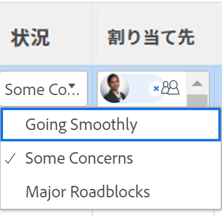

# タスクおよびイシューの条件の更新

タスクまたはイシューの状況は、進行状況を示すために配置されたフラグです。これは、作業項目の現在の開発段階を示す作業項目のステータスとは異なります。

タスクまたはイシューの状況は、自動または手動で設定できます。

Adobe Workfront 管理者は、環境のカスタムの状況を作成できます。詳しくは、[カスタム状況の作成または編集](../../../administration-and-setup/customize-workfront/create-manage-custom-conditions/create-edit-custom-conditions.md)を参照してください。

<!--You can manually update the Condition of a task or issue if you are assigned to it or if you have permissions to it, as described in the [Access requirements](#access-requirements) section of this article.-->

## アクセス要件 {#access-requirements}

この記事の手順を実行するには、次のアクセス権が必要です。

<table style="table-layout:auto"> 
 <col> 
 <col> 
 <tbody> 
  <tr> 
   <td role="rowheader">Adobe Workfront プラン</td> 
   <td> 
任意
 </td> 
  </tr> 
  <tr> 
   <td role="rowheader">Adobe Workfront ライセンス*</td> 
   <td>

新しいライセンスの場合：
<ul><li>
タスクの標準
</li>
   <li>
問題の寄稿者以上
</li></ul>

現在のライセンスの場合：
<ul><li>
タスクの場合はワーク以上
</li>
   <li>
イシューの場合はリクエスト以上
</li></ul>
    </td> 
  </tr> 
  <tr> 
   <td role="rowheader">アクセスレベル設定</td> 
   <td> 
プロジェクトに対する表示以上のアクセス権
 
タスクおよびイシューに対する編集アクセス権 
</td> 
  </tr> 
  <tr> 
   <td role="rowheader">オブジェクト権限</td> 
   <td> 
状況を表示するための、タスクおよびイシューに対する表示以上の権限

   
状況を更新するための、タスクおよびイシューに対する管理権限

  </td> 
  </tr> 
 </tbody> 
</table>

*保有するプラン、ライセンスの種類、アクセス権を確認するには、Workfront管理者にお問い合わせください。 詳しくは、 [Workfrontドキュメントのアクセス要件](/help/quicksilver/administration-and-setup/add-users/access-levels-and-object-permissions/access-level-requirements-in-documentation.md).

## タスクおよびイシューの状況を見つける

状況は、タスクまたはイシューに関連付けられたフラグとして表示されます。また、ラベルの代わりにレポートに表示できる数値に関連付けることもできます。状況と数値の関連付けについて詳しくは、[カスタム状況の作成または編集](../../../administration-and-setup/customize-workfront/create-manage-custom-conditions/create-edit-custom-conditions.md)を参照してください。

タスクおよびイシューの状況は、次のエリアで確認できます。

* タスクまたはイシューに割り当てられた場合の、更新内のタスクおよびイシューの更新領域。 これは、新しいコメントエクスペリエンスではサポートされていません。 詳しくは、 [新しいコメントエクスペリエンス](/help/quicksilver/product-announcements/betas/new-commenting-experience-beta/unified-commenting-experience.md).
* ビューまたはグループ化で「状況」フィールドを表示する場合は、レポートおよびリスト。

>[!NOTE]
>
>ジャーナルエントリレポートの「フィールド名」フィールドに「状況」という単語が表示される場合は、項目の状況が更新されたことを示します。ジャーナルエントリレポートで「状況」フィールドが追跡されると、新旧の数値には、名前ではなく状況に関連付けられた数値が表示されます。タスクまたはイシューに対して状況がもともと定義されていない状態で、後でその状況を更新した場合、更新を取り込むジャーナルエントリには、「状況」フィールドの「古い数値」が -2,147,483,648 と表示されます。

## ステータスを更新して状況を自動的に更新

タスクまたはイシューが割り当てられたときに「**作業をする**」、「タスクを開始」または「イシューの取り組みを開始」をクリックするか、そのステータスを更新すると、タスクまたはイシューの状況は、**順調**&#x200B;に関連付けられているデフォルトの状況に自動的に変更されます。

カスタム状況をデフォルトの状況として使用することについて詳しくは、[カスタム状況をタスクとイシューのデフォルトとして設定](../../../administration-and-setup/customize-workfront/create-manage-custom-conditions/set-custom-condition-default-tasks-issues.md)および[カスタム状況をプロジェクトのデフォルトとして設定](../../../administration-and-setup/customize-workfront/create-manage-custom-conditions/set-custom-condition-default-projects.md)の記事を参照してください。

タスクのステータスの変更について詳しくは、[タスクのステータスを更新](../../../manage-work/projects/updating-work-in-a-project/update-task-status.md)を参照してください。

イシューのステータスの変更について詳しくは、[イシューのステータスを更新](../../../manage-work/projects/updating-work-in-a-project/update-issue-status.md)を参照してください。

「作業をする」ボタンを「タスクを開始」または「イシューの取り組みを開始」ボタンに設定する方法について詳しくは、[「作業をする」ボタンを「開始」ボタンに置き換え](../../../people-teams-and-groups/create-and-manage-teams/work-on-it-button-to-start-button.md)を参照してください。

## 状況を手動で更新

状況を設定するには、タスクまたはイシューに割り当てられているか、タスクまたはイシューに対する管理権限を持っている必要があります。

ビューに「条件」フィールドを表示するときに、タスクまたはタスクまたはイシューのタスクまたはイシューの条件を手動で更新することができます。

<!--old Condition update - in the commenting stream: 
Updating the Condition of a task or issue differs depending on whether you are assigned to it or not:

* If you are using the legacy commenting experience, you can update the Condition in the Updates tab or in a list of tasks or issues if you are assigned to them. This is not supported in the new commenting experience. For information, see [New commenting experience](/help/quicksilver/product-announcements/betas/new-commenting-experience-beta/unified-commenting-experience.md). 
* You can update the Condition in a list of tasks or issues if you are not assigned to them, only if you have Manage permissions to them. In this case, you cannot update the Condition in the Update tab of the task or issue. -->

タスクまたはイシューの条件を手動で更新するには、次の手順に従います。

1. 管理権限を持つタスクまたは問題の一覧に移動します。 次を確認します。 **条件** フィールドがリストの表示に表示されます。

1. を更新します。 **条件** イシューまたはタスクをインラインで表示する場合は、既存の条件をダブルクリックし、ドロップダウンメニューから新しい値を選択します。

   

   >[!NOTE]
   >
   >状況は環境に合わせてカスタマイズできるので、お使いの環境で状況の選択肢が 4 つ以上ある場合もあります。状況の名前は、上記の名前とは異なる場合があります。Workfront での状況のカスタマイズについては、[カスタム状況の作成または編集](../../../administration-and-setup/customize-workfront/create-manage-custom-conditions/create-edit-custom-conditions.md)を参照してください。

1. 押す **入力** キーボードでクリックするか、[ 条件 ] フィールドの外側をクリックして、新しいタスクまたは問題の条件を保存します。

   <!--   
     <li data-mc-conditions="QuicksilverOrClassic.Draft mode">
(NOTE: drafted because I can't do this anymore)

If you have Manage permissions to the task or issue but are not assigned to it, perhaps as a project manager, add the <strong>Condition</strong> column to any view you use in a task or issue list, then set the <strong>Condition</strong> in inline edit and press Enter.

For information about adding a column to a view, see <a href="../../../reports-and-dashboards/reports/reporting-elements/views-overview.md" class="MCXref xref">Views overview in Adobe Workfront</a>.
</li>   
     -->
