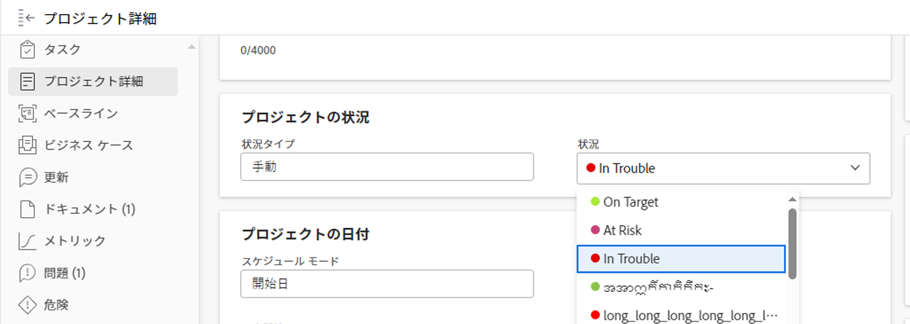

# プロジェクトの条件を更新

プロジェクトの「条件」は、プロジェクトに関連する作業がスムーズに進むかどうか、または道路ブロックが発生したかどうかを示すために、プロジェクトに配置されるフラグです。 これは、プロジェクトのステータスとは異なり、プロジェクトに対して積極的に作業を行っているかどうかを示します。

プロジェクトの条件は、自動または手動で設定できます。 プロジェクトの条件を手動で変更するには、プロジェクトの所有者であるか、管理権限が必要です。

Adobe Workfront管理者は、 [カスタム条件の作成または編集](../../../administration-and-setup/customize-workfront/create-manage-custom-conditions/create-edit-custom-conditions.md).

## アクセス要件

<!--drafted for P&P:

<table style="table-layout:auto"> 
 <col> 
 <col> 
 <tbody> 
  <tr> 
   <td role="rowheader">Adobe Workfront plan*</td> 
   <td>
Any
 </td> 
  </tr> 
  <tr> 
   <td role="rowheader">Adobe Workfront license*</td> 
   <td> 
   
   For the current licenses:
  
Standard

   
   For legacy licenses:
   <ul><li>
Plan

    </td> 
  </tr> 
  <tr> 
   <td role="rowheader">Access level configurations*</td> 
   <td> 
View or higher access to projects
 
Edit access to tasks and issues 
 
<b>NOTE</b> 
   
   If you still don't have access, ask your Workfront administrator if they set additional restrictions in your access level. For information on how a Workfront administrator can change your access level, see <a href="../../../administration-and-setup/add-users/configure-and-grant-access/create-modify-access-levels.md" class="MCXref xref">Create or modify custom access levels</a>.
 </td> 
  </tr> 
  <tr> 
   <td role="rowheader">Object permissions</td> 
   <td> 
View or higher permissions on tasks and issues to view their Condition

   
Manage permissions on tasks and issues to update the Condition

    
For information on requesting additional access, see <a href="../../../workfront-basics/grant-and-request-access-to-objects/request-access.md" class="MCXref xref">Request access to objects </a>.
 </td> 
  </tr> 
 </tbody> 
</table>
-->

この記事の手順を実行するには、次のアクセス権が必要です。

<table style="table-layout:auto"> 
 <col> 
 <col> 
 <tbody> 
  <tr> 
   <td role="rowheader">Adobe Workfront plan*</td> 
   <td> 
任意
 </td> 
  </tr> 
  <tr> 
   <td role="rowheader">Adobe Workfront license*</td> 
   <td> 
計画 
 </td> 
  </tr> 
  <tr> 
   <td role="rowheader">アクセスレベル設定*</td> 
   <td> 
プロジェクトへのアクセスを編集
 
<b>メモ</b>

まだアクセス権がない場合は、Workfront管理者に、アクセスレベルに追加の制限を設定しているかどうかを問い合わせてください。 Workfront管理者がアクセスレベルを変更する方法について詳しくは、 <a href="../../../administration-and-setup/add-users/configure-and-grant-access/create-modify-access-levels.md" class="MCXref xref">カスタムアクセスレベルの作成または変更</a>.
 </td>
</tr> 
  <tr> 
   <td role="rowheader">オブジェクト権限</td> 
   <td> 
プロジェクトに対する権限の管理
 
追加のアクセス権のリクエストについて詳しくは、 <a href="../../../workfront-basics/grant-and-request-access-to-objects/request-access.md" class="MCXref xref">オブジェクトへのアクセスのリクエスト </a>.
 </td> 
  </tr> 
 </tbody> 
</table>

&#42;保有しているプラン、ライセンスの種類、アクセス権を確認するには、Workfront管理者に問い合わせてください。

## 条件を自動的に設定

プロジェクトの条件を自動的に設定するには、プロジェクトの条件タイプを使用します。 Workfrontがプロジェクトの条件を自動的に設定するには、「条件タイプ」を「進行状況ステータス」に設定する必要があります。

「設定」領域でプロジェクトの環境設定を行う場合、Workfrontまたはグループ管理者が、システム内の新規プロジェクトの「条件の種類」フィールドのデフォルトを決定します。 詳しくは、 [システム全体のプロジェクト環境設定の指定](../../../administration-and-setup/set-up-workfront/configure-system-defaults/set-project-preferences.md).

プロジェクトを作成すると、その時点のプロジェクトの進捗状況ステータスに合わせて、プロジェクトの条件が自動的に設定されます。 プロジェクトの進捗状況ステータスは、プロジェクト上のタスクの進捗状況に基づきます。

プロジェクト条件と、進捗状況ステータスに基づく計算方法について詳しくは、 [プロジェクトの進行状況ステータスの概要](../../../manage-work/projects/planning-a-project/project-progress-status.md).

## プロジェクトの条件を手動で更新する

プロジェクトの条件の種類を進捗状況ステータスではなく手動に設定した場合は、手動でプロジェクトの条件を更新できます。

1. 条件を更新するプロジェクトに移動します。
1. 次をクリック： **プロジェクトの詳細** 」セクションに入力します。

   

1. 次を確認します。 **条件タイプ** フィールドが **手動**.

1. 内 **条件** 「 」フィールドで、以下のオプションから、関連する作業がスムーズに進むかどうか、または遅延が発生するかどうかを理解できるオプションを選択します。

   * **目標どおり**
   * **リスクあり**
   * **トラブル発生中**

   プロジェクト条件の詳細については、 [プロジェクト条件と条件タイプの概要](../../../manage-work/projects/manage-projects/project-condition-and-condition-type.md).

   >[!NOTE]
   >
   >条件は、お使いの環境に合わせてカスタマイズできるので、お使いの環境で条件に対して 3 つ以上のオプションを検索できます。 条件の名前は、上記の名前とは異なる場合があります。 Workfrontの条件のカスタマイズについて詳しくは、 [カスタム条件の作成または編集](../../../administration-and-setup/customize-workfront/create-manage-custom-conditions/create-edit-custom-conditions.md).

1. クリック **保存**&#x200B;クリック **変更を保存**.
