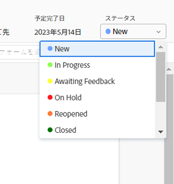
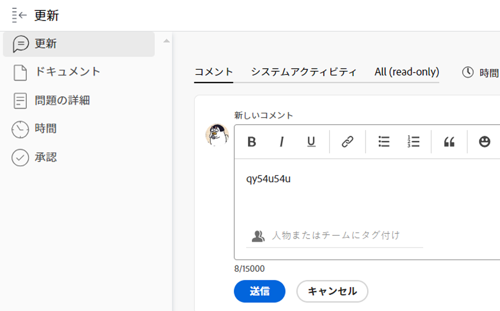

# 問題ステータスを更新

問題のステータスを更新して、問題の発生場所と進行状況を他の人に知らせることができます。

## アクセス要件

<!--drafted for P&P;

<table style="table-layout:auto"> 
 <col> 
 <col> 
 <tbody> 
  <tr> 
   <td role="rowheader">Adobe Workfront plan*</td> 
   <td> 
Any
 </td> 
  </tr> 
  <tr> 
   <td role="rowheader">Adobe Workfront license*</td> 
   <td> 
Current license: Contributor or higher

   Or
   
Legacy license: Request or higher

   </td> 
  </tr> 
  <tr> 
   <td role="rowheader">Access level configurations*</td> 
   <td> 
Edit access to Issues
 
<b>NOTE</b>
   
   If you still don't have access, ask your Workfront administrator if they set additional restrictions in your access level. For information on how a Workfront administrator can modify your access level, see <a href="../../../administration-and-setup/add-users/configure-and-grant-access/create-modify-access-levels.md" class="MCXref xref">Create or modify custom access levels</a>.
 </td> 
  </tr> 
  <tr> 
   <td role="rowheader">Object permissions</td> 
   <td> 
Manage permissions to the issue
 
For information on requesting additional access, see <a href="../../../workfront-basics/grant-and-request-access-to-objects/request-access.md" class="MCXref xref">Request access to objects </a>.
 </td> 
  </tr> 
 </tbody> 
</table>
-->

この記事の手順を実行するには、次のアクセス権が必要です。

<table style="table-layout:auto"> 
 <col> 
 <col> 
 <tbody> 
  <tr> 
   <td role="rowheader">Adobe Workfront plan*</td> 
   <td> 
任意
 </td> 
  </tr> 
  <tr> 
   <td role="rowheader">Adobe Workfront license*</td> 
   <td> 
リクエスト以上
 </td> 
  </tr> 
  <tr> 
   <td role="rowheader">アクセスレベル設定*</td> 
   <td> 
問題へのアクセスを編集
 
<b>メモ</b>

まだアクセス権がない場合は、Workfront管理者に、アクセスレベルに追加の制限を設定しているかどうかを問い合わせてください。 Workfront管理者がアクセスレベルを変更する方法について詳しくは、 <a href="../../../administration-and-setup/add-users/configure-and-grant-access/create-modify-access-levels.md" class="MCXref xref">カスタムアクセスレベルの作成または変更</a>.
 </td>
</tr> 
  <tr> 
   <td role="rowheader">オブジェクト権限</td> 
   <td> 
問題に対する権限の管理
 
追加のアクセス権のリクエストについて詳しくは、 <a href="../../../workfront-basics/grant-and-request-access-to-objects/request-access.md" class="MCXref xref">オブジェクトへのアクセスのリクエスト </a>.
 </td> 
  </tr> 
 </tbody> 
</table>

&#42;保有しているプラン、ライセンスの種類、アクセス権を確認するには、Workfront管理者に問い合わせてください。

## 問題のステータス

Workfrontの問題のデフォルトのステータスは次のとおりです。

* 新規
* 処理中
* フィードバック待ち
* 保留中
* 解決されない
* 再オープン
* クローズ
* 解決済み

Adobe Workfront管理者は、組織の問題に対してカスタムステータスを追加できます。 また、問題のタイプに応じて、ステータスを使用可能にすることもできます。

カスタムステータスと問題のタイプについて詳しくは、次の記事を参照してください。

* [ステータスの作成または編集](../../../administration-and-setup/customize-workfront/creating-custom-status-and-priority-labels/create-or-edit-a-status.md)
* [イシューの作成](../../../manage-work/issues/manage-issues/create-issues.md)

問題のステータスは、手動で更新することも、特定のアクションが実行されたときにWorkfrontで自動的に更新することもできます。

## 問題ステータスを手動で更新

問題ステータスを更新する際に、新しいステータスに関する説明を追加したり、コミット日などの他の問題情報を変更したりすることもできます。

1. ステータスを更新するために割り当てられている問題に移動します。
1. 次をクリック： **ステータス** 「 」フィールドに値を入力し、新しいステータスを選択します。

   

1. 問題の完了を視覚的に示すには、下のバブルをドラッグまたはダブルクリックします **完了率** を設定します。

   または

   問題のヘッダーのバブル内をクリックして、割合を入力します。

   

1. （オプション）次のいずれかの操作を行って、更新に関する追加情報を入力し、 **更新** または、問題のステータスが「完了」と等しい場合は、「 **完了：**

   * 更新に関するメモを追加するには、 **更新** 「 」セクションで、「 」をクリックします。 **新しい更新を開始**&#x200B;メモを入力します。

      

   * 更新を特定のユーザーに通知するには、 **通知** ボックスが表示されます。 詳しくは、 [更新時の他のユーザーへのタグ付け](../../../workfront-basics/updating-work-items-and-viewing-updates/tag-others-on-updates.md).
   * 問題の条件を更新するには、 **条件**「 」を選択し、問題の現在の状況を最も反映した条件を選択します。 次のオプションから選択します。

      * 順調
      * やや心配
      * 深刻な障害
   * 問題のコミット日を更新するには、 **コミット日** ドロップダウンカレンダーを開き、新しい日付を選択します。

## 問題ステータスを自動的に更新

Workfrontは、以下の表に示すアクションが発生すると、問題の既存のステータスを別のステータスに自動的に更新します。

>[!NOTE]
>
>次の表に、デフォルトのシステムステータスを示します。 Workfront管理者またはグループ管理者は、Workfrontのインスタンスでステータスの名前を変更できます。 Workfrontでのステータスの作成と管理について詳しくは、 [ステータスの作成または編集](../../../administration-and-setup/customize-workfront/creating-custom-status-and-priority-labels/create-or-edit-a-status.md).

<table style="table-layout:auto"> 
 <col> 
 <col> 
 <col> 
 <tbody> 
  <tr> 
   <td>アクション</td> 
   <td>元のステータス</td> 
   <td>新しいステータス</td> 
  </tr> 
  <tr> 
   <td>問題の割合を 100%に更新</td> 
   <td>新規または進行中</td> 
   <td>クローズ</td> 
  </tr> 
  <tr> 
   <td>問題の完了率を 100%から低い数に更新します</td> 
   <td>クローズ </td> 
   <td>処理中</td> 
  </tr> 
  <tr> 
   <td>問題に関連付けられた解決オブジェクトのステータスを更新します</td> 
   <td>各種ステータス</td> 
   <td> 
各種ステータス
 
オブジェクトの解決と問題の状態に対する影響の詳細については、この記事の「解決可能なオブジェクトの状態と解決可能なオブジェクトの状態の同期」を参照してください。 <a href="../../../manage-work/issues/convert-issues/resolving-and-resolvable-objects.md" class="MCXref xref">オブジェクトの解決と解決の概要 </a>.
 </td> 
  </tr> 
  <tr data-mc-conditions=""> 
   <td>「問題の開始」ボタンをクリックして、割り当てられた問題の作業を承認します </td> 
   <td>新規 </td> 
   <td> 
ホームチーム設定の [ 問題の開始 ] ボタンに関連するステータス。 
 
「Work On It」ボタンを「Start Issue」ボタンに置き換える方法については、 <a href="../../../people-teams-and-groups/create-and-manage-teams/work-on-it-button-to-start-button.md" class="MCXref xref">「作業対象」ボタンを「開始」ボタンに置き換えます</a>. 
 
ヒント：クリック 取り消しボタン 「問題を開始」をクリックすると、ステータスが「新規」に戻ります。 
 </td> 
  </tr> 
 </tbody> 
</table>
