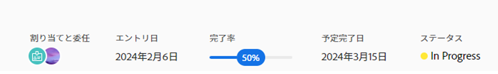
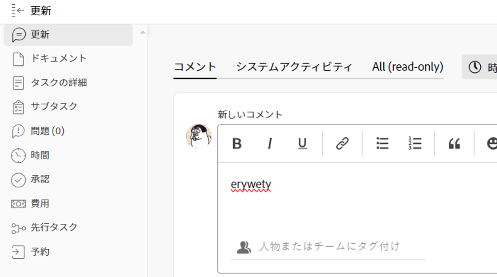

# タスクステータスの更新

タスクステータスを更新して、タスク（およびプロジェクト全体）の進行状況を他のユーザーに知らせることができます。

デフォルトのステータスは、「新規」、「処理中」および「完了」です。Adobe Workfront 管理者は、組織のカスタムステータスを追加できます。詳しくは、[ステータスの作成または編集](../../../administration-and-setup/customize-workfront/creating-custom-status-and-priority-labels/create-or-edit-a-status.md)を参照してください。

タスクのステータスは、手動で更新することも、特定のアクションが実行されたときに Workfront で自動的に更新することもできます。

## アクセス要件

タスクを手動で更新するには、次のアクセス権が必要です。

<table style="table-layout:auto"> 
 <col> 
 <col> 
 <tbody> 
  <tr> 
   <td role="rowheader">Adobe Workfront プラン</td> 
   <td> 
任意
 </td> 
  </tr> 
  <tr> 
   <td role="rowheader">Adobe Workfront ライセンス*</td> 
   <td> 
新規：標準
 
   または
   
現在：作業以上

   </td> 
  </tr> 
  <tr> 
   <td role="rowheader">アクセスレベル設定</td> 
   <td> 
タスクへのアクセスを編集
  </td> 
  </tr> 
  <tr> 
   <td role="rowheader">オブジェクト権限</td> 
   <td> 
タスクに対する管理権限
 </td> 
  </tr> 
 </tbody> 
</table>

*保有するプラン、ライセンスの種類、アクセス権を確認するには、Workfront管理者にお問い合わせください。 詳しくは、 [Workfrontドキュメントのアクセス要件](/help/quicksilver/administration-and-setup/add-users/access-levels-and-object-permissions/access-level-requirements-in-documentation.md).

## タスクのステータスの更新に関する考慮事項

* タスクを「完了」とマークすると、タスクの完了率が 100%に更新されます。
* 親タスクには、次のシナリオが存在します。
   * プロジェクトの [ サマリー完了モード ] が [ 自動 ] に設定され、サブタスクが完了していない場合は、親タスクの [ ステータス ] を [ 完了 ] に更新することはできません。
   * プロジェクトの [ サマリー完了モード ] が [ 手動 ] に設定され、サブタスクが完了または不完全になっている場合は、親タスクの [ ステータス ] を [ 完了 ] に更新できます。

  詳しくは、[プロジェクトの編集](../manage-projects/edit-projects.md)を参照してください。

## タスクのステータスを手動で更新

Workfrontの次の領域でタスクのステータスを更新できます。

* タスクページのタスクヘッダーです。
* タスクの編集時の [ タスクの編集 ] ボックス。
* タスクページの「タスクの詳細」セクション。
* タスクリストまたはレポートで、[ 状態 ] フィールドがビューに表示されている場合。
* タスクの Summary パネル。

タスク・ヘッダーのタスク・ステータスを手動で更新する手順は、次のとおりです。

1. ステータスを更新するタスクに移動します。
1. タスクのヘッダーの「**ステータス**」フィールドをクリックし、新しいステータスを選択します。
1. タスクの完了を視覚的に示すには、下のバブルをドラッグまたはダブルクリックします **完了率** タスクのヘッダー内

   または

   タスクのヘッダーのバブル内をクリックして、割合を入力します。

   

1. （オプション）更新に関する追加情報を提供するには、次のいずれかの操作を行います。

   * 更新に関するメモを追加するには、 **更新** 「 」セクションで、「 」をクリックします。 **新しいコメント**&#x200B;メモを入力します。

     

   * 更新を特定のユーザーに通知するには、ユーザー名を **担当者またはチームのタグ付け** コメントを入力すると表示されるフィールド。 詳しくは、[更新時の他のユーザーへのタグ付け](/help/quicksilver/workfront-basics/updating-work-items-and-viewing-updates/tag-others-on-updates.md)を参照してください。
   * タスクのコミット日を更新するには、 **タスクの詳細**」、「 **コミット日** フィールドに入力します。 詳しくは、[タスクを編集](/help/quicksilver/manage-work/tasks/manage-tasks/edit-tasks.md)を参照してください。

   >[!IMPORTANT]
   >
   >  コミット日を更新できるのは、タスクの担当者のみです。

<!--old functionality in old commenting: 

1. Go to a task that you are assigned to for which you want to update the status.
1. Click the **Status** field in the task header and select a new status. 
1. (Optional) Do any of the following to provide additional information about the update, then click **Update** or, if the task has the **Complete** status, click **Done:**

   * To add a note about the update, go to the **Updates** area and click **Start a new update**, then type your note.  

   * To notify certain users about the update, type their names in the **Notify** box that appears when you type a note about the update. For more information, see [Tag others on updates](../../../workfront-basics/updating-work-items-and-viewing-updates/tag-others-on-updates.md). 
   * To update the condition of the task, click **Select Condition** to the right of the **Notify** box (these appear when you type a note about the update), then select the condition that best reflects the current condition of the task.
   
   * To update the Commit Date of the task, expand the **Commit Date** drop-down calendar, and select a new Commit Date. 
   * To provide a visual indication of task completion, drag the bubble under Percent Complete or double-click it to enter a percent value.   
     -->

## タスクのステータスを自動的に更新

Workfront は、以下の表に示すアクションが発生すると、タスクの既存のステータスを別のステータスに自動的に更新します。

>[!NOTE]
>
>以下の表のステータスは、デフォルトのシステムステータスです。Workfront 管理者またはグループ管理者は、Workfront のインスタンスでステータスの名前を変更できます。Workfront でのステータスの作成と管理について詳しくは、[ステータスを作成または編集](../../../administration-and-setup/customize-workfront/creating-custom-status-and-priority-labels/create-or-edit-a-status.md)を参照してください。

<table style="table-layout:auto"> 
 <col> 
 <col> 
 <col> 
 <tbody> 
  <tr> 
   <td><b>アクション</b></td> 
   <td><b>元のステータス</b></td> 
   <td><b>新しいステータス</b></td> 
  </tr> 
  <tr> 
   <td>タスクの完了率を 100％に更新</td> 
   <td>新規または進行中</td> 
   <td>完了</td> 
  </tr> 
  <tr> 
   <td>タスクの完了率を 100％から低い数値に更新</td> 
   <td>完了</td> 
   <td>処理中</td> 
  </tr> 
  <tr data-mc-conditions=""> 
   <td>「タスクを開始」ボタンをクリックして割り当てられたタスクの作業を開始 </td> 
   <td>新規 </td> 
   <td> 
ホームチーム設定の「タスクを開始」ボタンに関連付けられたステータス。
 
「作業をする」ボタンを「タスクを開始」ボタンに置き換える方法については、<a href="../../../people-teams-and-groups/create-and-manage-teams/work-on-it-button-to-start-button.md" class="MCXref xref">「作業をする」ボタンを「開始」ボタンに置き換える</a>を参照してください。
 
ヒント：「タスクを開始」をクリックした後に「元に戻す」ボタンをクリックすると、ステータスが「新規」に戻ります。 
 </td> 
  </tr> 
 </tbody> 
</table>
