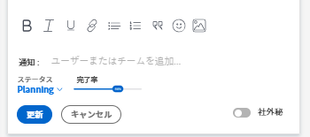

# タスクステータスを更新

タスクのステータスを更新して、タスクの場所（およびプロジェクト全体）と進行状況を他のユーザーに知らせることができます。

デフォルトのステータスは、「新規」、「処理中」および「完了」です。 Adobe Workfront管理者は、組織のカスタムステータスを追加できます。 詳しくは、 [ステータスの作成または編集](../../../administration-and-setup/customize-workfront/creating-custom-status-and-priority-labels/create-or-edit-a-status.md).

タスクのステータスは手動で更新することも、特定のアクションが実行されたときにWorkfrontで自動的に更新することもできます。

## アクセス要件

<!--drafted for P&P:

<table style="table-layout:auto"> 
 <col> 
 <col> 
 <tbody> 
  <tr> 
   <td role="rowheader">Adobe Workfront plan*</td> 
   <td> 
Any
 </td> 
  </tr> 
  <tr> 
   <td role="rowheader">Adobe Workfront license*</td> 
   <td> 
Current license: Standard
 
   Or
   
Legacy license: Work or higher

   </td> 
  </tr> 
  <tr> 
   <td role="rowheader">Access level configurations*</td> 
   <td> 
Edit access to Tasks
 
<b>NOTE</b>
   
   If you still don't have access, ask your Workfront administrator if they set additional restrictions in your access level. For information on how a Workfront administrator can modify your access level, see <a href="../../../administration-and-setup/add-users/configure-and-grant-access/create-modify-access-levels.md" class="MCXref xref">Create or modify custom access levels</a>.
 </td> 
  </tr> 
  <tr> 
   <td role="rowheader">Object permissions</td> 
   <td> 
Manage permissions to the task
 
For information on requesting additional access, see <a href="../../../workfront-basics/grant-and-request-access-to-objects/request-access.md" class="MCXref xref">Request access to objects </a>.
 </td> 
  </tr> 
 </tbody> 
</table>
-->

タスクを手動で更新するには、次のアクセス権が必要です。

<table style="table-layout:auto"> 
 <col> 
 <col> 
 <tbody> 
  <tr> 
   <td role="rowheader">Adobe Workfront plan*</td> 
   <td> 
任意
 </td> 
  </tr> 
  <tr> 
   <td role="rowheader">Adobe Workfront license*</td> 
   <td> 
仕事以上
 </td> 
  </tr> 
  <tr> 
   <td role="rowheader">アクセスレベル設定*</td> 
   <td> 
タスクへのアクセスを編集
 
<b>メモ</b>

まだアクセス権がない場合は、Workfront管理者に、アクセスレベルに追加の制限を設定しているかどうかを問い合わせてください。 Workfront管理者がアクセスレベルを変更する方法について詳しくは、 <a href="../../../administration-and-setup/add-users/configure-and-grant-access/create-modify-access-levels.md" class="MCXref xref">カスタムアクセスレベルの作成または変更</a>.
 </td>
</tr> 
  <tr> 
   <td role="rowheader">オブジェクト権限</td> 
   <td> 
タスクに対する権限の管理
 
追加のアクセス権のリクエストについて詳しくは、 <a href="../../../workfront-basics/grant-and-request-access-to-objects/request-access.md" class="MCXref xref">オブジェクトへのアクセスのリクエスト </a>.
 </td> 
  </tr> 
 </tbody> 
</table>

&#42;保有しているプラン、ライセンスの種類、アクセス権を確認するには、Workfront管理者に問い合わせてください。

## 手動でタスクステータスを更新

タスクのステータスを更新する際に、新しいステータスに関する説明を入力し、期限などの他のタスク情報を変更することもできます。

1. ステータスを更新するタスクに移動します。
1. 次をクリック： **ステータス** タスクヘッダーの「 」フィールドで、新しいステータスを選択します。
1. （オプション）次のいずれかの操作を行って、更新に関する追加情報を入力し、 **更新** または、タスクに **完了** ステータス、クリック **完了：**

   * 更新に関するメモを追加するには、 **更新** 領域とクリック **新しい更新を開始**&#x200B;メモを入力します。

   * 更新を特定のユーザーに通知するには、 **通知** ボックスが表示されます。 詳しくは、 [更新時の他のユーザーへのタグ付け](../../../workfront-basics/updating-work-items-and-viewing-updates/tag-others-on-updates.md).
   * タスクの条件を更新するには、 **条件を選択** 右 **通知** ボックス（更新に関するメモを入力すると表示されます）に表示され、タスクの現在の条件を最も反映した条件を選択します。

   * タスクのコミット日を更新するには、 **コミット日** ドロップダウン・カレンダを選択し、新しい「コミット日」を選択します。
   * タスクの完了を視覚的に示すには、「完了の割合」の下にバブルをドラッグするか、ダブルクリックして割合の値を入力します。\
      

## タスクのステータスを自動的に更新

Workfrontは、次の表に示すアクションが発生すると、タスクの既存のステータスを別のステータスに自動的に更新します。

>[!NOTE]
>
>次の表に、デフォルトのシステムステータスを示します。 Workfront管理者またはグループ管理者は、Workfrontのインスタンスでステータスの名前を変更できます。 Workfrontでのステータスの作成と管理について詳しくは、 [ステータスの作成または編集](../../../administration-and-setup/customize-workfront/creating-custom-status-and-priority-labels/create-or-edit-a-status.md).

<table style="table-layout:auto"> 
 <col> 
 <col> 
 <col> 
 <tbody> 
  <tr> 
   <td>アクション</td> 
   <td>元のステータス</td> 
   <td>新しいステータス</td> 
  </tr> 
  <tr> 
   <td>タスクの完了率を 100%に更新</td> 
   <td>新規または進行中</td> 
   <td>完了</td> 
  </tr> 
  <tr> 
   <td>タスクの完了率を 100%から低い数値に更新</td> 
   <td>完了</td> 
   <td>処理中</td> 
  </tr> 
  <tr data-mc-conditions=""> 
   <td>割り当てられたタスクの作業を承認するには、「タスクを開始」ボタンをクリックします </td> 
   <td>新規 </td> 
   <td> 
[ ホームチーム ] 設定の [ タスクの開始 ] ボタンに関連付けられた状態です。
 
「Work On It」ボタンを「Start Task」ボタンに置き換える方法については、 <a href="../../../people-teams-and-groups/create-and-manage-teams/work-on-it-button-to-start-button.md" class="MCXref xref">「作業対象」ボタンを「開始」ボタンに置き換えます</a>.
 
ヒント： クリック 取り消しボタン[ タスクの開始 ] をクリックすると、ステータスが [ 新規 ] に戻ります。 
 </td> 
  </tr> 
 </tbody> 
</table>
