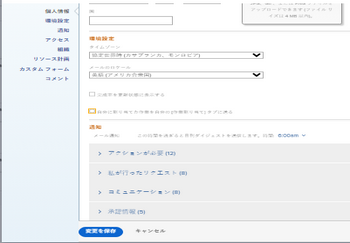

# タスクの完了率の表示と更新

タスクの完了率を更新して、タスクを完了するためのタスクの進捗状況を示すことができます。

## アクセス要件

<!--drafted for P&P:

<table style="table-layout:auto"> 
 <col> 
 <col> 
 <tbody> 
  <tr> 
   <td role="rowheader">Adobe Workfront plan*</td> 
   <td> 
Any
 </td> 
  </tr> 
  <tr> 
   <td role="rowheader">Adobe Workfront license*</td> 
   <td> 
Current license: Standard
 
   Or
   
Legacy license: Work or higher

   </td> 
  </tr> 
  <tr> 
   <td role="rowheader">Access level configurations*</td> 
   <td> 
Edit access to Tasks
 
<b>NOTE</b>
   
   If you still don't have access, ask your Workfront administrator if they set additional restrictions in your access level. For information on how a Workfront administrator can modify your access level, see <a href="../../../administration-and-setup/add-users/configure-and-grant-access/create-modify-access-levels.md" class="MCXref xref">Create or modify custom access levels</a>.
 </td> 
  </tr> 
  <tr> 
   <td role="rowheader">Object permissions</td> 
   <td> 
Manage permissions to the task
 
For information on requesting additional access, see <a href="../../../workfront-basics/grant-and-request-access-to-objects/request-access.md" class="MCXref xref">Request access to objects </a>.
 </td> 
  </tr> 
 </tbody> 
</table>
-->

タスクを手動で更新するには、次のアクセス権が必要です。

<table style="table-layout:auto"> 
 <col> 
 <col> 
 <tbody> 
  <tr> 
   <td role="rowheader">Adobe Workfront plan*</td> 
   <td> 
任意
 </td> 
  </tr> 
  <tr> 
   <td role="rowheader">Adobe Workfront license*</td> 
   <td> 
仕事以上
 </td> 
  </tr> 
  <tr> 
   <td role="rowheader">アクセスレベル設定*</td> 
   <td> 
タスクへのアクセスを編集
 
<b>メモ</b>

まだアクセス権がない場合は、Workfront管理者に、アクセスレベルに追加の制限を設定しているかどうかを問い合わせてください。 Workfront管理者がアクセスレベルを変更する方法について詳しくは、 <a href="../../../administration-and-setup/add-users/configure-and-grant-access/create-modify-access-levels.md" class="MCXref xref">カスタムアクセスレベルの作成または変更</a>.
 </td>
</tr> 
  <tr> 
   <td role="rowheader">オブジェクトの権限</td> 
   <td> 
タスクに対する権限の管理
 
追加のアクセス権のリクエストについて詳しくは、 <a href="../../../workfront-basics/grant-and-request-access-to-objects/request-access.md" class="MCXref xref">オブジェクトへのアクセスのリクエスト </a>.
 </td> 
  </tr> 
 </tbody> 
</table>

&#42;保有するプラン、ライセンスの種類、アクセス権を確認するには、Workfront管理者に問い合わせてください。

## タスクの完了率を更新できる領域

タスクの完了率は、次のいずれかの領域で更新できます。

* **タスクリスト内**:「完了の割合」列が表示されている場合に、タスクの完了率を更新できます。\
  インライン編集について詳しくは、 [Adobe Workfrontのリスト内の項目をインライン編集する](../../../workfront-basics/navigate-workfront/use-lists/inline-edit-objects.md).

* **マイルストーン表示で**：タスクの完了率は、プロジェクトリストまたはプロジェクトレポートでマイルストーンビューを使用する際に更新できます。 詳しくは、 [マイルストーンビューの使用](../../../reports-and-dashboards/reports/reporting-elements/use-milestone-view.md).

* **タスクを更新する際**：タスクに更新を追加する際に、タスクの「完了率」オプションを更新できます。

  >[!IMPORTANT]
  >
  >このオプションは、「完了率を表示」オプションを有効にした後にのみ表示されます。\
  >タスクの完了率更新バーを有効にするには、次の操作を行います。
  >
  >1. 次に移動： **メイン** メニュー > お名前 >**その他** アイコンが表示されます。**編集** > 選択 **更新ステータスの完了率を表示**.\
  >  >

* **タスクヘッダー内**：タスクヘッダーでタスクの完了率を更新できます。 詳しくは、 [タスクを編集](../../tasks/manage-tasks/edit-tasks.md).

  

## タスクの完了率を更新する際の考慮事項

* タスクを「100%完了」とマークすると、タスクの「ステータス」が「完了」に更新されます。
* 親タスクには、次のシナリオが存在します。
   * プロジェクトの [ サマリー完了モード ] が [ 自動 ] に設定され、サブタスクが完了していない場合は、親タスクの完了率を 100%に更新することはできません。
   * プロジェクトの [ サマリー完了モード ] が [ 手動 ] に設定され、サブタスクが完了または不完全になっている場合は、親タスクの完了率を 100%に更新できます。

  詳しくは、 [プロジェクトを編集](../manage-projects/edit-projects.md).

## タスクの完了率の更新

1. Workfrontの次のいずれかの領域に移動します。

   * タスクリスト
   * プロジェクトのリストとマイルストーンビューの適用
   * タスク（タスクページにアクセスする）
1. 次を見つけます。 **完了率** 達成率を更新するタスクのフィールド。
1. 「完了率」フィールド内をクリックし、0 ～ 100 の数値を入力します

   または

   をクリックし、 **完了率** 必要な数のバーに、完了したタスクの量を示します。

   >[!NOTE]
   >
   >タスクの 100%が完了したと示すと、タスクのステータスも「完了」に更新されます。

1. 完了率を保存するには、キーボードの Enter キーを押します。

