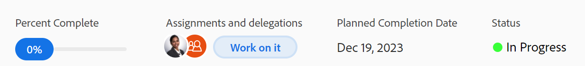

# タスクの完了率の表示と更新

<!--Audited: 05/2025-->

タスクの完了率を更新して、完了に向けたタスクの進捗状況を示すことができます。

問題の完了率を更新することは、タスクの完了率を更新することと似ています。 この記事では、タスクの完了率を更新する方法について説明します。

## アクセス要件

+++ 展開すると、この記事の機能のアクセス要件が表示されます。 

<table style="table-layout:auto"> 
 <col> 
 <col> 
 <tbody> 
  <tr> 
   <td role="rowheader">Adobe Workfront パッケージ</td> 
   <td> 
任意
 </td> 
  </tr> 
  <tr> 
   <td role="rowheader">Adobe Workfront プラン</td> 
   <td> 
標準
 
   
Work またはそれ以上

   </td> 
  </tr> 
  <tr> 
   <td role="rowheader">アクセスレベル設定</td> 
   <td> 
タスクへのアクセスを編集
 </td> 
  </tr> 
  <tr> 
   <td role="rowheader">オブジェクト権限</td> 
   <td> 
タスクに対する管理権限
  </td> 
  </tr> 
 </tbody> 
</table>

詳しくは、[Workfront ドキュメントのアクセス要件](/help/quicksilver/administration-and-setup/add-users/access-levels-and-object-permissions/access-level-requirements-in-documentation.md)を参照してください。

+++

<!--
Old:
<table style="table-layout:auto"> 
 <col> 
 <col> 
 <tbody> 
  <tr> 
   <td role="rowheader">Adobe Workfront plan</td> 
   <td> 
Any
 </td> 
  </tr> 
  <tr> 
   <td role="rowheader">Adobe Workfront license*</td> 
   <td> 
New license: Standard
 
   Or
   
Current license: Work or higher

   </td> 
  </tr> 
  <tr> 
   <td role="rowheader">Access level configurations</td> 
   <td> 
Edit access to Tasks
 </td> 
  </tr> 
  <tr> 
   <td role="rowheader">Object permissions</td> 
   <td> 
Manage permissions to the task
  </td> 
  </tr> 
 </tbody> 
</table>
-->

## タスクの完了率を更新できるエリア

タスクの完了率は、次のすべてのエリアで更新できます。

* **タスクリスト**:「完了率」列が表示されたときに、タスクの完了率を更新できます。

  インライン編集について詳しくは、[Adobe Workfront のリスト内の項目のインライン編集](../../../workfront-basics/navigate-workfront/use-lists/inline-edit-objects.md)を参照してください。

* **マイルストーンビュー**: プロジェクトリストまたはプロジェクトレポートでマイルストーンビューを使用する場合、タスクの完了率を更新できます。

  >[!TIP]
  >
  >  マイルストーンビューでは、問題の完了率を更新することはできません。

  詳しくは、[マイルストーンビューの使用](../../../reports-and-dashboards/reports/reporting-elements/use-milestone-view.md)を参照してください。

* **タスクヘッダー**: タスクヘッダーのタスクの完了率を更新できます。

  

* **タスクの概要パネル内**：次のエリアでタスクを表示する際に、概要パネルの上部でタスクの完了率を更新できます。

   * タスクリストまたはレポート
   * タイムシート
   * ワークロードバランサー

  

  詳しくは、[概要について](/help/quicksilver/workfront-basics/the-new-workfront-experience/summary-overview.md)を参照してください

* **ホーム**: タスクまたはイシューの完了率は、ホーム領域の概要パネルまたはマイワークウィジェットから更新できます。

  詳しくは、[&#x200B; ホームの使用を開始する](/help/quicksilver/workfront-basics/using-home/using-the-home-area/get-started-with-home.md)を参照してください。

## タスクの完了率を更新する際の考慮事項

* タスクを100%完了とマークすると、タスクのステータスが「完了」に更新されます。 イシューのステータスが「クローズ」に更新されます。
* タスクを完了すると、親とプロジェクトの完了率も更新されます。
* 親タスクとプロジェクトには、次のシナリオが存在します。
   * プロジェクトの「概要完了モード」が「自動」に設定され、サブタスクが完了していない場合、親タスクの完了率を 100％に更新できません。
   * プロジェクトの概要完了モードが「手動」に設定され、サブタスクが完了または未完了の場合、親タスクまたはプロジェクトの完了率を100%に更新できます。

  詳しくは、[プロジェクトの編集](../manage-projects/edit-projects.md)を参照してください。

## タスクの完了率を更新

1. タスクの完了率を更新する領域のいずれかに移動します。

   詳しくは、この記事の「[&#x200B; タスクの完了率を更新できる領域](#areas-where-you-can-update-the-percent-complete-of-a-task)」の節を参照してください。

1. 完了率を更新するタスクの「**完了率**」フィールドを見つけます。

   >[!TIP]
   >
   >「完了率」フィールドは、常に概要パネルの上部に表示されます。

1. 「**完了率**」フィールド内をクリックし、0 ～ 100の数値を入力します

   または

   「**完了率**」の青い吹き出しをクリックして、必要な数値にドラッグし、完了したタスクのうち、使用可能な場合にどれだけかを示します。

   >[!NOTE]
   >
   >    * 「完了率」バブル内をクリックすると、10進数を入力することはできません。
   >    * 概要パネルに青いバブルをドラッグ&amp;ドロップすると、完了率が1 ポイントずつ更新されます。
   >
   >    * タスクヘッダーに青いバブルをドラッグ&amp;ドロップすると、完了率が5 ポイント単位で更新されます。

1. キーボードのEnter キーを押して、完了率を保存します。

   プロジェクトまたは親タスクの「完了率」も自動的に更新される場合があります。

   タスクまたはイシューのステータスも更新されます。

