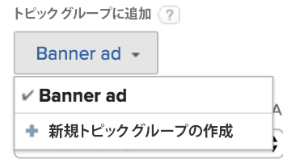
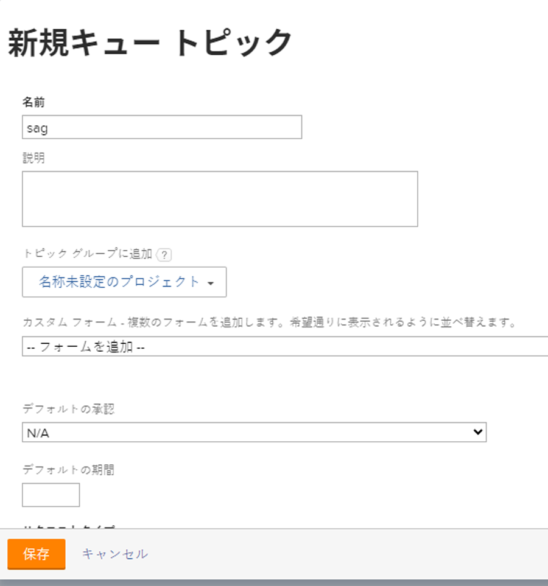

# キュートピックを作成

<!-- Audited: 12/2023 -->

キュートピックは、ルーティングルールと連携して、ユーザー、ジョブロール、チームに着信作業を自動的に割り当てたり、プロジェクトに配置したりします。 キュー・トピックでは、ルーティング・ルールを実装するために必要な条件を定義します。

トピックグループまたはプロジェクトに割り当てることができるキュートピックの数に制限はありません。 キュートピックは、レポート可能なオブジェクトタイプです。

## アクセス要件

<!--drafted - replace table with P&P:

<table style="table-layout:auto"> 
 <col> 
 <col> 
 <tbody> 
  <tr> 
   <td role="rowheader">Adobe Workfront plan*</td> 
   <td> 
Any 
 </td> 
  </tr> 
  <tr> 
   <td role="rowheader">Adobe Workfront license*</td> 
   <td> 
Current license: Standard 
 
   Or
   
Legacy license: Plan 
 </td> 
  </tr> 
  <tr> 
   <td role="rowheader">Access level configurations*</td> 
   <td> 
Edit access to Projects
 
Note: If you still don't have access, ask your Workfront administrator if they set additional restrictions in your access level. For information on how a Workfront administrator can modify your access level, see <a href="../../../administration-and-setup/add-users/configure-and-grant-access/create-modify-access-levels.md" class="MCXref xref">Create or modify custom access levels</a>.
 </td> 
  </tr> 
  <tr> 
   <td role="rowheader">Object permissions</td> 
   <td> 
 Manage permissions to the project
 
For information on requesting additional access, see <a href="../../../workfront-basics/grant-and-request-access-to-objects/request-access.md" class="MCXref xref">Request access to objects </a>.
 </td> 
  </tr> 
 </tbody> 
</table>
-->

この記事の手順を実行するには、次のアクセス権が必要です。

<table style="table-layout:auto"> 
 <col> 
 <col> 
 <tbody> 
  <tr> 
   <td role="rowheader">Adobe Workfrontプラン</td> 
   <td> 
任意 
 </td> 
  </tr> 
  <tr> 
   <td role="rowheader">Adobe Workfrontライセンス</td> 
   <td>
    
新規：標準

    
または

    
現在：プラン
</td>  
  </tr> 
  <tr> 
   <td role="rowheader">アクセスレベル設定</td> 
   <td> 
プロジェクトへのアクセスを編集
 </td> 
  </tr> 
  <tr> 
   <td role="rowheader">オブジェクトの権限</td> 
   <td> 
 プロジェクトに対する権限の管理
 </td> 
  </tr> 
 </tbody> 
</table>

この表の情報の詳細については、 [Workfrontドキュメントのアクセス要件](/help/quicksilver/administration-and-setup/add-users/access-levels-and-object-permissions/access-level-requirements-in-documentation.md).

## キュートピックの作成

1. ルーティングルール、トピックグループ、およびカスタムフォームを作成します（これらをキュートピックに関連付ける場合）。\
   ルーティングルール、トピックグループ、またはカスタムフォームの作成方法の詳細は、次の記事を参照してください。

   * [ルーティングルールの作成](../../../manage-work/requests/create-and-manage-request-queues/create-routing-rules.md)
   * [トピックグループの作成](../../../manage-work/requests/create-and-manage-request-queues/create-topic-groups.md)
   * [カスタムフォームの作成または編集](../../../administration-and-setup/customize-workfront/create-manage-custom-forms/create-or-edit-a-custom-form.md)

1. ヘルプリクエストキューとして有効にしたプロジェクトと、新しいキュートピックを作成する場所に移動します。\
   プロジェクトをヘルプリクエストキューとして指定する方法の詳細については、 [リクエストキューの作成](../../../manage-work/requests/create-and-manage-request-queues/create-request-queue.md).

   関連するキュートピックは、トピックグループの下に整理できます。 これにより、リクエストを行う際に、リクエスト元に一連のドロップダウンメニューが表示されます。

   または

   キュートピックは、ヘルプリクエストキューとして指定されたプロジェクトの下に、トピックグループを指定せずに直接ネストできます。

   トピックグループの作成について詳しくは、 [トピックグループの作成](../../../manage-work/requests/create-and-manage-request-queues/create-topic-groups.md).

1. クリック **トピックをキュー** をクリックします。 クリックが必要になる場合があります。 **表示を増やす**&#x200B;を、 **トピックをキュー**.
1. クリック **新しいキュートピック**.
1. 次の日： **新しいキュートピック** フォームで、次の情報を入力します。

   <table style="table-layout:auto"> 
    <col> 
    <col> 
    <tbody> 
     <tr> 
      <td role="rowheader"><strong>名前</strong> </td> 
      <td> キュートピックの名前。</td> 
     </tr> 
     <tr> 
      <td role="rowheader"><strong>説明</strong> </td> 
      <td>リクエストキューの説明を入力します。 説明は、新しいリクエストを送信する際に、ユーザーがキュートピックを選択する際に表示されます。 </td> 
     </tr> 
     <tr> 
      <td role="rowheader"><strong>トピックグループに追加</strong> </td> 
      <td> プロジェクトにトピックグループがない場合、プロジェクトの名前は既定でトピックグループになります。 ここから追加のトピックグループを作成する場合は、 <strong>新しいトピックグループを作成</strong> を選択します。 </td> 
     </tr> 
     <tr> 
      <td role="rowheader"><strong>カスタムフォーム</strong> </td> 
      <td>キューのトピックに関連付けるカスタムフォームを選択します。 問題をキューのトピックに関連付ける前に、問題のカスタムフォームを作成する必要があります。 カスタムフォームの作成について詳しくは、 <a href="../../../administration-and-setup/customize-workfront/create-manage-custom-forms/create-or-edit-a-custom-form.md" class="MCXref xref">カスタムフォームの作成または編集</a>.</td> 
     </tr> 
     <tr> 
      <td role="rowheader"><strong>デフォルトの承認</strong></td> 
      <td> 
このキュートピックに承認プロセスを関連付けます。 このドロップダウンメニューには、問題の承認プロセスのみが表示されます。 このキューに送信されたすべての問題は、この承認プロセスに関連付けられます。 Adobe Workfront管理者は、キュートピックに関連付ける前に、システムレベルの承認プロセスを定義する必要があります。 承認プロセスへの管理者アクセス権を持つユーザーは、グループ固有の承認プロセスを作成することもできます。 承認プロセスの作成について詳しくは、 <a href="../../../administration-and-setup/customize-workfront/configure-approval-milestone-processes/create-approval-processes.md" class="MCXref xref">作業項目の承認プロセスの作成</a>. 
 
       
 
        
重要：プロジェクトのグループが変更されると、既存の問題に関連付けられたグループ固有の承認プロセスが、単一で使用できる承認プロセスになります。 プロジェクトのグループに対する変更や承認プロセスの変更が承認設定に及ぼす影響について詳しくは、 <a href="../../../administration-and-setup/customize-workfront/configure-approval-milestone-processes/how-changes-affect-group-approvals.md" class="MCXref xref">グループと承認プロセスの変更が、割り当てられた承認プロセスに及ぼす影響</a>.
 
        
キューのトピックに承認プロセスを追加する際は、次の点を考慮してください。 
 
        <ul style="list-style-type: circle;"> 
         <li>アクティブな承認プロセスのみがリストに表示されます。 </li> 
         <li> 
システム全体およびグループ固有の承認プロセスがリストに表示されます。 プロジェクトの承認プロセス以外のグループに関連付けられている承認プロセスは、リストに表示されません。
 </li> 
        </ul> 
       
 </td> 
     </tr> 
     <tr> 
      <td role="rowheader"><strong>デフォルトの期間</strong> </td> 
      <td>これはリクエストのデフォルトの期間で、リクエストの計画完了日はこの値に基づいて計算されます。</td> 
     </tr> 
     <tr> 
      <td role="rowheader"><strong>デフォルトのルート</strong> </td> 
      <td>キュー・トピックに関連付けるルーティング・ルールを指定します。 ルーティングルールをキュートピックに添付する前に、ルーティングルールを作成する必要があります。 詳しくは、 <a href="../../../manage-work/requests/create-and-manage-request-queues/create-routing-rules.md">ルーティングルールの作成</a>. </td> 
     </tr> 
     <tr> 
      <td role="rowheader"><strong>リクエストタイプ</strong> </td> 
      <td> 
このキュートピックに保存するリクエストの種類を選択します。 表示されるオプションは、 <strong>キューの詳細</strong> 」タブをクリックします。 必須フィールドです。 

   
<b>注意</b>:

   「キューの詳細」ページと「キューのトピック」ページの両方で「リクエストタイプ」が選択されている場合にのみ、タイプが「リクエスト」領域に選択として表示されます。 プロジェクトの Queue Details 領域の設定については、 <a href="../../../manage-work/requests/create-and-manage-request-queues/create-request-queue.md" class="MCXref xref">リクエストキューの作成</a>. 
 
次のタイプから選択します。

   <ul>
   <li>バグレポート</li>
   <li>変更依頼</li>
   <li>問題</li>
   <li>リクエスト</li>
   </ul> 
Workfront管理者が、これらのオプションの一部の名前を変更している可能性があります。 
 </td>
   </tr> 
    </tbody> 
   </table>

   

1. 「**保存**」をクリックします。\
   Queue Topic が使用できるようになり、Request Queue と Topic Group を選択した後、Workfrontの Requests 領域に表示されます。
