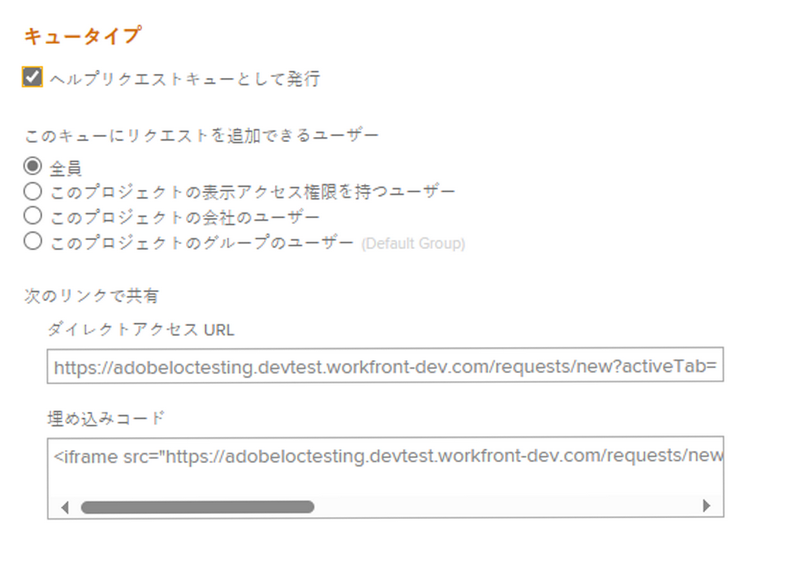
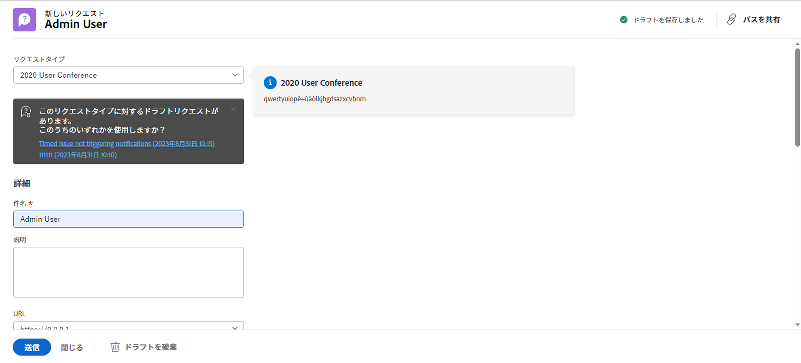
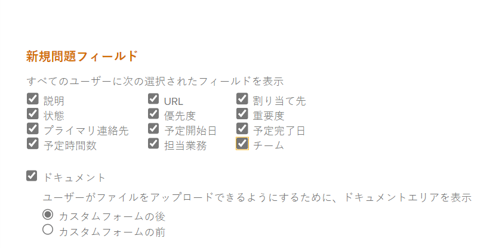
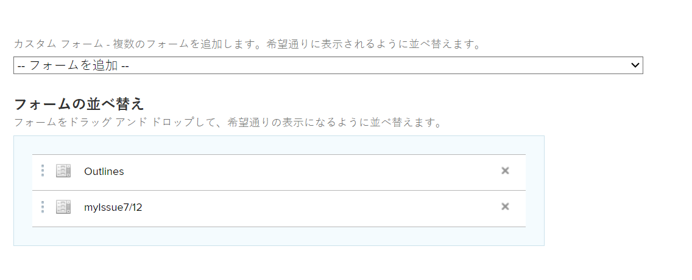

# リクエストキューの作成

<!--
<THIS IS CONNECTED TO THE PRODUCT IN BLUEPRINTS. DO NOT MOVE/ CHANGE URL>
-->

リクエストキューを設定して、プロジェクトで予定されていないリクエストを、ユーザーが頻繁に入力することができます。 例えば、ヘルプデスクのリクエストキューを設定して、IT 部門に対するすべてのユーザーリクエストをキャプチャできます。

## アクセス要件

<!--drafted for P&P: replace the table below with this:

<table style="table-layout:auto"> 
 <col> 
 <col> 
 <tbody> 
  <tr> 
   <td role="rowheader">Adobe Workfront plan*</td> 
   <td> 
Any 
 </td> 
  </tr> 
  <tr> 
   <td role="rowheader">Adobe Workfront license*</td> 
   <td> 
   
Current license: Stadard 

   Or
   
Legacy license: Plan 
 </td> 
  </tr> 
  <tr> 
   <td role="rowheader">Access level configurations*</td> 
   <td> 
Edit access to Projects
 
<b>NOTE</b> 
   
   If you still don't have access, ask your Workfront administrator if they set additional restrictions in your access level. For information on how a Workfront administrator can modify your access level, see <a href="../../../administration-and-setup/add-users/configure-and-grant-access/create-modify-access-levels.md" class="MCXref xref">Create or modify custom access levels</a>.
 </td> 
  </tr> 
  <tr> 
   <td role="rowheader">Object permissions</td> 
   <td> 
 Manage permissions to the project
 
For information on requesting additional access, see <a href="../../../workfront-basics/grant-and-request-access-to-objects/request-access.md" class="MCXref xref">Request access to objects </a>.
 </td> 
  </tr> 
 </tbody> 
</table>

&#42;To find out what plan, license type, or access you have, contact your Workfront administrator
-->

この記事の手順を実行するには、次のアクセス権が必要です。

<table style="table-layout:auto"> 
 <col> 
 <col> 
 <tbody> 
  <tr> 
   <td role="rowheader">Adobe Workfront plan*</td> 
   <td> 
任意 
 </td> 
  </tr> 
  <tr> 
   <td role="rowheader">Adobe Workfront license*</td> 
   <td> 
計画 
 </td> 
  </tr> 
  <tr> 
   <td role="rowheader">アクセスレベル設定*</td> 
   <td> 
プロジェクトへのアクセスを編集
 
注意：まだアクセス権がない場合は、Workfront管理者に、アクセスレベルに追加の制限を設定しているかどうかを問い合わせてください。 Workfront管理者がアクセスレベルを変更する方法について詳しくは、 <a href="../../../administration-and-setup/add-users/configure-and-grant-access/create-modify-access-levels.md" class="MCXref xref">カスタムアクセスレベルの作成または変更</a>.
 </td> 
  </tr> 
  <tr> 
   <td role="rowheader">オブジェクト権限</td> 
   <td> 
 プロジェクトに対する権限の管理
 
追加のアクセス権のリクエストについて詳しくは、 <a href="../../../workfront-basics/grant-and-request-access-to-objects/request-access.md" class="MCXref xref">オブジェクトへのアクセスのリクエスト </a>.
 </td> 
  </tr> 
 </tbody> 
</table>

&#42;保有するプラン、ライセンスの種類、アクセス権を確認するには、Workfront管理者に問い合わせてください

## リクエストキュー：概要

リクエストキューをプロジェクトとして設定します。 プロジェクトをリクエストキューとして指定すると、Adobe Workfrontの「リクエスト」領域からキューにアクセスできるようになります。 要求キューをカスタマイズすると、ユーザーが要求を送信する際に入力するフォームもカスタマイズします。

この記事では、既存のプロジェクトからリクエストキューを作成する方法について説明します。 ただし、要求取り込みプロセスの一貫性を確保したり、レポート作成や管理の向上のために複数のレイヤーを追加したりする場合は、次の表で説明する要求キューの追加の構築ブロックを設定することもできます。

<table style="table-layout:auto"> 
 <col> 
 <col> 
 <tbody> 
  <tr> 
   <td role="rowheader">キューの詳細</td> 
   <td> 
「キューの詳細」領域で、プロジェクトをリクエストキューとして設定する必要があります。 この手順は必須です。 
 
詳しくは、 <a href="#create-a-request-queue" class="MCXref xref">リクエストキューの作成</a> 」の節を参照してください。
 </td> 
  </tr> 
  <tr> 
   <td role="rowheader">トピック グループ</td> 
   <td> 
これらは、共通の機能に基づいてリクエストを分類する追加のメニューです。 例えば、IT リクエストキューの場合、「オンサイト」と「リモート」のトピックグループが必要な場合があります。 
 
詳しくは、 <a href="../../../manage-work/requests/create-and-manage-request-queues/create-topic-groups.md" class="MCXref xref">トピックグループの作成</a>. 
 
これはオプションです。
 </td> 
  </tr> 
  <tr> 
   <td role="rowheader">キュー トピック</td> 
   <td> 
共通の機能に基づいて、同じトピックグループに属するリクエストを分類する追加のメニューです。 1 つのトピックグループに複数のキュートピックを含めることができます。 
 
例えば、IT リクエストキューの「オンサイト」トピックグループには、「ハードウェア」、「ソフトウェア」、「ネットワーク」の各キュートピックが含まれる場合があります。 
 
詳しくは、 <a href="../../../manage-work/requests/create-and-manage-request-queues/create-queue-topics.md" class="MCXref xref">キュートピックを作成</a>. 
 
これはオプションです。
 </td> 
  </tr> 
  <tr> 
   <td role="rowheader">ルーティング規則</td> 
   <td> 
各リクエストをユーザー、ジョブの役割、チーム、またはプロジェクトにルーティングできます。 
 
詳しくは、 <a href="../../../manage-work/requests/create-and-manage-request-queues/create-routing-rules.md" class="MCXref xref">ルーティングルールの作成</a>. 
 
これはオプションです。
 </td> 
  </tr> 
 </tbody> 
</table>

## リクエストキューの作成

プロジェクトをリクエストキューとして設定する場合、Workfrontの「リクエスト」領域に表示するには、プロジェクトのステータスが「現在」になっている必要があります。

要求キューを作成する手順は、次のとおりです。

1. リクエストキューとして設定するプロジェクトに移動します。
1. （オプション）「 **プロジェクトの詳細** をクリックし、 **説明** を **概要** 領域 この情報は、すべての新しいリクエストに表示されます。
1. クリック **キューの詳細** をクリックします。 クリックが必要になる場合があります **さらに表示**&#x200B;を、 **キューの詳細**.

   「キューの詳細」セクションが開きます。

   

1. 次の情報を指定します。

   * **ヘルプリクエストキューとして公開：** このプロジェクトを要求キューとして識別するには、このオプションを選択します。 受信する問題はすべて、リクエストと見なされます。\
     このオプションを選択しない場合、プロジェクトはWorkfrontの標準プロジェクトのように動作し、すべての問題が発生します。

   * **このキューにリクエストを追加できるユーザー：** このキューに要求を追加するためのアクセス権を持つユーザーを選択します。 次の担当者グループに対し、グローバルナビゲーションバーのリクエスト領域にリクエストキューを表示することを許可できます。

     | リクエストを入力できるユーザー | 説明 |
     |---|---|
     | 全員 | アクティブなアカウントを持つWorkfrontユーザーは、このリクエストキューを表示してリクエストを追加できます |
     | このプロジェクトの表示アクセス権限を持つユーザー | プロジェクトに対する表示権限を持つユーザーは、このキューにリクエストを表示して追加できます |
     | このプロジェクトの会社のユーザー | このプロジェクトに関連付けられた会社に属するユーザーは、このキューにリクエストを表示して追加できます。 プロジェクトに関連する会社がある場合、会社の名前はこの設定の後の括弧内に表示されます。 |
     | このプロジェクトのグループのユーザー | このプロジェクトに関連付けられたグループに属するユーザーは、このキューにリクエストを表示して追加できます。 プロジェクトに関連付けられたグループがある場合は、この設定の後の括弧内にグループ名が表示されます。 |

     {style="table-layout:auto"}

   * **以下のリンクと共有：** 次のオプションを使用すると、リクエストキューとそれに関連付けられたフォームへの直接アクセスを、Workfront以外のユーザーや、外部ページを使用するWorkfrontユーザーに提供できます。 ダッシュボードへのリクエストキューの外部ページとしての埋め込みについて詳しくは、 [リクエストキューをダッシュボードに埋め込む](../../../reports-and-dashboards/dashboards/creating-and-managing-dashboards/embed-request-queue-dashboard.md).

     直接アクセス権を取得するには、ユーザーがリクエストキューへのアクセス権を既に持っている必要があります。 ここで説明したどちらのオプションを使用しても、ユーザーに対するアクセス権は自動的には付与されません。

     >[!TIP]
     >
     >ユーザーは、別のアプリケーションからリクエストキューページにアクセスする際に、まずWorkfrontにログインして、リクエストキューにアクセスする必要があります。

      * **直接アクセス URL :** ユーザーがブラウザーからこの URL にアクセスすると、ユーザーは「リクエスト」領域の「新しいリクエスト」セクションに直接移動し、デフォルトではこのリクエストが選択されます。

        

        >[!NOTE]
        >
        >リクエストキューは、ダッシュボードに外部ページとして表示できます。 この場合、リクエストキューは事前に選択されていますが、「リクエストタイプ」フィールドから他の任意のリクエストキューを選択できます。 ユーザーはリクエストタイプを変更できます。 また、リクエストのナビゲーションコンポーネントも表示されます。

      * **埋め込みコード：** このHTMLコードを使用して、リクエストキューフォームを iframe として任意のHTMLページに埋め込みます。\
        コードが埋め込まれているページを表示したときに、ユーザーがWorkfrontでまだ認証されていない場合は、Workfrontのログインダイアログボックスが表示されます。 ユーザーがログインすると、「リクエストキュー」フォームが表示されます。

        >[!NOTE]
        >
        iframe にリクエストキューを表示すると、リクエストフォームのみが表示され、リクエスト名は事前に選択され、淡色表示になります。 ユーザーはリクエストタイプを変更できません。 「リクエスト」領域のナビゲーションコンポーネントは表示されません。

        この埋め込みコードを使用する際にリクエストキューフォームを表示するには、システム設定で「iframe へのWorkfrontの埋め込みを許可」設定を有効にする必要があります。 iframe でのWorkfrontの埋め込みの有効化について詳しくは、 [システムセキュリティの環境設定の構成](../../../administration-and-setup/manage-workfront/security/configure-security-preferences.md). この設定が有効になっていない場合、iframe は空白として表示されます。

        埋め込みフォームの表示方法に関する様々な要素を、次のように調整できます。

        <table border="1" cellspacing="15"> 
         <col> 
         <col> 
         <thead> 
          <tr> 
           <th> 
<strong>機能</strong> 
 </th> 
           <th> 
<strong>解決策</strong> 
 </th> 
          </tr> 
         </thead> 
         <tbody> 
          <tr> 
           <td> 
フレームのサイズを調整
 </td> 
           <td> 
「width」および「height」属性を変更します。
 
デフォルトでは、幅は「500」、高さは「600」です
 </td> 
          </tr> 
          <tr> 
           <td> 
特定のキュートピックまたはトピックグループにユーザーを誘導
 </td> 
           <td> 
src URL に「path」パラメーターを追加します。 パスパラメーターを見つけるには、埋め込まれていないフォームで目的のキュートピックまたはトピックグループに移動し、URL を調べます。
 </td> 
          </tr> 
          <tr> 
           <td> 
事前設定済みのトピックグループドロップダウンリストを表示してユーザーに変更を許可
 </td> 
           <td> 
次を追加して、「path」パラメーターを使用します。 <code>showPreSelectedOptions=true</code> パラメーターを <code>src URL</code>.
 </td> 
          </tr> 
          <tr> 
           <td> 
フォームが送信されたタイミングを検出する
 </td> 
           <td> 
Web ページのウィンドウに「message」イベントリスナーを追加し、 <code>event.data.type</code> が <code>requestSubmitted</code>. <code>event.data.newIssueID</code> が作成されたイシューの ID に設定されます。
 </td> 
          </tr> 
         </tbody> 
        </table>

   * **リクエストタイプ：** 以下のデフォルトのオプションから「 」を選択します。

     Workfrontの管理者は、デフォルトのリクエストタイプの名前を変更できます。 リクエストタイプの名前の変更について詳しくは、 [デフォルトの問題タイプをカスタマイズ](../../../administration-and-setup/set-up-workfront/configure-system-defaults/customize-default-issue-types.md).

      * バグレポート
      * 変更依頼
      * 問題
      * リクエスト

        これは必須フィールドです。少なくとも 1 つのオプションを選択する必要があります。

     >[!NOTE]
     >
     「要求タイプ」は、「キューの詳細」ページと「キューのトピック」ページの両方で「要求タイプ」が選択されている場合にのみ、「要求」領域に選択として表示されます。 プロジェクトの Queue Details 領域の設定については、 [キュートピックを作成](../../../manage-work/requests/create-and-manage-request-queues/create-queue-topics.md).

     ここで選択した各タイプは、フォームで使用できます（複数選択できます）。 複数のタイプを選択すると、複数のリクエストを整理するのに役立ちます。\
     例えば、IT プロジェクトのリクエストキューでフォームを使用している場合、次のリクエストタイプをキューに追加できます。ハードウェア、ソフトウェア、バグ修正、問題。

   * **デフォルトの期間：** デフォルトの期間は、通常、問題の完了に要する時間です。 これは、すべての受信イシューのデフォルトになり、手動で変更できます。 通常、期間は時間、日、週で設定されます。 問題のデフォルトの期間は、問題の予定時間と同じです。 問題の「計画完了日」は、このフィールドに基づいて計算されます。\
     問題の「期間」のデフォルトは 1 日または 8 時間です。 Workfront管理者が「 Typical Hours per Work Day 」を 8 時間未満に設定した場合、問題のデフォルト期間は 8 時間になります。 例えば、「 Typical Hours per Work Day 」が 7 時間に設定されている場合、問題のデフォルトの期間は 1.14 日または 8 時間になります。 システムの通常の稼働日あたりの時間数の設定方法の詳細については、この記事の「タイムラインの計算」の節を参照してください [システム全体のプロジェクト環境設定の指定](../../../administration-and-setup/set-up-workfront/configure-system-defaults/set-project-preferences.md).

   * **同じ会社のユーザーは、すべてのリクエストに対して同じ権限を継承します。:** 選択すると、キューに送信されたすべてのリクエストが、同じ会社のユーザーに対して表示されます。 これらのリクエストは、リクエスト領域内の「すべてのリクエスト」セクションに表示されます。 この設定を有効または無効にすると、今後のすべてのリクエストに影響を与えます。情報に遡って影響を与えることはありません。
   * **誰かがリクエストをしたら、自動的に次の情報を付与します。** ユーザーがリクエストキューにリクエストを行うと、そのリクエストに対して選択した権限のレベルが自動的に付与されます。 次の権限レベルから選択します。

      * **ビュー**
      * **参加**. これはデフォルトの選択です。
      * **管理**

     Workfront権限モデルについて詳しくは、 [オブジェクトに対する共有権限の概要](../../../workfront-basics/grant-and-request-access-to-objects/sharing-permissions-on-objects-overview.md).\
     ここで権限を設定すると、受信するリクエストごとに権限を付与する必要がなく、時間を節約できます。 このオプションを選択した場合、今後のすべてのリクエストに影響が及びますが、既存のリクエストに遡って影響が及ぶことはありません。

   * **デフォルトの承認**:このリクエストキューに承認プロセスを関連付けます。 このドロップダウンメニューには、問題の承認プロセスのみが表示されます。 このキューに送信されたすべての問題は、この承認プロセスに関連付けられます。 Workfront管理者は、リクエストキューに関連付ける前に、システムレベルの承認プロセスを定義する必要があります。 承認プロセスへの管理者アクセス権を持つユーザーは、グループ固有の承認プロセスを作成することもできます。

     >[!IMPORTANT]
     >
     プロジェクトのグループが変更されると、既存の問題に関連付けられたグループ固有の承認プロセスが、単一使用の承認プロセスになります。 プロジェクトのグループに対する変更や承認プロセスの変更が承認設定に及ぼす影響について詳しくは、 [グループと承認プロセスの変更が、割り当てられた承認プロセスに及ぼす影響](../../../administration-and-setup/customize-workfront/configure-approval-milestone-processes/how-changes-affect-group-approvals.md).

     1 つのリクエストキューに複数のキュートピックが関連付けられている場合は、代わりに、承認プロセスをキュートピックに関連付けることをお勧めします。 キュートピックの作成について詳しくは、 [キュートピックを作成](../../../manage-work/requests/create-and-manage-request-queues/create-queue-topics.md).

     リクエストキューに承認プロセスを追加する際は、次の点を考慮してください。

      * アクティブな承認プロセスのみがリストに表示されます。
      * システム全体およびグループ固有の承認プロセスがリストに表示されます。 プロジェクトの承認プロセス以外のグループに関連付けられている承認プロセスは、リストに表示されません。

   * **デフォルトルート**:このリクエストキューにルーティングルールを関連付けます。 ルーティング・ルールを使用して、リクエスト・キューに提出された新しい問題を適切なリソース（ユーザー、ジョブ・ロールまたはチーム）と正しいプロジェクトに自動的に割り当てます。 このキューに送信されたすべての問題は、このルーティングルールに関連付けられます。 ルーティング・ルールを要求キューに関連付ける前に、ルーティング・ルールを構成する必要があります。\
     複数のキュートピックがリクエストキューに関連付けられている場合は、代わりに、ルーティングルールをキュートピックに関連付けることをお勧めします。 ルーティングルールの作成の詳細については、 [ルーティングルールの作成](../../../manage-work/requests/create-and-manage-request-queues/create-routing-rules.md).

   * **新しい問題フィールド：** [ 次の選択したフィールドをすべてのユーザーに表示する ] セクションで、プロジェクトに要求を送信したすべてのユーザーに表示したり、プロジェクトまたはタスクに問題を追加したりするフィールドを選択します。

     >[!TIP]
     >
     「Queue Details」セクションで選択した新しい Issue フィールドは、プロジェクトまたは「Issues」セクションのタスクに追加された新しい Issue にも関連付けられます。

     [ 割り当て先 ]、[ ジョブの役割 ]、または [ チーム ] フィールドを有効にすると、リクエストフォームでは常に [ 割り当て ] に名前が変更されますが、ここで選択できる割り当ての種類は、ここでのみ指定できます。

     >[!NOTE]
     >
     「キューの詳細」領域で「割り当て先」を選択した場合は、リクエスト・フォームの「割当」フィールドにユーザーのみを入力できます。 この場合、ジョブの役割やチームを入力することはできません。

   * **ドキュメント**:新しいリクエストフォームで「ドキュメント」セクションを表示する場合は、ドキュメントアップロードセクションの配置先を選択します。 次の中から選択します。

     <table style="table-layout:auto"> 
      <col> 
      <col> 
      <tbody> 
       <tr> 
        <td role="rowheader">カスタムフォームの後</td> 
        <td>「ドキュメント」セクションは、リクエストフォームの下部に表示されます。 </td> 
       </tr> 
       <tr> 
        <td role="rowheader">カスタムフォームの前</td> 
        <td> 
「ドキュメント」セクションは、Workfrontフィールドとリクエストフォームのカスタムフィールドの間に表示されます。 
 </td> 
       </tr> 
      </tbody> 
     </table>

     

   * **次の対象となる、選択されたフィールドと選択されていないフィールドをすべて表示：** フォームのすべてのフィールドを表示するユーザーを選択します。 次のオプションは、フォーム上のフィールドへのアクセスを制御します。

     | リクエストフォーム上のすべてのフィールドを表示できるユーザー | 説明 |
     |---|---| 
     | 全ユーザ（プランライセンス） | プランライセンスを持つすべてのユーザーには、選択されたフィールドと未選択のフィールドが表示されます。 |
     | このプロジェクトで表示アクセス権限を持つユーザー (プラン ライセンス) | このプロジェクトに対する表示権限も持つプランライセンスを持つユーザーは、選択されたフィールドと選択されていないフィールドを表示できます。 このプロジェクトにリクエストを送信できる残りのユーザーは、選択したフィールドのみを表示できます。 |
     | ユーザーなし | 未選択のフィールドを表示できるユーザーはいません。 このプロジェクトにリクエストを送信できるすべてのユーザーは、選択したフィールドのみを表示できます。 |

   * **カスタムForms**:リクエストキューに関連付けるカスタムフォームを選択します。 このドロップダウンメニューから選択できるのは、問題のカスタムFormsのみです。 リクエストキューに送信されたすべての問題には、選択したフォームが関連付けられます。\
     複数のキュートピックを 1 つのリクエストキューに関連付ける場合は、代わりにカスタムフォームをキュートピックに関連付けることをお勧めします。 リクエストキュー用のサブセクションの作成について詳しくは、 [キュートピックを作成](../../../manage-work/requests/create-and-manage-request-queues/create-queue-topics.md).

     

     リクエストキューに複数のカスタムフォームが関連付けられている場合は、フォームをドラッグ&amp;ドロップして、 **Formsの並べ替え** 」セクションに入力します。

     >[!TIP]
     >
     「キューの詳細」セクションに追加されたカスタムフォームは、プロジェクトまたは「問題」セクションのタスクに追加された新しい問題にも関連付けられます。

1. 引き続き、 **メールキュー設定** 領域（ユーザーがリクエストキュープロジェクトに電子メールでリクエストを送信できるようにする）

   詳しくは、 [ユーザーが問題をリクエストキュープロジェクトに電子メールで送信できるようにします](../../../manage-work/requests/create-requests/enable-email-issues-into-projects.md).

1. 「**保存**」をクリックします。\
   これで、プロジェクトがリクエストキューに設定され、ユーザーがリクエストを追加できるようになりました。

1. （オプション）リクエストキュー機能を強化するには、キュー用の追加のサブセクションと、受信リクエストを正しいチーム、担当者またはプロジェクトにルーティングするルールを作成します。

   * リクエストキュー用のサブセクションの作成について詳しくは、 [キュートピックを作成](../../../manage-work/requests/create-and-manage-request-queues/create-queue-topics.md) および [トピックグループの作成](../../../manage-work/requests/create-and-manage-request-queues/create-topic-groups.md).
   * 適切な担当者、チーム、および適切なプロジェクトにリクエストをルーティングする方法については、 [ルーティングルールの作成](../../../manage-work/requests/create-and-manage-request-queues/create-routing-rules.md).
