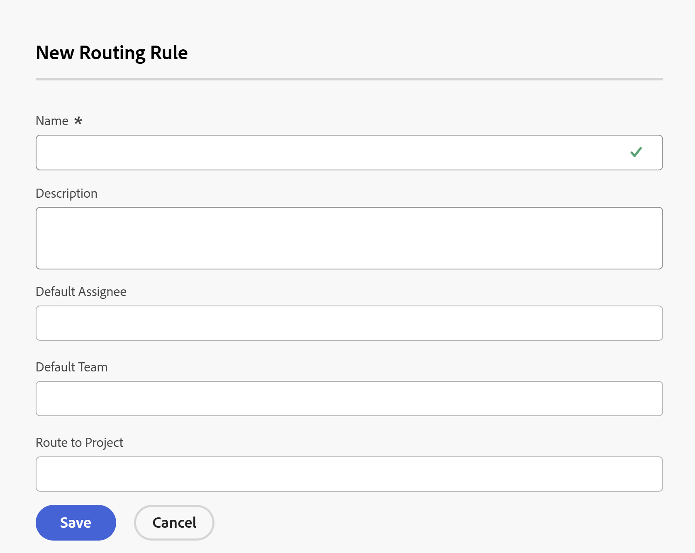

# ルーティングルールの作成

<!-- Audited: 12/2023 -->

ルーティングルールは、イシューがリクエストキューに送信される際に、Adobe Workfront がイシューに対して行う処理を制御します。リクエストキューの作成について詳しくは、[リクエストキューの作成](../../../manage-work/requests/create-and-manage-request-queues/create-request-queue.md)を参照してください。

ルーティングルールは、送信されたイシューまたはリクエストを解決するのに最適な特定のユーザーまたは担当業務にイシューを送信します。ルーティングルールは通常、キュートピックに関連付けられており、イシューまたはリクエストにどのルーティングルールを適用するかを制御するために使用されます。

## アクセス要件

+++ 展開すると、この記事の機能のアクセス要件が表示されます。

<!--drafted - replace the table at P&P:

<table style="table-layout:auto"> 
 <col> 
 <col> 
 <tbody> 
  <tr> 
   <td role="rowheader">Adobe Workfront plan*</td> 
   <td> 
Any 
 </td> 
  </tr> 
  <tr> 
   <td role="rowheader">Adobe Workfront license*</td> 
   <td> 
Current license: Standard 
 
   Or
   
Legacy license: Plan 
 </td> 
  </tr> 
  <tr> 
   <td role="rowheader">Access level configurations*</td> 
   <td> 
Edit access to Projects
 
<b>NOTE</b>
   
   If you still don't have access, ask your Workfront administrator if they set additional restrictions in your access level. For information on how a Workfront administrator can modify your access level, see <a href="../../../administration-and-setup/add-users/configure-and-grant-access/create-modify-access-levels.md" class="MCXref xref">Create or modify custom access levels</a>.
 </td> 
  </tr> 
  <tr> 
   <td role="rowheader">Object permissions</td> 
   <td> 
 Manage permissions to the project
 
For information on requesting additional access, see <a href="../../../workfront-basics/grant-and-request-access-to-objects/request-access.md" class="MCXref xref">Request access to objects </a>.
 </td> 
  </tr> 
 </tbody> 
</table>
-->

この記事の手順を実行するには、次のアクセス権が必要です。

<table style="table-layout:auto"> 
 <col> 
 <col> 
 <tbody> 
  <tr> 
   <td role="rowheader">Adobe Workfront プラン</td> 
   <td> 
任意 
 </td> 
  </tr> 
  <tr> 
   <td role="rowheader">Adobe Workfront プラン</td> 
   <td>
    
新規：標準

    
または

    
現在：プラン
</td> 
  </tr> 
  <tr> 
   <td role="rowheader">アクセスレベル設定</td>
   <td> 
プロジェクトへのアクセスを編集
 </td> 
  </tr> 
  <tr> 
   <td role="rowheader">オブジェクト権限</td> 
   <td> 
 プロジェクトの管理権限
 </td>
  </tr> 
 </tbody> 
</table>

この表の情報について詳しくは、[Workfront ドキュメントのアクセス要件](/help/quicksilver/administration-and-setup/add-users/access-levels-and-object-permissions/access-level-requirements-in-documentation.md)を参照してください。

+++

## ルーティングルールを作成

1. リクエストのルーティングルールを追加するプロジェクトに移動します。
1. 左側のパネルで「**ルーティングルール**」をクリックします。場合によっては、「**さらに表示**」をクリックして、「**ルーティングルール**」をクリックする必要があります。
1. 「**新規ルーティングルール**」をクリックして、新しいルールを追加します。
1. ルーティングルールに次の情報を入力します。

   <table style="table-layout:auto"> 
    <col> 
    <col> 
    <thead> 
     </thead> 
    <tbody> 
     <tr> 
      <td role="rowheader"><strong>名前</strong> </td> 
      <td>ルーティングルールの名前。プロジェクトにこの情報を表示するアクセス権がある場合は、ルーティングルールを表示できます。</td> 
     </tr> 
     <tr> 
      <td role="rowheader"><strong>説明</strong> </td> 
      <td>ルーティングルールの説明を追加します。</td> 
     </tr> 
     <tr> 
      <td role="rowheader"><strong>既定の割り当て先*</strong> </td> 
      <td>新しいイシューを割り当てる必要があるアクティブなユーザーまたはアクティブな担当業務を追加します。このフィールドには、デフォルトの担当者を 1 人だけ指定できます。 </td> 
     </tr> 
     <tr> 
      <td role="rowheader"><strong>既定のチーム*</strong> </td> 
      <td>新しいイシューを割り当てる必要があるアクティブなチームを追加します。このフィールドでは、デフォルトのチームを 1 つだけ使用できます。

   
<b>メモ</b>

   イシューの送信後、イシューの割り当てを編集し、他のユーザー、役割またはチームを割り当てることができます。詳しくは、<a href="../../../manage-work/issues/manage-issues/assign-issues.md">イシューの割り当て</a>を参照してください。

   </td> 
     </tr> 
     <tr> 
      <td role="rowheader"><strong>プロジェクトまでのルート</strong> </td> 
      <td>これは、イシューが追加されるプロジェクトです。</td> 
     </tr> 
    </tbody> 
   </table>

   >[!NOTE]
   >
   >*ユーザー、担当業務またはチームがルーティングルールに関連付けられた後に非アクティブ化された場合、リクエストは引き続きユーザー、担当業務またはチームにルーティングされます。すべてのルーティングルールのインベントリを定期的に取得し、非アクティブ化された割り当てをアクティブな割り当てに置き換える必要があります。

   プロジェクトにイシューをルーティングすると、そのイシューに対する権限を持つユーザーは、そのプロジェクトに設定された権限を受け取ります。プロジェクトでの権限の設定について詳しくは、[Adobe Workfront でのプロジェクトの共有](../../../workfront-basics/grant-and-request-access-to-objects/share-a-project.md)を参照してください。

   

1. 「**保存**」をクリックします。

   このプロセスは、ルーティングルールのみを定義します。イシューがリクエストキューに送信されたときに確実にルーティングされるようにするには、**デフォルトのルート**&#x200B;の下にある「**キューの詳細**」タブでルーティングルールを選択する必要があります。

   リクエストキューへのデフォルトルートの追加について詳しくは、[リクエストキューの作成](../../../manage-work/requests/create-and-manage-request-queues/create-request-queue.md)を参照してください。

   複数のルーティングルールをリクエストキューに関連付ける場合は、複数のキューのトピックを作成し、それぞれのトピックを個別のルーティングルールに関連付ける必要があります。キューのトピックの作成について詳しくは、[キュートのピックの作成](../../../manage-work/requests/create-and-manage-request-queues/create-queue-topics.md)を参照してください。
