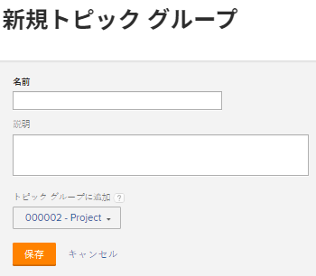

# トピックグループの作成

トピックグループはリクエストキューに関連付けられています。 リクエストの性質に応じて、リクエストキューを複数のカテゴリにレイヤー化できます。

## アクセス要件

以下が必要です。

<table style="table-layout:auto"> 
 <col> 
 <col> 
 <tbody> 
  <tr> 
   <td role="rowheader">Adobe Workfront plan*</td> 
   <td> 
任意 
 </td> 
  </tr> 
  <tr> 
   <td role="rowheader"> 
Adobe Workfront license*
 </td> 
   <td> 
計画 
 </td> 
  </tr> 
  <tr> 
   <td role="rowheader">アクセスレベル設定*</td> 
   <td> 
プロジェクトへのアクセスを編集
 
注意：まだアクセス権がない場合は、Workfront管理者に、アクセスレベルに追加の制限を設定しているかどうかを問い合わせてください。 Workfront管理者がアクセスレベルを変更する方法について詳しくは、 <a href="../../../administration-and-setup/add-users/configure-and-grant-access/create-modify-access-levels.md" class="MCXref xref">カスタムアクセスレベルの作成または変更</a>.
 </td> 
  </tr> 
  <tr> 
   <td role="rowheader">オブジェクト権限</td> 
   <td> 
 プロジェクトに対する権限の管理
 
追加のアクセス権のリクエストについて詳しくは、 <a href="../../../workfront-basics/grant-and-request-access-to-objects/request-access.md" class="MCXref xref">オブジェクトへのアクセスのリクエスト </a>.
 </td> 
  </tr> 
 </tbody> 
</table>

&#42;保有するプラン、ライセンスの種類、アクセス権を確認するには、Workfront管理者に問い合わせてください

## トピックグループの概要

例えば、マーケティングリクエストのリクエストキューがある場合、「Mother&#39;s Day Campaign」のトピックグループを作成し、第 2 レベルのトピックグループを「Digital Media」のトピックグループを追加し、「Print Media」のトピックグループを追加できます。 次に、各トピックグループ内に複数のキュートピックを持つことができます。 例えば、「Banner Ad」と「Blog」は、「Digital Media」トピックグループの「Queue Topics」になります。

リクエストキューの作成方法について詳しくは、 [リクエストキューの作成](../../../manage-work/requests/create-and-manage-request-queues/create-request-queue.md).

>[!TIP]
>
>* 1 つのリクエストキュー内に、最大 10 層のトピックグループを作成できます。
>* トピックグループに関連付けることができるキュートピックの数に制限はありません。
>* トピックグループはレポート可能なオブジェクトです。
>

## トピックグループの作成

トピックグループは、キュートピックを作成する前に作成することをお勧めします。 ただし、トピックグループはキュートピックビルダー内で作成できます。 キュートピックの作成の詳細については、 [キュートピックを作成](../../../manage-work/requests/create-and-manage-request-queues/create-queue-topics.md).

トピック・グループを作成する手順は、次のとおりです。

1. ヘルプリクエストキューとして公開したプロジェクトに移動します。\
   プロジェクトをヘルプリクエストキューとして公開する方法について詳しくは、 [リクエストキューの作成](../../../manage-work/requests/create-and-manage-request-queues/create-request-queue.md).

1. クリック **トピックグループ** をクリックします。 クリックが必要になる場合があります **さらに表示**&#x200B;を、 **トピックグループ**.
1. クリック **新しいトピックグループ**.

   

1. 次の情報を指定します。

   * **名前**:この名前は、このリクエストキューにリクエストを送信するユーザーに表示されます。
   * **説明**:説明は、新しいリクエストを送信する際に、ユーザーがトピックグループを選択すると表示されます。
   * **トピックグループに追加**:新しいトピックグループを既存のトピックグループに追加するか、ヘルプリクエストキューとして公開されたプロジェクトに直接追加できます。

1. 「**保存**」をクリックします。\
   これにより、リクエストキューに新しいトピックグループが作成されます。 リクエストキューの下にある最初のドロップダウンメニューから、追加のカテゴリを選択できるようになりました。\
   リクエストの送信について詳しくは、 [Adobe Workfront要求の作成と送信](../../../manage-work/requests/create-requests/create-submit-requests.md).
