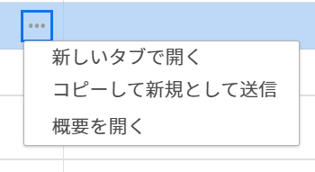

# リクエストのコピーと送信

同様のリクエストを頻繁に送信する場合は、既存の送信済みリクエストをコピーできます。この場合、既存のリクエストをコピーし、最小限の変更を加えて、新しいリクエストとして再送信できます。

## アクセス要件

+++ 展開すると、この記事の機能のアクセス要件が表示されます。

<table style="table-layout:auto"> 
 <col> 
 <col> 
 <tbody> 
  <tr> 
   <td role="rowheader">Adobe Workfront パッケージ</td> 
   <td> 
任意のWorkfrontまたはWorkflow パッケージ

任意のWorkfront計画パッケージを使用して、計画要求をコピーおよび送信できます </td> 
  </tr> 
  <tr> 
   <td role="rowheader">Adobe Workfront プラン</td> 
   <td> 
コントリビューター以上

   
リクエスト以上

    </td> 
  </tr> 
  <tr> 
   <td role="rowheader">アクセスレベル設定</td> 
   <td> 
イシューへのアクセス権を編集
  </td> 
  </tr> 
  <tr>
   <td role="rowheader">オブジェクト権限</td> 
   <td>
リクエストキューにリクエストを追加するためのアクセス権
 
既存のリクエストに対する表示またはそれ以上の権限
 
リクエストキューの設定について詳しくは、<a href="../../../manage-work/requests/create-and-manage-request-queues/create-request-queue.md" class="MCXref xref">リクエストキューの作成</a>を参照してください。 
 </td> 
  </tr>
  <!--
  <tr> 
   <td role="rowheader"> Product</td> 
   <td> <ul><li>Adobe Workfront</li><li>You must have Adobe Workfront Planning to view Planning requests or request forms</td> 
  </tr> 
  -->
 </tbody> 
</table>

詳しくは、[Workfront ドキュメントのアクセス要件](/help/quicksilver/administration-and-setup/add-users/access-levels-and-object-permissions/access-level-requirements-in-documentation.md)を参照してください。

+++

## 前提条件

自分または組織内の誰かが以前に送信したリクエストをコピーして再送信できる場合があります。リクエストが他のユーザーに属する場合、それをコピーして新しいリクエストとして送信するには、少なくともリクエストを表示できるアクセス権が必要です。

次のいずれかのタイプのリクエストをコピーして再送信できます。

* リクエストキューに送信されたWorkfront リクエスト
* 会社が計画パッケージを購入した場合は、Workfront計画リクエストが計画リクエストフォームに送信されます。

## リクエストをコピーし、新しいリクエストとして送信する際の考慮事項

* 送信済みのリクエストのコピーと送信のみ可能です。ドラフトのリクエストはコピーできません。
* コピーして送信できるリクエストは、もともと自分が送信したリクエストや、少なくとも表示できるアクセス権のある他のユーザーが送信したリクエストです。
* 自分自身のリクエストは、誰かにアクセス権を削除されない限り、常にコピーして送信することができます。
* 誰かが送信したリクエストを同じ会社の人が常にコピーして送信できるようにするには、リクエストキューの作成者が、キューの詳細エリアまたはプロジェクトの編集エリアで、「**同じ会社のユーザーがすべてのリクエストに対して同じ権限を継承する**」を有効にします。この設定を無効にすると、自分のリクエストを表示できるのはリクエストを行った本人だけになります。

  詳しくは、次の記事を参照してください。

   * [リクエストキューの作成](../../../manage-work/requests/create-and-manage-request-queues/create-request-queue.md)
   * [プロジェクトの編集](../../../manage-work/projects/manage-projects/edit-projects.md)

* 元のリクエストをコピーして更新すると、新しいリクエストとして再送信できます。
* 元のリクエストを送信した後に次の変更が生じた場合は、コピーして再送信することはできません。

   * リクエストキューが削除された。
   * キュートピックが削除された。

     >[!TIP]
     >
     >リクエストキュー内にキュートピックさえあれば、そのリクエストはコピーして送信することができ、リクエストキューに保存されます。

   * リクエストキューは、ヘルプリクエストキューとして公開されなくなりました。詳しくは、[リクエストキューの作成](../../../manage-work/requests/create-and-manage-request-queues/create-request-queue.md)を参照してください。
   * リクエストキューにキュートピックがなく、元のリクエストが 2022年1月より前に送信された。

   * リクエストキューに関連付けられているプロジェクトのステータスが「現在」でなくなった。

* 変換を行ったリクエストが変換プロセスで保持されている場合は、そのリクエストをコピーして送信できます。詳しくは、[Adobe Workfront でのイシューの変換の概要](../../../manage-work/issues/convert-issues/convert-issues.md)を参照してください。

  >[!TIP]
  >
  >コピーされたリクエストが解決オブジェクトにリンクされていない。

## 新しいリクエストエクスペリエンスでのリクエストのコピーと送信

リクエストは、Workfrontのリクエスト領域、またはホームのマイリクエストウィジェットからコピーして送信できます。

1. 次のいずれかの操作を行います。

   {{step1-to-requests}}

   1. **ホーム**&#x200B;の&#x200B;**マイリクエスト** ウィジェットにアクセスするには：

   {{step1-to-home}}

   1. **My Requests** ウィジェットを探します。

      マイリクエストウィジェットについて詳しくは、[ マイリクエストウィジェットの使用](/help/quicksilver/workfront-basics/using-home/using-the-home-area/my-requests-widget.md)を参照してください。

1. ホームの&#x200B;**リクエスト** リストまたは&#x200B;**マイリクエスト** ウィジェットで、コピーするリクエストにカーソルを合わせ、名前の横にある&#x200B;**詳細** メニューをクリックします。

   

1. 「**コピー**」をクリック

   または

   選択したリクエストを右クリックし、**コピー**&#x200B;をクリックします。

   >[!TIP]
   >
   >イシューを作成するアクセス権がない場合は、管理者によってリクエストの作成が制限されたという警告が表示されます。

1. （オプション）コピーしたリクエストの情報を更新します。使用可能なフィールドは、リクエストに使用されるリクエストキューまたはリクエストフォームによって異なります。

   コピーしたリクエストでフィールド値を入力または変更すると、ドラフトとして保存されます。

1. 「**送信**」をクリックします。

   コピーしたリクエストは新しいリクエストとして送信されます。

   元のリクエストから解決するオブジェクトはコピーされません。

   Planning リクエストをコピーして再送信すると、元のリクエストのフォームに関連付けられたレコードタイプの別のレコードが作成されます。

## 従来のリクエストエクスペリエンスでのリクエストのコピーと送信

会社がWorkfront Planning パッケージを購入した場合、従来のリクエストエクスペリエンスでPlanning リクエストをコピーして送信することはできません。

{{step1-to-requests}}

1. （条件付き）「送信済み」セクションがデフォルトで表示されない場合は、左パネルで「**送信済み**」をクリックします。

   >[!TIP]
   >
   >   Workfront 管理者またはグループ管理者がレイアウトテンプレートをカスタマイズし、環境のメインメニューまたは左パネルからエリアを削除する場合があります。この場合、これらは使用できない可能性があります。

1. 新規としてコピーして送信するリクエストを検索し、次のいずれかの操作を行います。

   * それを選択し、送信済みリクエストリストの左上隅にある「**コピー**をクリックします。

   >[!TIP]
   >
   > 最初にリクエストを選択していない場合、コピーアイコンはグレー表示になります。

   * リクエスト名の右側にある&#x200B;**詳細** メニューをクリックし、**コピーをクリックして新規として送信**

     または

     選択したリクエストを右クリックし、「**新規としてコピーして送信**」をクリックします。

     

     >[!TIP]
     >
     >イシューを作成するアクセス権がない場合は、管理者によってリクエストの作成が制限されたという警告が表示されます。

1. （オプション）必要に応じて、次の情報を更新します。

   * **リクエストタイプ**：コピーしたリクエストが保存されるリクエストキュー。デフォルトでは、コピーされたリクエストは、元のリクエストのリクエストキューに保存されます。
   * **トピックグループ**&#x200B;および&#x200B;**キュートピック**&#x200B;が選択されている場合。 名前またはトピックグループとキューのトピックは、環境に合わせてカスタマイズされます。デフォルトでは、コピーしたリクエストは、元のリクエストのトピックグループおよびキューのトピックに保存されます。

     >[!TIP]
     >
     >パスが元のリクエストのパスから変更された場合、リクエストのキューの作成者はキューを変更しました。

1. （オプション）コピーしたリクエストの情報を更新します。プロジェクトの「**キューの詳細**」サブタブの「**新しい問題フィールド**」セクションでリクエストキュー作成者が有効にしたフィールドに応じて、次のいずれかのフィールドが表示される場合があります。

   <table style="table-layout:auto"> 
    <col> 
    <col> 
    <tbody> 
     <tr> 
      <td role="rowheader"><strong>件名</strong> </td> 
      <td>元のリクエストの名前を表示します。必要に応じて更新します。 それ以外の場合、Workfrontはコピーされたリクエストに<b> コピーの</b>を付けます。 これは必須フィールドです。</td> 
     </tr> 
     <tr> 
      <td role="rowheader"><strong>説明</strong> </td> 
      <td>元のリクエストの説明を表示します。必要に応じて更新します。</td> 
     </tr> 
     <tr> 
      <td role="rowheader"><strong>URL</strong> </td> 
      <td> 
元のリクエストの URL を表示します。必要に応じて更新します。
 </td> 
     </tr> 
     <tr> 
      <td role="rowheader"><strong>優先度</strong> </td> 
      <td> 
リクエストの優先順位を指定します。優先度は、このリクエストをどの程度の速度で解決すべきかを定義する必要があります。デフォルトのオプションは次のとおりです。
 
       <ul> 
        <li>なし</li> 
        <li>低</li> 
        <li>標準</li> 
        <li>高</li> 
        <li>緊急</li> 
       </ul> 
優先順位の名前は、Workfront 管理者が変更できます。
 </td> 
     </tr> 
     <tr> 
      <td role="rowheader"><strong>重要度</strong> </td> 
      <td> 
リクエストの重要度を指定します。重大度は、時間内に解決されない場合に、このリクエストが作業に与える影響を定義する必要があります。デフォルトのオプションは次のとおりです。
 
       <ul> 
        <li>一時回避</li> 
        <li>混乱を招く</li> 
        <li>対処策のあるバグ</li> 
        <li>対処策のないバグ</li> 
        <li>致命的なエラー</li> 
       </ul> 
Workfront の管理者は重要度の名前を変更できます。
 </td> 
     </tr> 
     <tr> 
      <td role="rowheader"><strong>プライマリ連絡先</strong> </td> 
      <td>リクエストのプライマリ連絡先は、リクエストに関する質問に対処する時点の担当者なので、デフォルトでユーザーに設定されます。ただし、これを他の Workfront ユーザーに変更することはできます。</td> 
     </tr> 
     <tr data-mc-conditions=""> 
      <td role="rowheader"><strong>割り当て</strong> </td> 
      <td> 
リクエストを割り当てる必要があるアクティブなユーザー、担当業務、またはチームの名前を指定します。 
 
 複数のユーザー、担当業務、またはチームを指定できます。 
 
リクエストキューの設定によっては、リクエストを 3 つすべてではなく、1 つまたは 2 つのタイプのリソースにのみ割り当てることができます。 
 
リクエストキューを適切なリソースに自動的にルーティングできるように、ルーティング規則をリクエストキューに使用することをお勧めします。 
 </td> 
     </tr> 
     <tr> 
      <td role="rowheader" colspan="2"> 

リクエストキューの設定によっては、リクエストに割り当てるリソースのタイプが 1 つ（例：ユーザー）に限られる場合があります。ルーティングルールもリクエストキューに関連付けられ、異なるタイプのリソース（チームなど）に自動的にルーティングする場合、リクエスト（ユーザー）の送信時に手動で指定したエンティティとルーティングルール（チーム）で指定したリソースの両方にリクエストが割り当てられます。
 
詳しくは、次の記事を参照してください。
 
        <ul> 
         <li> 
<a href="../../../manage-work/requests/create-and-manage-request-queues/create-request-queue.md" class="MCXref xref">リクエストキューの作成</a> 
 </li> 
         <li> 
<a href="../../../manage-work/requests/create-and-manage-request-queues/create-routing-rules.md" class="MCXref xref">ルーティング規則の作成</a>   
 </li> 
        </ul> 
 </td> 
     </tr> 
     <tr> 
      <td role="rowheader"><strong>予定時間数</strong> </td> 
      <td> 
このリクエストの完了に要する時間を見積もります。
 </td> 
     </tr> 
     <tr> 
      <td role="rowheader"><strong>予定開始日</strong> </td> 
      <td> 
このリクエストでの作業を開始する日付。
 </td> 
     </tr> 
     <tr> 
      <td role="rowheader"><strong>予定完了日</strong> </td> 
      <td>このリクエストを解決したい日付。</td> 
     </tr> 
     <tr> 
      <td role="rowheader"><strong>ステータス</strong> </td> 
      <td>新しいリクエストのデフォルトのステータスは「新規」です。Workfront 管理者がこのステータスの名前を変更している可能性があります。このドロップダウンメニューからステータスを別のものに変更することもできます。</td> 
     </tr> 
     <tr> 
      <td role="rowheader"><strong>ドキュメント</strong> </td> 
      <td> 
リクエストにドキュメントを追加します。元のリクエストに添付されたドキュメントは、コピーされたリクエストに転送されません。
 
<b>ヒント</b>

   リクエストキューの設定に応じて、カスタムフィールドの前後に「ドキュメント」セクションが表示される場合があります。
 
 
 </td>
   </tr> 
    </tbody> 
   </table>

1. （オプション）必要に応じて、添付されたカスタムフォームの情報を更新します。

   >[!TIP]
   >
   >* 元のリクエストに添付されたすべてのカスタムフォームと、カスタムフィールドに含まれる値は、コピーされたリクエストに転送されます。これには、ロジックを含むフィールドが含まれます。
   >* コピーしたリクエストからカスタムフォームを削除することはできません。

1. 「**送信**」をクリックします。

   コピーされたリクエストは、指定したリクエストキューで新しいリクエストとして送信されます。

