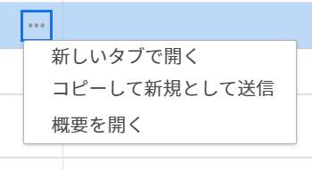

# リクエストのコピーと送信

<!--The highlighted information on this page refers to functionality not yet generally available. It is available only in the Preview environment. -->

同様のリクエストを頻繁に送信する場合は、既存の送信済みリクエストをコピーできます。 この場合、既存のリクエストをコピーし、最小限の変更を加えて、新しいリクエストとして再送信できます。

## アクセス要件

<!--drafted - replace table with P&P:

<table style="table-layout:auto"> 
 <col> 
 <col> 
 <tbody> 
  <tr> 
   <td role="rowheader">Adobe Workfront plan*</td> 
   <td> 
Any
 </td> 
  </tr> 
  <tr> 
   <td role="rowheader">Adobe Workfront license*</td> 
   <td>
Current license: Contributor or higher
 
   Or
   
Legacy license: Request or higher
 </td> 
  </tr> 
  <tr> 
   <td role="rowheader">Access level configurations*</td> 
   <td> 
Edit access to Issues
 
<b>NOTE</b> 
   
   If you still don't have access, ask your Workfront administrator if they set additional restrictions in your access level. For information on how a Workfront administrator can modify your access level, see <a href="../../../administration-and-setup/add-users/configure-and-grant-access/create-modify-access-levels.md" class="MCXref xref">Create or modify custom access levels</a>.
 </td> 
  </tr> 
  <tr> 
   <td role="rowheader">Object permissions</td> 
   <td> 
Access to add requests to a request queue
 
View or higher permissions on the existing request
 
For information on setting up a request queue, see <a href="../../../manage-work/requests/create-and-manage-request-queues/create-request-queue.md" class="MCXref xref">Create a Request Queue</a>. 
 </td> 
  </tr> 
 </tbody> 
</table>
-->
この記事の手順を実行するには、次のアクセス権が必要です。

<table style="table-layout:auto"> 
 <col> 
 <col> 
 <tbody> 
  <tr> 
   <td role="rowheader">Adobe Workfront plan*</td> 
   <td> 
任意
 </td> 
  </tr> 
  <tr> 
   <td role="rowheader">Adobe Workfront license*</td> 
   <td> 
リクエスト以上
 </td> 
  </tr> 
  <tr> 
   <td role="rowheader">アクセスレベル設定*</td> 
   <td> 
問題へのアクセスを編集
 
<b>メモ</b>

まだアクセス権がない場合は、Workfront管理者に、アクセスレベルに追加の制限を設定しているかどうかを問い合わせてください。 Workfront管理者がアクセスレベルを変更する方法について詳しくは、 <a href="../../../administration-and-setup/add-users/configure-and-grant-access/create-modify-access-levels.md" class="MCXref xref">カスタムアクセスレベルの作成または変更</a>.
 </td>
</tr> 
  <tr> 
   <td role="rowheader">オブジェクト権限</td> 
   <td> 
リクエストキューにリクエストを追加するためのアクセス
 
既存のリクエストに対する表示権限以上の権限
 
リクエストキューの設定について詳しくは、 <a href="../../../manage-work/requests/create-and-manage-request-queues/create-request-queue.md" class="MCXref xref">リクエストキューの作成</a>. 
 </td> 
  </tr> 
 </tbody> 
</table>

&#42;保有しているプラン、ライセンスの種類、アクセス権を確認するには、Workfront管理者に問い合わせてください。

## 前提条件

自分または組織内の誰かが以前に送信したリクエストをコピーして再送信できるようにする必要があります。 リクエストが他のユーザーに属する場合、新しくコピーして送信するには、少なくとも表示へのアクセス権が必要です。

## リクエストを新規としてコピーし、送信する際の考慮事項

* 送信されたリクエストのコピーと送信のみ可能です。 下書きリクエストはコピーできません。
* 最初に送信したリクエストや、他のユーザーが送信したリクエスト、少なくともビューへのアクセス権を持っているリクエストをコピーして送信できます。
* ユーザーが自分のリクエストに対する権限を削除しない限り、ユーザーは常に自分のリクエストのコピーおよび送信のアクセス権を持ちます。
* 他のユーザーが最初に送信したコピー要求と送信要求へのアクセスは、同じ会社内のユーザーに対して、要求キューの作成者が **同じ会社の担当者は、すべてのリクエストに対して同じ権限を継承します** 「キューの詳細」または「プロジェクトを編集」領域で、 この設定を無効にすると、元の要求者のみが独自の要求を表示できます。

  詳しくは、次の記事を参照してください。

   * [リクエストキューの作成](../../../manage-work/requests/create-and-manage-request-queues/create-request-queue.md)
   * [プロジェクトを編集](../../../manage-work/projects/manage-projects/edit-projects.md)

* 元のリクエストのコピーを更新してから、新しいリクエストとして再送信できます。
* 元のリクエストが送信された後に次の変更が発生した場合は、コピーして再送信することはできません。

   * リクエストキューが削除されました。
   * キュートピックが削除されました。

     >[!TIP]
     >
     >キュートピックがリクエストキュー内で唯一のトピックであった場合でも、リクエストをコピーして送信でき、リクエストキュー自体に保存されます。

   * リクエストキューがヘルプリクエストキューとして公開されなくなりました。 詳しくは、 [リクエストキューの作成](../../../manage-work/requests/create-and-manage-request-queues/create-request-queue.md).
   * リクエストキューにキュートピックがなく、元のリクエストが 2022 年 1 月より前に送信された場合。

   * リクエストキューに関連付けられているプロジェクトのステータスが現在ではなくなりました。

* 変換後のリクエストが変換プロセスで保持されている場合は、そのリクエストのコピーをコピーして送信できます。 詳しくは、 [Adobe Workfrontでの変換の問題の概要](../../../manage-work/issues/convert-issues/convert-issues.md).

  >[!TIP]
  >
  >コピーされたリクエストは解決オブジェクトにリンクされていません。

## リクエストのコピーと送信

1. 次をクリック： **メインメニュー** アイコン  Adobe Workfrontの右上隅で、 **リクエスト**.
1. （条件付き）デフォルトで「送信済み」セクションが表示されない場合、 **送信済み** をクリックします。
1. 新規としてコピーして送信するリクエストを見つけ、次のいずれかの操作を行います。

   * 選択して、 **新規としてコピーして送信** アイコン  （「送信済みのリクエスト」リストの左上隅） <!--update this icon the 23.3 preview release, or shortly after: replace this step with this: Select it, then click the **Copy** icon  in the upper-left corner of the Submitted requests list.-->

   <!-- reveal this tip for 23.3 preview release:
   >[!TIP]
   >
   > If you did not select a request first, the Copy icon is dimmed. 
   -->

   * 次をクリック： **詳細** メニュー  をクリックし、 **新規としてコピーして送信** <!--ensure this does not change with the Copy icon improvements with 23.3 preview-->

     または

     選択したリクエストを右クリックし、「 **新規としてコピーして送信**.

     

     >[!TIP]
     >
     >イシューを作成するアクセス権がない場合は、管理者によってリクエストの作成が制限されたという警告が表示されます。

1. （オプション）必要に応じて、次の情報を更新します。

   * **リクエストタイプ**:コピーしたリクエストが保存されるリクエストキュー。 デフォルトでは、コピーされたリクエストは元のリクエストのリクエストキューに保存されます。
   * **トピックグループ** および **トピックをキュー**（選択されている場合） 名前またはトピックグループとキューのトピックは、環境に合わせてカスタマイズされます。 デフォルトでは、コピーしたリクエストは、元のリクエストのトピックグループおよびキュートピックに保存されます。

     >[!TIP]
     >
     >パスが元のリクエストのパスから変更された場合、リクエストキューの作成者はキューを変更しました。

1. （オプション）コピーしたリクエストの情報を更新します。 リクエストキューの作成者が **新しい問題フィールド** セクション **キューの詳細** プロジェクトの「 」サブタブには、次のフィールドが表示される場合があります。

   <table style="table-layout:auto"> 
    <col> 
    <col> 
    <tbody> 
     <tr> 
      <td role="rowheader"><strong>件名</strong> </td> 
      <td>元のリクエストの名前を表示します。 必要に応じて、更新します。 それ以外の場合、Workfrontはコピーしたリクエストに名前を付けます <b>のコピー &lt;name of="" original="" request=""&gt;</b>. これは必須フィールドです。</td> 
     </tr> 
     <tr> 
      <td role="rowheader"><strong>説明</strong> </td> 
      <td>元のリクエストの説明を表示します。 必要に応じて、更新します。</td> 
     </tr> 
     <tr> 
      <td role="rowheader"><strong>URL</strong> </td> 
      <td> 
元のリクエストの URL を表示します。 必要に応じて、更新します。
 </td> 
     </tr> 
     <tr> 
      <td role="rowheader"><strong>優先度</strong> </td> 
      <td> 
リクエストの優先度を指定します。 優先度は、このリクエストを解決すると思われる速さを定義する必要があります。 デフォルトのオプションは次のとおりです。
 
       <ul> 
        <li>なし</li> 
        <li>低</li> 
        <li>標準</li> 
        <li>高</li> 
        <li>緊急</li> 
       </ul> 
優先度の名前はWorkfront管理者が変更できます。
 </td> 
     </tr> 
     <tr> 
      <td role="rowheader"><strong>重大度</strong> </td> 
      <td> 
リクエストの重大度を指定します。 重大度は、時間内に解決されない場合に、このリクエストが作業に与える影響を定義する必要があります。 デフォルトのオプションは次のとおりです。
 
       <ul> 
        <li>一時回避</li> 
        <li>混乱を招く</li> 
        <li>対処策のあるバグ</li> 
        <li>対処策のないバグ</li> 
        <li>致命的なエラー</li> 
       </ul> 
Workfrontの管理者が重大度の名前を変更できます。
 </td> 
     </tr> 
     <tr> 
      <td role="rowheader"><strong>プライマリ連絡先</strong> </td> 
      <td>リクエストのプライマリ連絡先は、リクエストに関する質問に対処する時点の担当者なので、デフォルトでユーザーに設定されます。 ただし、これを他のWorkfrontユーザーに変更することはできます。</td> 
     </tr> 
     <tr data-mc-conditions=""> 
      <td role="rowheader"><strong>割り当て</strong> </td> 
      <td> 
リクエストを割り当てる必要があるアクティブなユーザー、ジョブの役割、またはチームの名前を指定します。 
 
 複数のユーザー、ジョブの役割、またはチームを指定できます。 
 
リクエストキューの設定によっては、リクエストを 3 つすべてではなく、1 つまたは 2 つのタイプのリソースにのみ割り当てることができます。 
 
リクエストキューを適切なリソースに自動的にルーティングできるように、ルーティングルールをリクエストキューに使用することをお勧めします。 
 </td> 
     </tr> 
     <tr> 
      <td role="rowheader" colspan="2"> 

リクエストキューの設定によっては、リクエストに割り当てるリソースのタイプが 1 つ（例：ユーザー）に限られる場合があります。 ルーティングルールもリクエストキューに関連付けられ、異なるタイプのリソース（チームなど）に自動的にルーティングする場合、リクエスト（ユーザー）の送信時に手動で指定したエンティティとルーティングルール（チーム）で指定したリソースの両方にリクエストが割り当てられます。
 
詳しくは、次の記事を参照してください。
 
        <ul> 
         <li> 
<a href="../../../manage-work/requests/create-and-manage-request-queues/create-request-queue.md" class="MCXref xref">リクエストキューの作成</a> 
 </li> 
         <li> 
<a href="../../../manage-work/requests/create-and-manage-request-queues/create-routing-rules.md" class="MCXref xref">ルーティングルールの作成</a>   
 </li> 
        </ul> 
 </td> 
     </tr> 
     <tr> 
      <td role="rowheader"><strong>予定時間数</strong> </td> 
      <td> 
このリクエストの完了に要する時間を見積もります。
 </td> 
     </tr> 
     <tr> 
      <td role="rowheader"><strong>予定開始日</strong> </td> 
      <td> 
このリクエストでの作業を開始する日付。
 </td> 
     </tr> 
     <tr> 
      <td role="rowheader"><strong>予定完了日</strong> </td> 
      <td>このリクエストを解決する日付です。</td> 
     </tr> 
     <tr> 
      <td role="rowheader"><strong>ステータス</strong> </td> 
      <td>新しいリクエストのデフォルトのステータスは「新規」です。 Workfront管理者がこのステータスの名前を変更している可能性があります。 このドロップダウンメニューからステータスを別のものに変更することもできます。</td> 
     </tr> 
     <tr> 
      <td role="rowheader"><strong>ドキュメント</strong> </td> 
      <td> 
リクエストにドキュメントを追加します。 元のリクエストに添付されたドキュメントは、コピーされたリクエストに転送されません。
 
<b>ヒント</b>

   リクエストキューの設定に応じて、カスタムフィールドの前後に「ドキュメント」セクションが表示される場合があります。
 
 
 </td>
   </tr> 
    </tbody> 
   </table>

1. （オプション）必要に応じて、添付されたカスタムフォームの情報を更新します。

   >[!TIP]
   >
   >* 元の要求に添付されたすべてのカスタムフォームと、カスタムフィールドに含まれる値は、コピーされた要求に転送されます。 これには、ロジックを含むフィールドが含まれます。
   >* コピーした要求からカスタムフォームを削除することはできません。

1. クリック **送信**.

   コピーされたリクエストは、指定したリクエストキューで新しいリクエストとして送信されます。
