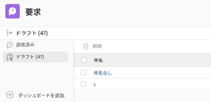

# 下書きからのリクエストの作成

このページで強調表示されている情報は、まだ一般に利用できない機能を示しています。 これは、プレビュー環境でのみ使用できます。

新しいリクエストを入力する際にWorkfrontが提案する利用可能なドラフトを使用する以外に、「ドラフト」セクションからドラフトリクエストにアクセスし、そこから送信を完了することもできます。

## アクセス要件

この記事の手順を実行するには、次のアクセス権が必要です。

<table style="table-layout:auto"> 
 <col> 
 <col> 
 <tbody> 
  <tr> 
   <td role="rowheader">Adobe Workfront plan*</td> 
   <td> 
任意 
 </td> 
  </tr> 
  <tr> 
   <td role="rowheader">Adobe Workfront license*</td> 
   <td> 
リクエスト以上
 </td> 
  </tr> 
  <tr> 
   <td role="rowheader">アクセスレベル設定*</td> 
   <td> 
問題へのアクセスを編集
 
注意：まだアクセス権がない場合は、Workfront管理者に、アクセスレベルに追加の制限を設定しているかどうかを問い合わせてください。 Workfront管理者がアクセスレベルを変更する方法について詳しくは、 <a href="../../../administration-and-setup/add-users/configure-and-grant-access/create-modify-access-levels.md" class="MCXref xref">カスタムアクセスレベルの作成または変更</a>.
 </td> 
  </tr> 
 </tbody> 
</table>

&#42;保有しているプラン、ライセンスの種類、アクセス権を確認するには、Workfront管理者に問い合わせてください。

## ドラフトからのリクエスト作成の前提条件

下書きからリクエストを作成する前に、次の操作を行う必要があります。 

* リクエストの作成を開始します。 これにより、要求が下書きとして「下書き」セクションに自動的に保存されます。

   リクエストの作成について詳しくは、 [Adobe Workfront要求の作成と送信](../../../manage-work/requests/create-requests/create-submit-requests.md).

## 下書きからのリクエストの作成

1. 次をクリック： **メインメニュー** アイコン  Workfrontの右上隅にある
1. クリック **リクエスト** > **ドラフト**.

   このリストには、各リクエストキューの各キュートピックの下書きが表示されます。

   

1. （オプション）列見出しをクリックして、その列でリストを並べ替えます。

1. 下書きリストの次の列で各下書きに関する情報を確認します。

   | 件名 | これは、作成を開始したときにリクエストに付けた名前です。 |
   |---|---|
   | パス | 最初に要求を送信する際に使用した要求キュー、トピックグループおよびキュートピックの名前。 |
   | エントリ日 | リクエストの作成を開始した日付。 |
   | 最終更新日 | 前回の更新の最後。 リクエストを最初に開始してから更新しなかった場合、「入口日」と「最終更新日」は同じにする必要があります。 |

   {style="table-layout:auto"}

1. （任意）下書きリストの右上隅にあるクイックフィルターを使用して、下書きの要求、要求キュー、キュートピック、またはトピックグループの名前を入力し、下書きの名前をクリックして開きます。 
1. リクエストの情報を更新します。詳しくは、 [Adobe Workfront要求の作成と送信](../../../manage-work/requests/create-requests/create-submit-requests.md).
1. （オプションおよび条件付き）リクエストの入力中の任意の時点で、 **破棄** 下書きを削除する場合は、下書きを選択します。 これにより、復元できない下書きが削除されます。 ドラフトの削除について詳しくは、 [要求下書きの削除](../../../manage-work/requests/create-requests/delete-request-draft.md).

1. （オプション）「 **キャンセル** をクリックします。

1. リクエストの情報を入力したら、次のいずれかの操作を行います。

   * クリック **送信** リクエストを送信する準備が整っている場合。 リクエストが「送信済み」セクションに保存されます。 要求キューのルーティング規則に応じて、この要求は要求キューとして指定された要求とは異なるプロジェクトにルーティングされる場合があります。 ルーティングルールの詳細については、 [ルーティングルールの作成](../../../manage-work/requests/create-and-manage-request-queues/create-routing-rules.md).

      または

      クリック **閉じる** まだ送信する準備が整っていない場合は、戻って後で完了する可能性があります。 リクエストは「ドラフト」セクションに保存され、次回このリクエストキューのリクエストを送信する際に利用できます。

      

      リクエストを送信すると、下書きは削除され、復元できません。
