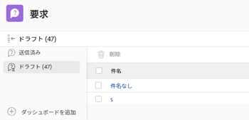

# ドラフトからリクエストを作成

新しいリクエストを入力する際に Workfront が提案する利用可能なドラフトを使用する以外に、「ドラフト」セクションからドラフトリクエストにアクセスし、そこから送信を完了することもできます。

## アクセス要件

+++ 展開すると、この記事の機能のアクセス要件が表示されます。

<table style="table-layout:auto"> 
 <col> 
 <col> 
 <tbody> 
  <tr> 
   <td role="rowheader">Adobe Workfront パッケージ</td> 
   <td> 
任意のAdobe WorkfrontまたはWorkflow パッケージ

   
Workfront計画のリクエストを作成するための任意のAdobe Workfront計画パッケージ </td> 
  </tr> 
  <tr> 
   <td role="rowheader">Adobe Workfront プラン</td> 
   <td> 
コントリビューター以上

   
リクエスト以上

    </td> 
  </tr> 
  <tr> 
   <td role="rowheader">アクセスレベル設定</td> 
   <td> 
イシューへのアクセス権を編集
  </td> 
  </tr>

</tbody> 
</table>

詳しくは、[Workfront ドキュメントのアクセス要件](/help/quicksilver/administration-and-setup/add-users/access-levels-and-object-permissions/access-level-requirements-in-documentation.md)を参照してください。

+++

## ドラフトからリクエストを作成するための前提条件

ドラフトからリクエストを作成する前に、次の手順を実行する必要があります。

* リクエストの作成を開始します。これにより、リクエストがドラフトとして「ドラフト」セクションに自動的に保存されます。

  リクエストの作成について詳しくは、[Adobe Workfront リクエストの作成および送信](../../../manage-work/requests/create-requests/create-submit-requests.md)を参照してください。

## ドラフトからリクエストを作成

ドラフトからリクエストを作成する手順は、新しいリクエストエクスペリエンスと従来のエクスペリエンスで異なります。

* [新しいリクエストエクスペリエンスのドラフトからリクエストを作成する](#create-requests-from-drafts-in-the-new-requesting-experience)
* [従来のリクエストエクスペリエンスのドラフトからリクエストを作成する](#create-requests-from-drafts-in-the-legacy-requesting-experience)

### 新しいリクエストエクスペリエンスのドラフトからリクエストを作成する

1. ドラフトを開きます。

   ドラフトは次の場所にあります。

   * リクエストエリアのリクエストリストで
   * ホームのマイリクエストウィジェットのリクエストリストで
   * 新規リクエストダイアログで（選択したフォームで作成されたリクエストのドラフトのみを含む）

   >[!NOTE]
   >
   >従来のリクエストエクスペリエンスで作成されたドラフトは、新しいリクエストエクスペリエンスでは使用できません。

1. [Adobe Workfront リクエストの作成および送信](../../../manage-work/requests/create-requests/create-submit-requests.md)の説明に従って、リクエストの情報を更新します。
1. （オプションおよび条件付き）リクエストの入力中の任意の時点でドラフトを削除したい場合は、「**ドラフトを破棄**」をクリックします。これにより、ドラフトが削除されます。

   誤って下書きを破棄した場合は、画面の下部にあるメッセージで&#x200B;**取り消し**&#x200B;をすぐにクリックできます。 このオプションは数秒間のみ使用できます。

   ドラフトの削除について詳しくは、[送信済みリクエストまたはリクエストドラフトの削除](../../../manage-work/requests/create-requests/delete-request-draft.md)を参照してください。

1. （オプション）ドラフトへの変更を送信せずに保存するには、新規リクエストページを残します。 変更は自動的に保存されます。

1. リクエストの情報を完了したら、**送信**&#x200B;をクリックします。

   リクエストを送信すると、ドラフトは削除され、復元できません。

### 従来のリクエストエクスペリエンスのドラフトからリクエストを作成する

{{step1-to-requests}}

1. 左側のパネルで「**ドラフト**」を選択します。

   それぞれのリクエストキューのそれぞれのキュートピックのドラフトがこのリストに表示されます。

   

1. （オプション）列の見出しをクリックして、その列でリストを並べ替えます。

1. ドラフトリストの以下の列で、それぞれのドラフトに関する情報を確認します。

   | 件名 | これは、リクエストの作成を開始したときにリクエストに付けた名前です。 |
   | --- | --- |
   | パス | 最初にリクエストを送信する予定だったリクエストキュー、トピックグループおよびキュートピックの名前。 |
   | エントリ日 | リクエストの作成を開始した日付。 |
   | 最終更新日 | 前回の更新。最初にリクエストを開始してから更新していない場合、エントリ日と最終更新日日は同じです。 |

   {style="table-layout:auto"}

1. （任意）ドラフトリストの右上隅にあるクイックフィルターを使用して、リクエストのドラフト、リクエストキュー、キュートピック、またはトピックグループの名前を入力し、続いてドラフトの名前をクリックして開きます。

   >[!TIP]
   >
   >リクエストエリアの「ドラフト」セクションでは、永続的なフィルターを適用できません。さらに、ドラフトリストの表示を修正したり変更したりするオプションもありません。

1. [Adobe Workfront リクエストの作成および送信](../../../manage-work/requests/create-requests/create-submit-requests.md)の説明に従って、リクエストの情報を更新します。
1. （オプションおよび条件付き）リクエストの入力中の任意の時点でドラフトを削除したい場合は、「**ドラフトを破棄**」をクリックします。これにより、復元できない下書きが削除されます。ドラフトの削除について詳しくは、[リクエストドラフトの削除](../../../manage-work/requests/create-requests/delete-request-draft.md)を参照してください。

1. （オプション）アクションを元に戻してドラフトを保持したい場合は、ページの左下隅にある「**キャンセル**」をクリックします。

1. リクエストの情報を入力したら、以下のいずれかの操作を行います。

   * リクエストを送信する準備ができたら、「**送信**」をクリックします。リクエストが「送信済み」セクションに保存されます。リクエストキューのルーティングルールに応じて、このリクエストはリクエストキューとして指定されたリクエストとは異なるプロジェクトにルーティングされる場合があります。ルーティングルールについて詳しくは、[ルーティングルールの作成](../../../manage-work/requests/create-and-manage-request-queues/create-routing-rules.md)を参照してください。

     または

     送信する準備がまだ整っておらず、後で戻って完了する場合は、「**閉じる**」をクリックします。リクエストは「ドラフト」セクションに保存され、次回このリクエストキューのリクエストを送信する際に利用できます。

     

     リクエストを送信すると、ドラフトは削除され、復元できません。

