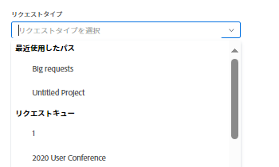
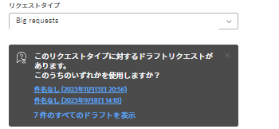
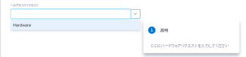
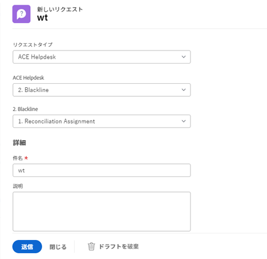

# Adobe Workfront要求の作成と送信

<!--Audited: 12/2023-->

<!--

(NOTE: Linked to the UI - do not change/ remove; THIS IS NOW SPLIT IN THREE ARTICLES>> MAKE SURE THE TRANSITION TO THE OTHER TWO IS CLEAR SINCE THIS IS LINKED TO UI)

(NOTE: If they come out with templates AND drafts, consider splitting this article to keep Create in one and Working with Drafts and Requests in another??)

(NOTE: this article is linked from Submitting Workfront Requests from Salesforce) 

-->

計画作業は、Adobe Workfrontではプロジェクトとタスクで表されます。 ただし、予期しない作業が要求の形でいつでも発生する可能性がある環境で作業する場合もあります。 Workfrontは、リクエストキューを使用してこのタイプの環境に対応するワークフローを提供します。

リクエストキューでリクエストを作成した後、完了するように割り当てるか、タスクまたはプロジェクトに変換することができます。\
タスクまたはプロジェクトに問題を変換する方法の詳細については、「 [Adobe Workfrontでの変換の問題の概要](../../../manage-work/issues/convert-issues/convert-issues.md).

リクエストは、次の方法で作成できます。

* この記事で説明するように、最初から。
* 下書きから。 詳しくは、 [下書きからのリクエストの作成](../../../manage-work/requests/create-requests/create-requests-from-drafts.md).
* 既存のリクエストから、コピーをコピーして送信します。 詳しくは、 [リクエストのコピーと送信](../../../manage-work/requests/create-requests/copy-and-submit-requests.md).

## アクセス要件

この記事の手順を実行するには、次のアクセス権が必要です。

<table style="table-layout:auto"> 
 <col> 
 <col> 
 <tbody> 
  <tr> 
   <td role="rowheader">Adobe Workfront plan*</td> 
   <td> 
任意 
 </td> 
  </tr> 
  <tr> 
   <td role="rowheader">Adobe Workfront license*</td> 
   <td> 
新規：寄稿者以上

   または
   
現在：リクエスト以降

    </td> 
  </tr> 
  <tr> 
   <td role="rowheader">アクセスレベル設定*</td> 
   <td> 
問題へのアクセスを編集
  </td> 
  </tr> 
 </tbody> 
</table>

この表の情報の詳細については、 [Workfrontドキュメントのアクセス要件](/help/quicksilver/administration-and-setup/add-users/access-levels-and-object-permissions/access-level-requirements-in-documentation.md).

## リクエストキュー使用の前提条件

Workfront管理者は、この機能を使用する前に、リクエストキューを作成して、ユーザーが使用できるようにする必要があります。 Planner ライセンスを持ち、プロジェクトへの編集アクセス権と特定のプロジェクトに対する管理権限を持つユーザーは、要求キューを作成することもできます。

要求キューの作成方法について詳しくは、 [リクエストキューの作成](../../../manage-work/requests/create-and-manage-request-queues/create-request-queue.md).

Workfrontの管理者は、リクエストキューの次のコンポーネントを作成する必要があります。

* 現在のステータスのプロジェクトで、ヘルプリクエストキューとして公開されます。
* トピックをキューします。\
  詳しくは、 [キュートピックを作成](../../../manage-work/requests/create-and-manage-request-queues/create-queue-topics.md).

* ルーティングルール。\
  詳しくは、 [ルーティングルールの作成](../../../manage-work/requests/create-and-manage-request-queues/create-routing-rules.md).

* （オプション）トピックグループ。\
  詳しくは、 [トピックグループの作成](../../../manage-work/requests/create-and-manage-request-queues/create-topic-groups.md).

* （オプション）カスタムフォームを要求します。\
  詳しくは、 [カスタムフォームの作成または編集](../../../administration-and-setup/customize-workfront/create-manage-custom-forms/create-or-edit-a-custom-form.md).

* （オプション）承認をリクエストするプロセス。\
  詳しくは、 [作業項目の承認プロセスの作成](../../../administration-and-setup/customize-workfront/configure-approval-milestone-processes/create-approval-processes.md).

## Workfront Web アプリでのリクエストの作成とドラフトの生成

Workfront Web アプリでリクエストを作成すると、Workfrontはリクエストをドラフトとして保存してから送信します。 リクエストキューを選択し、その情報の入力を開始すると、Workfrontはすぐに下書きを作成します。

リクエストの送信を続行するか、利用可能な限りの情報を入力し、後でリクエストを完了するために離れることができます。 Workfrontは、開始した下書き要求を Drafts フォルダーに保存します。

>[!IMPORTANT]
>
>ドラフトを使用する際は、次の点に注意してください。
>
>* Workfrontでは、サードパーティのアプリケーションからリクエストを送信する際 (Workfrontへの電子メール送信や、別のアプリケーションを使用してリクエストを作成する場合など ) に、ドラフトリクエストは作成されません。 Workfront Web アプリの外部からリクエストを送信すると、リクエストは「送信済み」セクションに保存されます。
>* リクエストキューの構造が変更されると、既存のドラフトにアクセスできなくなります。 例えば、キューのトピックが削除された場合や、トピックグループが追加された場合、保存されたドラフトにはアクセスできなくなります。
>

既存のドラフトからのリクエストの作成について詳しくは、 [下書きからのリクエストの作成](../../../manage-work/requests/create-requests/create-requests-from-drafts.md). 要求ドラフトの削除について詳しくは、 [要求下書きの削除](../../../manage-work/requests/create-requests/delete-request-draft.md).

Workfront Web アプリでリクエストを作成するには：

1. 次をクリック： **[!UICONTROL メインメニュー]** アイコン  Adobe Workfrontの右上隅にある、または（使用可能な場合）、 **[!UICONTROL メインメニュー]** アイコン  をクリックします。

   <!--
   <MadCap:conditionalText data-mc-conditions="QuicksilverOrClassic.Draft mode">
   </MadCap:conditionalText>
   -->

1. クリック  **リクエスト**&#x200B;を選択し、次に **新しいリクエスト** をクリックします。

   >[!TIP]
   >
   >* 「リクエスト」領域の任意のセクションから、「新しいリクエスト」オプションにアクセスできます。
   >* 「 New Request 」オプションは、イシューを作成するアクセス権がない場合は淡色表示になります。

1. （条件付き） **リクエストタイプ** フィールドに値を入力し、次のいずれかの操作を行います。

   * 次から： **最近使用したパス** 「 」セクションで、リクエストキューを開くために最近使用したパスを選択します。 パスには、リクエストキュー、トピックグループ、最近送信したキュートピックが含まれます。 デフォルトでは、最後の 3 つのパスが表示されます。

     >[!NOTE]
     >
     >Workfrontは、実際にリクエストを送信した場合にのみパスを保存します。 下書き要求のパスは作成されません。

     

   * 次から： **リクエストキュー** 「 」セクションで、リクエストキューを選択します。
   * 以前にアクセスしたパスに属するキーワードを入力して、リクエストキューを検索します。

     例えば、「Location」という名前のトピックグループと「Remote」という名前のキュートピックを持つ「Help Desk」という名前のリクエストキューがある場合、「remote」と入力し、パス表示の任意の要素に「remote」を含むすべてのリクエストキューを入力できます。

     >[!TIP]
     >
     >特殊文字を含む名前を入力すると、入力を省略した場合でも、要求キュー、キュートピック、またはトピックグループが表示されます。

     

     使用可能なリクエストキューと最近のパスのリストは、結果でハイライト表示されたキーワードを含むパスのみが含まれるように動的に更新されます。

     検索結果は、次の領域に表示されます。

     <table style="table-layout:auto"> 
      <col> 
      <col> 
      <tbody> 
       <tr> 
        <td role="rowheader">リクエストキュー</td> 
        <td>名前にキーワードが含まれるリクエストキュー</td> 
       </tr> 
       <tr> 
        <td role="rowheader">リクエストパス</td> 
        <td> 
要素の名前にキーワードが含まれるパス（リクエストキュー、トピックグループ、キュートピックを含む）
 </td> 
       </tr> 
      </tbody> 
     </table>

   >[!TIP]
   >
   >* 最初の 200 個のリクエストキューは、デフォルトで、アルファベット順に表示されます。
   >* リクエストキューの名前は、ヘルプリクエストキューとして公開されたプロジェクトの名前です。
   >* 選択したリクエストキューとして設定されたプロジェクトの説明が、リクエストキュー名の右側に表示されます。
   >   
   >プロジェクトをヘルプリクエストキューとして公開する方法の詳細については、この記事を参照してください。 [リクエストキューの作成](../../../manage-work/requests/create-and-manage-request-queues/create-request-queue.md).

1. Adobe Analytics の **新しいリクエスト** フォームで、次のいずれかの操作を行います。

   * （条件付き）「リクエストタイプ」フィールドに表示される通知メッセージから、使用可能なドラフトを選択します。

     この領域は、下書きを送信せずに保存した場合にのみ表示されます。

     デフォルトでは、3 つの異なるキュートピックの 3 つ前のドラフトが表示されます。

     

   * 選択したキューに新しいリクエストを入力し始めます。

     新しい要求の情報を入力し、「件名」フィールドに要求の名前を入力すると、新しい下書きが「下書き」セクションに自動的に保存されます。

1. （オプション）リクエストキューにトピックグループが含まれる場合、最初のドロップダウンフィールドでトピックグループの名前を選択します。 それ以外の場合は、Queue Topic を選択します。

   >[!TIP]
   >
   >トピックグループまたはキュートピックの上にマウスポインターを置くと、右側に「説明」フィールドが表示されます。 トピックグループまたはキューのトピックに関する追加情報が含まれます。
   >
   >
   >   >
   >

   リクエストキューには、最大 10 層のトピックグループを組み込むことができます。\
   トピックグループの作成方法の詳細については、「 [トピックグループの作成](../../../manage-work/requests/create-and-manage-request-queues/create-topic-groups.md). キュートピックの作成の詳細については、「 [キュートピックを作成](../../../manage-work/requests/create-and-manage-request-queues/create-queue-topics.md).

   >[!TIP]
   >
   >ドラフトまたは前のパスを選択した場合、トピックグループとキューのトピックは既に選択されています。 必要に応じて、別のものを選択できます。

1. Workfront管理者が **新しい問題フィールド** のセクション **キューの詳細** プロジェクトの「 」サブタブで、新しい要求を送信すると、次のフィールドのいずれかが表示される場合があります。

   <table style="table-layout:auto"> 
    <col> 
    <col> 
    <tbody> 
     <tr> 
      <td role="rowheader"><strong>件名</strong> </td> 
      <td>リクエストの名前を指定します。 これは必須フィールドです。</td> 
     </tr> 
     <tr> 
      <td role="rowheader"><strong>説明</strong> </td> 
      <td>リクエストの説明を指定します。</td> 
     </tr> 
     <tr> 
      <td role="rowheader"><strong>URL</strong> </td> 
      <td> 
リクエストに関連する URL を指定します。
 </td> 
     </tr> 
     <tr> 
      <td role="rowheader"><strong>優先度</strong> </td> 
      <td> 
リクエストの優先度を指定します。 優先度は、このリクエストを解決すると思われる速さを定義する必要があります。 デフォルトのオプションは次のとおりです。 
 
       <ul> 
        <li>なし</li> 
        <li>低 </li> 
        <li>標準</li> 
        <li>高</li> 
        <li>緊急</li> 
       </ul> 
優先順位の名前は、システム管理者が変更できます。
 </td> 
     </tr> 
     <tr> 
      <td role="rowheader"><strong>重大度</strong> </td> 
      <td> 
リクエストの重大度を指定します。 重大度は、時間内に解決されない場合に、このリクエストが作業に与える影響を定義する必要があります。 デフォルトのオプションは次のとおりです。
 
       <ul> 
        <li>一時回避</li> 
        <li>混乱を招く</li> 
        <li>対処策のあるバグ</li> 
        <li>対処策のないバグ</li> 
        <li>致命的なエラー</li> 
       </ul> 
システム管理者は、重大度の名前を変更できます。
 </td> 
     </tr> 
     <tr> 
      <td role="rowheader"><strong>プライマリ連絡先</strong> </td> 
      <td>リクエストのプライマリ連絡先は、リクエストに関する質問に対処する時点の担当者なので、デフォルトでユーザーに設定されます。 ただし、これを他のWorkfrontユーザーに変更することはできます。</td> 
     </tr> 
     <tr data-mc-conditions="QuicksilverOrClassic.Quicksilver"> 
      <td role="rowheader"><strong>割り当て</strong> </td> 
      <td> 
リクエストを割り当てる必要があるアクティブなユーザー、ジョブの役割、またはチームの名前を指定します。 
 
1 つのチームのみを指定できます。

   
 リクエストキューの設定によっては、リクエストに 3 つすべてではなく、1 つまたは 2 つのタイプのリソースのみを割り当てることができます（例えば、リクエストをユーザーに割り当てることができます）。

   
ルーティングルールもリクエストキューに関連付けられ、異なるタイプのリソース（チームなど）に自動的にルーティングする場合、リクエスト（ユーザー）の送信時に手動で指定したエンティティとルーティングルール（チーム）で指定したリソースの両方にリクエストが割り当てられます。 

   
 詳しくは、次の記事を参照してください。
 
      <ul> 
      <li> 
<a href="../../../manage-work/requests/create-and-manage-request-queues/create-request-queue.md" class="MCXref xref">リクエストキューの作成</a> 
 </li> 
      <li> 
<a href="../../../manage-work/requests/create-and-manage-request-queues/create-routing-rules.md" class="MCXref xref">ルーティングルールの作成</a>   
 </li> 
      </ul> 

   
リクエストキューを適切なリソースに自動的にルーティングできるように、ルーティングルールをリクエストキューに使用することをお勧めします。 
 </td> 
     </tr>

   <tr> 
      <td role="rowheader"><strong>予定時間</strong> </td> 
      <td> 
このリクエストの完了に要する時間を見積もります。
 </td> 
     </tr> 
     <tr> 
      <td role="rowheader"><strong>計画開始日</strong> </td> 
      <td> 
このリクエストでの作業を開始する日付を指定します。
 </td> 
     </tr> 
     <tr> 
      <td role="rowheader"><strong>計画完了日</strong> </td> 
      <td>このリクエストを解決する日付を指定します。</td> 
     </tr> 
     <tr> 
      <td role="rowheader"><strong>ステータス</strong> </td> 
      <td>新しいリクエストのデフォルトのステータスは「新規」です。 システム管理者がこのステータスの名前を変更した可能性があります。 このドロップダウンメニューからステータスを別のものに変更することもできます。</td> 
     </tr> 
     <tr> 
      <td role="rowheader"><strong>ドキュメント</strong> </td> 
      <td> 
リクエストにドキュメントを追加します。 
 
 リクエストキューの設定に応じて、カスタムフィールドの前後に「ドキュメント」セクションが表示される場合があります。 
 
Workfrontにアップロードしたドキュメントは、下書きの要求に 24 時間保存されます。 その後、ドラフトを編集して送信する際に、再度添付する必要があります。 他のドライブからリンクされたドキュメントは、恒久的にドラフトに保存されます。 
 </td> 
     </tr> 
    </tbody> 
   </table>

1. （オプション）Workfront管理者がカスタムフォームをリクエストキューまたはキュートピックに関連付けた場合、カスタムフォーム内のフィールドを指定します。\
   カスタムフォームは、Workfrontインスタンスごとに異なります。
1. （オプションおよび条件付き）リクエストの入力中の任意の時点で、「 [!UICONTROL **下書きの破棄**] 自動的に作成されたドラフトを削除する場合。 これにより、復元できない下書きが削除されます。 下書きの削除を確認する確認メッセージが表示されます。

1. （オプション）「 [!UICONTROL **取り消し**] をクリックします。

1. 次のいずれかの操作を行います。

   * クリック **送信** リクエストを送信する準備が整っている場合。 リクエストは「送信済み」セクションに保存されます。 要求キューのルーティング規則に応じて、この要求は要求キューとして指定された要求とは異なるプロジェクトにルーティングされる場合があります。 ルーティングルールの詳細については、 [ルーティングルールの作成](../../../manage-work/requests/create-and-manage-request-queues/create-routing-rules.md).

     または

     クリック **閉じる** まだ送信する準備が整っていない場合は、戻って後で完了する可能性があります。 リクエストは「ドラフト」セクションに保存され、次回このリクエストキューのリクエストを送信する際に利用できます。

     

   要求を送信すると、下書きが自動的に削除され、復元できなくなります。

   受信リクエストの処理について詳しくは、「 [作業とチームのリクエストを管理](../../../people-teams-and-groups/work-with-team-requests/manage-work-and-team-requests.md).

   送信または下書きのリクエストの検索については、 [送信された要求を見つける](../../../manage-work/requests/create-requests/locate-submitted-requests.md).

## Workfront以外からのリクエストの作成

新しいリクエストを送信する際に、リクエストキューへの直接リンクを共有し、他のアプリケーションに埋め込むことができます。 Web や他のアプリケーションからこのリンクにアクセスするユーザーは、アクティブなWorkfrontアカウントでログインして、このキューにアクセスしてリクエストを送信する必要もあります。 詳しくは、 [リクエストキューへのリンクの共有](../../../manage-work/requests/create-requests/share-link-to-request-queue.md).

## Workfrontに電子メールで要求を作成

リクエストキューが電子メールでリクエストを受け取るように設定されている場合、リクエストキューに関連付けられた電子メールアドレスに直接リクエストを電子メールで送信できます。

電子メールの本文テキストがリクエストの説明として追加されます。

>[!NOTE]
>
>HTMLの形式は、要求がWorkfrontに入ると削除されますが、署名と既存の返信先スレッドの内容は削除されず、要求の説明に表示されます。

リクエストキューが電子メールでリクエストを受け取れるようにする方法について詳しくは、 [ユーザーが問題をリクエストキュープロジェクトに電子メールで送信できるようにします](../../../manage-work/requests/create-requests/enable-email-issues-into-projects.md).

## Outlook クライアントを使用して要求を作成する

Outlook クライアントを使用して要求を送信できます。 新しいリクエストを作成するか、電子メールをリクエストに変換することができます。

Outlook クライアントを使用して要求を送信する方法については、この記事を参照してください [Outlook 電子メールからのAdobe Workfront要求の作成](../../../workfront-integrations-and-apps/using-workfront-with-outlook/create-a-wf-request-from-an-outlook-email.md).

## Workfrontモバイルアプリを使用したリクエストの作成

スマートフォンのモバイルアプリを使用して要求を送信できます。 新しいリクエストを作成し、Web アプリケーションで表示するためのアクセス権を持つリクエストキューに送信できます。

モバイルアプリを使用してリクエストを送信する方法について詳しくは、次の記事のリクエストの節を参照してください。

* [Adobe Workfront for Android](../../../workfront-basics/mobile-apps/using-the-workfront-mobile-app/workfront-for-android.md#requests)
* [Adobe Workfront for iOS](../../../workfront-basics/mobile-apps/using-the-workfront-mobile-app/workfront-for-ios.md#requests)

## 他のアプリケーションからのリクエストの作成

Workfrontと統合されている任意のアプリケーションを使用して、要求を送信できます。

* Workfrontと別のアプリケーションとの間のカスタム統合を構築し、他のアプリケーションからWorkfrontにリクエストを送信できます。\
  カスタムWorkfrontの統合について詳しくは、 [Adobe Workfront統合](../../../administration-and-setup/configure-integrations/workfront-integrations-1.md).

* Salesforce 用Workfrontアプリをインストール済みの場合は、Salesforce から要求を送信できます。\
  Salesforce 用Workfrontアプリを使用して Salesforce からリクエストを送信する方法については、この記事を参照してください。 [Salesforce オブジェクトからAdobe Workfrontリクエストを送信](../../../workfront-integrations-and-apps/using-workfront-with-salesforce/submit-workfront-requests-from-salesforce-objects.md).

## 送信された要求を見つける

送信または下書きのリクエストの検索について詳しくは、 [送信された要求を見つける](../../../manage-work/requests/create-requests/locate-submitted-requests.md).
