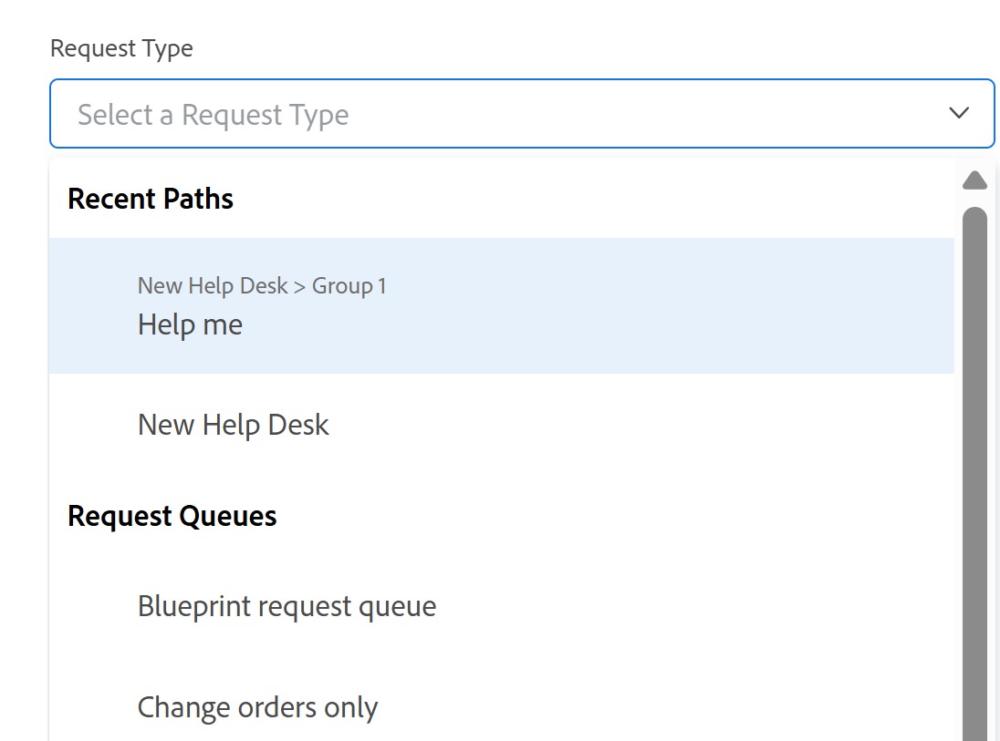
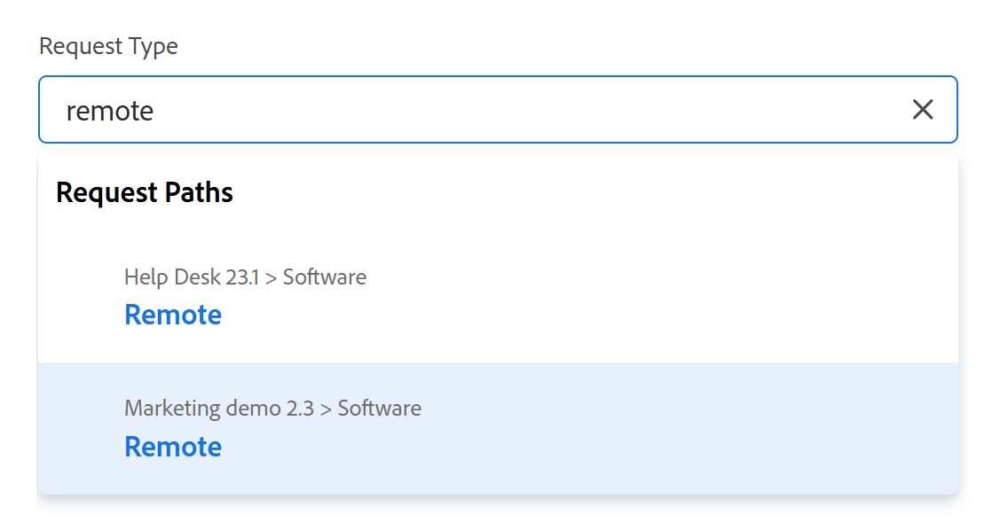
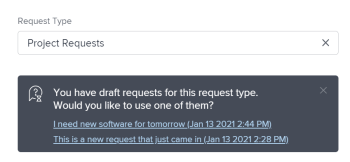
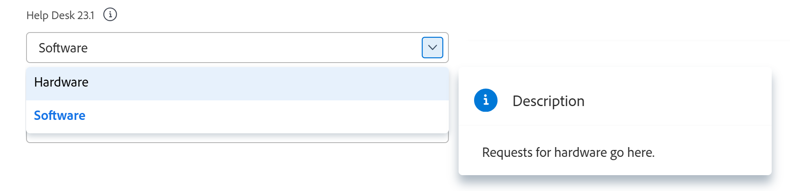

# リクエストの作成と送信

<!--Audited: 03/2026-->

<!--

(NOTE: Linked to the UI - do not change/ remove; THIS IS NOW SPLIT IN THREE ARTICLES>> MAKE SURE THE TRANSITION TO THE OTHER TWO IS CLEAR SINCE THIS IS LINKED TO UI)

(NOTE: this article is linked from Submitting Workfront Requests from Salesforce) 

-->

予定作業は、Adobe Workfront ではプロジェクトとタスクで表されます。ただし、予定外の作業が要求という形で突然舞い込んでくる環境で働いているかもしれません。Workfront には、リクエストキューを使用してこのタイプの環境に対応するワークフローが用意されています。

リクエストキューにリクエストを作成したら、担当者に割り当てて完了させるか、タスクまたはプロジェクトに変換することができます。\
タスクまたはプロジェクトにイシューを変換する方法について詳しくは、[Adobe Workfront におけるイシューの変換の概要](../../../manage-work/issues/convert-issues/convert-issues.md)を参照してください。

Workfront リクエストは、次の方法で作成できます。

* 最初から（この記事ではこの場合について説明しています）。
* ドラフトから。詳しくは、[ドラフトからのリクエストの作成](../../../manage-work/requests/create-requests/create-requests-from-drafts.md)を参照してください。
* 既存のリクエストから（コピーの送信によります）。詳しくは、[リクエストのコピーと送信](../../../manage-work/requests/create-requests/copy-and-submit-requests.md)を参照してください。

お客様の会社がAdobe Workfront Planningを購入している場合は、次の方法でWorkfront Planning リクエストをゼロから作成することもできます。

* Workfront Planning リクエストフォームへのリンクから。

* Workfrontのリクエスト領域にあるWorkfront計画リクエストフォームから。

プランニングリクエストは、Workfront Planningでレコードを作成します。

詳しくは、この記事の「[Workfront Planning リクエストフォームを使用したリクエストの作成](#create-requests-using-a-workfront-planning-request-form)」を参照してください。

この記事では、Workfront リクエストキューを使用してWorkfront リクエストを作成および送信する方法について説明します。

## アクセス要件

+++ 展開すると、この記事の機能のアクセス要件が表示されます。

<table style="table-layout:auto"> 
 <col> 
 <col> 
 <tbody> 
 <tbody> 
  <tr> 
   <td role="rowheader">Adobe Workfront パッケージ</td> 
   <td> 
任意のWorkfrontまたはWorkflow パッケージ

   
Planning リクエストを作成するには、任意のAdobe Workfront Planning パッケージが必要です
 </td> 
  </tr> 
  <tr> 
   <td role="rowheader">Adobe Workfront プラン</td> 
   <td> 
Workfront Contributor以上

   
Workfront リクエスト以上

    </td> 
  </tr> 
  <tr> 
   <td role="rowheader">アクセスレベル設定</td> 
   <td> 
イシューへのアクセス権を編集
  </td> 
  </tr>  
 </tbody> 
</table>

詳しくは、[Workfront ドキュメントのアクセス要件](/help/quicksilver/administration-and-setup/add-users/access-levels-and-object-permissions/access-level-requirements-in-documentation.md)を参照してください。

+++

## リクエストキューの使用上の前提条件

この節では、Workfront リクエストキューについて説明します。 Planning リクエストフォームについて詳しくは、[Adobe Workfront Planningでのリクエストフォームの作成と管理](/help/quicksilver/planning/requests/create-request-form.md)を参照してください。

この機能を使用するには、まず Workfront 管理者がリクエストキューを作成して、ユーザーが使用できるようにする必要があります。プランナーライセンスを持ち、プロジェクトへの編集アクセス権と特定のプロジェクトの管理権限を持つユーザーも、リクエストキューを作成できます。

リクエストキューの作成方法については、[リクエストキューの作成](../../../manage-work/requests/create-and-manage-request-queues/create-request-queue.md)を参照してください。

Workfront 管理者は、リクエストキューの次のコンポーネントを作成する必要があります。

* ステータスが「進行中」のプロジェクト。ヘルプリクエストキューとして公開されます。
* キュートピック\
  詳しくは、[キュートピックの作成](../../../manage-work/requests/create-and-manage-request-queues/create-queue-topics.md)を参照してください。

* ルーティング規則\
  詳しくは、[ルーティング規則の作成](../../../manage-work/requests/create-and-manage-request-queues/create-routing-rules.md)を参照してください。

* （オプション）トピックグループ\
  詳しくは、[トピックグループの作成](../../../manage-work/requests/create-and-manage-request-queues/create-topic-groups.md)を参照してください。

* （オプション）リクエストのカスタムフォーム。\
  詳しくは、[ カスタムフォームの作成](/help/quicksilver/administration-and-setup/customize-workfront/create-manage-custom-forms/form-designer/design-a-form/design-a-form.md)の記事を参照してください。

* （オプション）リクエストの承認プロセス。\
  詳しくは、[作業アイテムの承認プロセスの作成](../../../administration-and-setup/customize-workfront/configure-approval-milestone-processes/create-approval-processes.md)を参照してください。

## Workfront web アプリでのリクエストの作成とドラフトの生成

Workfront web アプリでリクエストを作成すると、Workfront はリクエストをドラフトとして保存してから送信します。リクエストキューを選択し、その情報の入力を開始するとすぐに、Workfront がドラフトを作成します。

引き続きリクエストを送信することもできますし、入手できる限りの情報を入力し、いったん作業を離れて後でリクエストを完了することもできます。Workfrontは、開始したドラフトされたリクエストを保存します。

ドラフトされたリクエストは、次のリクエストエクスペリエンスの次の領域で見つけることができます。

* 新しいリクエストエクスペリエンス：リクエストリスト。 ドラフトは、ステータスが「ドラフト」のリクエストです。
* 従来のリクエストのエクスペリエンス：リクエストリストのドラフトフォルダー。

>[!IMPORTANT]
>
>ドラフトを使用する際は、次の点に注意してください。
>
>* Workfront では、サードパーティのアプリケーションからリクエストを送信する際（Workfront へのメール送信や、別のアプリケーションを使用してリクエストを作成する場合など）に、ドラフトリクエストは作成されません。Workfront web アプリの外部からリクエストを送信すると、リクエストは「送信済み」セクションに保存されます。
>* リクエストキューの構造が変更されると、既存のドラフトにアクセスできなくなります。例えば、キューのトピックが削除された場合や、トピックグループが追加された場合、保存されたドラフトにはアクセスできなくなります。
>
>* ドラフトは削除されません。 ユーザーがリクエストを送信して送信済みリクエストになるか、またはユーザーが削除するまで、これらのリクエストはWorkfrontに保持されます。

既存のドラフトからのリクエストの作成について詳しくは、[ドラフトからリクエストを作成](../../../manage-work/requests/create-requests/create-requests-from-drafts.md)を参照してください。リクエストドラフトの削除について詳しくは、[送信済みリクエストまたはリクエストドラフトの削除](../../../manage-work/requests/create-requests/delete-request-draft.md)も参照してください。

Workfront web アプリでリクエストを作成するには：

{{step1-to-requests}}

1. （オプションおよび条件付き）画面の右上にある「**新しいエクスペリエンスに切り替え**」設定を選択します。

1. （条件付き）従来のリクエスト用エクスペリエンスを使用している場合は、ページの右上隅にある「**新しいリクエスト**」をクリックします。

   >[!TIP]
   >
   >* 「新規リクエスト」オプションには、リクエスト領域の任意のセクションからアクセスできます。
   >* 問題を作成するためのアクセス権がない場合、「新規リクエスト」オプションはグレー表示になります。

   **新しいリクエスト** ボックスが開きます。

1. （条件付き）新しいエクスペリエンスに切り替えた場合は、Workfront リクエストキューのパスまたはフォームのいずれかを選択するか、検索バーをクリックします。

   検索バーをクリックすると、最も最近使用したキューとフォームが最初に表示されるドロップダウンが表示されます。 リストから1つを選択するか、入力を開始して、キューまたはフォームが表示されたら選択します。

   >[!TIP]
   >
   >このリストには、Workfront リクエストキューとWorkfront Planning リクエストフォームの両方が含まれます

1. （条件付き）新しいエクスペリエンスに切り替えた場合は、トピックグループとキューのトピックを選択して、フォームの更新を続行します。

   レガシーエクスペリエンスで、「**リクエストタイプ**」フィールド内をクリックし、次のいずれかの操作を行います。

   * 「**最近使用したパス**」セクションで、リクエストキューを開くために最近使用したパスを選択します。パスには、リクエストキュー、トピックグループ、最近送信したキューのトピックが含まれます。デフォルトでは、最後の 3 つのパスが表示されます。

     >[!NOTE]
     >
     >Workfront は、実際にリクエストを送信した場合にのみパスを保存します。ドラフトリクエストのパスは作成されません。

     

   * 「**リクエストキュー**」セクションで、リクエストキューを選択します。
   * 以前にアクセスしたパスに属するキーワードを入力して、リクエストキューを検索します。

     例えば、「Location」という名前のトピックグループと「Remote」という名前のキューのトピックを含む「Help Desk」という名前のリクエストキューがある場合、「remote」と入力すると、パスの要素に「remote」を含むすべてのリクエストキューが表示されます。

     >[!TIP]
     >
     >特殊文字を含む名前を入力すると、入力を省略した場合でも、リクエストキュー、キューのトピック、またはトピックグループが表示されます。

     

     使用可能なリクエストキューと最近のパスのリストは、結果でハイライト表示されたキーワードを含むパスのみが含まれるように動的に更新されます。

     検索結果は、次のエリアに表示されます。

     <table style="table-layout:auto"> 
      <col> 
      <col> 
      <tbody> 
       <tr> 
        <td role="rowheader">リクエストキュー</td> 
        <td>名前にキーワードが含まれるリクエストキュー</td> 
       </tr> 
       <tr> 
        <td role="rowheader">リクエストパス</td> 
        <td> 
要素の名前にキーワードが含まれるパス（リクエストキュー、トピックグループ、キューのトピックを含む）
 </td> 
       </tr> 
      </tbody> 
     </table>

   >[!TIP]
   >
   >* デフォルトでは、最初の 200 件のリクエストキューがアルファベット順に表示されます。
   >* リクエストキューの名前は、ヘルプリクエストキューとして公開されたプロジェクトの名前です。
   >* 選択したリクエストキューとして設定されたプロジェクトの説明が、リクエストキュー名の右側に表示されます。
   >   
   >プロジェクトをヘルプリクエストキューとして公開する方法について詳しくは、[リクエストキューの作成](../../../manage-work/requests/create-and-manage-request-queues/create-request-queue.md)の記事を参照してください。

1. **新しいリクエスト**&#x200B;フォームで、次のいずれかの操作を行います。

   * （条件付き）「リクエストタイプ」フィールドに表示される通知メッセージから、使用可能なドラフトを選択します。

     このエリアは、以前にドラフトを送信せずに保存したことがある場合にのみ表示されます。

     デフォルトでは、3 つの異なるキューのトピックからの 3 つの最新のドラフトが表示されます。

     

   * 選択したキューに新しいリクエストの入力を開始します。

     新しいリクエストの情報を入力し、「件名」フィールドにリクエストの名前を付けると、新しいドラフトが&#x200B;**ドラフト** セクションに自動的に保存されます。

1. （オプション）リクエストキューにトピックグループが含まれる場合、最初のドロップダウンフィールドでトピックグループの名前を選択します。それ以外の場合は、キュートピックを選択します。

   >[!TIP]
   >
   >トピックグループまたはキュートピックの上にポインタを合わせると、右側に「説明」フィールドが表示されます。トピックグループまたはキューのトピックに関する追加情報が含まれます。
   >
   >
   >
   >

   リクエストキューには、最大 10 個のトピックグループを組み込むことができます。\
   トピックグループの作成方法について詳しくは、[トピックグループの作成](../../../manage-work/requests/create-and-manage-request-queues/create-topic-groups.md)の記事を参照してください。キュートピックの作成について詳しくは、[キューのトピックを作成](../../../manage-work/requests/create-and-manage-request-queues/create-queue-topics.md)を参照してください。

   >[!TIP]
   >
   >ドラフトまたは前のパスを選択した場合、トピックグループとキューのトピックは既に選択されています。必要に応じて、別のものを選択できます。

1. Workfront 管理者がプロジェクトの「**キューの詳細**」サブタブの「**新規問題フィールド**」セクションで有効にしたフィールドに応じて、新しいリクエストを送信すると、次のフィールドのいずれかが表示されることがあります。

   <table style="table-layout:auto"> 
    <col> 
    <col> 
    <tbody> 
     <tr> 
      <td role="rowheader"><strong>件名</strong> </td> 
      <td>リクエストの名前を指定します。これは必須フィールドです。</td> 
     </tr> 
     <tr> 
      <td role="rowheader"><strong>説明</strong> </td> 
      <td>リクエストの説明を指定します。</td> 
     </tr> 
     <tr> 
      <td role="rowheader"><strong>URL</strong> </td> 
      <td> 
リクエストに関連する URL を指定します。
 </td> 
     </tr> 
     <tr> 
      <td role="rowheader"><strong>優先度</strong> </td> 
      <td> 
リクエストの優先度を指定します。優先度は、このリクエストをどの程度の速度で解決すべきかを定義する必要があります。デフォルトのオプションは次のとおりです。 
 
       <ul> 
        <li>なし</li> 
        <li>低 </li> 
        <li>標準</li> 
        <li>高</li> 
        <li>緊急</li> 
       </ul> 
優先事項の名前は、システム管理者が変更できます。
 </td> 
     </tr> 
     <tr> 
      <td role="rowheader"><strong>重大度</strong> </td> 
      <td> 
リクエストの重大度を指定します。重大度は、時間内に解決されない場合に、このリクエストが作業に与える影響を定義する必要があります。デフォルトのオプションは次のとおりです。
 
       <ul> 
        <li>一時回避</li> 
        <li>混乱を招く</li> 
        <li>対処策のあるバグ</li> 
        <li>対処策のないバグ</li> 
        <li>致命的なエラー</li> 
       </ul> 
重大度の名前は、システム管理者が変更できます。
 </td> 
     </tr> 
     <tr> 
      <td role="rowheader"><strong>プライマリ連絡先</strong> </td> 
      <td>リクエストのプライマリ連絡先は、リクエストに関する質問に対処する時点の担当者なので、デフォルトでユーザーに設定されます。ただし、これを他の Workfront ユーザーに変更することはできます。</td> 
     </tr> 
     <tr data-mc-conditions="QuicksilverOrClassic.Quicksilver"> 
      <td role="rowheader"><strong>割り当て</strong> </td> 
      <td> 
リクエストを割り当てる必要があるアクティブなユーザー、担当業務、またはチームの名前を指定します。 
 
1 つのチームのみを指定できます。

   
 リクエストキューの設定方法によっては、リクエストに 3 つすべてではなく、1 つまたは 2 つのタイプのリソースを割り当てることのみ可能です（例えば、リクエストをユーザーに割り当てることのみ可能です）。

   
ルーティングルールもリクエストキューに関連付けられ、異なるタイプのリソース（チームなど）に自動的にルーティングする場合、リクエスト（ユーザー）の送信時に手動で指定したエンティティとルーティングルール（チーム）で指定したリソースの両方にリクエストが割り当てられます。 

   
 詳しくは、次の記事を参照してください。
 
      <ul> 
      <li> 
<a href="../../../manage-work/requests/create-and-manage-request-queues/create-request-queue.md" class="MCXref xref">リクエストキューの作成</a> 
 </li> 
      <li> 
<a href="../../../manage-work/requests/create-and-manage-request-queues/create-routing-rules.md" class="MCXref xref">ルーティングルールの作成</a>  
 </li> 
      </ul> 

   
リクエストキューを適切なリソースに自動的にルーティングできるように、ルーティングルールをリクエストキューに使用することをお勧めします。 
 </td> 
     </tr>

   <tr> 
      <td role="rowheader"><strong>予定時間数</strong> </td> 
      <td> 
このリクエストの完了に要する時間を見積もります。
 </td> 
     </tr> 
     <tr> 
      <td role="rowheader"><strong>予定開始日</strong> </td> 
      <td> 
このリクエストでの作業を開始する日付を指定します。
 </td> 
     </tr> 
     <tr> 
      <td role="rowheader"><strong>予定完了日</strong> </td> 
      <td>このリクエストを解決する日付を指定します。</td> 
     </tr> 
     <tr> 
      <td role="rowheader"><strong>ステータス</strong> </td> 
      <td>新しいリクエストのデフォルトのステータスは「新規」です。システム管理者がこのステータスの名前を変更した可能性があります。このドロップダウンメニューからステータスを別のものに変更することもできます。</td> 
     </tr> 
     <tr> 
      <td role="rowheader"><strong>ドキュメント</strong> </td> 
      <td> 
リクエストにドキュメントを追加します。 
 
 リクエストキューの設定に応じて、カスタムフィールドの前後に「ドキュメント」セクションが表示される場合があります。 
 
Workfront にアップロードしたドキュメントは、ドラフトのリクエストに 24 時間保存されます。その後、ドラフトの編集と送信に戻ったときに、それらを再添付する必要があります。他のドライブからリンクされたドキュメントは、永久にドラフトに保存されます。 
 </td> 
     </tr> 
    </tbody> 
   </table>

1. （オプション）Workfront 管理者がカスタムフォームをリクエストキューまたはキューのトピックに関連付けた場合、カスタムフォーム内のフィールドを指定します。

   カスタムフォームは、Workfront インスタンスごとに異なります。

1. （オプションおよび条件付き）リクエストの入力中の任意の時点で、自動的に作成されたドラフトを削除する場合、「[!UICONTROL **ドラフトの破棄**]」をクリックします。これにより、復元できない下書きが削除されます。ドラフトの削除を確認する確認メッセージが表示されます。

1. （オプション）アクションを元に戻してドラフトを保持したい場合は、確認メッセージで「[!UICONTROL **取り消し**]」をクリックします。

1. 次のいずれかの操作を行います。

   * リクエストを送信する準備ができたら、「**送信**」をクリックします。リクエストは「送信済み」セクションに保存されます。 リクエストキューのルーティングルールに応じて、このリクエストはリクエストキューとして指定されたリクエストとは異なるプロジェクトにルーティングされる場合があります。ルーティングルールについて詳しくは、[ルーティングルールの作成](../../../manage-work/requests/create-and-manage-request-queues/create-routing-rules.md)を参照してください。

     または

     送信する準備がまだ整っておらず、後で戻って完了する場合は、「**閉じる**」をクリックします。リクエストは「ドラフト」セクションに保存され、次回このリクエストキューのリクエストを送信する際に利用できます。

     

   リクエストを送信すると、ドラフトが自動的に削除され、復元できなくなります。

   送信されたリクエストは、従来のエクスペリエンスを使用する場合、リクエスト領域の&#x200B;**送信済み** セクションに一覧表示されます。 新しいエクスペリエンスを使用している場合は、Workfrontで送信されたリクエストがリクエストリストに表示されます。

   >[!NOTE]
   >
   >新しいリクエストエクスペリエンスのリクエストリストについて、次の点を考慮してください。
   >
   >* オブジェクトタイプでリストをフィルタリングできます。
   >
   >* ドラフトは、送信されたリクエストと同じリストに表示されます。

   受信リクエストの処理について詳しくは、[作業とチームのリクエストを管理](../../../people-teams-and-groups/work-with-team-requests/manage-work-and-team-requests.md)の記事を参照してください。

   送信済みリクエストまたはドラフト済みリクエストの検索について詳しくは、[送信済みリクエストの表示](../../../manage-work/requests/create-requests/locate-submitted-requests.md)も参照してください。

## Workfront 以外からのリクエストを作成する

新しいリクエストを送信し、他のアプリケーションに埋め込む際に、リクエストキューへの直接リンクを共有できます。Webまたはその他のアプリケーションからこのリンクにアクセスするユーザーは、このキューにアクセスしてリクエストを送信するには、アクティブなWorkfront アカウントでログインする必要があります。

詳しくは、[リクエストキューへのリンクの共有](../../../manage-work/requests/create-requests/share-link-to-request-queue.md)を参照してください。

## Workfront にメールでリクエストを作成する

リクエストキューでメールによるリクエストを受け取ることを有効にしている場合、リクエストキューに関連付けられたメールにリクエストを直接メールで送信できます。

メールの本文テキストがリクエストの説明として追加されます。

>[!NOTE]
>
>HTML の形式は、リクエストが Workfront に入ると削除されますが、署名と既存の返信先スレッドの内容は削除されず、リクエストの説明に表示されます。

リクエストキューがメールでリクエストを受け取れるようにする方法について詳しくは、[ユーザーがイシューをリクエストキュープロジェクトにメールで送信できるようにする](../../../manage-work/requests/create-requests/enable-email-issues-into-projects.md)を参照してください。

## Workfront モバイルアプリを使用したリクエストの作成

スマートフォンのモバイルアプリを使用してリクエストを送信できます。新しいリクエストを作成し、web アプリケーションで表示するためのアクセス権があるリクエストキューに送信できます。

モバイルアプリを使用してリクエストを送信する方法について詳しくは、この記事のリクエストの節を参照してください。

* [Android 用 Adobe Workfront](../../../workfront-basics/mobile-apps/using-the-workfront-mobile-app/workfront-for-android.md#requests)
* [iOS 用 Adobe Workfront](../../../workfront-basics/mobile-apps/using-the-workfront-mobile-app/workfront-for-ios.md#requests)

## 他のアプリケーションからリクエストを作成する

Workfront と統合されている任意のアプリケーションを使用して、リクエストを送信できます。

* Workfront と別のアプリケーションとの間のカスタム統合を構築し、他のアプリケーションから Workfront にリクエストを送信できます。\
  カスタム Workfront の統合について詳しくは、[Adobe Workfront 統合](../../../administration-and-setup/configure-integrations/workfront-integrations-1.md)を参照してください。

## Workfront Planning リクエストフォームを使用したリクエストの作成

Planning リクエストフォームを使用して、Workfront Planning リクエストを追加できます。 Workfront計画リクエストを追加すると、リクエストフォームが承認されている場合や、承認が必要ない場合に、計画レコードが作成される場合があります。

プランニングリクエストを送信するには、Workfront プランニングパッケージを購入する必要があります。

詳しくは、次の記事を参照してください。

* [Adobe Workfront Planning](/help/quicksilver/planning/requests/create-request-form.md)でリクエストフォームを作成および管理します。
* [ レコードを作成するためのAdobe Workfront計画リクエストを送信](/help/quicksilver/planning/requests/submit-requests.md)。

## 送信されたリクエストを見つける

送信済みリクエストまたはドラフト済みリクエストの検索について詳しくは、[送信済みリクエストの表示](../../../manage-work/requests/create-requests/locate-submitted-requests.md)を参照してください。
