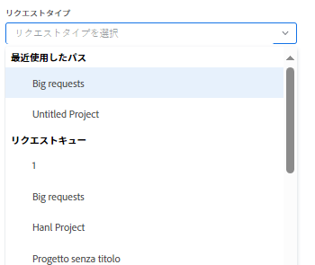

# Adobe Workfront リクエストの作成と送信

<!--Audited: 12/2023-->

<!--

(NOTE: Linked to the UI - do not change/ remove; THIS IS NOW SPLIT IN THREE ARTICLES>> MAKE SURE THE TRANSITION TO THE OTHER TWO IS CLEAR SINCE THIS IS LINKED TO UI)

(NOTE: If they come out with templates AND drafts, consider splitting this article to keep Create in one and Working with Drafts and Requests in another??)

(NOTE: this article is linked from Submitting Workfront Requests from Salesforce) 

-->

予定作業は、Adobe Workfront ではプロジェクトとタスクで表されます。ただし、予期しない作業が要求の形でいつでも発生する可能性がある環境で作業する場合もあります。 Workfront には、リクエストキューを使用してこのタイプの環境に対応するワークフローが用意されています。

リクエストキューにリクエストを作成したら、担当者に割り当てて完了させるか、タスクまたはプロジェクトに変換することができます。\
タスクまたはプロジェクトにイシューを変換する方法について詳しくは、[Adobe Workfront におけるイシューの変換の概要](../../../manage-work/issues/convert-issues/convert-issues.md)を参照してください。

リクエストは、次のいずれかの方法で作成できます。

* 最初から（この記事ではこの場合について説明しています）。
* ドラフトから。詳しくは、[ドラフトからのリクエストの作成](../../../manage-work/requests/create-requests/create-requests-from-drafts.md)を参照してください。
* 既存のリクエストから（コピーの送信によります）。詳しくは、[リクエストのコピーと送信](../../../manage-work/requests/create-requests/copy-and-submit-requests.md)を参照してください。

## アクセス要件

この記事の手順を実行するには、次のアクセス権が必要です。

<table style="table-layout:auto"> 
 <col> 
 <col> 
 <tbody> 
  <tr> 
   <td role="rowheader">Adobe Workfront プラン*</td> 
   <td> 
任意 
 </td> 
  </tr> 
  <tr> 
   <td role="rowheader">Adobe Workfront ライセンス*</td> 
   <td> 
新規：寄稿者以上

   または
   
現在：リクエスト以降

    </td> 
  </tr> 
  <tr> 
   <td role="rowheader">アクセスレベル設定*</td> 
   <td> 
イシューへのアクセス権を編集
  </td> 
  </tr> 
 </tbody> 
</table>

この表の情報の詳細については、 [Workfrontドキュメントのアクセス要件](/help/quicksilver/administration-and-setup/add-users/access-levels-and-object-permissions/access-level-requirements-in-documentation.md).

## リクエストキューの使用上の前提条件

Workfront管理者は、この機能を使用する前に、リクエストキューを作成して、ユーザーが使用できるようにする必要があります。 プランナーライセンスを持ち、プロジェクトへの編集アクセス権と特定のプロジェクトの管理権限を持つユーザーも、リクエストキューを作成できます。

リクエストキューの作成方法については、[リクエストキューの作成](../../../manage-work/requests/create-and-manage-request-queues/create-request-queue.md)を参照してください。

Workfrontの管理者は、リクエストキューの次のコンポーネントを作成する必要があります。

* 現在のステータスのプロジェクトで、ヘルプリクエストキューとして公開されます。
* キュートピック\
  詳しくは、[キュートピックの作成](../../../manage-work/requests/create-and-manage-request-queues/create-queue-topics.md)を参照してください。

* ルーティング規則\
  詳しくは、[ルーティング規則の作成](../../../manage-work/requests/create-and-manage-request-queues/create-routing-rules.md)を参照してください。

* （オプション）トピックグループ\
  詳しくは、[トピックグループの作成](../../../manage-work/requests/create-and-manage-request-queues/create-topic-groups.md)を参照してください。

* （オプション）リクエストのカスタムフォーム。\
  詳しくは、[カスタムフォームの作成または編集](../../../administration-and-setup/customize-workfront/create-manage-custom-forms/create-or-edit-a-custom-form.md)を参照してください。

* （オプション）リクエストの承認プロセス。\
  詳しくは、[作業アイテムの承認プロセスの作成](../../../administration-and-setup/customize-workfront/configure-approval-milestone-processes/create-approval-processes.md)を参照してください。

## Workfront web アプリでのリクエストの作成とドラフトの生成

Workfront web アプリでリクエストを作成すると、Workfront はリクエストをドラフトとして保存してから送信します。リクエストキューを選択し、その情報の入力を開始するとすぐに、Workfront がドラフトを作成します。

引き続きリクエストを送信することもできますし、入手できる限りの情報を入力し、いったん作業を離れて後でリクエストを完了することもできます。Workfront は、開始されたドラフトリクエストをドラフトフォルダーに保存します。

>[!IMPORTANT]
>
>ドラフトを使用する際は、次の点に注意してください。
>
>* Workfront では、サードパーティのアプリケーションからリクエストを送信する際（Workfront へのメール送信や、別のアプリケーションを使用してリクエストを作成する場合など）に、ドラフトリクエストは作成されません。Workfront web アプリの外部からリクエストを送信すると、リクエストは「送信済み」セクションに保存されます。
>* リクエストキューの構造が変更されると、既存のドラフトにアクセスできなくなります。例えば、キューのトピックが削除された場合や、トピックグループが追加された場合、保存されたドラフトにはアクセスできなくなります。
>

既存のドラフトからのリクエストの作成について詳しくは、[ドラフトからリクエストを作成](../../../manage-work/requests/create-requests/create-requests-from-drafts.md)を参照してください。リクエストドラフトの削除について詳しくは、[リクエストドラフトを削除](../../../manage-work/requests/create-requests/delete-request-draft.md)を参照してください。

Workfront Web アプリでリクエストを作成するには：

1. Adobe Workfront の右上隅にある&#x200B;**[!UICONTROL メインメニュー]**&#x200B;アイコンをクリックして、または（使用可能な場合）左上隅にある&#x200B;**[!UICONTROL メインメニュー]**&#x200B;アイコンをクリックします。

   <!--
   <MadCap:conditionalText data-mc-conditions="QuicksilverOrClassic.Draft mode">
   </MadCap:conditionalText>
   -->

1. 「**リクエスト**」をクリックし、ページの右上隅にある「**新しいリクエスト**」を選択します。

   >[!TIP]
   >
   >* リクエストエリアの任意のセクションから、「新しいリクエスト」オプションにアクセスできます。
   >* 「新しいリクエスト」オプションは、イシューを作成するアクセス権がない場合はグレー表示になります。

1. （条件付き）「**リクエストタイプ**」フィールド内をクリックし、次のいずれかの操作を行います。

   * 「**最近使用したパス**」セクションで、リクエストキューを開くために最近使用したパスを選択します。パスには、リクエストキュー、トピックグループ、最近送信したキューのトピックが含まれます。デフォルトでは、最後の 3 つのパスが表示されます。

     >[!NOTE]
     >
     >Workfront は、実際にリクエストを送信した場合にのみパスを保存します。ドラフトリクエストのパスは作成されません。

     

   * 「**リクエストキュー**」セクションで、リクエストキューを選択します。
   * 以前にアクセスしたパスに属するキーワードを入力して、リクエストキューを検索します。

     例えば、「Location」という名前のトピックグループと「Remote」という名前のキュートピックを持つ「Help Desk」という名前のリクエストキューがある場合、「remote」と入力し、パス表示の任意の要素に「remote」を含むすべてのリクエストキューを入力できます。

     >[!TIP]
     >
     >特殊文字を含む名前を入力すると、入力を省略した場合でも、リクエストキュー、キューのトピック、またはトピックグループが表示されます。

     

     使用可能なリクエストキューと最近のパスのリストは、結果でハイライト表示されたキーワードを含むパスのみが含まれるように動的に更新されます。

     検索結果は、次のエリアに表示されます。

     <table style="table-layout:auto"> 
      <col> 
      <col> 
      <tbody> 
       <tr> 
        <td role="rowheader">リクエストキュー</td> 
        <td>名前にキーワードが含まれるリクエストキュー</td> 
       </tr> 
       <tr> 
        <td role="rowheader">リクエストパス</td> 
        <td> 
要素の名前にキーワードが含まれるパス（リクエストキュー、トピックグループ、キューのトピックを含む）
 </td> 
       </tr> 
      </tbody> 
     </table>

   >[!TIP]
   >
   >* 最初の 200 個のリクエストキューは、デフォルトで、アルファベット順に表示されます。
   >* リクエストキューの名前は、ヘルプリクエストキューとして公開されたプロジェクトの名前です。
   >* 選択したリクエストキューとして設定されたプロジェクトの説明が、リクエストキュー名の右側に表示されます。
   >   
   >プロジェクトをヘルプリクエストキューとして公開する方法の詳細については、この記事を参照してください。 [リクエストキューの作成](../../../manage-work/requests/create-and-manage-request-queues/create-request-queue.md).

1. **新しいリクエスト**&#x200B;フォームで、次のいずれかの操作を行います。

   * （条件付き）「リクエストタイプ」フィールドに表示される通知メッセージから、使用可能なドラフトを選択します。

     このエリアは、以前にドラフトを送信せずに保存したことがある場合にのみ表示されます。

     デフォルトでは、3 つの異なるキューのトピックからの 3 つの最新のドラフトが表示されます。

     

   * 選択したキューに新しいリクエストの入力を開始します。

     新しいリクエストの情報の入力を開始し、「件名」フィールドにリクエストに名前を付けると、新しいドラフトが「ドラフト」セクションに自動的に保存されます。

1. （オプション）リクエストキューにトピックグループが含まれる場合、最初のドロップダウンフィールドでトピックグループの名前を選択します。それ以外の場合は、Queue Topic を選択します。

   >[!TIP]
   >
   >トピックグループまたはキュートピックの上にマウスポインターを置くと、右側に「説明」フィールドが表示されます。 トピックグループまたはキューのトピックに関する追加情報が含まれます。
   >
   >
   >   >
   >

   リクエストキューには、最大 10 層のトピックグループを組み込むことができます。\
   トピックグループの作成方法について詳しくは、[トピックグループの作成](../../../manage-work/requests/create-and-manage-request-queues/create-topic-groups.md)の記事を参照してください。キュートピックの作成について詳しくは、[キューのトピックを作成](../../../manage-work/requests/create-and-manage-request-queues/create-queue-topics.md)を参照してください。

   >[!TIP]
   >
   >ドラフトまたは前のパスを選択した場合、トピックグループとキューのトピックは既に選択されています。必要に応じて、別のものを選択できます。

1. Workfront管理者が **新しい問題フィールド** のセクション **キューの詳細** プロジェクトの「 」サブタブで、新しい要求を送信すると、次のフィールドのいずれかが表示される場合があります。

   <table style="table-layout:auto"> 
    <col> 
    <col> 
    <tbody> 
     <tr> 
      <td role="rowheader"><strong>件名</strong> </td> 
      <td>リクエストの名前を指定します。これは必須フィールドです。</td> 
     </tr> 
     <tr> 
      <td role="rowheader"><strong>説明</strong> </td> 
      <td>リクエストの説明を指定します。</td> 
     </tr> 
     <tr> 
      <td role="rowheader"><strong>URL</strong> </td> 
      <td> 
リクエストに関連する URL を指定します。
 </td> 
     </tr> 
     <tr> 
      <td role="rowheader"><strong>優先度</strong> </td> 
      <td> 
リクエストの優先度を指定します。優先度は、このリクエストをどの程度の速度で解決すべきかを定義する必要があります。デフォルトのオプションは次のとおりです。 
 
       <ul> 
        <li>なし</li> 
        <li>低 </li> 
        <li>標準</li> 
        <li>高</li> 
        <li>緊急</li> 
       </ul> 
優先事項の名前は、システム管理者が変更できます。
 </td> 
     </tr> 
     <tr> 
      <td role="rowheader"><strong>重大度</strong> </td> 
      <td> 
リクエストの重大度を指定します。重大度は、時間内に解決されない場合に、このリクエストが作業に与える影響を定義する必要があります。デフォルトのオプションは次のとおりです。
 
       <ul> 
        <li>一時回避</li> 
        <li>混乱を招く</li> 
        <li>対処策のあるバグ</li> 
        <li>対処策のないバグ</li> 
        <li>致命的なエラー</li> 
       </ul> 
重大度の名前は、システム管理者が変更できます。
 </td> 
     </tr> 
     <tr> 
      <td role="rowheader"><strong>プライマリ連絡先</strong> </td> 
      <td>リクエストのプライマリ連絡先は、リクエストに関する質問に対処する時点の担当者なので、デフォルトでユーザーに設定されます。ただし、これを他の Workfront ユーザーに変更することはできます。</td> 
     </tr> 
     <tr data-mc-conditions="QuicksilverOrClassic.Quicksilver"> 
      <td role="rowheader"><strong>割り当て</strong> </td> 
      <td> 
リクエストを割り当てる必要があるアクティブなユーザー、担当業務、またはチームの名前を指定します。 
 
1 つのチームのみを指定できます。

   
 リクエストキューの設定方法によっては、リクエストに 3 つすべてではなく、1 つまたは 2 つのタイプのリソースを割り当てることのみ可能です（例えば、リクエストをユーザーに割り当てることのみ可能です）。

   
ルーティングルールもリクエストキューに関連付けられ、異なるタイプのリソース（チームなど）に自動的にルーティングする場合、リクエスト（ユーザー）の送信時に手動で指定したエンティティとルーティングルール（チーム）で指定したリソースの両方にリクエストが割り当てられます。 

   
 詳しくは、次の記事を参照してください。
 
      <ul> 
      <li> 
<a href="../../../manage-work/requests/create-and-manage-request-queues/create-request-queue.md" class="MCXref xref">リクエストキューの作成</a> 
 </li> 
      <li> 
<a href="../../../manage-work/requests/create-and-manage-request-queues/create-routing-rules.md" class="MCXref xref">ルーティングルールの作成</a>  
 </li> 
      </ul> 

   
リクエストキューを適切なリソースに自動的にルーティングできるように、ルーティングルールをリクエストキューに使用することをお勧めします。 
 </td> 
     </tr>

   <tr> 
      <td role="rowheader"><strong>予定時間数</strong> </td> 
      <td> 
このリクエストの完了に要する時間を見積もります。
 </td> 
     </tr> 
     <tr> 
      <td role="rowheader"><strong>予定開始日</strong> </td> 
      <td> 
このリクエストでの作業を開始する日付を指定します。
 </td> 
     </tr> 
     <tr> 
      <td role="rowheader"><strong>予定完了日</strong> </td> 
      <td>このリクエストを解決する日付を指定します。</td> 
     </tr> 
     <tr> 
      <td role="rowheader"><strong>ステータス</strong> </td> 
      <td>新しいリクエストのデフォルトのステータスは「新規」です。システム管理者がこのステータスの名前を変更した可能性があります。このドロップダウンメニューからステータスを別のものに変更することもできます。</td> 
     </tr> 
     <tr> 
      <td role="rowheader"><strong>ドキュメント</strong> </td> 
      <td> 
リクエストにドキュメントを追加します。 
 
 リクエストキューの設定に応じて、カスタムフィールドの前後に「ドキュメント」セクションが表示される場合があります。 
 
Workfront にアップロードしたドキュメントは、ドラフトのリクエストに 24 時間保存されます。その後、ドラフトの編集と送信に戻ったときに、それらを再添付する必要があります。他のドライブからリンクされたドキュメントは、永久にドラフトに保存されます。 
 </td> 
     </tr> 
    </tbody> 
   </table>

1. （オプション）Workfront 管理者がカスタムフォームをリクエストキューまたはキューのトピックに関連付けた場合、カスタムフォーム内のフィールドを指定します。\
   カスタムフォームは、Workfront インスタンスごとに異なります。
1. （オプションおよび条件付き）リクエストの入力中の任意の時点で、自動的に作成されたドラフトを削除する場合、「[!UICONTROL **ドラフトの破棄**]」をクリックします。これにより、復元できない下書きが削除されます。ドラフトの削除を確認する確認メッセージが表示されます。

1. （オプション）アクションを元に戻してドラフトを保持したい場合は、確認メッセージで「[!UICONTROL **取り消し**]」をクリックします。

1. 次のいずれかの操作を行います。

   * リクエストを送信する準備ができたら、「**送信**」をクリックします。リクエストは「送信済み」セクションに保存されます。リクエストキューのルーティングルールに応じて、このリクエストはリクエストキューとして指定されたリクエストとは異なるプロジェクトにルーティングされる場合があります。ルーティングルールについて詳しくは、[ルーティングルールの作成](../../../manage-work/requests/create-and-manage-request-queues/create-routing-rules.md)を参照してください。

     または

     送信する準備がまだ整っておらず、後で戻って完了する場合は、「**閉じる**」をクリックします。リクエストは「ドラフト」セクションに保存され、次回このリクエストキューのリクエストを送信する際に利用できます。

     

   リクエストを送信すると、ドラフトが自動的に削除され、復元できなくなります。

   受信リクエストの処理について詳しくは、[作業とチームのリクエストを管理](../../../people-teams-and-groups/work-with-team-requests/manage-work-and-team-requests.md)の記事を参照してください。

   送信またはドラフトのリクエストの検索について詳しくは、[送信された要求を見つける](../../../manage-work/requests/create-requests/locate-submitted-requests.md)を参照してください。

## Workfront 以外からのリクエストを作成する

新しいリクエストを送信する際に、リクエストキューへの直接リンクを共有し、他のアプリケーションに埋め込むことができます。 Web または他のアプリケーションからこのリンクにアクセスするユーザーも、このキューにアクセスしてリクエストを送信できるように、アクティブな Workfront アカウントでログインする必要があります。詳しくは、[リクエストキューへのリンクの共有](../../../manage-work/requests/create-requests/share-link-to-request-queue.md)を参照してください。

## Workfrontに電子メールで要求を作成

リクエストキューが電子メールでリクエストを受け取るように設定されている場合、リクエストキューに関連付けられた電子メールアドレスに直接リクエストを電子メールで送信できます。

メールの本文テキストがリクエストの説明として追加されます。

>[!NOTE]
>
>HTML の形式は、リクエストが Workfront に入ると削除されますが、署名と既存の返信先スレッドの内容は削除されず、リクエストの説明に表示されます。

リクエストキューがメールでリクエストを受け取れるようにする方法について詳しくは、[ユーザーがイシューをリクエストキュープロジェクトにメールで送信できるようにする](../../../manage-work/requests/create-requests/enable-email-issues-into-projects.md)を参照してください。

## Outlook クライアントを使用して要求を作成する

Outlook クライアントを使用してリクエストを送信できます。新しいリクエストを作成するか、メールをリクエストに変換することができます。

Outlook クライアントを使用してリクエストを送信する方法について詳しくは、[Outlook メールから Adobe Workfront リクエストを作成](../../../workfront-integrations-and-apps/using-workfront-with-outlook/create-a-wf-request-from-an-outlook-email.md)の記事を参照してください。

## Workfront モバイルアプリを使用してリクエストを作成する

スマートフォンのモバイルアプリを使用してリクエストを送信できます。新しいリクエストを作成し、Web アプリケーションで表示するためのアクセス権を持つリクエストキューに送信できます。

モバイルアプリを使用してリクエストを送信する方法について詳しくは、次の記事のリクエストの節を参照してください。

* [Android 用 Adobe Workfront](../../../workfront-basics/mobile-apps/using-the-workfront-mobile-app/workfront-for-android.md#requests)
* [iOS 用 Adobe Workfront](../../../workfront-basics/mobile-apps/using-the-workfront-mobile-app/workfront-for-ios.md#requests)

## 他のアプリケーションからリクエストを作成する

Workfrontと統合されている任意のアプリケーションを使用して、要求を送信できます。

* Workfront と別のアプリケーションとの間のカスタム統合を構築し、他のアプリケーションから Workfront にリクエストを送信できます。\
  カスタム Workfront の統合について詳しくは、[Adobe Workfront 統合](../../../administration-and-setup/configure-integrations/workfront-integrations-1.md)を参照してください。

* Salesforce 用 Workfront アプリをインストール済みの場合は、Salesforce からリクエストを送信できます。\
  Salesforce 用 Workfront アプリを使用して Salesforce からリクエストを送信する方法について詳しくは、[Salesforce オブジェクトから Adobe Workfront リクエストを送信](../../../workfront-integrations-and-apps/using-workfront-with-salesforce/submit-workfront-requests-from-salesforce-objects.md)の記事を参照してください。

## 送信されたリクエストを見つける

送信またはドラフトのリクエストの検索について詳しくは、[送信されたリクエストを見つける](../../../manage-work/requests/create-requests/locate-submitted-requests.md)を参照してください。
