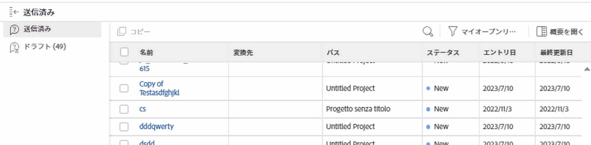

# 送信された要求の場所

自分または他のユーザーが送信したリクエスト、または開始したが送信を完了していないリクエストのタイプを確認できます。 これらのリクエストは、Adobe Workfrontの次の領域で検索できます。

* **送信済みセクション**:自分または他のユーザーが送信したすべてのリクエストと、少なくとも表示へのアクセス権を持っている。
* **ドラフトセクション** :開始したが、完了せず、送信しなかったすべてのリクエスト。 ドラフトリクエストについて詳しくは、 [Adobe Workfront要求の作成と送信](../../../manage-work/requests/create-requests/create-submit-requests.md).

   >[!TIP]
   >
   >自分の下書きリクエストのみを表示できます。

## アクセス要件

この記事の手順を実行するには、次の手順を実行する必要があります。

<table style="table-layout:auto"> 
 <col> 
 <col> 
 <tbody> 
  <tr> 
   <td role="rowheader">Adobe Workfront plan*</td> 
   <td> 
任意 
 </td> 
  </tr> 
  <tr> 
   <td role="rowheader">Adobe Workfrontライセンスの概要*</td> 
   <td> 
リクエスト以上
 </td> 
  </tr> 
  <tr> 
   <td role="rowheader">アクセスレベル設定*</td> 
   <td> 
問題へのアクセスを編集
 
<b>メモ</b>

まだアクセス権がない場合は、Workfront管理者に、アクセスレベルに追加の制限を設定しているかどうかを問い合わせてください。 Workfront管理者がアクセスレベルを変更する方法について詳しくは、 <a href="../../../administration-and-setup/add-users/configure-and-grant-access/create-modify-access-levels.md" class="MCXref xref">カスタムアクセスレベルの作成または変更</a>.
 </td>
</tr> 
  <tr> 
   <td role="rowheader">オブジェクト権限</td> 
   <td> 
リクエストに対する権限以上の表示
 
追加のアクセス権のリクエストについて詳しくは、 <a href="../../../workfront-basics/grant-and-request-access-to-objects/request-access.md" class="MCXref xref">オブジェクトへのアクセスのリクエスト </a>.
 </td> 
  </tr> 
 </tbody> 
</table>

*保有するプラン、ライセンスの種類、アクセス権を確認するには、Workfront管理者にお問い合わせください。

## 送信された要求の場所

自分または他のユーザーが送信した要求を見つけるには、次の手順を実行します。

1. 次をクリック： **メインメニュー** アイコン  Adobe Workfrontの右上隅にある
1. クリック **送信済み** が左側のパネルに表示され、送信されたすべてのリクエストが表示されます。

   最大 2,000 個のリクエストを表示でき、複数のページに表示できます。

   >[!TIP]
   >
   >「送信済みのリクエスト」リストの列はカスタマイズできません。

   

1. デフォルトでは、次の列が表示されます。

   <table style="table-layout:auto"> 
    <col> 
    <col> 
    <tbody> 
     <tr> 
      <td role="rowheader">名前</td> 
      <td> 
リクエストの名前。
 
リクエストの名前をクリックして開きます。 
 
<b>ヒント</b>

   タスクまたはプロジェクトに変換したときに問題が保持されなかった場合は、問題の名前が淡色表示になり、クリックできなくなります。 問題の変換について詳しくは、 <a href="../../../manage-work/issues/convert-issues/convert-issues.md" class="MCXref xref">Adobe Workfrontでの変換の問題の概要</a>. 
 </td>
   </tr> 
     <tr> 
      <td role="rowheader">変換先</td> 
      <td> 
リクエストの変換先のタスクまたはプロジェクトである解決オブジェクトの名前です。 
 
タスクまたはプロジェクトの名前をクリックして開きます。 
 
リクエストが変換されなかった場合、このフィールドは空です。 
 </td> 
     </tr> 
     <tr> 
      <td role="rowheader">パス</td> 
      <td>リクエストが最初に送信されたリクエストキュー、トピックグループ、およびキュートピックの名前。 </td> 
     </tr> 
     <tr> 
      <td role="rowheader">ステータス</td> 
      <td>リクエストの現在のステータス、または解決オブジェクト（タスクまたはプロジェクト）の現在のステータス</td> 
     </tr> 
     <tr> 
      <td role="rowheader">エントリ日</td> 
      <td>リクエストが送信された日付、または変換時にリクエストが削除された場合に解決オブジェクトが作成された日付。 </td> 
     </tr> 
     <tr> 
      <td role="rowheader">最終更新日</td> 
      <td> 
リクエストが最後に更新された日付。
 
「送信済みのリクエスト」リストは、デフォルトで、このフィールドで並べ替えられます。 
 </td> 
     </tr> 
    </tbody> 
   </table>

1. （オプション）並べ替える列のヘッダーをクリックします。

   >[!TIP]
   >
   >「送信済みのリクエスト」リストから移動すると、選択された並べ替えオプションが保持されます。

1. （オプション）リストからリクエストを選択し、 **概要を開く** アイコン  をクリックして Summary パネルを開き、要求に関する追加情報を表示したり、コメントやドキュメントを追加したり、割り当てたりします。 概要パネルについて詳しくは、 [概要の概要](../../../workfront-basics/the-new-workfront-experience/summary-overview.md).

   >[!TIP]
   >
   >[ 概要 ] パネルが既に開いている場合は、[ 概要を開く ] アイコンが [ 概要を閉じる ] に変わります。

1. （オプションおよび条件付き） **X** アイコンをクリックします。 **概要を閉じる** アイコン  をクリックして Summary Panel を閉じます。

   問題がタスクまたはプロジェクトに変換され、変換処理で問題が削除された場合、[ 概要 ] パネルは空白になります。 問題の変換について詳しくは、 [Adobe Workfrontでの変換の問題の概要](../../../manage-work/issues/convert-issues/convert-issues.md).

1. 次の **フィルターアイコン**  リストの右上で、次の表に示すフィルターのいずれかを選択します。

   >[!TIP]
   >
   >「要求」領域では、フィルターを変更できません。 また、「リクエスト」領域の表示を変更または変更するオプションはありません。

   <table style="table-layout:auto"> 
    <col> 
    <col> 
    <tbody> 
     <tr> 
      <td role="rowheader">すべて</td> 
      <td>ステータスや送信者に関係なく、すべての送信済みリクエスト。</td> 
     </tr> 
     <tr> 
      <td role="rowheader">開く</td> 
      <td> 
送信者に関係なく、現在開いているすべての送信済みリクエスト。 自分で送信しなかった場合は、少なくともここに表示する権限を持っているリクエストのみが表示されます。 
 
実際の完了日がない要求、またはその解決オブジェクトに実際の完了日が設定されていない要求は、「オープン」サブタブに表示されます。
 
<b>ヒント</b>

   ステータスが「クローズ済み」と等しくないリクエストは、オープンと見なされます。
 </td>
   </tr> 
     <tr> 
      <td role="rowheader">マイリクエスト</td> 
      <td>ステータスに関係なく、送信したリクエスト。 </td> 
     </tr> 
     <tr> 
      <td role="rowheader">My Open Requests</td> 
      <td> 
送信したリクエストがまだ開いています。 
 
実際の完了日がない要求、または解決オブジェクトに実際の完了日が設定されていない要求は、「オープン要求」サブタブに表示されます。 
 
<b>ヒント</b>

   ステータスが「クローズ」に等しくないリクエストは、「オープン」と見なされます。
 </td>
   </tr> 
    </tbody> 
   </table>

1. （オプション） **ページをフィルター** アイコン  をクリックし、名前でリクエストを検索します。 リストは、検索条件に一致する結果で更新されます。

   <!--
   <li value="9" data-mc-conditions="QuicksilverOrClassic.Draft mode"> 
Click the&nbsp;<strong>Complete</strong> subtab to view requests that have been completed.
 
(NOTE: this step will stay drafted even after release. We can't see Completed at this time!)  Requests with an Actual Completion Date or whose resolving object has an Actual Completion Date are listed in the Complete subtab. Once a request receives an Actual Completion Date, it stays in the Recently Completed area for 10 business days. After that, it is moved to the Completed area.  For information about resolving and resolvable objects, see the article <a href="../../../manage-work/issues/convert-issues/resolving-and-resolvable-objects.md" class="MCXref xref">Overview of Resolving and Resolvable Objects </a>.
 </li>
   -->

   <!--
   <li value="10" data-mc-conditions="QuicksilverOrClassic.Draft mode">(Optional) Select an option from the <strong>Sort by</strong> drop-down menu to sort the requests by the following criteria:&nbsp; &nbsp;(NOTE:&nbsp;this step will stay drafted even after release. We can't see Completed at this time!) &nbsp;
   <ul>
   <li><strong>Assigned To</strong>: Requests are sorted alphabetically by the name of the assignee using the following criteria:&nbsp;
   <ul>
   <li>All requests assigned to users are sorted first, in the order of the users' names.</li>
   <li>Requests assigned to job roles are sorted secondly, in the order of the job roles' names and are listed after all the requests assigned to users.</li>
   <li>Requests that are assigned to teams are sorted last, in the order of the teams' names and are listed after all the requests assigned to users and those assigned to job roles.</li>
   <li>All unassigned requests are listed last, in the order of their Entry Date. </li>
   </ul></li>
   <li><strong>Submitted On</strong>: Requests are sorted chronologically by the date when they were submitted.</li>
   <li><strong>Recently Updated</strong> (this is the default): Requests are sorted chronologically by the date of their last update.</li>
   <li><strong>Name</strong>: Requests are sorted alphabetically by name.&nbsp;</li>
   <li><strong>Priority</strong>: Requests are sorted in the order of their priority.</li>
   <li><strong>Queue</strong>: Requests are sorted alphabetically by the name of the requests queue where they were submitted.&nbsp;</li>
   <li><strong>Status</strong>: Requests are sorted alphabetically by their status.&nbsp;</li>
   </ul></li>
   -->

1. クリック **ドラフト** ：すべての下書きリクエストを表示します。 Workfrontは、このフォルダー内の各要求キューに対して無制限の数のドラフトを保存します。 既に下書きを持つキュートピックの新しいリクエストを入力すると、既存の下書きを使用するよう求めるプロンプトが表示されます。 詳しくは、 [下書きからのリクエストの作成](../../../manage-work/requests/create-requests/create-requests-from-drafts.md).

 

 

 
