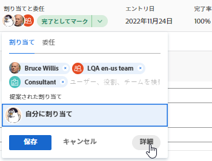

# タスクを割り当て

{{highlighted-preview}}

>[!IMPORTANT]
>
>2023 年 6 月 30 日のプレビューで、割り当て率の上書き機能が一時的に無効になりました。

ユーザー、ジョブの役割またはチームにタスクを割り当てて、タスクの完了担当者を指定できます。 一度に複数のリソースにタスクを割り当てることができます。

>[!TIP]
>
>複数のユーザー、ジョブの役割またはチームを割り当てることができます。 アクティブなユーザー、ジョブの役割およびチームのみを割り当てることができます。
>
>非アクティブ化前にユーザー、ジョブの役割、またはチームが割り当てられた場合、そのユーザーは作業項目に割り当てられたままになります。 この場合、次の操作をお勧めします。
>
>* 作業項目をアクティブなリソースに再割り当てする。
>* 非アクティブなチームのユーザをアクティブなチームに関連付け、作業項目をアクティブなチームに再割り当てします。
>

タスクに割り当てられたユーザー数とタスク所有者のスケジュールは、タスクの予定日を変更することで、プロジェクトのタイムラインが変更されます。 複数のユーザーをタスクに割り当てることの影響について詳しくは、 [タスクの割り当て変更の概要](../../../manage-work/tasks/assign-tasks/modify-task-assignments-overview.md).

タスクの割り当ての詳細については、この記事に加え、次の記事を読むことをお勧めします。

* [タスクの割り当て変更の概要](../../../manage-work/tasks/assign-tasks/modify-task-assignments-overview.md)
* [スマート割り当ての概要](../../../manage-work/tasks/assign-tasks/smart-assignments.md)
* [スマート割り当てを行う](../../../manage-work/tasks/assign-tasks/make-smart-assignments.md)
* [高度な割り当てを作成](../../../manage-work/tasks/assign-tasks/create-advanced-assignments.md)
* [タスクリスト内の複数のユーザー割り当てを変更する](../../../manage-work/tasks/assign-tasks/modify-multiple-assignments-in-task-list.md)
* [タスクを編集](../../../manage-work/tasks/manage-tasks/edit-tasks.md)
* [プロジェクトの概要の計画](../../../manage-work/projects/planning-a-project/plan-project.md)
* [タスクの概要計画完了日](../../../manage-work/tasks/task-information/task-planned-completion-date.md)
* [プロジェクトの完了予定日を設定](../../../manage-work/projects/planning-a-project/project-planned-completion-date.md)
* [システム全体のプロジェクト環境設定の指定](../../../administration-and-setup/set-up-workfront/configure-system-defaults/set-project-preferences.md)
* [ワークロードバランサーでの作業割り当ての概要](../../../resource-mgmt/workload-balancer/assign-work-in-workload-balancer.md)

## アクセス要件

<!--drafted for P&P - replace table below with this:

<table style="table-layout:auto"> 
 <col> 
 <col> 
 <tbody> 
  <tr> 
   <td role="rowheader">Adobe Workfront plan*</td> 
   <td> 
Any
 </td> 
  </tr> 
  <tr> 
   <td role="rowheader">Adobe Workfront license*</td> 
   <td> 
Current license: Standard
 
   Or
   
Legacy license: Work or higher

   </td> 
  </tr> 
  <tr> 
   <td role="rowheader">Access level configurations*</td> 
   <td> 
Edit access to Projects and Tasks
 
View or higher access to Users
 
<b>NOTE</b>
   
   If you still don't have access, ask your Workfront administrator if they set additional restrictions in your access level. For information on how a Workfront administrator can modify your access level, see <a href="../../../administration-and-setup/add-users/configure-and-grant-access/create-modify-access-levels.md" class="MCXref xref">Create or modify custom access levels</a>.
 </td> 
  </tr> 
  <tr> 
   <td role="rowheader">Object permissions</td> 
   <td> 
Contribute or higher permissions to tasks
 
For information on requesting additional access, see <a href="../../../workfront-basics/grant-and-request-access-to-objects/request-access.md" class="MCXref xref">Request access to objects </a>.
 </td> 
  </tr> 
 </tbody> 
</table>

-->

この記事の手順を実行するには、次のアクセス権が必要です。

<table style="table-layout:auto"> 
 <col> 
 <col> 
 <tbody> 
  <tr> 
   <td role="rowheader">Adobe Workfront plan*</td> 
   <td> 
任意
 </td> 
  </tr> 
  <tr> 
   <td role="rowheader">Adobe Workfront license*</td> 
   <td> 
仕事以上
 </td> 
  </tr> 
  <tr> 
   <td role="rowheader">アクセスレベル設定*</td> 
   <td> 
プロジェクトとタスクへのアクセスを編集
 
ユーザーへのアクセス権を表示するか、それ以上に設定する
 
<b>メモ</b>

まだアクセス権がない場合は、Workfront管理者に、アクセスレベルに追加の制限を設定しているかどうかを問い合わせてください。 Workfront管理者がアクセスレベルを変更する方法について詳しくは、 <a href="../../../administration-and-setup/add-users/configure-and-grant-access/create-modify-access-levels.md" class="MCXref xref">カスタムアクセスレベルの作成または変更</a>.
 </td>
</tr> 
  <tr> 
   <td role="rowheader">オブジェクト権限</td> 
   <td> 
タスクに権限を付与するか、それ以上の権限を付与する
 
追加のアクセス権のリクエストについて詳しくは、 <a href="../../../workfront-basics/grant-and-request-access-to-objects/request-access.md" class="MCXref xref">オブジェクトへのアクセスのリクエスト </a>.
 </td> 
  </tr> 
 </tbody> 
</table>

*保有するプラン、ライセンスの種類、アクセス権を確認するには、Workfront管理者にお問い合わせください。

## 役割、チーム、ユーザーに対する複数の割り当てに関する考慮事項

作業項目に複数のリソースを割り当てる際は、次の点に注意してください。

* ユーザーのプロファイルには、複数のジョブの役割を関連付けることができます。 ユーザーとジョブの役割の関連付けについて詳しくは、 [ユーザーのプロファイルの編集](../../../administration-and-setup/add-users/create-and-manage-users/edit-a-users-profile.md).

* 1 つのタスクまたはイシューに複数のユーザーを割り当てた場合、最初に選択した 1 人のユーザーが自動的にタスクまたはイシューの所有者に指定されます。
これを変更する手順については、この記事の「プライマリを作成」オプションに関する情報を参照してください [高度な割り当てを作成](create-advanced-assignments.md).

* チームは、タスクまたはイシューのプライマリの担当者にすることはできません。 タスクまたはイシューのプライマリとして指定できるのは、ユーザーまたはジョブの役割のみです。

<!-- If a task is assigned to multiple teams, the primary team sees the Work On It button. waiting on team to verify if this is true. (Courtney)
You cannot make a team be a Primary on a task/ issue. (Alina) -->

* プロジェクトのタスクとタスクは、1 つ以上のチームまたはジョブの役割に最初に割り当てられる場合があります。 プロジェクトを開始する準備が整ったら、ユーザーに割り当てる必要が生じる場合があります。

  <table>
  <col> 
  <col> 
  <tbody>
  <tr>
   <td>チーム</td>
   <td>タスクをチームに割り当て、ユーザーも割り当てた場合、ユーザーがチームのメンバーでなくても、タスクはチームとユーザーに割り当てられたままになります。</td>
  </tr>
  <tr>
   <td>担当業務</td>
   <td>
1 つまたは複数の役割にタスクまたはイシューを割り当て、ユーザーも割り当てた場合は、次の規則に従って、追加のユーザーに関連付けるジョブの役割を決定します（存在する場合）。

     <ul>
      <li>割り当てられたジョブの役割が 1 つだけで、ユーザーの主要な役割（ユーザーのプロファイルで設定）に一致する場合、タスクまたは問題はそのユーザーにのみ割り当てられます。</li>
      <li>複数の役割が割り当てられ、そのうち少なくとも 1 つがユーザーの他の役割のいずれかと一致する場合、タスクまたは問題がユーザーに割り当てられます（複数の役割が一致する場合はランダムに選択されます）。</li>
      <li>1 つ以上のジョブの役割が割り当てられ、ユーザーのジョブの役割に一致する役割がない場合、タスクまたは問題は役割または役割の両方とユーザーに割り当てられます。</li>
     </ul>
   
ユーザーの主な役割とその他の役割について詳しくは、 <a href="../../../administration-and-setup/add-users/create-and-manage-users/edit-a-users-profile.md">ユーザーのプロファイルの編集</a>.

   </td> 
     </tr>
  </tbody>
  </table>

<!--

<h2>Considerations for multiple user assignments and using schedules</h2>

(NOTE: moved to the Modify task assignments overview standalone article)

You can assign multiple resources to a task. When you assign a user to a task, Workfront uses the user's schedule to calculate the planned dates for the task which ultimately determine the timeline of the project. Using the schedule of the user takes into account their time off, holidays, and weekend days which are considered non-working days when task activity cannot occur. 

When you assign multiple users to a task, your Workfront administrator or a group administrator determines which one of the following schedules Workfront uses to determine the planned dates of the tasks, based on schedules: 

<ul>
<li> 
<strong>The Primary Assignee's schedule</strong>: this is the schedule associated with the user designated as the task Owner.
 
For information about associating users with schedules, see <a href="../../../administration-and-setup/add-users/create-and-manage-users/edit-a-users-profile.md" class="MCXref xref">Edit a user's profile</a>.
 </li>
<li><strong>The Project's schedule</strong>: this is the schedule associated with the project. For adding a schedule to a project, see <a href="../../../manage-work/projects/manage-projects/edit-projects.md" class="MCXref xref">Edit projects</a>.</li>
</ul>

For information about setting up which schedule a project uses in the case of multiple assignments, see <a href="../../../administration-and-setup/set-up-workfront/configure-system-defaults/set-project-preferences.md" class="MCXref xref">Configure system-wide project preferences</a>. 

-->

## 1 つのタスクを割り当て

1. 割り当てるタスクに移動します。
1. クリック **割り当て先** 内 **割り当て** タスクまたはイシューのヘッダーのフィールド。

   または

   タスクまたはタスクが既に割り当てられている場合は、割り当ての名前をクリックします。

   

1. 次のいずれかの操作を行います。

   * 割り当てるユーザー、役割、またはチームの名前を入力し、リストに表示されたらクリックします。

     >[!TIP]
     >
     >ユーザー割り当てを追加する際には、アバター、ユーザーのプライマリの役割、または電子メールアドレスに注意して、同じ名前のユーザーを区別します。 ユーザーを追加したときに表示するには、少なくとも 1 つのジョブの役割に関連付ける必要があります。
     >
     >ユーザーがユーザーの電子メールを表示するには、アクセスレベルで [ 連絡先情報の表示 ] 設定を有効にしておく必要があります。 詳しくは、 [ユーザーへのアクセス権の付与](../../../administration-and-setup/add-users/configure-and-grant-access/grant-access-other-users.md).
     >
     >ジョブロールの割り当てを追加する際に、ジョブロールまたは場所を検索できます。 割当にデフォルトの請求レートを使用する場合は「システム/デフォルト・ジョブ・ロール」を選択し、レート・カードから請求レートを使用する場合は「レート・カード・ジョブ・ロール」を選択します。 レートカードについて詳しくは、 [レートカードの管理](/help/quicksilver/administration-and-setup/set-up-workfront/configure-system-defaults/manage-rate-cards.md).

   * （条件付き） **推奨割り当て** リストが表示される場合は、このリストが表示されます。 詳しくは、 [スマート割り当ての概要](../../../manage-work/tasks/assign-tasks/smart-assignments.md).

   * クリック **詳細**

     高度な割り当てを行う方法については、 [高度な割り当てを作成](../../../manage-work/tasks/assign-tasks/create-advanced-assignments.md).

1. 「**保存**」をクリックします。
1. （オプションおよび条件付き） **X アイコン** 割り当てを削除するタスクの右パネルにある割り当て名の横に表示されます（クリックした場合）。 **詳細**.

## リスト内のタスクを割り当て

いずれかの割り当てフィールドがリストのビューに表示されている場合、リストまたはレポート内のタスクを割り当てることができます。 これは、タスクをより迅速に割り当てる方法です。 この記事では、リスト内の 1 つのタスクの割り当てを変更する方法について説明します。 リスト内の複数のタスクに対する複数の割り当てを変更する方法については、 [タスクリスト内の複数のユーザー割り当てを変更する](../../../manage-work/tasks/assign-tasks/modify-multiple-assignments-in-task-list.md).

ビューに表示されるフィールドに応じて、タスクに次のエンティティを割り当てることができます。

| フィールド | 割り当てられたエンティティ |
|---|---|
| **割り当て先** | 1 人のユーザーを割り当て |
| **割り当て** | 1 人のユーザーを割り当て |
| **割り当て** | ユーザー、ジョブの役割、またはチームの割り当て |

リスト内のタスクを割り当てる手順は、次のとおりです。

1. ビュー内の [ 割り当て先 ]、[ 割り当て先 ]、または [ 割り当て先 ] フィールドを持つタスクの一覧に移動します。
1. （オプション） **自動保存** ドロップダウンメニューから、次のオプションを選択します。

   | オプション | オプションの説明 |
   |---|---| 
   | 自動保存 | タスクに加えた変更は自動的に保存され、元に戻すことはできません |
   | 手動保存 | 変更は手動で保存する必要があります。 変更内容は、保存する前に元に戻すことができます。 |
   | タイムラインの計画 | 変更は手動で保存する必要があります。 変更内容は、保存する前に元に戻すことができます。 「手動保存」を選択した場合よりも、変更を保存したり、すべてのプロジェクトの依存関係を保存したりする方が速くなります。 |

   リストで編集中にタスクを保存する方法について詳しくは、 [リスト内のタスクの編集](../../../manage-work/tasks/manage-tasks/edit-tasks-in-a-list.md).

1. タスクを割り当てるには、次のいずれかを実行します。

   * 内側をクリック **割り当て先** または **割り当て済み** フィールドに入力し、タスクに割り当てるアクティブなユーザーの名前を入力し、リストに表示されたらクリックします。
   * 内側をクリック **割り当て** フィールドに、タスクに割り当てるアクティブなユーザー、ジョブの役割、またはチームの名前を入力し、リストに表示されたらクリックします。

     >[!TIP]
     >
     >ユーザー割り当てを追加する際には、アバター、ユーザーのプライマリの役割、または電子メールアドレスに注意して、同じ名前のユーザーを区別します。 ユーザーを追加したときに表示するには、少なくとも 1 つのジョブの役割に関連付ける必要があります。
     >
     >ユーザーがユーザーの電子メールを表示するには、アクセスレベルで [ 連絡先情報の表示 ] 設定を有効にしておく必要があります。 詳しくは、 [ユーザーへのアクセス権の付与](../../../administration-and-setup/add-users/configure-and-grant-access/grant-access-other-users.md)
     >
     >ジョブロールの割り当てを追加する際に、ジョブロールまたは場所を検索できます。 割当にデフォルトの請求レートを使用する場合は「システム/デフォルト・ジョブ・ロール」を選択し、レート・カードから請求レートを使用する場合は「レート・カード・ジョブ・ロール」を選択します。 レートカードについて詳しくは、 [レートカードの管理](/help/quicksilver/administration-and-setup/set-up-workfront/configure-system-defaults/manage-rate-cards.md).

1. （条件付き） **割り当て** フィールドで、 **人** 割り当てボックスの右上隅にあるアイコンをクリックして、 **高度な割り当て** 」ボックスに入力し、高度な割り当てを作成します。

   <!--
   there is a People icon in NWE but it's hard to see - you need to assign the task to at least 2 users, not roles, or teams, before it shows up

   -->

   詳しくは、 [高度な割り当てを作成](../../../manage-work/tasks/assign-tasks/create-advanced-assignments.md).

   >[!TIP]
   >
   >「割り当て先」フィールドまたは「割り当て先」フィールドからは、高度な割り当てを行うことはできません。

1. タスクに担当者を追加した後、Enter キーを押すか、ページ上の任意の場所をクリックして、「自動保存」を選択した場合に変更を保存します。 それ以外の場合は、 **保存**.

## ユーザーに複数のタスクを割り当て

1. 一括で割り当てるタスクのリストに移動します。
1. （条件付き） **自動保存** オプションは、プロジェクトのタスクのリストにある場合に選択します。

   >[!IMPORTANT]
   >
   >プロジェクトでタスクを手動で保存する場合は、タスクを一括で編集できません。

1. タスクリストで複数のタスクを選択します。
1. クリック **編集**.

   この **タスクを編集** ダイアログボックスが開きます。

1. 内 **割り当て** 領域で、 **担当者** ボックスに、すべてのタスクに割り当てるユーザー、ジョブの役割、またはチームの名前を入力します。

   >[!IMPORTANT]
   >
   >タスクが既に割り当てられている場合、ここに指定したリソースは、タスク上の既存のリソースを置き換える代わりに、タスクに追加されます。

1. （オプション） **タスク所有者** 複数のリソースをタスクに割り当てる場合に、タスクの主担当者または所有者であるリソースを示す列。 これは、チームには使用できません。
1. （条件付き） **配分%** 選択したすべてのタスクに「期間タイプ」（「作業主導」または「計算済割り当て」）がある場合、タスクに割り当てられた各リソースに対して。 これは、これらのリソースがタスクの完了に費やす時間を示します。 これは、ユーザーとジョブの役割でのみ使用できます。

   または

   金額を指定 **時間** 選択したすべてのタスクの [ 期間の種類 ] が [ シンプル ] の場合は、タスクに割り当てられた各リソースに対して実行します。 すべてのリソースの全時間の合計は、タスクの予定時間数と等しくする必要があります。

   >[!IMPORTANT]
   >
   >選択したタスクの期間の種類や選択したタスクの期間の種類が異なる場合は、割り当ての割合またはリソースごとの時間数を指定できません。

   タスクの期間のタイプについて詳しくは、 [タスクの期間と期間のタイプの概要](../../../manage-work/tasks/taskdurtn/task-duration-and-duration-type.md).

1. （オプション）ユーザーがタスクで実行する必要がある役割を **役割を選択** ドロップダウンメニュー **担当者の役割** 」列に表示されます。 役割を選択しない場合、Workfrontはユーザーの役割を自動的にプライマリします。

1. （オプション）すべてのタスクから既存の担当者を削除する場合は、次のいずれかを実行します。

   1. タスクから削除するユーザー、役割、またはチームの名前を入力し、リストに表示されたら選択して、「 」をクリックします **担当者を削除** をクリックして、さらに担当者を削除します。
   1. クリック **既存の担当者をすべて削除** 選択したすべてのタスクからすべての担当者を削除します。

1. 「**変更を保存**」をクリックします。
1. （オプションおよび条件付き）タスクのリストに「割り当て先」フィールドまたは「割り当て先」フィールドが表示されたら、タスクの列の 1 つ内をクリックし、 **X アイコン** タスクから削除する担当者の名前の横に表示されます。

<!--

<h2>Considerations about unassigning tasks</h2>

(NOTE: moved this to the new article: /Content/Manage work/Tasks/Assign tasks/modify-task-assignments-overview.htm)

You can remove assignments from one task at a time, or you can remove assignments from multiple tasks in bulk.

For more information about removing assignments from tasks in bulk, see <a href="../../../manage-work/tasks/assign-tasks/modify-multiple-assignments-in-task-list.md" class="MCXref xref">Modify multiple user assignments in a task list</a>. 

Consider the following when removing assignments from tasks: 

<ul>
<li>When you unassign a user from a task, the task remains assigned to the job role that the user fulfilled on the task.</li>
<li>When you unassign a job role or a team from a task, the task remains unassigned if it is not assigned to any other resources. </li>
</ul>

-->

