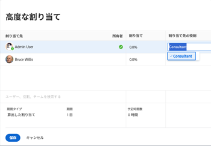
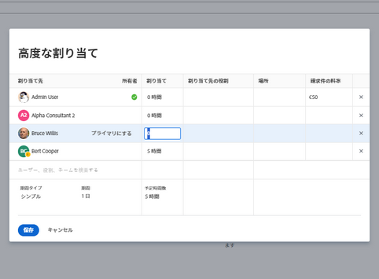

# 高度な割り当てを作成

{{highlighted-preview}}

>[!IMPORTANT]
>
>2023 年 6 月 30 日のプレビューで、割り当て率の上書き機能が一時的に無効になりました。

タスクまたは課題の割り当ては、[ 詳細な割り当て ] を使用して管理できます。

高度な割り当てを行う際に、次の割り当て情報を調整できます。

* タスクまたはイシューにユーザーを割り当てます（高度な割り当て以外で実行できます）。
* 各担当者に割り当てられる時間数を調整および再配分します。
* タスクまたはイシューの所有者またはプライマリの担当者に指定するユーザーを決定します。
* タスクまたはイシューで作業する際に各ユーザーが果たす役割を指定します。
* ジョブロールの請求率を上書きします。

>[!NOTE]
>
>ユーザーを作業に割り当てる場合、スケジュールに従って使用できるかどうかは、タスクや問題の計画日と予定日に影響します。 スケジュールについて詳しくは、 [スケジュールの作成](../../../administration-and-setup/set-up-workfront/configure-timesheets-schedules/create-schedules.md).

## 高度な割り当てを行えるAdobe Workfrontの領域

この記事では、タスクまたはイシューのヘッダーで「事前割り当て」にアクセスする方法について説明します。

さらに、Workfrontの次の領域で高度な割り当てをおこなうことができます。

* [ 割り当て ] フィールドがビューに表示されるときのリストとレポート。
* （タスクの編集時の「割り当て」セクション）。 詳しくは、 [タスクを編集](../../../manage-work/tasks/manage-tasks/edit-tasks.md).
* タスクまたはイシューのヘッダーの「割り当て」領域で、
* ワークロードバランサー内。 詳しくは、 [ワークロードバランサーを使用して作業を手動で割り当て](../../../resource-mgmt/workload-balancer/assign-work-in-workload-balancer-manually.md).

## アクセス要件

この記事の手順を実行するには、次のアクセス権が必要です。

<table style="table-layout:auto"> 
 <col> 
 <col> 
 <tbody> 
  <tr> 
   <td role="rowheader">Adobe Workfront plan*</td> 
   <td> 
任意
 </td> 
  </tr> 
  <tr> 
   <td role="rowheader">Adobe Workfront license*</td> 
   <td> 
仕事以上
 </td> 
  </tr> 
  <tr> 
   <td role="rowheader">アクセスレベル設定*</td> 
   <td> 
タスクおよび問題へのアクセスを編集
 
<b>メモ</b>

まだアクセス権がない場合は、Workfront管理者に、アクセスレベルに追加の制限を設定しているかどうかを問い合わせてください。 Workfront管理者がアクセスレベルを変更する方法について詳しくは、 <a href="../../../administration-and-setup/add-users/configure-and-grant-access/create-modify-access-levels.md" class="MCXref xref">カスタムアクセスレベルの作成または変更</a>.
 </td>
</tr> 
  <tr> 
   <td role="rowheader">オブジェクト権限</td> 
   <td> 
タスクまたはイシューに対する権限を貢献するか、それ以上に設定する
 
追加のアクセス権のリクエストについて詳しくは、 <a href="../../../workfront-basics/grant-and-request-access-to-objects/request-access.md" class="MCXref xref">オブジェクトへのアクセスのリクエスト </a>.
 </td> 
  </tr> 
 </tbody> 
</table>

&#42;保有しているプラン、ライセンスの種類、アクセス権を確認するには、Workfront管理者に問い合わせてください。

## 高度な割り当てを行う

1. タスクまたはイシューを割り当てるプロジェクトに移動します。
1. クリック **タスク** または **問題** 左側のパネルで、リスト内のタスクまたはイシューの名前をクリックします。

   >[!TIP]
   >
   >複数の担当者が割り当てられている場合は、タスクまたはイシューリストで直接高度な割り当てを行うことができます。 内側をクリック **割り当て** タスクまたはイシューと同じ行のフィールドを選択し、 **人物アイコン** をクリックして、「詳細割当」ウィンドウを開きます。 高度な割り当ての作成を続行するには、手順 5 に進んでください。\
   >
   >

1. クリック **割り当て先** 内 **割り当て** タスクまたはイシューのヘッダーのフィールド

   または

   タスクまたはタスクが既に割り当てられている場合は、割り当ての名前をクリックします。

1. クリック **詳細**.

   

1. 内 **担当者、役割、チームの検索** フィールドにユーザー、役割、またはチームの名前を入力し、ドロップダウンリストに表示されたら名前をクリックします。

   >[!NOTE]
   >
   >ユーザーの名前に特殊文字が含まれている場合は、その特殊文字を検索フィールドに含める必要があります。

1. （オプション）引き続き **担当者、役割またはチームを検索** ボックスを使用して、タスクまたはイシューに複数のリソースを追加します。

   >[!TIP]
   >
   >* 複数のユーザー、ジョブの役割またはチームを割り当てることができます。 アクティブなユーザー、ジョブの役割およびチームのみを割り当てることができます。
   >
   >
   >* ユーザー割り当てを追加する際には、アバター、ユーザーのプライマリの役割、または電子メールアドレスに注意して、同じ名前のユーザーを区別します。 ユーザーを追加したときに表示するには、少なくとも 1 つのジョブの役割に関連付ける必要があります。
   >
   >
   >* ジョブロールの割り当てを追加する際に、ジョブロールまたは場所を検索できます。 割当に対するデフォルトの請求率を使用する場合は「システム・ロール」または「デフォルト・ジョブ・ロール」を選択し、割当レベルでのレートを上書きする場合は「レート・カード・ジョブ・ロール」を選択します。 レートカードについて詳しくは、 [レートカードの管理](/help/quicksilver/administration-and-setup/set-up-workfront/configure-system-defaults/manage-rate-cards.md).
   >
   >
   >* 非アクティブ化前にユーザー、ジョブの役割、またはチームが割り当てられた場合、そのユーザーは作業項目に割り当てられたままになります。 この場合、次の操作をお勧めします。
   >   
   >   * 作業項目をアクティブなリソースに再割り当てする。
   >   * 非アクティブなチームのユーザをアクティブなチームに関連付け、作業項目をアクティブなチームに再割り当てします。
   >   
   >

1. ユーザーごとに **担当者** 列に、次の情報を指定します。

   * **所有者**:担当者の名前の上にマウスポインターを置いて、 **プライマリ** 担当者をタスクまたはイシューの所有者としてマークする場合は、「所有者」フィールドを使用します。 緑のチェックボックスは、指定したユーザーがタスクまたはイシューのプライマリ連絡先であることを示します。 Adobe Workfrontは、タスクまたはイシューに最初に割り当てたユーザーまたはジョブの役割を、所有者またはプライマリの割り当てとしてマークします。 チームは、タスクまたはイシューのプライマリ所有者に指定できません。

     >[!IMPORTANT]
     >
     >Workfront管理者またはグループ管理者がプロジェクト環境設定をおこなう方法に応じて、Workfrontでは、複数のユーザーをタスクに割り当てている場合に、タスク所有者のスケジュールを使用してタスクのタイムラインを計算できます。 複数のタスクの割り当て先について詳しくは、この記事の「複数のユーザーをタスクに割り当てる」の節を参照してください [タスクを割り当て](../../../manage-work/tasks/assign-tasks/assign-tasks.md).

   * **配分** :タスクの期間の種類が [ 簡易 ] の場合は、各ユーザーまたはジョブの役割をタスクに割り当てる時間数を指定します。 各ユーザーに割り当てられたすべての時間の合計は、 **予定時間** フィールドを使用します。 それ以外の場合は、タスクまたは問題の解決に担当者が費やす時間（または配分）の割合を指定します。

     <!--   
     
(NOTE: make sure this is right in the new UI for both classic and QS???)
   
     -->

     >[!TIP]
     >
     >
     >   
     >   
     >   * タスクの割り当てを手動で変更すると、タスクの予定時間がそれに応じて更新される場合があります。 詳細については、この記事の「ユーザー割り当てを管理する際のタスク予定時間の更新」を参照してください [計画時間の概要](../../../manage-work/tasks/task-information/planned-hours.md).
     >   * 問題に対する割り当てを手動で変更することはできません。
     >   * タスクに割り当てられたチームの割り当てを手動で変更することはできません。
     >   
     >

   * **担当者の役割：** この割り当てを実行する際にユーザーが使用する役割を選択します。  プライマリの役割は、デフォルトで表示されます。 「担当者の役割」ボックスをクリックして、別の役割を選択します。  最初にタスクまたはタスクをロールに割り当て、次にそのロールを果たすユーザーを 2 番目のアサイメントとして追加すると、タスクおよびタスクに既に割り当てられているロールを満たすユーザーの候補ユーザーがフィルタされます。

     

   

   * **場所**:プロジェクトに添付されたレートカードがジョブの役割を持つロケーションを使用している場合、ロケーションはレートカードから取得されます。 場所は変更できません。

   * **請求率**:ユーザーの請求率は、ユーザーまたは関連するジョブロールのシステム率から取得されます。 ジョブロールの請求率は、システムレートまたはレートカード（レートカードがプロジェクトに添付されている場合）から取得されます。 既存の請求率は、このフィールドには表示されません。 この特定のタスク割り当ての請求率を変更するには、[ ] フィールドをクリックします。

   

   * **期間のタイプ**:これは、タスクに対してのみ使用できます。 期間タイプの名前をクリックし、ドロップダウンメニューから期間タイプを選択します。 期間のタイプについて詳しくは、 [タスクの期間と期間のタイプの概要](../../../manage-work/tasks/taskdurtn/task-duration-and-duration-type.md).

   * **期間：** タスクに対する管理権限を持っている場合は、タスクに対してこのフィールドを更新できます。

     詳しくは、 [タスクの期間と期間のタイプの概要](../../../manage-work/tasks/taskdurtn/task-duration-and-duration-type.md). 割り当て情報を一括編集すると、ユーザー、時間、割り当て、タスク所有者を割り当てるための同様のダイアログボックスが表示されます。

   * **予定時間**:「期間タイプ」が「割り当ての計算」または「単純」の場合は、計画時間数を更新します。 その結果、各リソースの割り当て率または時間が均等に配分されます。 Workfrontは、期間タイプが「作業時間または工数主導」の計算時間を計算します。 詳しくは、 [タスクの期間と期間のタイプの概要](../../../manage-work/tasks/taskdurtn/task-duration-and-duration-type.md).

     実稼動環境のサンプル画像：

     

     

     プレビュー環境のサンプル画像：

     

     

1. 「**保存**」をクリックします。
