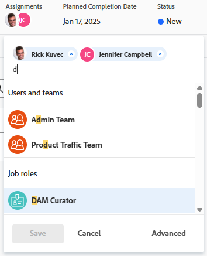

# 高度な割り当てを作成

<!-- Audited: 11/2025-->

<!--remove the bullet indicated when we get rid of the new/old experience of editing tasks-->

<!--
 

The highlighted information on this page refers to functionality not yet generally available. It is available only in the Preview environment for all customers. The same features will also be available in the Production environment for all customers starting with  a week from the Preview release.      

For more information, see [Interface modernization](/help/quicksilver/product-announcements/product-releases/interface-modernization/interface-modernization.md).  

 -->

高度な割り当てを使用して、タスクまたはイシューの割り当てを管理できます。

高度な割り当てを行う際に、割り当て情報を次のように調整できます。

* タスクまたはイシューにユーザーを割り当て（高度な割り当て以外で実行可能）。
* 各担当者に配分される時間数を調整および再配分。
* タスクまたはイシューの所有者またはプライマリ担当者に指定するユーザーを決定。
* タスクまたはイシューで作業する際に各ユーザーが果たす役割を指定。
  <!--* Override the billing rate for a job role.-->

>[!NOTE]
>
>ユーザーを作業に割り当てる場合、ユーザーのスケジュールに応じた空き時間は、タスクやイシューの予定日と見込日に影響します。スケジュールについて詳しくは、[スケジュールの作成](../../../administration-and-setup/set-up-workfront/configure-timesheets-schedules/create-schedules.md)を参照してください。

## 高度な割り当てを行える Adobe Workfront の領域

この記事では、タスクまたは問題のヘッダーで詳細割り当てにアクセスする方法について説明します。

Workfront の次の領域でも、高度な割り当てをおこなうことができます。

* リストとレポート（割り当てフィールドがビューに表示されている場合）。
* タスクの編集時の「割り当て」セクション。

。詳しくは、[ タスクの編集 ](../../../manage-work/tasks/manage-tasks/edit-tasks.md) を参照してください。<!--When we remove the old/ new experience: take this bullet out completely; in the new Edit Task experience, this is no longer possible-->
* 割り当て領域のタスクまたはイシューのヘッダー。
* ワークロードバランサー内（詳しくは、[ワークロードバランサーを使用した手動による作業の割り当て](../../../resource-mgmt/workload-balancer/assign-work-in-workload-balancer-manually.md)を参照してください）

## アクセス要件

+++ 展開すると、この記事の機能のアクセス要件が表示されます。

<table style="table-layout:auto"> 
 <col> 
 <col> 
 <tbody> 
  <tr> 
   <td>Adobe Workfront パッケージ</td> 
   <td> 
任意
 </td> 
  </tr> 
  <tr> 
   <td>Adobe Workfront プラン</td> 
   <td> 
標準

   
ワークまたはそれ以上

   </td> 
  </tr> 
  <tr> 
   <td role>アクセスレベル設定</td> 
   <td> 
タスクおよびイシューに対する編集アクセス権
  </td> 
  </tr> 
  <tr> 
   <td>オブジェクト権限</td> 
   <td> 
タスクまたは問題に対する投稿以上の権限
</td> 
  </tr> 
 </tbody> 
</table>

詳しくは、[Workfront ドキュメントのアクセス要件](/help/quicksilver/administration-and-setup/add-users/access-levels-and-object-permissions/access-level-requirements-in-documentation.md)を参照してください。

+++

## 高度な割り当てを行う

1. タスクまたはイシューを割り当てるプロジェクトに移動します。
1. 左側のパネルで「**タスク**」または「**イシュー**」をクリックし、リスト内のタスクまたはイシューの名前をクリックします。

   >[!TIP]
   >
   >タスクまたは問題リストで直接詳細な割り当てを行うことができます。 タスクまたは問題と同じ行の「**割り当て**」フィールド内をクリックし、リストの下部にある **詳細** をクリックするか、割り当てボックスの右上隅にある **人物アイコン** をクリックして、「詳細な割り当て」ウィンドウを開きます。 高度な割り当ての作成を続行するには、手順 5 に進んでください。
   >。

1. タスクまたはイシューのヘッダーにある&#x200B;**割り当て**&#x200B;フィールドの「**割り当て先**」をクリックします。

   または

   タスクまたは問題が既に割り当てられている場合は、割り当てられた名前のいずれかをクリックします。

1. 「**詳細**」をクリックします。

   

1. 「**ユーザー、役割、チームを検索**」フィールドにユーザー、役割、チームの名前の入力を開始し、ドロップダウンリストに表示される名前をクリックします。

   >[!NOTE]
   >
   >ユーザーの名前に特殊文字が含まれている場合は、その特殊文字を検索フィールドに含める必要があります。

1. （任意）「担当者、役割、チームを検索 **ボックスに担当者を引き続き追加して** タスクまたは問題に複数のリソースを追加します。

   >[!TIP]
   >
   >* 複数のユーザー、担当業務やチームを割り当てることができます。アクティブなユーザー、担当業務およびチームのみを割り当てることができます。
   >
   >
   >* ユーザー割り当てを追加する際には、アバター、ユーザーの主要な役割やメールアドレスに注意して、同じ名前のユーザーを区別してください。
   >ユーザーを追加したときに表示するには、少なくとも 1 つの担当業務に関連付ける必要があります。
   >ユーザーがユーザーのメールを表示するには、アクセスレベルで、連絡情報の表示の設定を有効にしておく必要があります。詳しくは、[ユーザーへのアクセス権の付与](../../../administration-and-setup/add-users/configure-and-grant-access/grant-access-other-users.md)を参照してください。
   >
   >
   >* ユーザー、担当業務、またはチームが非アクティブ化される前に割り当てられていた場合、それらは作業アイテムに割り当てられたままになります。この場合、以下の操作をお勧めします。
   >   
   >   * 作業アイテムをアクティブなリソースに再割り当てする。
   >   * 非アクティブ化されたチームのユーザーをアクティブなチームに関連付け、作業アイテムをアクティブなチームに再割り当てする。

   <!-- SHOULD BE THIRD BULLET POINT IN TIP TABLE WHEN THIS FEATURE IS RELEASED 
    * When adding a job role assignment, you can search for the job role or location. Select the System/Default Job Role to use the default billing rate for the assignment, or select a Rate Card Job Role to override the rate at the assignment level. For more information on rate cards, see [Manage rate cards](/help/quicksilver/administration-and-setup/set-up-workfront/configure-system-defaults/manage-rate-cards.md).
    -->

1. 「**担当者**」列で、ユーザーごとに次の情報を指定します。

   * **所有者**：担当者をタスクまたはイシューの所有者としてマークする場合は、担当者の名前にポインタを合わせ、所有者フィールドの「**プライマリにする**」をクリックします。緑のチェックボックスは、指定したユーザーがタスクまたはイシューのプライマリ連絡先であることを示します。Adobe Workfront は、タスクやイシューに最初に割り当てたユーザーや担当業務を、所有者またはプライマリ割り当てとしてマークします。チームは、タスクやイシューのプライマリ所有者に指定できません。

     >[!IMPORTANT]
     >
     >Workfront 管理者またはグループ管理者がプロジェクトの環境設定をどのように指定したかに応じて、複数のユーザーがタスクに割り当てられている場合、Workfront はタスク所有者のスケジュールを使用してタスクのタイムラインを計算する場合があります。複数のタスクの担当者について詳しくは、[タスクの割り当て](../../../manage-work/tasks/assign-tasks/assign-tasks.md)の記事の「複数のユーザーをタスクに割り当て」の節を参照してください。

   * **割り当て**：タスクの「期間タイプ」が「シンプル」の場合、各ユーザーまたは担当業務をタスクに割り当てる時間数を指定します。 各ユーザーに割り当てられたすべての時間の合計は、「配分」列の下部にある&#x200B;**予定時間数**&#x200B;フィールドの数値と等しくなります。それ以外のすべての期間タイプでは、タスクやイシューの解決に担当者が費やす時間の割合（または配分）を指定します。

     >[!TIP]
     >   
     >   * タスクの割り当ての配分を手動で変更すると、タスクの予定時間数がそれに応じて更新される場合があります。詳しくは、[予定時間数の概要](../../../manage-work/tasks/task-information/planned-hours.md)の記事の「ユーザーの配分を管理する際のタスクの予定時間数を更新」の節を参照してください。
     >   * イシューに対する割り当ての配分を手動で変更することはできません。
     >   * タスクに割り当てられたチームの配分を手動で変更することはできません。

   * **割り当て先の役割：**&#x200B;この割り当てを実行する際にユーザーが使用する役割を選択します。デフォルトでは、ユーザーの主要役割が表示されます。「**担当者の役割**」ボックスをクリックして、別の役割を選択します。 最初にタスクやイシューを役割に割り当て、次にその役割を実行できるユーザーを 2 番目の割り当てとして追加すると、ユーザー候補のリストは、タスクやイシューに既に割り当てられている役割を実行できるユーザーに絞り込まれます。

     

   <!--

   * **Location**: The location comes from the rate card, if a rate card attached to the project uses locations with the job roles. The location can't be changed. 

   * **Billing Rates**: The billing rate for a user comes from the system rate for the user or their associated job role. The billing rate for a job role comes from the system rate or from the rate card, if a rate card is attached to the project. Existing billing rates are not displayed in this field. Click in the field to change the billing rate for this specific task assignment.

   
-->

   * **期間タイプ**：これは、タスクでのみ使用できます。期間タイプの名前をクリックし、ドロップダウンメニューから期間タイプを選択します。期間タイプについては、[タスクの期間と期間タイプの概要](../../../manage-work/tasks/taskdurtn/task-duration-and-duration-type.md)を参照してください。

   * **期間：**&#x200B;タスクに対する管理権限がある場合は、タスクのこのフィールドを更新できます。

     詳しくは、[タスクの期間と期間タイプの概要](../../../manage-work/tasks/taskdurtn/task-duration-and-duration-type.md)を参照してください。割り当て情報を一括編集すると、ユーザー、時間数、配分およびタスク所有者を割り当てるための同様のダイアログボックスが表示されます。

   * **予定時間数**：期間タイプが「予定割り当て時間」または「シンプル」の場合は、予定時間数の数値を更新します。その結果、それぞれのリソースの配分率または時間数が均等に配分されます。Workfront では、期間タイプが「予定作業」または「残存作業時間の優先」の場合は、予定時間数を計算します。詳しくは、[タスクの期間と期間タイプの概要](../../../manage-work/tasks/taskdurtn/task-duration-and-duration-type.md)を参照してください。

1. 「**保存**」をクリックします。
