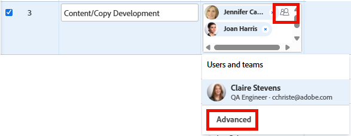

# 高度な割り当てを作成

{{highlighted-preview}}

<!-- Audited: 11/2025-->

<!--remove the bullet indicated when we get rid of the new/old experience of editing tasks-->

<!--

 

The highlighted information on this page refers to functionality not yet generally available. It is available only in the Preview environment for all customers. The same features will also be available in the Production environment for all customers starting with  a week from the Preview release.      

For more information, see [Interface modernization](/help/quicksilver/product-announcements/product-releases/interface-modernization/interface-modernization.md).  

-->

タスクまたはイシューの割り当ては、高度な割り当てを使用して管理できます。

高度な割り当てを行う際に、割り当て情報を次のように調整できます。

* タスクまたはイシューにユーザーを割り当て（高度な割り当て以外で実行可能）。
* 各担当者に配分される時間数を調整および再配分。
* タスクまたはイシューの所有者またはプライマリ担当者に指定するユーザーを決定。
* タスクまたはイシューで作業する際に各ユーザーが果たす役割を指定。
* 割り当てレベルで請求とコストのレート情報を追加します。
* 各割り当てについて、時間ベースの予定時間、総費用、総収益の詳細を確認します。

>[!NOTE]
>
>ユーザーを作業に割り当てる場合、ユーザーのスケジュールに応じた空き時間は、タスクやイシューの予定日と見込日に影響します。スケジュールについて詳しくは、[スケジュールの作成](../../../administration-and-setup/set-up-workfront/configure-timesheets-schedules/create-schedules.md)を参照してください。

## 高度な割り当てを行える Adobe Workfront の領域

この記事では、タスクまたはイシューのヘッダーで高度な割り当てにアクセスする方法について説明します。

Workfront の次の領域でも、高度な割り当てをおこなうことができます。

* リストとレポート（割り当てフィールドがビューに表示されている場合）。
* タスクの編集時の「割り当て」セクション。

。詳しくは、[&#x200B; タスクの編集](../../../manage-work/tasks/manage-tasks/edit-tasks.md)を参照してください。<!--When we remove the old/ new experience: take this bullet out completely; in the new Edit Task experience, this is no longer possible-->
* 割り当て領域のタスクまたはイシューのヘッダー。
* ワークロードバランサー内（詳しくは、[ワークロードバランサーを使用した手動による作業の割り当て](../../../resource-mgmt/workload-balancer/assign-work-in-workload-balancer-manually.md)を参照してください）

## アクセス要件

+++ 展開すると、この記事の機能のアクセス要件が表示されます。

<table style="table-layout:auto"> 
 <col> 
 <col> 
 <tbody> 
  <tr> 
   <td>Adobe Workfront パッケージ</td> 
   <td> 
タスクの割り当てに請求とコストのレートを追加し、高度な検索を使用するには：ワークフローUltimate
 
高度な割り当てを作成するには：任意のWorkfrontまたはワークフローパッケージ
</td> 
  </tr> 
  <tr> 
   <td>Adobe Workfront プラン</td> 
   <td> 
標準

   
Work またはそれ以上

   </td> 
  </tr> 
  <tr> 
   <td role>アクセスレベル設定</td> 
   <td> 
タスクおよびイシューに対する編集アクセス権
  </td> 
  </tr> 
  <tr> 
   <td>オブジェクト権限</td> 
   <td> 
タスクまたは問題に対する権限の貢献度を上げます
</td> 
  </tr> 
 </tbody> 
</table>

詳しくは、[Workfront ドキュメントのアクセス要件](/help/quicksilver/administration-and-setup/add-users/access-levels-and-object-permissions/access-level-requirements-in-documentation.md)を参照してください。

+++

## 高度な割り当ての作成 – ワークフローUltimate パッケージ

この高度な割り当てのレイアウトは、タスクにのみ適用されます。 問題については、[高度な割り当ての作成 – 他のすべてのパッケージ &#x200B;](#create-advanced-assignments--all-other-packages)を参照してください。

1. タスクを割り当てるプロジェクトに移動します。
1. 左側のパネルで「**タスク**」または「**問題**」をクリックし、リスト内のタスクの名前をクリックします。

   >[!TIP]
   >
   >タスクリストで直接高度な割り当てをおこなうことができます。 タスクと同じ行の&#x200B;**割り当て** フィールド内をクリックし、リストの下部にある&#x200B;**詳細**、または割り当てボックスの右上隅にある&#x200B;**人物アイコン**&#x200B;をクリックして、「詳細な割り当て」ウィンドウを開きます。 高度な割り当ての作成を続行するには、手順 5 に進んでください。
   >

1. タスクのヘッダーの「**割り当て**」フィールドで「**割り当て**」をクリックします

   または

   タスクが既に割り当てられている場合は、割り当てられた名前のいずれかをクリックします。

1. 「**詳細**」をクリックします。

   

   「詳細割り当て」ウィンドウが表示されます。

   

1. 必要に応じて、タスク期間の情報を確認します。 これらのフィールドはすべて高度な割り当てからの表示専用であり、タスクで更新できます。

   タスク期間、期間タイプ、時間単位、予定時間数について詳しくは、[&#x200B; タスク期間と期間タイプの概要](/help/quicksilver/manage-work/tasks/taskdurtn/task-duration-and-duration-type.md)を参照してください。

1. （オプション）割り当てを表示するには、**時間**、**FTE**&#x200B;または&#x200B;**パーセンテージ**&#x200B;を選択します。

   ユーザーが割り当てられている時間を、計画時間、キャパシティに対する割合、またはFTE （フルタイム当量、0 ～ 1 スケール）で確認できます。 デフォルト設定は時間数です。

   FTEについて詳しくは、[&#x200B; リソース管理の環境設定](/help/quicksilver/administration-and-setup/set-up-workfront/configure-system-defaults/configure-resource-mgmt-preferences.md)を参照してください。

1. タスクに割り当てを追加するには、**新しい行**&#x200B;をクリックします。

1. **担当者**&#x200B;列をクリックして、ユーザーまたはチームを追加します。 ユーザーまたはチームの名前を入力し始め、ドロップダウンリストに表示される名前をクリックします。

   >[!NOTE]
   >
   >名前に特殊文字が含まれている場合は、検索フィールドに特殊文字を含める必要があります。

   プライマリジョブの役割を持つユーザーを追加すると、**担当者の役割**&#x200B;が入力されます。

   ユーザーにプロファイルに属性が割り当てられている場合、属性はタスク割り当てに入力されます。

1. タスクで作業するユーザーがわからない場合に担当業務を追加するには、「**担当者の役割**」列をクリックします。 担当業務の名前を入力し、ドロップダウンリストに表示される名前をクリックします。

   >[!NOTE]
   >
   >名前に特殊文字が含まれている場合は、検索フィールドに特殊文字を含める必要があります。

   ジョブロールにプロジェクトのレートカードから割り当てられた属性がある場合、属性はタスク割り当てに入力されます。

   後で「担当者」フィールドを使用してユーザーを割り当てると、基本検索は次のアルゴリズムに従います。

   * 完全一致：担当業務とすべての属性
   * 部分一致：担当業務と一部の属性
   * 担当業務の一致のみ

   高度な検索について詳しくは、この記事の「[高度な検索を使用する](#use-the-advanced-search)」を参照してください。

1. （オプション）引き続き担当者を新しい行に追加して、タスクに複数のリソースを追加します。

   >[!TIP]
   >
   >* 複数のユーザー、担当業務やチームを割り当てることができます。割り当てることができるのは、アクティブなユーザー、担当業務、チームのみです。 1つのタスクにつき最大200人の担当者を割り当てることができます。
   >
   >
   >* ユーザー割り当てを追加する際には、アバター、ユーザーの主要な役割やメールアドレスに注意して、同じ名前のユーザーを区別してください。
   >ユーザーを追加したときに表示するには、少なくとも 1 つの担当業務に関連付ける必要があります。
   >ユーザーがユーザーのメールを表示するには、アクセスレベルで、連絡情報の表示の設定を有効にしておく必要があります。詳しくは、[ユーザーへのアクセス権の付与](../../../administration-and-setup/add-users/configure-and-grant-access/grant-access-other-users.md)を参照してください。
   >
   >
   >* ユーザー、担当業務、またはチームが非アクティブ化される前に割り当てられていた場合、それらは作業アイテムに割り当てられたままになります。この場合、以下の操作をお勧めします。
   >   
   >   * 作業アイテムをアクティブなリソースに再割り当てする。
   >   * 非アクティブ化されたチームのユーザーをアクティブなチームに関連付け、作業アイテムをアクティブなチームに再割り当てする。

1. 担当者をタスク所有者としてマークするには、行のチェックボックスを選択し、詳細割り当てウィンドウの下部にあるアクションバーの&#x200B;**Set primary**&#x200B;をクリックします。

   デフォルトでは、Workfrontは、タスクに割り当てた最初のユーザーまたはプライマリロールを「所有者」または「役職」としてマークします。 チームをタスクのプライマリオーナーに指定することはできません。

   タスクのプライマリオーナーが表示されない場合は、**プライマリ**&#x200B;列をテーブルに追加できます。

   >[!IMPORTANT]
   >
   >Workfront 管理者またはグループ管理者がプロジェクトの環境設定をどのように指定したかに応じて、複数のユーザーがタスクに割り当てられている場合、Workfront はタスク所有者のスケジュールを使用してタスクのタイムラインを計算する場合があります。複数のタスク担当者について詳しくは、記事[&#x200B; タスクの割り当て](/help/quicksilver/manage-work/tasks/assign-tasks/assign-tasks.md#considerations-for-multiple-assignments-to-job-roles-teams-and-users)の「[担当業務、チーム、ユーザーへの複数の割り当てに関する考慮事項](../../../manage-work/tasks/assign-tasks/assign-tasks.md)」を参照してください。

1. 「**担当者**」列で、ユーザーごとに次の情報を指定します。

   * （オプション） **請求用の担当業務**：この特定の担当者とタスクの請求用の担当業務を検索して選択します。

     請求の担当業務は、この割り当てでのみ使用され、ユーザーの他の割り当てに自動的に適用されません。 例えば、ユーザーの主な担当業務はDesignerですが、ある業務ではシニアDesignerとして機能し、請求率はそれを反映している必要があります。 請求用の担当業務はユーザーにのみ適用され、他の担当業務では使用できません。

     ユーザー割り当てに請求の担当業務が適用される場合、請求および収益の計算では、ユーザーまたは担当業務のレートの代わりに、請求の担当業務に添付されたレートを使用できます。

     請求用のプロジェクトレベルの担当業務をユーザーに設定することもできます。その値は、そのプロジェクトに対するユーザーのすべての割り当てで使用されます。

     詳しくは、[請求用の担当業務の設定](/help/quicksilver/manage-work/projects/project-finances/set-up-job-role-for-billing.md)を参照してください。

   * **配分**: タスクの期間タイプが「単純」の場合、各ユーザーまたはジョブロールをタスクに割り当てる時間数を指定します。 各ユーザーに割り当てられたすべての時間の合計は、「詳細割り当て」ウィンドウの上部にある「**予定時間**」フィールドの数値と同じです。 それ以外の場合はすべて、担当者がタスクの解決に費やす時間（または割り当て）の割合を指定します。

     >[!TIP]
     >
     >タスクの割り当ての配分を手動で変更すると、タスクの予定時間数がそれに応じて更新される場合があります。タスクに割り当てられたチームの割り当てを手動で変更することはできません。 詳しくは、[計画時間の概要](/help/quicksilver/manage-work/tasks/task-information/planned-hours.md)記事内の[ユーザー割り当て管理時のタスクの予定時間数の更新](/help/quicksilver/manage-work/tasks/task-information/planned-hours.md#update-task-planned-hours-when-managing-user-allocations)の節を参照してください。

   * **属性**: ユーザーで使用可能なすべての属性が、属性フィールドに表示されます。 管理者は属性を設定し、属性をユーザープロファイルに追加するか、レートカードの担当業務に関連付けます。 詳しくは、[&#x200B; レート属性の定義](/help/quicksilver/administration-and-setup/manage-enterprise-operations/define-rate-attributes.md)および[&#x200B; ユーザーのプロファイルの編集](/help/quicksilver/administration-and-setup/add-users/create-and-manage-users/edit-a-users-profile.md)を参照してください。

     属性は現在、ユーザー割り当てでは読み取り専用です。 担当業務に対して編集できます。

   * **レート通貨**：請求レートとコスト レートの通貨は、プロジェクトからデフォルト設定されていますが、この割り当ての通貨を変更できます。

   * （オプション） **請求率**：請求率は、レートカードなど、システムの他の領域から取得できます。 詳しくは、[収益とコスト階層の概要](/help/quicksilver/manage-work/projects/project-finances/overview-revenue-cost-hierarchy.md)を参照してください。 このフィールドでは、この特定の割り当ての請求レートを手動で上書きできます。また、収益の計算では、ユーザーのその他のすべてのレートが上書きされます。
   * （オプション） **コスト率**：コスト率は、システムの他の領域から取得できます。 詳しくは、[収益とコスト階層の概要](/help/quicksilver/manage-work/projects/project-finances/overview-revenue-cost-hierarchy.md)を参照してください。 このフィールドでは、この特定の割り当てのコストレートを手動で上書きできます。また、コスト計算でユーザーのその他のすべてのレートを上書きします。
   * **は請求可能です**：財務計算に割り当てを含めるには、このオプションを選択します。 財務計算から割り当てを除外するには、このオプションをオフにします。

     このフィールドは、タスクに収益タイプがある場合、すべての割り当てに対してデフォルトでオンになっています。

1. （オプション）ユーザーまたは役割の日付別の割り当てデータを表示するには、テーブルの行を選択し、詳細割り当てウィンドウの下部にあるアクションバーの「**日付別に表示**」をクリックします。 詳しくは、この記事の「[日付ごとに割り当てデータを表示](#view-assignment-data-by-dates)」を参照してください。
1. （オプション）リストから1つ以上の割り当てを削除するには、各行のチェックボックスを選択し、詳細割り当てウィンドウの下部にあるアクションバーの&#x200B;**削除**&#x200B;をクリックします。
1. 詳細な割り当ての編集を終了したら、**保存**&#x200B;または&#x200B;**保存して閉じる**&#x200B;をクリックします。

### 「詳細割り当て」リストの列の追加と削除

フィールドは、リストに追加する前に存在する必要があります。

1. リストの右上にある&#x200B;**+**&#x200B;をクリックして、**列マネージャー**&#x200B;を開きます。

   

1. 追加するフィールドのタイプを選択するには、「**プロパティ**」タブまたは「**KPI**」タブを選択します。

   場所やコストセンターなどのプロパティは、コンテクスト情報を提供します。 収益やコストなどの時間段階のKPIは、期間ごとの値を示します。

1. **Available** セクションで既存のオブジェクトフィールドを検索し、フィールド名の右側にある&#x200B;**+**&#x200B;をクリックして、**Selected**&#x200B;列に追加します。
1. 「**Selected**」セクションのフィールドの右側にある「**-**」をクリックして、リストから削除します。
1. 「**保存**」をクリックします。

   列マネージャーについて詳しくは、[拡張リストの使用](/help/quicksilver/workfront-basics/navigate-workfront/use-lists/enhanced-lists.md)を参照してください。

### 詳細な割り当てリストへのビューの適用

ビューは、リストに適用できる、パーソナライズされた列の配置のセットです。

1. 「**ビュー**」ドロップダウンをクリックし、リストに適用するビューを選択します。

   **システム ビュー**&#x200B;は、システム管理者が追加したビューであり、変更できません。 **マイ ビュー**&#x200B;は、自分が作成したか、自分と共有されたビューです。

1. **ビュー** ドロップダウンの&#x200B;**新しいビュー**&#x200B;をクリックして、ビューを作成します。

   列を追加、削除、または並べ替えると、変更は自動的にビューに保存されます。 次回このビューを適用しても、列は設定したままになります。

   ビューについて詳しくは、[拡張リストの使用](/help/quicksilver/workfront-basics/navigate-workfront/use-lists/enhanced-lists.md)を参照してください。

### 詳細検索の使用

高度な検索を使用すると、割り当てに追加する適切なユーザーまたは担当業務を見つけることができます。

1. 詳細検索ウィンドウを開くには、次のいずれかの操作を行います。

   * 「詳細割り当て」ウィンドウの右上にある「**詳細検索**」をクリックします。
   * 割り当て行を選択し、詳細割り当てウィンドウの下部にあるアクションバーの&#x200B;**詳細検索**&#x200B;をクリックします。 これにより、特定の割り当てに自動的に適用されるフィルターを含む高度な検索が開きます。

1. 詳細検索ウィンドウの「ユーザー」タブまたは「担当業務」タブを選択します。
1. 必要に応じてフィルターを適用します。

   1. リストの上にある&#x200B;**フィルター**&#x200B;をクリックします。
   1. フィルターボックスで、**条件を追加**&#x200B;をクリックします。
   1. フィルタリングするフィールドを選択します。
   1. 「次のいずれかを持つ」、「次のいずれも持たない」、「次の前にある」、「次の後にある」などのフィルター修飾子を選択します。 修飾子オプションは、フィルタリングするフィールドのタイプによって異なります。
   1. フィールドの値を選択します。 フィルタリングするフィールドタイプに応じて、リストから項目を選択するか、検索するか、カレンダーを使用して日付範囲を選択するように求められることがあります。

   フィルターは自動的にリストに適用されます。 フィルターについて詳しくは、[拡張リストの使用](/help/quicksilver/workfront-basics/navigate-workfront/use-lists/enhanced-lists.md)を参照してください。

1. 担当業務またはユーザーを検索します。

   担当業務の割り当てに一致するユーザーを検索する場合、完全一致（担当業務とすべての属性）のみが表示されます。

1. **+**&#x200B;をクリックして、列をテーブルに追加します。 詳細については、[高度な割り当てリスト &#x200B;](#add-and-remove-columns-on-the-advanced-assignments-list)の列の追加と削除を参照してください。
1. 1人以上のユーザーまたは担当業務を選択し、ウィンドウ下部のアクションバーで「**ユーザーを追加**」または「**役割を追加**」をクリックします。

   割り当ては、「詳細割り当て」ウィンドウに追加されます。

### 日付ごとの割り当てデータの表示

詳細な割り当ての&#x200B;**日別に表示** ウィンドウには、特定のユーザーまたは役割に対する割り当ての日付有効履歴全体が表示されます。 過去と将来の変更が表示されます。

割り当て履歴に影響を与える可能性のある日付有効な項目の例は次のとおりです。

* ユーザーのプライマリ/その他の担当業務
* 請求用のプロジェクト レベルの担当業務
* ユーザープロファイルの請求/コスト率
* プロジェクトの上書き請求/原価率（ユーザーまたは担当業務）
* 役職/属性別のカード料率の評価
* ユーザー属性
* ユーザースケジュール

これは包括的なリストではなく、変更されたフィールドは必ずしも割り当てデータのテーブルに表示されるわけではありませんが、ユーザーまたは担当業務の請求とコストのレートまたは属性に影響することに注意してください。

割り当てデータは、単一のユーザーまたは役割の日付によってのみ表示できます。

1. ユーザーまたは役割のテーブル行を選択し、詳細割り当てウィンドウの下部にあるアクションバーの&#x200B;**日付で表示**&#x200B;をクリックします。

   **日別に表示** ウィンドウが表示されます。 データは読み取り専用です。

   テーブルの各行は、割り当て時の日付有効な変更を表します。 日付有効な変更が行われていない場合、テーブルには現在のデータを示す1つの行があります。 強調表示されたフィールドには変更された内容が示され、各アップデートの開始日と終了日が一覧表示されます。 例えば、8月20日の202から8月21日の205に請求レートが変更された場合、そのレートは強調表示されます。 括弧内のテキストは、プロジェクトなど、レートに変更が加えられた場所を示します。

   

   データの確認が完了したら、左上の矢印をクリックして「詳細割り当て」ウィンドウに戻ります。

## 高度な割り当ての作成 – 他のすべてのパッケージ

この高度な割り当てのレイアウトは、タスクとイシューの両方に適用されます。

1. タスクまたはイシューを割り当てるプロジェクトに移動します。
1. 左側のパネルで「**タスク**」または「**イシュー**」をクリックし、リスト内のタスクまたはイシューの名前をクリックします。

   >[!TIP]
   >
   >タスクまたはイシューのリストで直接高度な割り当てをおこなうことができます。 タスクまたは問題と同じ行の&#x200B;**割り当て** フィールド内をクリックし、リストの下部にある&#x200B;**詳細**、または割り当てボックスの右上隅にある&#x200B;**人アイコン**&#x200B;をクリックして、「詳細な割り当て」ウィンドウを開きます。 高度な割り当ての作成を続行するには、手順 5 に進んでください。
   >

1. タスクまたはイシューのヘッダーにある&#x200B;**割り当て**&#x200B;フィールドの「**割り当て先**」をクリックします。

   または

   タスクまたはイシューが既に割り当てられている場合は、割り当てられた名前のいずれかをクリックします。

1. 「**詳細**」をクリックします。

   

1. **ユーザー、役割、チームを検索** フィールドで、ユーザー、役割、またはチームの名前を入力し始め、ドロップダウンリストに表示されたら、名前をクリックします。

   >[!NOTE]
   >
   >ユーザーの名前に特殊文字が含まれている場合は、その特殊文字を検索フィールドに含める必要があります。

1. （オプション）引き続き、**人、役割、チームを検索** ボックスで担当者を追加して、タスクまたは問題に複数のリソースを追加します。

   >[!TIP]
   >
   >* 複数のユーザー、担当業務やチームを割り当てることができます。アクティブなユーザー、担当業務およびチームのみを割り当てることができます。
   >
   >
   >* ユーザー割り当てを追加する際には、アバター、ユーザーの主要な役割やメールアドレスに注意して、同じ名前のユーザーを区別してください。
   >ユーザーを追加したときに表示するには、少なくとも 1 つの担当業務に関連付ける必要があります。
   >ユーザーがユーザーのメールを表示するには、アクセスレベルで、連絡情報の表示の設定を有効にしておく必要があります。詳しくは、[ユーザーへのアクセス権の付与](../../../administration-and-setup/add-users/configure-and-grant-access/grant-access-other-users.md)を参照してください。
   >
   >
   >* ユーザー、担当業務、またはチームが非アクティブ化される前に割り当てられていた場合、それらは作業アイテムに割り当てられたままになります。この場合、以下の操作をお勧めします。
   >   
   >   * 作業アイテムをアクティブなリソースに再割り当てする。
   >   * 非アクティブ化されたチームのユーザーをアクティブなチームに関連付け、作業アイテムをアクティブなチームに再割り当てする。

1. 「**担当者**」列で、ユーザーごとに次の情報を指定します。

   * **所有者**：担当者をタスクまたはイシューの所有者としてマークする場合は、担当者の名前にポインタを合わせ、所有者フィールドの「**プライマリにする**」をクリックします。緑のチェックボックスは、指定したユーザーがタスクまたはイシューのプライマリ連絡先であることを示します。Adobe Workfront は、タスクやイシューに最初に割り当てたユーザーや担当業務を、所有者またはプライマリ割り当てとしてマークします。チームは、タスクやイシューのプライマリ所有者に指定できません。

     >[!IMPORTANT]
     >
     >Workfront 管理者またはグループ管理者がプロジェクトの環境設定をどのように指定したかに応じて、複数のユーザーがタスクに割り当てられている場合、Workfront はタスク所有者のスケジュールを使用してタスクのタイムラインを計算する場合があります。複数のタスク担当者について詳しくは、記事[&#x200B; タスクの割り当て](/help/quicksilver/manage-work/tasks/assign-tasks/assign-tasks.md#considerations-for-multiple-assignments-to-job-roles-teams-and-users)の「[担当業務、チーム、ユーザーへの複数の割り当てに関する考慮事項](../../../manage-work/tasks/assign-tasks/assign-tasks.md)」を参照してください。

   * **割り当て**: タスクの期間タイプが「シンプル」の場合、各ユーザーまたはジョブロールがタスクに割り当てる時間数を指定します。 各ユーザーに割り当てられたすべての時間の合計は、「配分」列の下部にある&#x200B;**予定時間数**&#x200B;フィールドの数値と等しくなります。それ以外の場合はすべて、担当者がタスクや問題の解決に費やす時間（または割り当て）の割合を指定します。

     >[!TIP]
     >   
     >   * タスクの割り当ての配分を手動で変更すると、タスクの予定時間数がそれに応じて更新される場合があります。詳しくは、[計画時間の概要](/help/quicksilver/manage-work/tasks/task-information/planned-hours.md)記事内の[ユーザー割り当て管理時のタスクの予定時間数の更新](/help/quicksilver/manage-work/tasks/task-information/planned-hours.md#update-task-planned-hours-when-managing-user-allocations)の節を参照してください。
     >   * イシューに対する割り当ての配分を手動で変更することはできません。
     >   * タスクに割り当てられたチームの配分を手動で変更することはできません。

   * **割り当て先の役割：**&#x200B;この割り当てを実行する際にユーザーが使用する役割を選択します。デフォルトでは、ユーザーの主要役割が表示されます。「**担当者の役割**」ボックスをクリックして、別の役割を選択します。 最初にタスクやイシューを役割に割り当て、次にその役割を実行できるユーザーを 2 番目の割り当てとして追加すると、ユーザー候補のリストは、タスクやイシューに既に割り当てられている役割を実行できるユーザーに絞り込まれます。

     

   * **期間タイプ**：これは、タスクでのみ使用できます。期間タイプの名前をクリックし、ドロップダウンメニューから期間タイプを選択します。期間タイプについては、[タスクの期間と期間タイプの概要](../../../manage-work/tasks/taskdurtn/task-duration-and-duration-type.md)を参照してください。

   * **期間：**&#x200B;タスクに対する管理権限がある場合は、タスクのこのフィールドを更新できます。

     詳しくは、[タスクの期間と期間タイプの概要](../../../manage-work/tasks/taskdurtn/task-duration-and-duration-type.md)を参照してください。割り当て情報を一括編集すると、ユーザー、時間数、配分およびタスク所有者を割り当てるための同様のダイアログボックスが表示されます。

   * **予定時間数**：期間タイプが「予定割り当て時間」または「シンプル」の場合は、予定時間数の数値を更新します。その結果、それぞれのリソースの配分率または時間数が均等に配分されます。Workfront では、期間タイプが「予定作業」または「残存作業時間の優先」の場合は、予定時間数を計算します。詳しくは、[タスクの期間と期間タイプの概要](../../../manage-work/tasks/taskdurtn/task-duration-and-duration-type.md)を参照してください。

1. 「**保存**」をクリックします。

