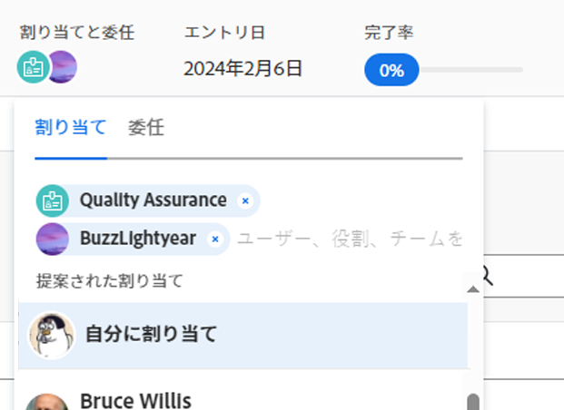
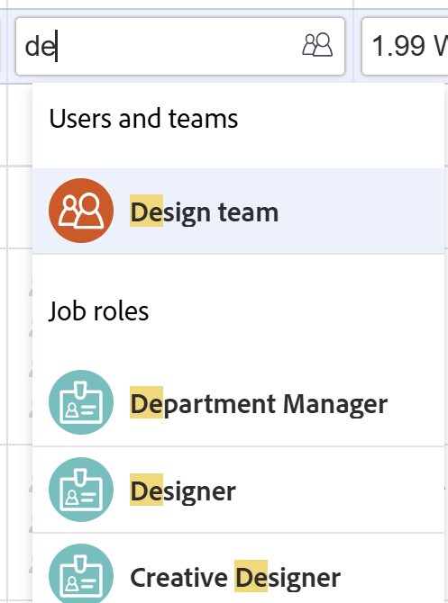

# スマート割り当ての実行

<!--Audited: 07/2024-->

スマート割り当てを使用して、作業の完了に最適なユーザーを特定できます。

スマート割り当ては、作業アイテムをリソースに割り当てる際に Adobe Workfront に表示される、ユーザー、役割またはチームに関する提案です。 Workfront は、業務に最も適したリソースを決定するアルゴリズムに基づいて提案します。

<!--There are two separate algorithms in Workfront that calculate smart assignments that work differently for tasks and for issues. -->

スマート割り当ての決定に使用される基準について詳しくは、[スマート割り当ての概要](/help/quicksilver/manage-work/tasks/assign-tasks/smart-assignments.md)を参照してください。

## アクセス要件

+++ 展開すると、この記事の機能のアクセス要件が表示されます。

<table style="table-layout:auto"> 
 <col> 
 <col> 
 <tbody> 
  <tr> 
   <td>Adobe Workfront パッケージ</td> 
   <td> 
任意
 </td> 
  </tr> 
  <tr> 
   <td>Adobe Workfront プラン</td> 
   <td> 
標準

   
Work またはそれ以上

   </td> 
  </tr> 
  <tr> 
   <td>アクセスレベル設定</td> 
   <td> 
タスクおよびイシューに対する編集アクセス権
 
プロジェクトに対する表示以上のアクセス権
 </td> 
  </tr> 
  <tr> 
   <td>オブジェクト権限</td>
   <td>タスクやイシューに対する割り当てを行う権限の付与</td>
  </tr>
 </tbody>
</table>

詳しくは、[Workfront ドキュメントのアクセス要件](/help/quicksilver/administration-and-setup/add-users/access-levels-and-object-permissions/access-level-requirements-in-documentation.md)を参照してください。

+++

## スマート割り当ての実行

スマート割り当ては、Workfront で割り当てを行うほとんどの場所で使用できます。

1. 次のエリアに移動し、「**割り当て**」または「**割り当て先**」フィールドをクリックします。

   * タスクまたはイシューのリストやレポート
   * タスクまたはイシューのヘッダー
   * タスクまたはイシューの概要パネル
   * ワークロードバランサーのタスクまたはイシュー
     <!--* A New Task or New Issue box, as you add a new task or issue to a project-->

1. 「割り当て」フィールドにカーソルを置き、2秒間待ちます。

   <!--
   For issues, the smart assignments display in the following sections: 
      * **Users and teams**
      * **Job roles**
        
        -->

   スマート割り当ては、次のセクション <!--, depending on which phase of the algorithm's calculation identified the assignments-->に表示されます。

   <!--* **Suggested assignments**: Displays assignments identified in the first phase of the task smart assignment algorithm. -->
   * **ユーザーとチーム**&#x200B;または&#x200B;**担当業務** <!--or **Rate card job roles**: Assignments identified in the second phase of the task smart assignment's algorithm calculation.-->

   

   詳しくは、[スマート割り当ての概要](../../../manage-work/tasks/assign-tasks/smart-assignments.md)を参照してください。

1. 名前をクリックして、レコメンデーションリストのリソースを選択します。

1. （オプション）「**自分に割り当て**」をクリックして、作業アイテムを自分に割り当てます。

   >[!TIP]
   >
   >候補の提案がない場合、候補リストは開きません。

1. （オプション）スマート割り当てリストから候補ユーザーの 1 人を使用しない場合は、目的のリソースの名前を入力していき、リストに名前が表示されたらそれを選択します。
1. 「**入力**」をクリックして割り当てを行います。

   選択したユーザーがタスクまたはイシューに割り当てられます。
